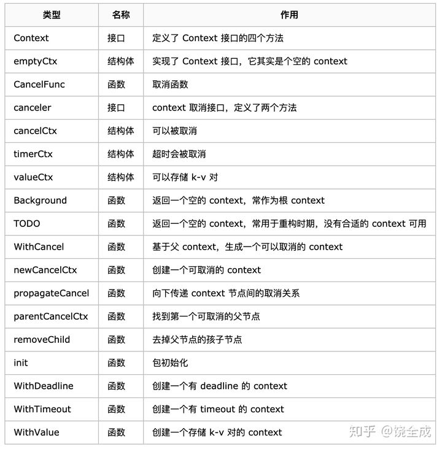

## 并发控制神器:context

### 什么是context

Go 1.7 标准库引入 Context , 它是 goroutine 的上下文，包含 goroutine 的运行状态、环境、现场等信息,主要用来在 goroutine 之间传递上下文信息，包括：取消信号、超时时间、截止时间、k-v 等。它是一个接口，它具备手动、定时、超时发出取消信号、传值等功能，主要用于控制多个协程之间的协作，尤其是取消操作。一旦取消指令下达，那么被 Context 跟踪的这些协程都会收到取消信号，就可以做清理和退出操作。

在 Go 的 server 里，通常每来一个请求都会启动**若干个 goroutine** 同时工作, 在Go 里，我们不能直接杀死协程，协程的关闭一般会用 `channel+select` 方式来控制。但是在某些场景下，例如处理一个请求衍生了很多协程，这些协程之间是相互关联的：需要共享一些全局变量、有共同的 deadline 等，而且可以同时被关闭。再用 **`channel+select` 就会比较麻烦**，这时就可以通过 context 来实现。

用一句话来讲：Go用来实现协程之间的退出通知，值传递等功能

### 整体概览

Context 接口只有四个方法：都是幂等的，

```go
type Context interface {
	//Deadline获取设置的截止时间，第一个返回值 deadline 是截止时间，到了这个时间点，Context 会自动发起取消请求，第二个返回值 ok 代表是否设置了截止时间。
   Deadline() (deadline time.Time, ok bool)
	//Done 方法返回一个只读的 channel，类型为 struct{}。在协程中，如果该方法返回的 chan 可以读取，则意味着 Context 已经发起了取消信号。通过 Done 方法收到这个信号后，就可以做清理操作，然后退出协程，释放资源。
   Done() <-chan struct{}
	//Err 方法返回取消的错误原因，即因为什么原因 Context 被取消
   Err() error
  //Value 方法获取该 Context 上绑定的值，是一个键值对，所以要通过一个 key 才可以获取对应的值。
   Value(key interface{}) interface{}

}
```



### Context 树

Go 语言提供了函数可以**帮助我们生成不同的 Context**，通过这些函数可以生成一颗 Context 树，这样 Context 才可以关联起来，父 Context 发出取消信号的时候，子 Context 也会发出

从使用功能上分，有四种实现好的 Context。

1. **空 emptyCtx**：不可取消，没有截止时间，主要用于 Context 树的根节点。
2. **可取消的 cancelCtx**：用于发出取消信号，当取消的时候，它的子 Context 也会取消。
3. **可定时取消的timerCtx **：多了一个定时的功能。结构体多了一个timer
4. **值 Context**：用于存储一个 key-value 键值对


然后再通过Go语言的函数生成context树

1. **WithCancel(parent Context)**：生成一个可取消的 Context。
2. **WithDeadline(parent Context, d time.Time)**：生成一个可定时取消的 Context，参数 d 为定时取消的具体时间。
3. **WithTimeout(parent Context, timeout time.Duration)**：生成一个可超时取消的 Context，参数 timeout 用于设置多久后取消
4. **WithValue(parent Context, key, val interface{})**：生成一个可携带 key-value 键值对的 Context。

### Context 传值

`WithValue` 创建 context 节点的过程实际上就是创建链表节点的过程。两个节点的 key 值是可以相等的，但它们是两个不同的 context 节点。查找的时候，会向上查找到最后一个挂载的 context 节点，也就是离得比较近的一个父节点 context。所以，整体上而言，用 `WithValue` 构造的其实是一个低效率的链表。

很多人建议尽量不要通过 context 传值，因为你根本就不知道什么时候什么地方传了什么值？这些值会不会被“覆盖”（底层是两个不同的 context 节点，查找的时候，只会返回一个结果）？你肯定会崩溃的。

### Context 使用原则

Context 是一种非常好的工具，使用它可以很方便地**控制取消多个协程**。在 Go 语言标准库中也使用了它们，比如 net/http 中使用 Context 取消网络的请求。

要更好地使用 Context，有一些使用原则需要尽可能地遵守。

1. Context 不要放在结构体中，要以参数的方式传递。
2. Context 作为函数的参数时，要放在第一位，也就是第一个参数。
3. 要使用 **context.Background 函数**生成根节点的 Context，也就是最顶层的 Context。
4. Context 传值要传递必须的值，而且要尽可能地少，不要什么都传。
5. **Context 多协程安全**，可以在多个协程中放心使用。

### context使用场景

1. 取消 goroutine，可以使用`case <-ctx.Done():`进行取消

   context也有缺点：context 并没有那么美好。Go 官方建议我们把 Context 作为函数的第一个参数，甚至连名字都准备好了。这造成一个后果：因为我们想控制所有的协程的取消动作，所以需要在几乎所有的函数里加上一个 Context 参数。很快，我们的代码里，context 将像病毒一样扩散的到处都是。

