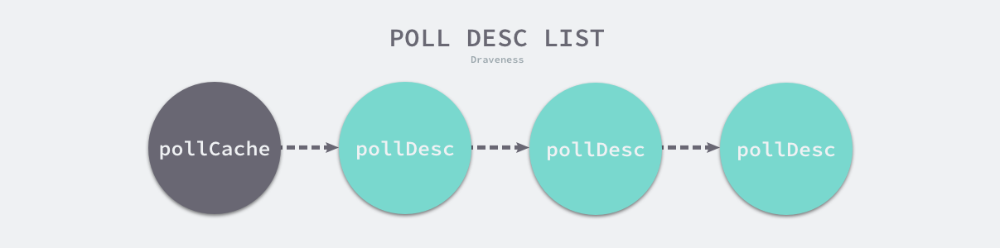

IO模型主要分为五种：阻塞 I/O、非阻塞 I/O、信号驱动 I/O 与异步 I/O 以及 I/O 多路复用五种 I/O 模型

I/O 多路复用是最常用的IO模型，它可以同时阻塞监听了一组文件描述符的状态，在Redis和Nginx都有用到
源码主要集中于：

>   src/runtime/netpoll_epoll.go //linux
>   		src/runtime/netpoll_kqueue.go//
>   		src/runtime/netpoll_solaris.go
>   		src/runtime/netpoll_windows.go
>   		src/runtime/netpoll_aix.go
>   		src/runtime/netpoll_fake.go

多路复用模块都要实现以下五个函数，这五个函数构成一个虚拟的接口：

```go
func netpollinit()//初始化网络轮询器，通过 sync.Once 和 netpollInited 变量保证函数只会调用一次；
func netpollopen(fd uintptr, pd *pollDesc) int32//监听文件描述符上的边缘触发事件，创建事件并加入监听
func netpoll(delta int64) gList//轮询网络并返回一组已经准备就绪的 Goroutine，传入的参数会决定它的行为；
func netpollBreak()//唤醒网络轮询器，向管道中写入数据唤醒 epoll
func netpollIsPollDescriptor(fd uintptr) bool//判断文件描述符是否被轮询器使用
```

##### 数据结构

文件描述符也就是`runtime.pollDesc` 结构体：

```go
type pollDesc struct {
	link *pollDesc//串联成链表存储在 runtime.pollCache 中：
	lock    mutex//保护数据的互斥锁
	fd      uintptr//文件描述符
	...
	rseq    uintptr//表示文件描述符被重用或者计时器被重置
	rg      uintptr//信号量，可能为 pdReady、pdWait、等待文件描述符可读或者可写的 Goroutine 以及 nil；
	rt      timer//等待文件描述符的计时器
	rd      int64//等待文件描述符可读或者可写的截止日期
	wseq    uintptr
	wg      uintptr
	wt      timer
	wd      int64
```

`runtime.pollCache` 是运行时包中的全局变量，该结构体中包含一个用于保护轮询数据的互斥锁和链表头



存在链表头部的是空闲没有被使用的pollDesc结构体，当我们运行时第一次调用 runtime.pollCache.alloc 方法时初始化总大小约为 **4KB 的 runtime.pollDesc 结构体**，runtime.persistentAlloc 会保证这些数据结构初始化在不会触发垃圾回收的内存中，这样每个调用都会从链表头部返回一个未使用的pollDesc，使用完毕通过free将结构体插回链表。

##### 多路复用

网络轮询器实际上是对 **I/O 多路复用技术的封装**，本节将通过以下的三个过程分析网络轮询器的实现原理：

1.  网络轮询器的初始化；（1,2对应epoll创建和初始化）

    >   网络轮询器的初始化会使用 runtime.poll_runtime_pollServerInit 和 runtime.netpollGenericInit 两个函数：
    >
    >   ```go
    >   func poll_runtime_pollServerInit() {
    >   	netpollGenericInit()
    >   }
    >   
    >   func netpollGenericInit() {
    >   	if atomic.Load(&netpollInited) == 0 {
    >   		lock(&netpollInitLock)
    >   		if netpollInited == 0 {
    >   			netpollinit()//调用Linux上的epoll
    >   			atomic.Store(&netpollInited, 1)
    >   		}
    >   		unlock(&netpollInitLock)
    >   	}
    >   }
    >   /**
    >   做了三件事情：1.调用 epollcreate1 创建一个新的 epoll 文件描述符，这个文件描述符会在整个程序的生命周期中使用；
    >   2.通过 runtime.nonblockingPipe 创建一个用于通信的管道；
    >   3.使用 epollctl 将用于读取数据的文件描述符打包成 epollevent 事件加入监听；
    >   **/
    >   func netpollinit() {
    >   	epfd = epollcreate1(_EPOLL_CLOEXEC)
    >   	r, w, _ := nonblockingPipe()//提供了中断多路复用等待文件描述符中事件的方法，runtime.netpollBreak 会向管道中写入数据唤醒 epoll：
    >   	ev := epollevent{//打包
    >   		events: _EPOLLIN,
    >   	}
    >   	*(**uintptr)(unsafe.Pointer(&ev.data)) = &netpollBreakRd
    >   	epollctl(epfd, _EPOLL_CTL_ADD, r, &ev)//加入监听
    >   	netpollBreakRd = uintptr(r)
    >   	netpollBreakWr = uintptr(w)
    >   }
    >   //初始化的管道为我们提供了中断多路复用等待文件描述符中事件的方法，runtime.netpollBreak 会向管道中写入数据唤醒 epoll
    >   func netpollBreak() {
    >   	for {
    >   		var b byte
    >   		n := write(netpollBreakWr, unsafe.Pointer(&b), 1)
    >   		if n == 1 {
    >   			break
    >   		}
    >   		if n == -_EINTR {
    >   			continue
    >   		}
    >   		if n == -_EAGAIN {
    >   			return
    >   		}
    >   	}
    >   }
    >   ```

2.  如何向网络轮询器加入待监控的任务；（——对应–）

    >   runtime.poll_runtime_pollOpen 重置轮询信息 runtime.pollDesc 并调用 runtime.netpollopen 初始化轮询事件
    >
    >   ```go
    >   func poll_runtime_pollOpen(fd uintptr) (*pollDesc, int) {
    >   	pd := pollcache.alloc()//申请一个文件描述符
    >   	lock(&pd.lock)
    >   	if pd.wg != 0 && pd.wg != pdReady {
    >   		throw("runtime: blocked write on free polldesc")
    >   	}
    >   	...
    >   	pd.fd = fd//初始化结构体
    >   	pd.closing = false
    >   	pd.everr = false
    >   	...
    >   	pd.wseq++
    >   	pd.wg = 0
    >   	pd.wd = 0
    >   	unlock(&pd.lock)
    >   
    >   	var errno int32
    >   	errno = netpollopen(fd, pd)//调用netpollopen，(将文件描述符放到epoll对象中)
    >   	return pd, int(errno)
    >   }
    >   ```
    >
    >   ```go
    >   //调用 epollctl 向全局的轮询文件描述符 epfd 中加入新的轮询事件监听文件描述符的可读和可写状态：
    >   func netpollopen(fd uintptr, pd *pollDesc) int32 {
    >   	var ev epollevent
    >   	ev.events = _EPOLLIN | _EPOLLOUT | _EPOLLRDHUP | _EPOLLET
    >   	*(**pollDesc)(unsafe.Pointer(&ev.data)) = pd
    >   	return -epollctl(epfd, _EPOLL_CTL_ADD, int32(fd), &ev)
    >   }
    >   ```
    >
    >   runtime.netpollclose删除待监听的文件描述符

3.  如何从网络轮询器获取触发的事件；**（——对应Accept 过程——-）**

    >   ​    分为协程等待事件和轮询器不断轮询查看是否有事件需要处理
    >
    >   **等待事件：**当我们在文件描述符上执行读写操作时，如果文件描述符不可读或者不可写，当前 Goroutine 会执行 runtime.poll_runtime_pollWait 检查 runtime.pollDesc 的状态并调用 runtime.netpollblock(运行时提供的 `runtime.gopark` 让出当前线程，将 Goroutine 转换到休眠状态并等待运行时的唤醒) 等待文件描述符的可读或者可写：
    >
    >   **轮询等待：**核心是调用 `runtime.netpoll` 轮询网络
    >
    >   1.  根据传入的 `delay` 计算 `epoll` 系统调用需要等待的时间；
    >
    >   2.  调用 `epollwait` 等待可读或者可写事件的发生；(epollwait返回值大于0，意味着被监控的文件描述符出现了待处理的事件)
    >
    >       >   处理的事件总共包含两种，一种是调用 runtime.netpollBreak 触发的事件，该函数的作用是中断网络轮询器；另一种是其他文件描述符的正常读写事件，对于这些事件，我们会交给 runtime.netpollready 处理：
    >
    >   3.  在循环中依次处理 `epollevent` 事件；
    >
    >       ```go
    >       var toRun gList
    >       	for i := int32(0); i < n; i++ {
    >       		ev := &events[i]
    >       		if *(**uintptr)(unsafe.Pointer(&ev.data)) == &netpollBreakRd {
    >       			...//中断网络轮询器的事件
    >       			continue
    >       		}
    >       
    >       		var mode int32
    >       		if ev.events&(_EPOLLIN|_EPOLLRDHUP|_EPOLLHUP|_EPOLLERR) != 0 {
    >       			mode += 'r'
    >       		}
    >       		...
    >       		if mode != 0 {
    >       			pd := *(**pollDesc)(unsafe.Pointer(&ev.data))
    >       			pd.everr = false
    >       			netpollready(&toRun, pd, mode)//其他文件描述符的正常读写事件，交给netpollready处理
    >       		}
    >       	}
    >       	return toRun
    >       }
    >       
    >       func netpollready(toRun *gList, pd *pollDesc, mode int32) {
    >       	var rg, wg *g
    >       	...
    >       	if mode == 'w' || mode == 'r'+'w' {
    >       		wg = netpollunblock(pd, 'w', true)
    >       	}
    >       	...
    >       	if wg != nil {
    >       		toRun.push(wg)
    >       	}
    >       }
    >       
    >       
    >       ```

##### 截止日期              

截止日期是用来保证程序的正常运行，这时需要用到网络轮询器中的 `runtime.poll_runtime_pollSetDeadline`

poll_runtime_pollSetDeadline会先使用截止日期计算出过期的时间点，如果截止日期小于 0，上述代码会调用 runtime.netpollgoready 直接唤醒对应的 Goroutine，

在 runtime.poll_runtime_pollSetDeadline 中直接调用 runtime.netpollgoready 是相对比较特殊的情况。在正常情况下，运行时都会在计时器到期时调用 runtime.netpollDeadline、runtime.netpollReadDeadline 和 runtime.netpollWriteDeadline 三个函数，三个函数都会通过 runtime.netpolldeadlineimpl 调用 runtime.netpollgoready 直接唤醒相应的 Goroutine，Goroutine 在被唤醒之后会意识到当前的 I/O 操作已经超时，可以根据需要选择重试请求或者中止调用。

##### 总结

从底层来看：

>   epoll底层结构：红黑树+链表
>
>   epoll提供的方法：epollcreate(创建一个新的 `epoll` 文件描述符), epollctl(加入事件监听)，epollwait（不断轮询等待可读事件）
>
>   提供的接口：netpollinit，netpollopen，netpoll，netpollBreak，netpollIsPollDescriptor


从中层来看：

>   1、 `runtime.pollDesc`结构体用于保存文件描述符，pollCache负责将其串联为一个链表，最开始的都是空闲的，直接取下来使用，每次通过alloc去获得一个pollDesc
>
>   2、网络轮询器的初始化；（poll_runtime_pollServerInit–>netpollGenericInit->会调用平台上特定实现的 `runtime.netpollinit`）
>
>   3、向网络轮询器加入待监控的任务(`netpollinit`初始化网络轮询器后，还会通过`netpollopen`重置轮询信息，epoll_etl 并将文件描述符注入到事件监听)
>
>   4、从网络轮询器获取触发的事件（1.文件描述符不可读或者不可写，当前 Goroutine 会执行 [`runtime.poll_runtime_pollWait`](https://draveness.me/golang/tree/runtime.poll_runtime_pollWait) 检查 [`runtime.pollDesc`](https://draveness.me/golang/tree/runtime.pollDesc) 的状态并调用 [`runtime.netpollblock`](https://draveness.me/golang/tree/runtime.netpollblock) （函数将调用`gopark将当前协程阻塞`）等待文件描述符的可读或者可写 2.调用netpoll传入delay计算等待时间，epollwait轮询网络事件，epollwait大于0，说明有事件，则`netpollready`处理事件）

从上层来看：

>   Listen监听端口->Accept接受请求-> Read 和 Write进行读写
>
>   Listen过程：
>
>   *   创建 socket 并设置非阻塞，（sysSocket -> socketFunc    对于每个服务器都需要）
>
>   *   bind 绑定并监听本地的一个端口，调用 listen 开始监听（listenStream->listenFunc 每个服务器都需要）
>   *   epoll_create 创建一个 epoll 对象(poll_runtime_pollServerInit->netpollinit连上上面的了，poll_runtime_pollOpen调用epollctl)
>   *   epoll_etl 将 listen 的 socket 添加到 epoll 中等待连接到来（）
>
>   Accept 过程：
>
>   *   调用 accept 系统调用接收一个连接（对应中层的第4个步骤）
>   *   如果没有连接到达，把当前协程阻塞掉（runtime_pollWait ->netpollblock->gopark）
>   *   新连接到来的话，将其添加到 epoll 中管理，然后返回
>
>   Read 和 Write 内部过程:
>
>   1.   Read 函数会进入到 FD 的 Read 中。在这个函数内部调用 Read 系统调用来读取数据。如果数据还尚未到达则也是把自己阻塞起来
>   2.   调用 Write 系统调用发送数据，如果内核发送缓存区不足的时候，就把自己先阻塞起来，然后等可写时间发生的时候再继续发送