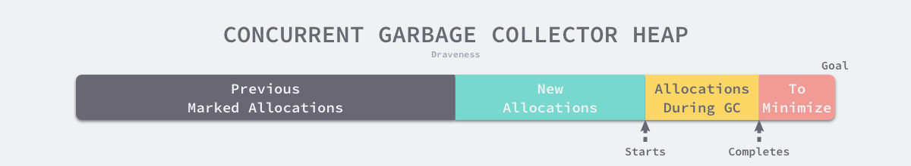

**Golang GC**
-------------

Golang从1.5开始引入了三色GC, 经过多次改进, 当前的1.9版本的GC停顿时间已经可以做到极短.停顿时间的减少意味着"最大响应时间"的缩短, 这也让go更适合编写**网络服务程序**.

### 三色标记

##### 三色标记过程

*   白色对象 — 潜在的垃圾，其内存可能会被垃圾收集器回收；
*   黑色对象 — 活跃的对象，包括不存在任何引用外部指针的对象以及从根对象可达的对象；
*   灰色对象 — 活跃的对象，因为存在指向白色对象的外部指针，垃圾收集器会扫描这些对象的子对象；

先从灰色对象开始，将与灰色对象连接着的对象置为灰色，将原本的灰色对象变为黑色，知道将所有的灰色对象变为黑色为止。


##### 三色标记的问题

**多标-浮动垃圾问题：**在上面，假设对E对象标记后，D-E的连接断开，但是EFG三个对象并不会被回收，只能等到下一次GC回收, 这些就称为**浮动垃圾**

**悬挂指针：**如上：当 GC 线程已经遍历到 E 变成灰色，D变成黑色时，灰色 E 断开引用白色 G ，黑色 D 引用了白色 G。此时切回 GC 线程继续跑，因为 E 已经没有对 G 的引用了，所以不会将 G 放到灰色集合。尽管因为 D 重新引用了 G，但因为 D 已经是黑色了，不会再重新做遍历处理。最终导致的结果是：G 会一直停留在白色集合中，最后被当作垃圾进行清除。这直接影响到了应用程序的正确性，是不可接受的，这也是 Go 需要在 GC 时解决的问题。

### 屏障技术

内存屏障技术是一种屏障指令，它可以让 CPU 或者编译器在执行内存相关操作时遵循特定的约束，目前多数的现代处理器都会乱序执行指令以最大化性能，但是<u>该技术能够保证内存操作的顺序性</u>，在内存屏障前执行的操作一定会先于内存屏障后执行的操作。

想要在并发或者增量的标记算法中保证正确性，我们需要达成以下两种三色不变性（Tri-color invariant）中的一种：

*   强三色不变性 — 黑色对象不会指向白色对象，只会指向灰色对象或者黑色对象；
*   弱三色不变性 — 黑色对象指向的白色对象必须包含一条从灰色对象经由多个白色对象的可达路径

**三色不变性**可以保证垃圾回收算法的正确性，而**屏障技术**就是在并发或者增量标记过程中保证三色不变性的重要技术。

Go 语言中使用的两种写屏障技术，分别是 Dijkstra 提出的**插入写屏障**和 Yuasa 提出的**删除写屏障**

##### 插入写屏障

每当执行类似 `*slot = ptr` 的表达式时，会执行上述写屏障通过 `shade` 函数尝试改变指针的颜色。如果 `ptr` 指针是白色的，那么该函数会将该对象设置成灰色（因为ptr有引用了），其他情况则保持不变。


插入写屏障是一种相对保守的屏障技术，它会将**有存活可能的对象都标记成灰色**以满足强三色不变性，但是对于上图来说，他可能错误的将本该回收的B留在了堆中，只能等待下一次垃圾回收才能回收。

**缺点：**栈上的对象在垃圾收集中也会被认为是根对象，所以为了保证内存的安全，Dijkstra 必须为栈上的对象增加写屏障或者在标记阶段完成重新对栈上的对象进行扫描，这两种方法各有各的缺点，前者会大幅度增加写入指针的<u>额外开销，</u>后者<u>重新扫描栈对象时需要暂停程序</u>，垃圾收集算法的设计者需要在这两者之间做出权衡。

##### 删除写屏障

​	删除写屏障会在老对象的引用被删除时，将白色的老对象涂成灰色，这样删除写屏障就可以保证弱三色不变性，老对象引用的下游对象一定可以被灰色对象引用。


1.  垃圾收集器将根对象指向 A 对象标记成黑色并将 A 对象指向的对象 B 标记成灰色；
2.  用户程序将 A 对象原本指向 B 的指针指向 C，触发删除写屏障，但是因为 B 对象已经是灰色的，所以不做改变；
3.  **用户程序将 B 对象原本指向 C 的指针删除，触发删除写屏障，白色的 C 对象被涂成灰色**；
4.  垃圾收集器依次遍历程序中的其他灰色对象，将它们分别标记成黑色；


------------------------------------------------------------------------------------------------------------------------------------------------------

### 增量和并发垃圾收集

*   增量垃圾收集 — 增量地标记和清除垃圾，降低应用程序暂停的最长时间；
*   并发垃圾收集 — 利用多核的计算资源，在用户程序执行时并发标记和清除垃圾；

增量和并发垃圾收集都需要**使用屏障技术**保证垃圾收集的正确性。


#### 并发垃圾收集

扫描对象之前：启动后台标记的垃圾收集器以及开启写屏障

##### 垃圾回收时间

Go 语言 v1.5 引入并发垃圾收集器的同时使用**垃圾收集调步（Pacing）算法**计算触发的垃圾收集的最佳时间，确保触发的时间既不会浪费计算资源，也不会超出预期的堆大小，如下图，我们要做的就是尽可能的<u>减少红色部分的大小</u>。




##### 混合写屏障

在 Go 语言 v1.7 版本之前，运行时会使用 <u>Dijkstra 插入写屏障</u>保证强三色不变性，但是运行时并没有在所有的垃圾收集根对象上开启插入写屏障。因为应用程序可能包含成百上千的 Goroutine，而垃圾收集的根对象一般包括全局变量和栈对象，如果运行时需要在几百个 Goroutine 的栈上都开启写屏障，会带来巨大的额外开销，所以 Go 团队在实现上选择了在标记阶段完成时**暂停程序、将所有栈对象标记为灰色并重新扫描**，在活跃 Goroutine 非常多的程序中，重新扫描的过程需要占用 10 ~ 100ms 的时间。

Go 语言在 v1.8 组合 Dijkstra 插入写屏障和 Yuasa 删除写屏障构成了如下所示的<u>混合写屏障</u>，该写屏障会**将被覆盖的对象标记成灰色并在当前栈没有扫描时将新对象也标记成灰色**：

```go
writePointer(slot, ptr):
    shade(*slot)
    if current stack is grey:
        shade(ptr)
    *slot = ptr
```

为了移除栈的重扫描过程，除了引入混合写屏障之外，在垃圾收集的标记阶段，我们还需要**将创建的所有新对象都标记成黑色**，防止新分配的栈内存和堆内存中的对象被错误地回收，因为栈内存在标记阶段最终都会变为黑色，所以不再需要重新扫描栈空间。

### GC实现原理

Go 语言的垃圾收集可以分成清除终止、标记、标记终止和清除四个不同阶段.

##### 实现过程

1.  清理终止阶段；
    1.  **暂停程序**，所有的处理器在这时会进入安全点（Safe point）；
    2.  如果当前垃圾收集循环是强制触发的，我们还需要处理还未被清理的内存管理单元；
2.  标记阶段；
    1.  将状态切换至 `_GCmark`、开启写屏障、用户程序协助（Mutator Assists）并将根对象入队；
    2.  恢复执行程序，标记进程和用于协助的用户程序会开始并发标记内存中的对象，写屏障会将被覆盖的指针和新指针都标记成灰色，而所有新创建的对象都会被直接标记成黑色；
    3.  开始扫描根对象，包括所有 Goroutine 的栈、全局对象以及不在堆中的运行时数据结构，扫描 Goroutine 栈期间会暂停当前处理器；
    4.  依次处理灰色队列中的对象，将对象标记成黑色并将它们指向的对象标记成灰色；
    5.  使用分布式的终止算法检查剩余的工作，发现标记阶段完成后进入标记终止阶段；
3.  标记终止阶段；
    1.  **暂停程序**、将状态切换至 `_GCmarktermination` 并关闭辅助标记的用户程序；
    2.  清理处理器上的线程缓存；
4.  清理阶段；
    1.  将状态切换至 `_GCoff` 开始清理阶段，初始化清理状态并关闭写屏障；
    2.  恢复用户程序，所有新创建的对象会标记成白色；
    3.  后台并发清理所有的内存管理单元，当 Goroutine 申请新的内存管理单元时就会触发清理
