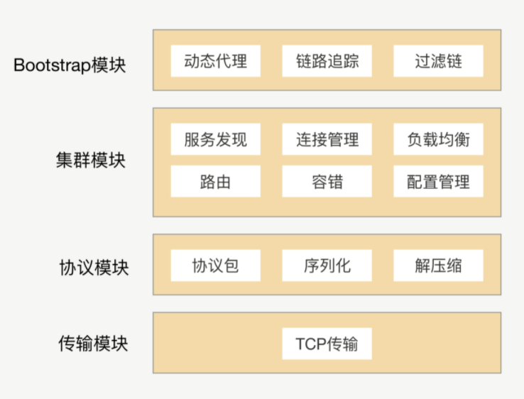
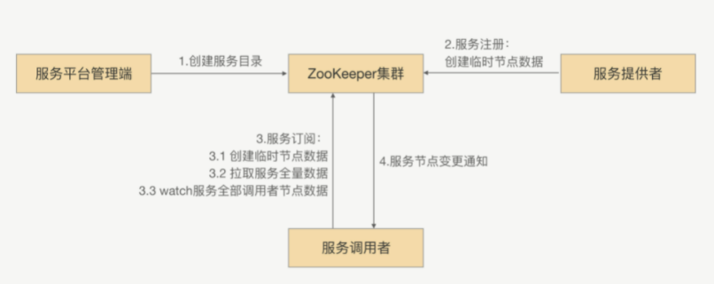

服务发现，服务治理，服务暴露

限流，熔断，降级

### RPC架构设计

单点+集群功能架构

在实际开发中 ，完成功能只是一小部分，框架的可扩展性也是一部分，**Java的SPI机制**能够动态为接口寻找服务实现。

### 服务发现

##### **服务发现需要解决的问题：**

1. 服务注册：在服务提供方启动的时候，将对外暴露的接口注册到注册中心之中，注册中心将这个服务节点的 IP 和接口保存下来。
2. 服务订阅：在服务调用方启动的时候，去注册中心查找并订阅服务提供方的 IP，然后缓存到本地，并用于后续的远程调用。

##### 分布式系统CP和AP

目前主流的注册中心有 ZooKeeper、Eureka、Etcd、Consul、Nacos 等，选择一个高性能、高可用的注册中心对 RPC 框架至关重要。说到高可用自然离不开 CAP 理论，一致性 Consistency、可用性 Availability 和分区容忍性 Partition tolerance 是无法同时满足的，注册中心一般分为 CP 类型注册中心和 AP 类型注册中心。使用最为广泛的 Zookeeper 就是 CP 类型的注册中心，集群中会有一个节点作为 Leader，如果 Leader 节点挂了，会重新进行 Leader 选举，ZooKeeper 保证了所有节点的强一致性，**但是在 Leader 选举的过程中是无法对外提供服务的，牺牲了部分可用性**。Eureka 是典型的 AP 类型注册中心，在实现服务发现的场景下有很大的优势，整个集群是不存在 Leader、Flower 概念的，如果其中一个节点挂了，请求会立刻转移到其他节点上。可能会存在的问题是如果不同分区无法进行节点通信，那么可能会造成节点之间的数据是有差异的，所以 **AP 类型的注册中心通过牺牲强一致性来保证高可用性** 。

##### 基于 ZooKeeper 的服务发现

整体的思路很简单，就是搭建一个 ZooKeeper 集群作为注册中心集群，服务注册的时候只需要服务节点向 ZooKeeper 节点写入注册信息即可，利用 ZooKeeper 的 Watcher 机制完成服务订阅与服务下发功能，整体流程如下图：

1. 服务平台管理端先在 ZooKeeper 中创建一个服务根路径，可以根据接口名命名（例如：/service/com.demo.xxService），在这个路径再创建服务提供方目录与服务调用方目录（例如：provider、consumer），分别用来存储服务提供方的节点信息和服务调用方的节点信息。
2. 当服务提供方发起注册时，会在服务提供方目录中创建一个临时节点，节点中存储该服务提供方的注册信息。
3. 当服务调用方发起订阅时，则在服务调用方目录中创建一个临时节点，节点中存储该服务调用方的信息，同时服务调用方 watch 该服务的服务提供方目录（/service/com.demo.xxService/provider）中所有的服务节点数据。
4. 当服务提供方目录下有节点数据发生变更时，ZooKeeper 就会通知给发起订阅的服务调用方。

**但是，zookeeper之类的中间件实现服务发现有个问题**：在zookeeper读写特别频繁，节点达到一定的数量，zookeeper将变得不稳定，CPU持续升高。

##### 基于消息总线的最终一致性的注册中心

1. 当有服务上线，注册中心节点收到注册请求，服务列表数据发生变化，会生成一个消息，推送给消息总线，每个消息都有整体递增的版本。
2. 消息总线会主动推送消息到各个注册中心，同时注册中心也会定时拉取消息。对于获取到消息的在消息回放模块里面回放，只接受大于本地版本号的消息，小于本地版本号的消息直接丢弃，从而实现最终一致性。
3. 消费者订阅可以从注册中心内存拿到指定接口的全部服务实例，并缓存到消费者的内存里面。
4. 采用推拉模式，消费者可以及时地拿到服务实例增量变化情况，并和内存中的缓存数据进行合并。

**这种方法存在的问题：**由于消息存在延迟，服务调用方拿到的节点可能不是最新的，所以在服务调用方调用的时候需要做出判断，对目标节点进行合法性验证。

### 健康监测

### 路由策略

### 12异常重试

重试首先需要**考虑业务的幂等性**，使用重试异常白名单，区分是服务端返回的异常还是因为网络或者服务器问题返回的异常，所以当调用端请求失败，返回异常，调用端需要进行判定是否符合重试条件，并且对于负载均衡后引起返回异常的那个服务器我们应当去掉出现异常的那个节点，而且异常也需要超时时间限制。

### 13优雅关闭

一般来说会有两种情况：

1.   调用方发请求前，目标服务已经下线。对于调用方来说，跟目标节点的连接会断开，这时候调用方可以立马感知到，并且在其健康列表里面会把这个节点挪掉，自然也就不会被负载均衡选中。
2.   调用方发请求的时候，目标服务正在关闭，但调用方并不知道它正在关闭，而且两者之间的连接也没断开，所以这个节点还会存在健康列表里面，因此该节点就有一定概率会被负载均衡选中。

解决办法：

1.   主动下线，先通知注册中心，注册中心再通知调用方，缺点就是有延迟，依然不能完全解决这个问题
2.   设置一个请求挡板，当进入关闭流程之后，对于后续的请求返回一个ShutdownException，调用端收到这个异常后就可以手动将其移除
3.   对象在关闭的过程中还会有新的请求，我们可以使用引用计数来等待计数器为0之后完全关闭，并且对于处理时间过长的请求我们还可以设置超时时间。

### 14优雅启动

如何让刚启动的服务器接收少部分流量，等完全启动预热后再切换大流量？

1.   可以考虑在调用方选择负载均衡节点的时候，对刚启动的服务器进行区分，降低它的权重，那怎么去做呢？我们要知道服务提供方启动的时间，这个怎么获取呢？我这里给出两种方法，一种是服务提供方在启动的时候，把自己启动的时间告诉注册中心；另外一种就是**注册中心收到的服务提供方的请求注册时间**。这两个时间我认为都可以，我们可以设置：当服务提供方运行时间小于预热时间，就给其一个小的权重，并且权重逐渐增加
2.   延迟暴露，将Bean注册接口放在应用启动快结束的时候，来保证应用在启动完之后才开始接入流量

