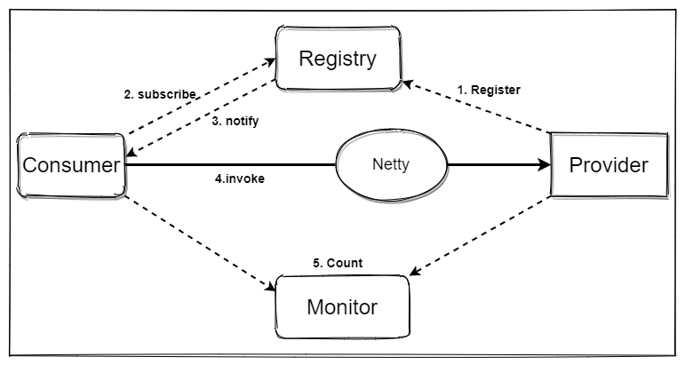

RPC远程过程调用
---------------

总体实现流程：https://www.cnblogs.com/endless-code/p/11235624.html

启动服务提供者后，服务提供者会以异步的方式向注册中心注册。然后启动服务消费者，它会订阅注册中心中服务提供者列表，当有服务提供者的信息发生改变时，注册中心会通知所有的消费者。当消费者发起远程调用时，会通过**动态代理**将需要**请求的参数以及方法签名等信息通过Netty发送给服务提供者**，服务提供者收到调用的信息后调用对应的方法并将产生的结果返回给消费者，这样就完成了一个完整的远程调用。当然了这个过程中可能还会将**调用信息异步发送给monitor用于监控和统计**。

### 核心工作

我们大概需要实现一下这几个功能：

服务器端初始化，向注册中心进行注册，相应客户端的远程调用

客户端订阅注册中心，监听服务端的变化

> 主流的注册中心有 ZooKeeper、Eureka、Etcd、Consul、Nacos 等，根据 CAP 理论，一致性 Consistency、可用性 Availability 和分区容忍性 Partition tolerance 是无法同时满足的，注册中心分为 CP 类型注册中心和 AP 类型。使用最为广泛的 Zookeeper 就是 CP 类型的注册中心，集群中会有一个节点作为 Leader，如果 Leader 节点挂了，会重新进行 Leader 选举，ZooKeeper 保证了所有节点的强一致性，但是在 Leader 选举的过程中是无法对外提供服务的，牺牲了部分可用性。Eureka 是典型的 AP 类型注册中心，在实现服务发现的场景下有很大的优势，整个集群是不存在 Leader、Flower 概念的，如果其中一个节点挂了，请求会立刻转移到其他节点上。可能会存在的问题是如果不同分区无法进行节点通信，那么可能会造成节点之间的数据是有差异的，所以 AP 类型的注册中心通过牺牲强一致性来保证高可用性 。

自定义注解实现

动态代理实现

Netty实现发送接受信息

### 用到的数据结构

一致性Hash环：TreeMap使用ceilingEntry；

HashMap<hash码(存储serviceName)，serviceInterface>

ConcurrentHashMap使用异步future时，需要通过一个id与对应的请求进行关联

AtomicLong就是上面异步生成的id

ThreadPoolExecutor构建线程池提交任务

### Dubbo比我的项目多的

更丰富的序列化，注册中心，请求协议，动态代理方式，SPI ,重试机制，心跳机制，时间轮执行定时任务，实时监控，熔断限流，优雅启动关闭，健康监测，流量回放，安全

### 缓存技术和池化技术

1.   使用 HashMap<String, Registry> 缓存注册中心的接口

     >   集成watcher重写process方法，实现订阅

2.   使用hashMap 缓存服务器端暴露的方法

3.   服务器端采用线程池提交任务

4.   服务消费端使用ChannelFuture异步调用

5.   服务消费端的建立ChannelPool来缓存与服务器之间的链接，并且添加IdleStateHandler设置为10秒一个心跳

