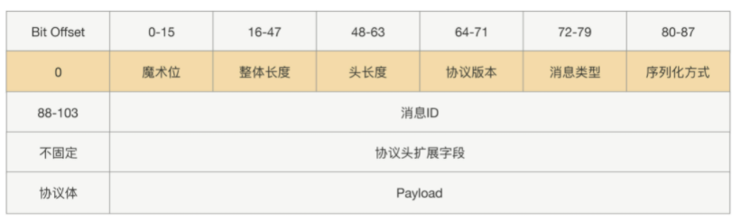

基本功能
--------

##### 协议

HTTP协议加入了太多无用的字段，数据包大小远大于数据本身，并且HTTP是无状态的，无法进行请求响应关联

私有协议：

+--------------------------------------------------------------------------------------+
		| 魔数 2byte | 协议版本号 1byte | 序列化算法 1byte | 报文类型 1byte  |
		+---------------------------------------------------------------+
		| 状态 1byte      |        消息 ID 8byte     |        数据长度 4byte          |
		+---------------------------------------------------------------+
		|                   数据内容 （长度不定）                          |
		+---------------------------------------------------------------+

可以考虑在添加一个扩展字段----(**头长度**)

##### 序列化

`高性能、跨语言、可维护性、可扩展性等， Kryo、Hessian、Protobuf`

Kryo 序列化后占用字节数较少，网络传输效率更高，但是不支持跨语言。Hessian 是目前业界使用较为广泛的序列化协议，它的兼容性好，支持跨语言，API 方便使用，序列化后的字节数适中。Protobuf 是 gRPC 框架默认使用的序列化协议，属于 Google 出品的序列化框架。Protobuf 支持跨语言、跨平台，具有较好的扩展性，并且性能优于 Hessian。但是 Protobuf 使用时需要编写特定的 prpto 文件，然后进行静态编译成不同语言的程序后拷贝到项目工程中，一定程序增加了开发者的复杂度。综合各方面因素以及实际口碑，个人比较推荐使用 Hessian 和 Protobuf 序列化协议。

关于 RPC 框架序列化进一步的性能优化我们可以采用以下方法：

1.   减少不必要的字段以及精简字段的长度，从而降低序列化后占用的字节数。
2.   提供不同的序列化策略。可以将不同的字段拆分至不同的线程里进行反序列化，例如 Netty I/O 线程可以只负责 className 和 消息头 Header 的反序列化，然后根据 Header 分发到不同的业务线程池中，由业务线程负责反序列化消息内容 Content，这样可以有效地降低 I/O 线程的压力。

##### 动态代理

JDK CGLIB, Javassist, Byte Buddy

动态代理：通过对字**节码进行增强**，来实现非业务逻辑和业务逻辑的解耦合，AOP:统一拦截，授权认证，性能统计

Javassist 的定位是能够操纵底层字节码，所以使用起来并不简单，要生成动态代理类恐怕是有点复杂了。但好的方面是，通过 Javassist 生成字节码，不需要通过反射完成方法调用，所以性能肯定是更胜一筹的。在使用中，我们要注意一个问题，通过 Javassist 生成一个代理类后，此 CtClass 对象会被冻结起来，不允许再修改；否则，再次生成时会报错。

Byte Buddy 则属于后起之秀，在很多优秀的项目中，像 Spring、Jackson 都用到了 Byte Buddy 来完成底层代理。相比 Javassist，Byte Buddy 提供了更容易操作的 API，**编写的代码可读性更高。更重要的是，生成的代理类执行速度比 Javassist 更快**。

如果没有动态代理帮我们完成方法调用拦截，那么就需要使用静态代理来实现，就需要用户对原始类中所有的方法都重新实现一遍，并且为每个方法附加相似的代码逻辑，如果在RPC中，这种需要代理的类有很多个，就需要针对每个类都创建一个代理类。

##### 网络IO模型

阻塞IO, IO多路复用 → NIO → Reator(Linux的epoll) → 零拷贝(Netty,linux) → 

自定义协议解决粘包问题

##### 注册中心(服务发现)

##### 健康监测

健康检测的目的是为了及时发现不健康的节点，作出应对，防止出现大量RPC请求失败的情况。

1. 通过心跳机制，定时去探测主机是否还能应答，根据心跳失败情况，将请求自动下线
2. 但是上面方法，当出现亚健康状态节点的时候，直接下线不合适，而且有些节点可能只是网络出现波动，并不是真正直接宕机了，所以我们可以设置阈值，当发现连续几次心跳探测失败，则**下线节点**，当发现连接多次心跳探测成功，则**上线节点**
3. 但是由于每个接口调用频次不同，接口的响应时间也不一样，所以上面的策略也会有问题，采用可用率来衡量是比较可靠的方法（成功次数/总调用次数）
4. 还有可能出现的问题就是心跳仪器坏了，会导致看起来所有机器都出故障了，所以我们可以在多个机器上安装心跳探测，来确保心跳机制的可靠性

##### 路由策略

##### 负载均衡

除了基本的负载均衡方法，还可以根据节点的负载情况，如果一个节点负载过高，就可以适当的减去权重，收齐CPU核数，CPU负载，内存，请求耗时, TP99,TP999指标

**一致性Hash算法** 

##### 定时任务需要时间轮

##### SPI实现动态实例化

##### 熔断限流降级

##### 服务启动关闭

##### 路由策略

##### 服务发现

##### 健康监测

##### Channel复用——池化技术

##### Netty 网络参数配置

Netty 提供了 **ChannelOption** 以便于我们优化 <u>TCP 参数配置</u>，为了提高网络通信的吞吐量，一些可选的网络参数我们有必要掌握。

**TCP_NODELAY**，是否开启 Nagle 算法。Nagle 算法通过缓存的方式将网络数据包累积到一定量才会发送，从而避免频繁发送小的数据包。Nagle 算法 在海量流量的场景下非常有效，但是会造成一定的数据延迟。如果对数据传输延迟敏感，那么应该禁用该参数。

**SO_BACKLOG：已完成三次握手的请求队列最大长度**。同一时刻服务端可能会处理多个连接，在高并发海量连接的场景下，该参数应适当调大。但是 SO_BACKLOG 也不能太大，否则无法防止 SYN-Flood 攻击。

**SO_SNDBUF/SO_RCVBUF，TCP 发送缓冲区和接收缓冲区的大小**。为了能够达到最大的网络吞吐量，SO_SNDBUF 不应当小于带宽和时延的乘积。SO_RCVBUF 一直会保存数据到应用进程读取为止，如果 SO_RCVBUF 满了，接收端会通知对端 TCP 协议中的窗口关闭，保证 SO_RCVBUF 不会溢出。

SO_KEEPALIVE，连接保活。启用了 TCP SO_KEEPALIVE 属性，TCP 会主动探测连接状态，Linux 默认设置了 2 小时的心跳频率。TCP KEEPALIVE 机制主要用于回收死亡时间交长的连接，不适合实时性高的场景。

##### 内存管理

Netty 会使用堆外内存 **DirectBuffer 进行 Socket 读写**，相比使用堆内存减少了一次内存拷贝。然而堆外内存的创建和销毁成本更高，所以通常会使用内存池来提高性能，比如《Recycler 对象池技术解析》,对于**数据量较小的一些场景**，可以考虑使用 HeapBuffer，由 JVM 负责内存的分配和回收可能效率更高。

避免多余的拷贝，也是可以优化的点：零拷贝技术，

### 高可用篇

##### 连接空闲检测+心跳检测

##### 异常重试(消费者调用超时)

怎么判断调用超时，超时时间怎么判断，有哪些超时情况，应该怎么办

设置合理的服务调用超时时间以及失败后的重试次数

指数退避的策略，两次重试之间指数级增加间隔时间

保证幂等，

剔除上次重试失败的节点，进一步提高重试的成功率。

##### 线程池隔离

##### 集群容错

集群容错是指服务<u>**消费者调用服务提供者集群时发生异常时的处理方案**</u>。

以 Dubbo 框架为例，提供了六种内置的集群容错措施:

1.   Failover，失效转移策略。Failover 是 Dubbo 默认的集群容错措施，当出现调用失败时，会重新尝试调用其他服务节点。对于幂等性操作我们可以选择 Failover 策略，但是重试的副作用在上文中我们已经提到过，如果服务提供者出现问题可能会产生大量的重试请求。
2.   Failfast，快速失败策略。Failfast 非常适合非幂等性操作，服务消费者只发起一次调用，如果出现失败的情况则立刻报错，不进行任何重试。Failfast 的缺点就是需要服务消费者自己控制重试逻辑。
3.   Failsafe，失效安全策略。Failsafe 策略在出现异常时，直接忽略。Failsafe 策略适合执行非核心的操作，如监控日志记录。

4.   Failback，失效自动恢复策略。服务消费者调用失败后，Dubbo 会记录此次失败请求到队列中，然后定时重新发送该请求。Failback 策略适用于实时性不高的场景，如消息推送。
5.   Forking，并行措施。服务调用者并行调用多个服务提供者节点，只要有一个调用成功就返回结果。通常用于实时性要求较高的操作，而且可以降低 TP999 指标，但是需要牺牲一定的服务器资源。

6.   Broadcast，广播措施。Broadcast 策略会广播所有的服务提供者，逐个调用，任意一台失败则等待广播最后完成之后抛出，通常用于更新服务提供方的本地资源状态。

以上几种集群容错措施可以根据实际的业务场景进行配置选择，而且 Dubbo 给我们**提供了 Cluster 扩展接口**，我们可以自己定制集群的容错模式。

此外，实现 RPC 框架高可用的措施还有很多，如<u>限流保护、动态扩容、平滑重启、服务治理</u>等等，由于篇幅有限，我在这里就不一一展开了。实现一个 RPC 框架原型并不是什么难事，但是如何保证 RPC 框架的高性能、高可用、易扩展，是需要我们不断去学习和积累的技能。
