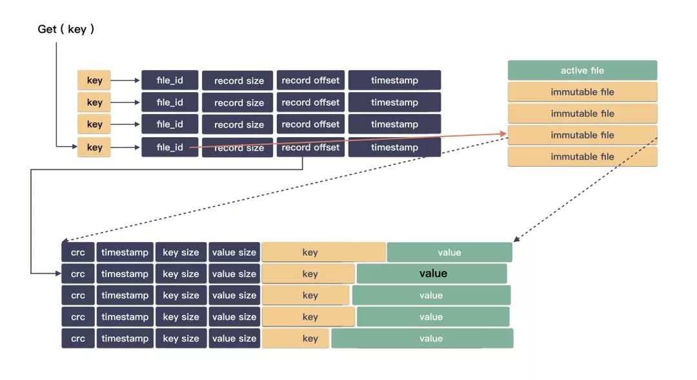
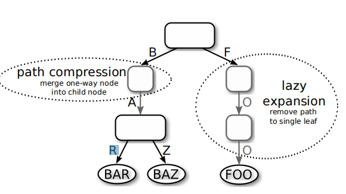
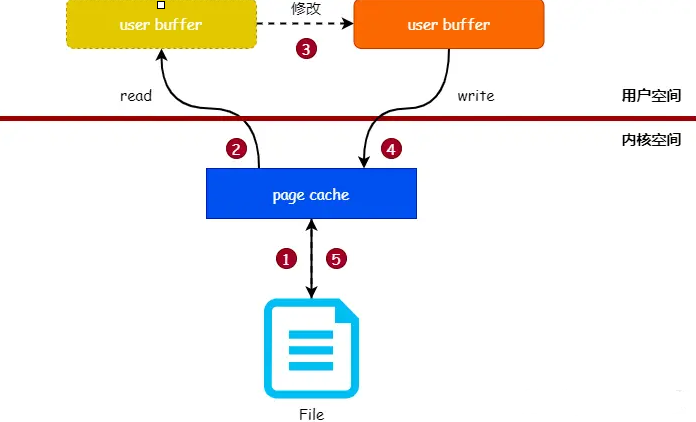
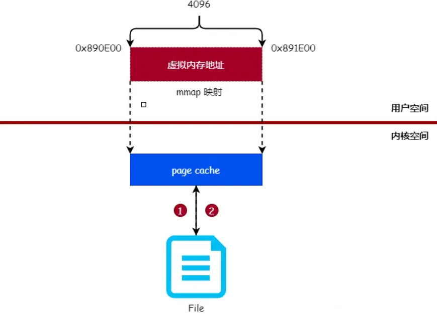

### Bitcask

##### Bitcask是什么

是一种基于日志的KV存储模型，起源于 Riak 分布式数据库，主要有以下几个优点：

*   读写的低时延;
*   高吞吐，在随机写入的场景;
*   数据量级要比 RAM 大;
*   持久化后的存储，故障恢复也要方便;
*   也要方便备份，方便恢复;

##### 增删改查

**增：**写入先写文件(顺序写入active file)，持久化落盘之后更新内存 hash 表。

**删：****删除也是写入**

**查：**先在内存 hash 表中查找用户 key ，从而获取到用户 value 在日志文件的位置。

​		file_id: 标示在哪个文件； 
​				offset: 标示在文件的开始位置； 
​				length: 标示值的长短（结束位置）；按着地址信息依次读取查询。



**回收：**在日志文件中删除的标记已经打上了，内存里又有全部索引，那只需要把有效的数据读出来写到新文件，然后把旧文件一删，就完成了空间的释放。

Bitcask 为了索引 key/value 的位置，在内存中构建了全部的索引关系。这个构建在初始化的时候可能会非常耗时，因为要遍历全部的日志文件，所以在每次merge的时候生成一份索引文档，也就是`hint  file`，在启动的时候用户内存加载索引。

##### 适用场景

1.   不适合存储海量数据，因为初始化时间会很长，并且需要的构建索引的内存也需要很大。
2.   适合小对象存储，因为是顺序IO的如果小对象存储时前面有个大对象，那么会导致小对象迟迟得不到落盘。

rosedb
------

基于go语言的NoSQL数据库 

本项目基于bitcask存储模型思想实现了一个高性能的Nosql数据库，通过go benchmark进行基准测试，能够实现76242op/s读操作，80690op/s写操作

1.   实验了string, list,hash,set 和zset，sortset数据结构

2.   实现了多种hash方法包括murmurhash3

3.   基于ARTree做内存索引

4.   实现普通文件和mmap读写方式，提高读写效率


```go
--benchmark 
----db_bench_test.go//性能测试测试函数
----kv_data.go //编写性能测试主要项目（增删改查操作）
--cmd//实现命令行命令
----command.go //
----server.go //
--ds//Data Structure
----art//ARTree
-------art.go//arTree树的基本操作（hash）
-------art_test.go //测试artree树
----zset//跳表结构
-------zset.go //定义跳表结构和跳表增删改查
		
--example
----hash
----list
----open
----sets
----strs

--flock
----flock_plan9.go//提供文件锁的基本方法
----flock_test.go//测试
----flock_unix.go//
----flock_windows.go//

--ioselector
----fileio.go // 提供普通形式读写方法，返回
----io_selector.go//接口，提供读写文件的抽象接口
----io_selector_test.go//
----mmap.go//提供mmap方式的读写方法，减少内存拷贝次数

--logfile
----log_entry.go//定义entry基本存储结构及操作方法
----log_entry_test.go//测试entry
----log_file.go//存储的磁盘文件的结构及基本方法
----log_file_test.go//测试

--logger
----log.go//定义各种情况下的日志输出,高亮，日志等级

--mmap

--resource//静态资源目录

--util 
----file.go //提供文件，文件夹的一些基本操作
----hash.go // 提供生成hash的方法
----murhash.go //Murmurhash3 哈希
----str.go 

--index.go //根据不同类型的存储形式定义内存索引的各种方法
--hash.go //定义hash类型的存储形式
--discard.go// 
--db.go //定义一个基本的数据库实例，及各种变量，增删改查方法
--sets.go
--zset.go
--strs.go
--list.go
--option.go 配置文件参数和默认配置
```

example中有不同的存储形式，比如hash中的main.go

>   1.   初始化option，构建db实例。
>   2.   调用 `db.HSet([]byte("watermelon"), []byte("hash"), []byte("In summer, I love watermelon."))`进入hash.go中

hash.go>HSet(将键值对放入内存和文件)

>   1.   上锁
>   2.   encodeKey根据key, field进行编码，LogEntry构建entry，writeLogEntry将entry写入file中
>   3.   art.NewART()创建ART树，db.updateIndexTree更新索引树

### 保存在内存中的MemTable

T-Tree,b+Tree

索引结构影响着内存读写的性能，在Redis中使用的是Hash，但是Hash只支持点查询，没有范围查询。rosedb中使用的是ARTree，能通过自适应地为内部节点选择紧凑而高效的数据结构，支持范围扫描、前缀查找、top-k、最小值和最大值等多种查找方法。

有两种类型的节点：内部节点，用来确定下一个子节点和叶节点，用来存储值。

如下图所示，其存储形式类似前缀树，但是其由多个不同大小的内部节点：Node4，Node16，Node48，Node256多种类型节点，适用于增量更新，避免像B+树那样调整



### mmap零拷贝原理

在[Netty零拷贝](../../中间件\Netty\源码分析\Netty零拷贝.md)中有说过，mmap+write可以减少一次数据拷贝，所以数据读取和发送我们都能使用上mmap零拷贝技术，以下是其主要原理

传统读写文件：

*   把文件内容读入到内存中。
*   修改内存中的内容。
*   把内存的数据写入到文件中。




mmap 读写文件：

如果可以直接在用户空间读写 `页缓存`page cache，那么就可以免去将 `页缓存` 的数据复制到用户空间缓冲区的过程，使用 `mmap` 系统调用可以将用户空间的虚拟内存地址与文件进行映射（绑定），对映射后的虚拟内存地址进行读写操作就如同对文件进行读写操作一样。



### skip-table结构

