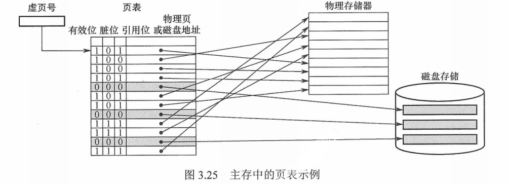
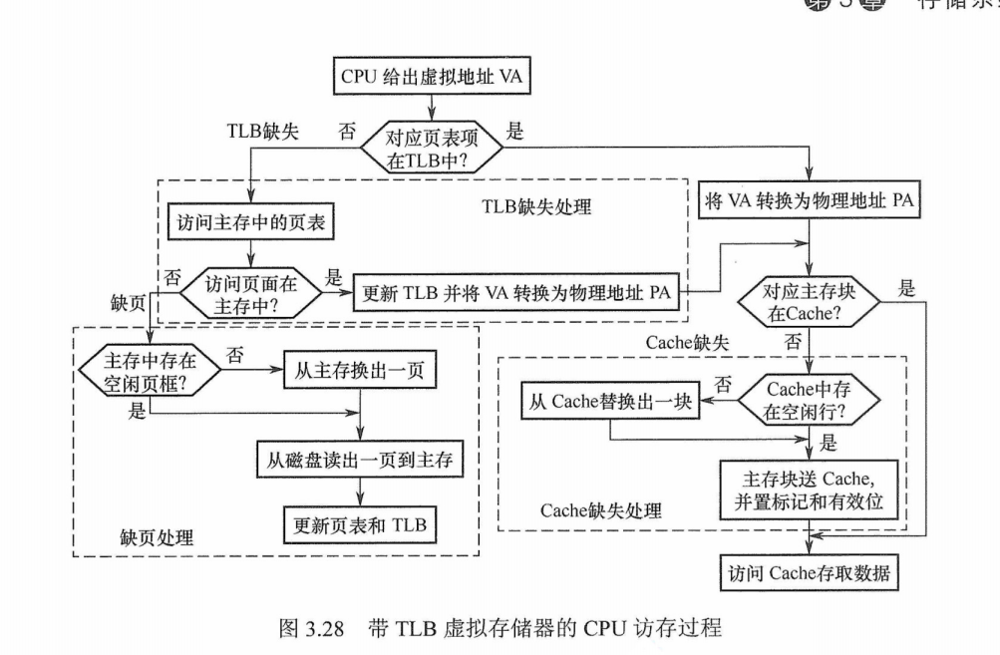
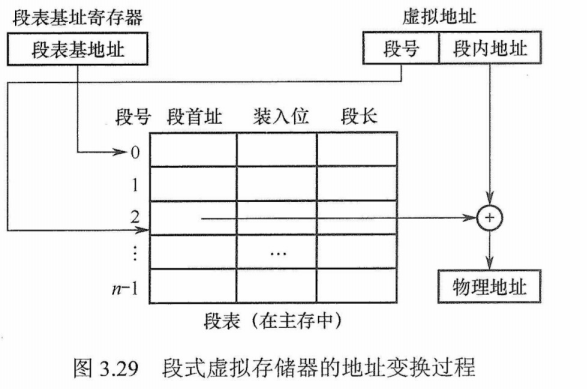

### Linux虚拟地址转为物理地址

1. 引入虚拟地址让系统更安全，这样上层系统就不能够直接操纵物理地址，需要通过**虚拟地址映射为物理地址**。
2. 用户可以自由编程，不需要在乎主存容量和程序实际存储位置

Linux引入了MMU（Memory Management Unit），CPU核发出的地址将被MMU截获，从CPU到MMU的地址称为**虚拟地址**（Virtual Address，以下简称VA），而MMU将这个地址翻译成另一个地址发到CPU芯片的外部地址引脚上，也就是将虚拟地址映射成物理地址

#### 页式虚拟存储器

以页为基本单位的虚拟存储器称为**页式虚拟存储器**。虚拟空间与主存空间都被划分成同样大小的页，主存的页称为实页，<u>虚存的页称为虚页</u>。把虚拟地址分为两个字段:<u>虚页号和页内地址</u>。虚拟地址到物理地址的转换是由页表实现的。页表是一张存放在主存中的虚页号和实页；

页表：用来表示页面是否在主存中，若为1，代表虚拟页在主存中，此时页表存放该页的物理页号，若为0，则页表存放的该页的磁盘地址。除此之外，还有脏位和引用位(使用位，配合替换策略)

CPU 执行指令时，需要先将虚拟地址转换为主存物理地址。**每个进程都有一个页表基址寄存器**，存放该进程的页表首地址，然后根据虚拟地址高位部分的虚拟页号找到对应的页表项，若装入位为1，则取出物理页号，和虚拟地址低位部分的页内地址拼接，形成实际物理地址;若装入位为0，则说明缺页，需要操作系统进行缺页处理。

页式虚拟存储器的优点是，页面的长度固定,页表简单，调入方便。缺点是，由于程序不可能正好是页面的整数倍，最后一页的零头将无法利用而造成浪费，并且页不是逻辑上独立的实体，所以处理、保护和共享都不及段式虚拟存储器方便。

#### TLB快表

主存中的页为慢表，因为需要先访问主存查表，如果页面在主存，则还需要访问一次主存，否则还要通过中断将页面调入主存，所以就有了快表，快表根据局部性原理，如果命中快表，则无需访问主存。

带有快表的cpu访问主存过程：

#### 段式虚拟存储器

段式虚拟存储器中的段是按**程序的逻辑结构划分**的，各个段的长度因程序而异。虚拟地址分为两部分:**段号和段内地址**。虚拟地址到实地址之间的变换是由<u>段表</u>来实现的。段表是程序的逻辑段和在主存中存放位置的对照表。段表的每行记录与某个段对应的段号、装入位、段起点和段长等信息。由于段的长度可变，所以段表中要给出各段的起始地址与段的长度。

#### 段页式虚拟存储器

把程序按逻辑结构分段，每段再划分为固定大小的页，主存空间也划分为大小相等的页程序对主存的调入、调出仍以页为基本传送单位，这样的虚拟存储器称为段页式虚拟存储器在段页式虚拟存储器中，每个程序对应一个段表，每段对应一个页表，段的长度必须是页长的整数倍,段的起点必须是某一页的起点。
		虚地址分为**段号、段内页号、页内地址**三部分。CPU根据虚地址访存时，首先根据段号得到段表地址;然后从段表中取出该段的页表起始地址，与虚地址段内页号合成，得到页表地址;最后从页表中取出实页号，与页内地址拼接形成主存实地址。
		段页式虚拟存储器的优点是，兼具页式和段式虚拟存储器的优点，可以按段实现共享和保护。缺点是在**地址变换过程中需要两次查表，系统开销较大**。

### Linux内存

#### 虚拟地址转为物理地址

linux采用了分页机制，通常采用四级页表，页全局目录(PGD)，页上级目录(PUD)，页中间目录(PMD)，页表(PTE)

每次转换先获取物理页基地址，再从线性地址中获取索引，合成物理地址后再访问内存。不管是页表还是要访问的数据都是以页为单位存放在主存中的，因此每次访问内存时都要先获得基址，再通过索引(或偏移)在页内访问数据

#### 内存初始化

构建四级页表

#### 内存分配器

##### 动态内存分配

动态内存分配（Dynamic memory allocation）简称 DMA，在程序运行时对程序进行内存分配，主要使用空闲分区链维护空闲内存，通过不同的算法来查找可用的空闲链表。1.⾸次适应算法（first fit）2.循环首次适应算法（next fit 从上次找到的空闲分区的下⼀个空闲分区开始查找）3.最佳适应算法（best fit）

##### 伙伴算法

伙伴算法是一种非常经典的内存分配算法，它采用了分离适配的设计思想，将物理内存按照 2 的次幂进行划分，内存分配时也是按照 2 的次幂大小进行按需分配

##### slab算法

伙伴算法都是以Page为最小管理单位，在小内存的分配场景，伙伴算法并不适用，如果每次都分配一个 Page 岂不是非常浪费内存，因此 Slab 算法应运而生了

Linux内核使用的就是slab算法，