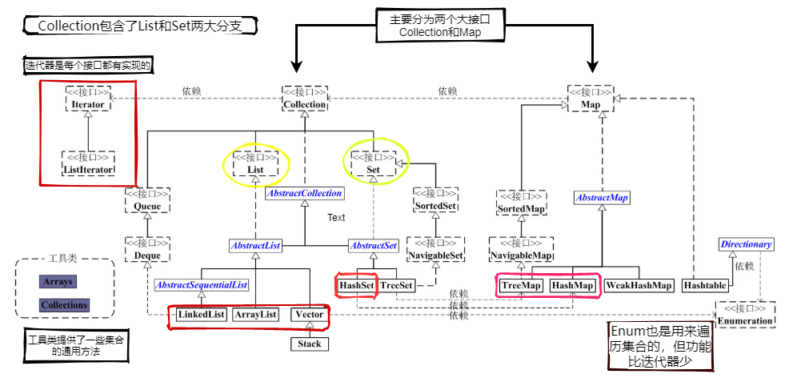
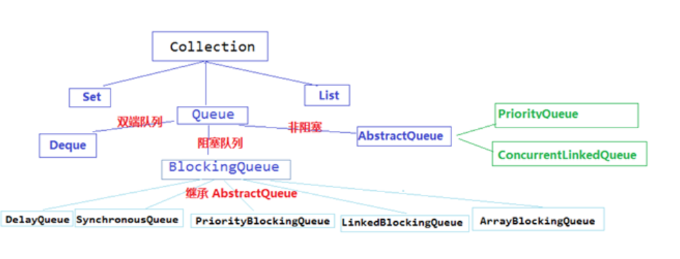

java集合框架
------------

分为Collection接口和Map接口；



>  List接口下的集合ArrayList，LinkedList，Vector，CopyOnWriteArrayList

#### ArrayList

>   		ArrayList考点没有很多，首先extends AbstractList 并实现了List接口（第一个考点：**为什么同时继承AbstractList ，又实现List**）接着就是初始化，初始化如果有传入容量就对容量进行有效性判断，如果没有，就使用默认容量（默认：10，最小也是10）。然后它的基本方法都很简单（第二个考点：**初始化时ArrayList底层数组并没有形成，而是第一次add是创建的底层数组**），基本就是对数组进行操作，如果需要扩容（第三个点：**扩容扩多少，怎么去扩**），则生成一个新的Capacity(当然其中包括了很多判断，总之不能超过Integer.MAX_VALUE )，在进行深拷贝 System.arraycopy（第四个考点：**深拷贝**），替换到新的数组中。哦对，还有一个**fast-fail机制**。
>   -----------------------------------------------------------------------------------------------------------------------------------------------------------------------------------------------------------------------------------------------------------------------------------------------------------------------------------------------------------------------------------------------------------------------------------------------------------------------------------------------------------------------------------------------------------------------------------------------------------------------------------------

1. List接口下的一个实现，使用数组存储

2. extends AbstractList ：继承了AbstractList。为什么要先继承AbstractList，而让AbstractList先实现List？而不是让ArrayList直接实现List？
   这里是有一个思想，接口中全都是抽象的方法，而抽象类中可以有抽象方法，还可以有具体的实现方法，正是利用了这一点，让AbstractList是实现接口中一些通用的方法，而具体的类， 如ArrayList就继承这个AbstractList类，拿到一些通用的方法，然后自己在实现一些自己特有的方法，这样一来，让代码更简洁，就继承结构最底层的类中通用的方法都抽取出来，先一起实现了，减少重复代码。所以一般看到一个类上面还有一个抽象类，应该就是这个作用。

3. 实现了List接口：ArrayList的父类AbstractList也实现了List接口，那为什么子类ArrayList还是去实现一遍呢？collection 的作者Josh说他写这代码的时候觉得这个会有用处，但是其实并没什么用，但因为没什么影响，就一直留到了现在。

4. 实现了RandomAccess接口：表明ArrayList支持快速（通常是固定时间）随机访问。在ArrayList中，我们可以通过元素的序号快速获取元素对象，这就是快速随机访问。

5. 实现了Cloneable接口：实现了该接口，就可以使用Object.Clone()方法了。

6. implements java.io.Serializable：表明该类具有序列化功能，该类可以被序列化，什么是序列化？简单的说，就是能够从类变成字节流传输，然后还能从字节流变成原来的类。

   > 容量：1.7的时候是初始化就创建一个容量为10的数组，1.8后是初始化先创建一个空数组，第一次add时才扩容为10
   >
   > 构造方法：无参，int值，传入collection集合
   >
   > ```
   > trimToSize ：将list数组容量设置为实际容量
   > size（），isEmpty，contains，indexOf，lastIndexOf，clone，toArray，set，get,add(),add(int,E)（使用arraycopy来将index后面的数据放到index+1处）,remove(int)，remove(Object o)(删除指定索引或者指定元素),fastRemove，clear,addAll,removeRange(int，int),rangeCheck,removeAll,retainAll（保留指定集合的元素，删除不在的元素，调用batchRemove(c, true)删除不在的元素），listIterator(int index)（返回指定位置开始的迭代器），listIterator（功能更强大的迭代器），Iterator，Itr（hasNext，next，remove，forEachRemaining），ListItr（hasPrevious，nextIndex，previousIndex，set，add），subList，sort（legacyMergeSort归并排序或者TimSort）
   > ```

#### LinkedList

> LinkedList考点更加少，继承于AbstractSequentialList，实现了List ，Deque 接口，主要操作就是基于数据结构的链表，但注意他是双向链表，每个节点都具有pre和next两个指针，并且链表还具有first和last两个头尾指针。
>
> 构造Queue:
>
> Queue queue = new LinkedList()普通队列（add(e)，offer(e)，remove()，poll()，element()，peek()）
>
> Deque deque = new LinkedList()可用作双端队列（offerFirst(e)=addFirst(e)，pollFirst()，peekFirst()=getFirst()，offerLast(e)，pollLast()，peekLast()）和堆栈（push(e)，pop()，peek()）

> List<E>, Deque<E>, Cloneable, java.io.Serializable
>        LinkedList 是一个继承于AbstractSequentialList的双向链表。它也可以被当作堆栈、队列或双端队列进行操作。实现了Dequeue接口，
>        LinkedList 实现 List 接口，能对它进行队列操作。
>        LinkedList 实现 Deque 接口，即能将LinkedList当作双端队列使用。
>        LinkedList 实现了Cloneable接口，即覆盖了函数clone()，能克隆。
>        LinkedList 实现java.io.Serializable接口，这意味着LinkedList支持序列化，能通过序列化去传输。
>        LinkedList 是非同步的。
>
> Node是**双向链表节点所对应的数据结构**，它包括的属性有：**当前节点所包含的值**，**上一个节点**，**下一个节点**。

> 构造函数：无参和collection集合
>
> ```
> linkFirst，linkLast，linkBefore（在指定元素前加入指定元素），unlinkFirst，unlinkLast，unlink，getFirst，getLast，removeFirst，removeLast，addFirst，addLast，contains，size，add，remove，addAll，get，add(int index, E element)，isElementIndex，
> ```

#### CopyOnWriteArrayList

CopyOnWriteArrayList适合使用在读操作远远大于写操作的场景里，比如缓存。

缺点：

1. 写操作的时候，需要拷贝数组，会消耗内存，如果原数组的内容比较多的情况下，可能导致young gc或者full gc
2. 不能用于实时读的场景，像拷贝数组、新增元素都需要时间，,虽然CopyOnWriteArrayList 能做到最终一致性,但是还是没法满足实时性要求；

继承自List<E>, RandomAccess, Cloneable, java.io.Serializable


#### Set

Set是个接口，继承自collection，iterable，

> set接口下有HashSet，TreeSet

##### HashSet

**构造函数：**1.默认无参构造2. 带集合的构造函数3.指定HashSet初始容量和加载因子的构造函数4.指定HashSet初始容量的构造函数

**继承自：**Set<E>, Cloneable, java.io.Serializable，AbstractSet


#### Queue



queue继承collection,iterable,

> Queue接口下有Deque(双端队列)，BlockingQueue(阻塞队列)，AbstractQueue(非阻塞队列)

接口queue中的方法:

```java
add,offer,remove,poll,element，peek，都是抽象方法，需要子类去实现
```

 Deque<E> extends Queue

接口deque中的方法：

```java
除了collection，Queue接口上继承的方法，还有自己针对双链表操作的方法，addFirst，addLast，offerFirst，offerLast，removeFirst，removeLast，pollFirst，pollLast，getFirst，getLast，peekFirst，peekLast，removeFirstOccurrence，removeLastOccurrence，descendingIterator，push，pop
```

### Map

> Map接口下有HashMap（HashMap下面还有LinkedHashMap，ConcurrentHashMap，weakHashMap等等）,TreeMap, HashTable

#### HashMap


#### TreeMap

基于红黑树实现。

#####  Collection 和 Collections 有什么区别？

1、**java.util.Collection 是一个集合接口**。它提供了对集合对象进行基本操作的通用接口方法。Collection接口在Java 类库中有很多具体的实现。Collection接口的意义是为各种具体的集合提供了最大化的统一操作方式。List，Set，Queue接口都继承Collection。直接实现该接口的类只有AbstractCollection类，该类也只是一个抽象类，提供了对集合类操作的一些基本实现。List和Set的具体实现类基本上都直接或间接的继承了该类。

2、**java.util.Collections 是一个包装类**。它包含有各种有关集合操作的静态方法（对集合的搜索、排序、线程安全化等），大多数方法都是用来处理线性表的。此类不能实例化，就像一个工具类，常用的方法有**sort**(对集合进行排序)，**shuffle**(随机生成一个排序)，**binarySearch**（查找指定集合中的元素，返回所查找元素的索引），**replaceAll**(将所有指定的元素进行替换)，**reverse**(反转集合中元素的顺序)，**copy**（将集合m中的元素复制到集合n），**fill**（将集合中所有元素替换为给定那个元素）

##### 21.HashMap 和 Hashtable 有什么区别？

HashMap允许键和值是null，而Hashtable则不允许键或者值是null。

Hashtable是同步的，也就是线程安全的，而HashMap不是，所以**HashMap更适用于单线程环境，Hashtable则适用于多线程环境**

##### 22.如何决定使用 HashMap 还是 TreeMap？

##### 25.ArrayList 和 LinkedList 的区别是什么？

##### 26.如何实现数组和 List 之间的转换？

##### 28.Array 和 ArrayList 有何区别？

##### 29.在 Queue 中 poll()和 remove()有什么区别？

##### 30.哪些集合类是线程安全的？

##### 31.迭代器 Iterator 是什么？

##### 32.Iterator 怎么使用？有什么特点？

##### 33.Iterator 和 ListIterator 有什么区别？

##### 34.怎么确保一个集合不能被修改？

final关键字可以修饰类，方法，成员变量，final修饰的类不能被继承，final修饰的方法不能被重写，final修饰的成员变量必须初始化值，如果这个成员变量是基本数据类型，表示这个变量的值是不可改变的，如果说这个成员变量是引用类型，则表示这个引用的地址值是不能改变的，但是这个引用所指向的对象里面的内容还是可以改变的

那么，我们怎么确保一个集合不能被修改？首先我们要清楚，集合（map,set,list…）都是引用类型，所以我们如果用final修饰的话，集合里面的内容还是可以修改的。

假如我们用final关键字定义了一个map集合，这时候我们往集合里面传值，第一个键值对1,1；我们再修改后，可以把键为1的值改为100，说明我们是可以修改map集合的值的。

那我们应该怎么做才能确保集合不被修改呢？
我们可以采用Collections包下的unmodifiableMap方法，通过这个方法返回的map,是不可以修改的。他会报 java.lang.UnsupportedOperationException错。

同理：Collections包也提供了对list和set集合的方法。
Collections.unmodifiableList(List)
Collections.unmodifiableSet(Set)

##### asList的缺陷

[asList](http://wiki.jikexueyuan.com/project/java-enhancement/java-thirtysix.html)

