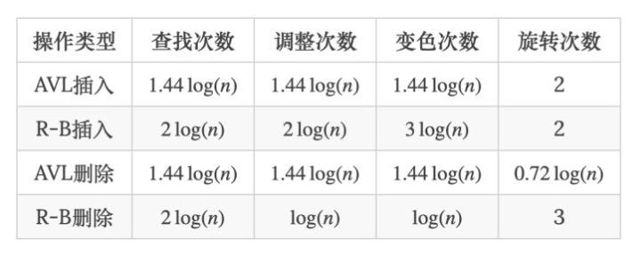

红黑树
------

https://zhuanlan.zhihu.com/p/93369069

##### 定义

红黑树是一种含有红黑结点并能**自平衡的二叉查找树**

​	

##### 性质

 *性质1：每个节点要么是黑色，要么是红色。*  

  *性质2：根节点是黑色。*  

  *性质3：每个叶子节点（NIL）是黑色。*  

***性质4：每个红色结点的两个子结点一定都是黑色。*** 

***性质5：任意一结点到每个叶子结点的路径都包含数量相同的黑结点。（保证这棵树尽量是平衡的。）***

#### 平衡操作

https://www.cnblogs.com/gejuncheng/p/9081886.html

##### 1.插入操作

首先约定**被插入的节点都为红色节点**

（1）被插入的节点是根节点，直接涂为黑色

（2）被插入的父节点是黑色，什么都不用做

（3）被插入的节点父节点也是红色，

1.   当前节点的祖父节点的另一个子节点〔叔叔节点）也是红色

​     {1}将“父节点“设为黑色。
​            (2]将”叔叔节点“设为黑色。

​    (3]将”祖交节点“设为“红色“。
​            (4将"祖父节点"设为“当前节点”(红色节点):即，之后继续对"当前节点"进行操作

2.   叔叔节点是黑色,且当面节点是共交节点的右孩子
            (1)将父节点“作为“新的当前节点“。

​		     (2) 以”新的当前节点为支点进行左旋。

3.   叔叔节点是黑色:且当前节点是共交节点的左孩子
     (1]将“父节点“设为”“黑色“。
     (2)将”祖交节点“设为“红色“。

​     (3)以”祖交节点"为支点讲行右旋。

##### 2.删除操作

删除的节点有两个儿子时，可以转化为删除的节点只有一个儿子时的问题。对于二叉查找树，在删除带有两个非叶子儿子的节点的时候，<u>我们找到要么在它的左子树中的最大元素、要么在它的右子树中的最小元素，并把它的值转移到要删除的节点中</u>。我们接着删除我们从中复制出值的那个节点，它必定有少于两个非叶子的儿子。因为只是复制了一个值，不违反任何性质，这就把问题简化为如何删除最多有一个儿子的节点的问题。它不关心这个节点是最初要删除的节点还是我们从中复制出值的那个节点。

1.   N为红色节点时。直接删除N，用它的黑色儿子代替它的位置。

     

### 应用场景

**查找代价：**由于**红黑树的**性质(<u>最长路径长度不超过最短路径长度的2倍</u>)，**可以**说明**红黑树**虽然不像AVL一样**是**严格平衡**的**，但平衡性能还**是**要比BST要好。其查找代价基本维持在O(logN)左右，但在最差情况下(最长路径**是**最短路径**的**2倍少1)，比AVL要略逊色一点。

**插入代价：**RBT插入结点时，需要旋转操作和变色操作。但由于只需要保证RBT基本平衡就**可以**了。因此插入结点最多只需要2次旋转，这一点和AVL**的**插入操作一样。虽然变色操作需要O(logN)，但**是**变色操作十分简单，代价很小。

**删除代价：**RBT的删除操作代价要比AVL要好的多，删除一个结点最多只需要3次旋转操作。从根到叶子节点的最大路径不能大于最短路径的两倍长,大致上是平衡的，插入、删除和查找某个值的最坏情况时间都要求与树的高度成比例。

