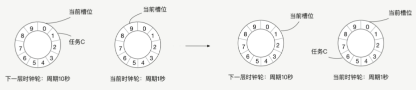

# 时间轮

### 使用场景

Dubbo 中对时间轮的应用主要体现在如下两个方面：

- **失败重试，** 例如，Provider 向注册中心进行注册失败时的重试操作，或是 Consumer 向注册中心订阅时的失败重试等。
- **周期性定时任务，** 例如，定期发送心跳请求，请求超时的处理，或是网络连接断开后的重连机制。
- **延时消息的功能**，比如让一个任务几分钟之后发送一条消息出去。在比如可以实现订单过期功能，用户下单10分钟没付款，就取消订单，可以通过时钟轮实现。

### 时间轮原理

本来可以使用sleep，每次启动一个线程，sleep到规定时间就触发超时逻辑。但是在高并发场景下，太耗费资源，所以不可行。

还有另一种实现方式。我们可以用一个线程来处理所有的定时任务，我们启动一个线程，这个线程每隔 100 毫秒会扫描一遍所有的处理 Future 超时的任务，当发现一个 Future 超时了，我们就执行这个任务，对这个 Future 执行超时逻辑。这种方式每隔100ms就需要对所有任务进行扫描，当任务足够多，每秒就需要对所有线程扫描10次，很浪费CPU;

##### 时间轮

在时钟轮机制中，有**时间槽和时钟轮**的概念，时间槽就相当于**时钟的刻度**，而时钟轮就相当于秒针与分针等跳动的一个周期，我们会将每个任务放到对应的时间槽位上。

分为当前时间轮和下一个时间轮,假设当前时间轮每一个槽位代表100ms，一共九个槽位共1s，则下一个时间轮每一个槽位为1s , 当前时间轮转完后，下一个时间轮就会转动一个槽位，将下一个时间轮槽位任务分配到当前时间轮中。

两个注意点：

1. 时间槽位的单位时间越短，时间轮触发任务的时间就越精确。例如时间槽位的单位时间是 10 毫秒，那么执行定时任务的时间误差就在 10 毫秒内，如果是 100 毫秒，那么误差就在 100 毫秒内。
2. 时间轮的槽位越多，那么一个任务被重复扫描的概率就越小，因为只有在多层时钟轮中的任务才会被重复扫描。比如一个时间轮的槽位有 1000 个，一个槽位的单位时间是 10 毫秒，那么下一层时间轮的一个槽位的单位时间就是 10 秒，超过 10 秒的定时任务会被放到下一层时间轮中，也就是只有超过 10 秒的定时任务会被扫描遍历两次，但如果槽位是 10 个，那么超过 100 毫秒的任务，就会被扫描遍历两次。

### 核心实现

##### **TimerTask 

在 Dubbo 中，所有的定时任务都要继承 **TimerTask 接口**，该方法的入参是一个 **Timeout 接口的对象**。Timeout 对象与 TimerTask 对象一一对应，两者的关系类似于线程池返回的 Future 对象与提交到线程池中的任务对象之间的关系。通过 Timeout 对象，我们不仅可以查看定时任务的状态，还可以操作定时任务（例如取消关联的定时任务）

##### HashedWheelTimeout

HashedWheelTimeout 是 Timeout 接口的唯一实现，是 HashedWheelTimer 的内部类。HashedWheelTimeout 扮演了两个角色：

- 第一个，时间轮中双向链表的**节点**，即定时任务 TimerTask 在 HashedWheelTimer 中的容器。
- 第二个，定时任务 TimerTask 提交到 HashedWheelTimer 之后返回的**句柄**（Handle），用于在时间轮外部查看和控制定时任务。

HashedWheelTimeout 中的核心字段如下：

- **prev、next（HashedWheelTimeout类型）**，分别对应当前定时任务在链表中的前驱节点和后继节点。
- **task（TimerTask类型）**，指实际被调度的任务。
- **deadline（long类型）**，指定时任务执行的时间。这个时间是在创建 HashedWheelTimeout 时指定的，计算公式是：currentTime（创建 HashedWheelTimeout 的时间） + delay（任务延迟时间） - startTime（HashedWheelTimer 的启动时间），时间单位为纳秒。
- **state（volatile int类型）**，指定时任务当前所处状态，可选的有三个，分别是 INIT（0）、CANCELLED（1）和 EXPIRED（2）。另外，还有一个 STATE_UPDATER 字段（AtomicIntegerFieldUpdater类型）实现 state 状态变更的原子性。
- **remainingRounds（long类型）**，指当前任务剩余的时钟周期数。时间轮所能表示的时间长度是有限的，在任务到期时间与当前时刻的时间差，超过

##### HashedWheelBucket

HashedWheelBucket 是**时间轮中的一个槽**，时间轮中的槽实际上就是一个**用于缓存和管理双向链表的容器**，双向链表中的每一个节点就是一个 HashedWheelTimeout 对象，也就关联了一个 TimerTask 定时任务。

HashedWheelBucket 持有双向链表的首尾两个节点，分别是 head 和 tail 两个字段，再加上每个 HashedWheelTimeout 节点均持有前驱和后继的引用，这样就可以正向或是逆向遍历整个双向链表了。

下面我们来看 HashedWheelBucket 中的核心方法。

- **addTimeout() 方法**：新增 HashedWheelTimeout 到双向链表的尾部。
- **pollTimeout() 方法**：移除双向链表中的头结点，并将其返回。
- **remove() 方法**：从双向链表中移除指定的 HashedWheelTimeout 节点。
- **clearTimeouts() 方法**：循环调用 pollTimeout() 方法处理整个双向链表，并返回所有未超时或者未被取消的任务。
- **expireTimeouts() 方法**：遍历双向链表中的全部 HashedWheelTimeout 节点。 在处理到期的定时任务时，会通过 remove() 方法取出，并调用其 expire() 方法执行；对于已取消的任务，通过 remove() 方法取出后直接丢弃；对于未到期的任务，会将 remainingRounds 字段（剩余时钟周期数）减一。

##### HashedWheelTimer

HashedWheelTimer 是 Timer 接口的实现，它通过时间轮算法实现了一个定时器。HashedWheelTimer 会根据当前时间轮指针选定对应的槽（HashedWheelBucket），从双向链表的头部开始迭代，对每个定时任务（HashedWheelTimeout）进行计算，属于当前时钟周期则取出运行，不属于则将其剩余的时钟周期数减一操作。

下面我们来看 HashedWheelTimer 的核心属性。

- **workerState（volatile int类型）**：时间轮当前所处状态，可选值有 init、started、shutdown。同时，有相应的 AtomicIntegerFieldUpdater 实现 workerState 的原子修改。
- **startTime（long类型）**：当前时间轮的启动时间，提交到该时间轮的定时任务的 deadline 字段值均以该时间戳为起点进行计算。
- **wheel（HashedWheelBucket[]类型）**：该数组就是时间轮的环形队列，每一个元素都是一个槽。当指定时间轮槽数为 n 时，实际上会取大于且最靠近 n 的 2 的幂次方值。
- **timeouts、cancelledTimeouts（LinkedBlockingQueue类型）**：timeouts 队列用于缓冲外部提交时间轮中的定时任务，cancelledTimeouts 队列用于暂存取消的定时任务。HashedWheelTimer 会在处理 HashedWheelBucket 的双向链表之前，先处理这两个队列中的数据。
- **tick（long类型）**：该字段在 HashedWheelTimer$Worker 中，是时间轮的指针，是一个步长为 1 的单调递增计数器。
- **mask（int类型）**：掩码， mask = wheel.length - 1，执行 ticks & mask 便能定位到对应的时钟槽。
- **ticksDuration（long类型）**：时间指针每次加 1 所代表的实际时间，单位为纳秒。
- **pendingTimeouts（AtomicLong类型）**：当前时间轮剩余的定时任务总数。
- **workerThread（Thread类型）**：时间轮内部真正执行定时任务的线程。
- **worker（Worker类型）**：真正执行定时任务的逻辑封装这个 Runnable 对象中。

时间轮对外提供了一个 newTimeout() 接口用于提交定时任务，在定时任务进入到 timeouts 队列之前会先调用 start() 方法启动时间轮，其中会完成下面两个关键步骤：

1. 确定时间轮的 startTime 字段；
2. 启动 workerThread 线程，开始执行 worker 任务。

之后根据 startTime 计算该定时任务的 deadline 字段，最后才能将定时任务封装成 HashedWheelTimeout 并添加到 timeouts 队列。

下面我们来分析时间轮指针一次转动的全流程。

1. 时间轮指针转动，时间轮周期开始。
2. 清理用户主动取消的定时任务，这些定时任务在用户取消时，会记录到 cancelledTimeouts 队列中。在每次指针转动的时候，时间轮都会清理该队列。
3. 将缓存在 timeouts 队列中的定时任务转移到时间轮中对应的槽中。
4. 根据当前指针定位对应槽，处理该槽位的双向链表中的定时任务。
5. 检测时间轮的状态。如果时间轮处于运行状态，则循环执行上述步骤，不断执行定时任务。如果时间轮处于停止状态，则执行下面的步骤获取到未被执行的定时任务并加入 unprocessedTimeouts 队列：遍历时间轮中每个槽位，并调用 clearTimeouts() 方法；对 timeouts 队列中未被加入槽中循环调用 poll()。
6. 最后再次清理 cancelledTimeouts 队列中用户主动取消的定时任务。

上述核心逻辑在 HashedWheelTimer$Worker.run() 方法中，若你感兴趣的话，可以翻看一下源码进行分析。

### Dubbo 中如何使用定时任务

在 Dubbo 中，时间轮并不直接用于周期性操作，而是只向时间轮提交执行单次的定时任务，在上一次任务执行完成的时候，调用 newTimeout() 方法再次提交当前任务，这样就会在下个周期执行该任务。即使在任务执行过程中出现了 GC、I/O 阻塞等情况，导致任务延迟或卡住，也不会有同样的任务源源不断地提交进来，导致任务堆积。

