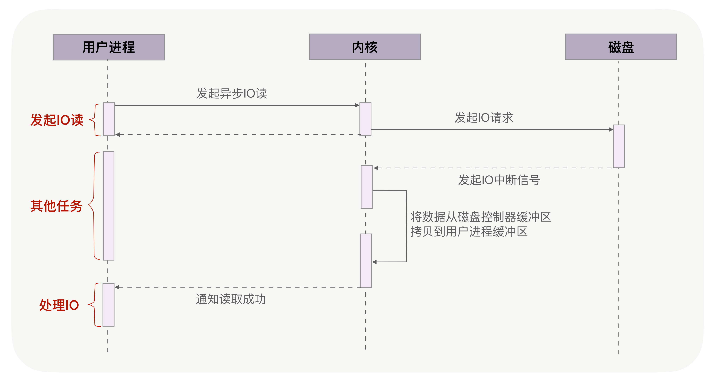

Netty零拷贝
-----------

### Linux的零拷贝技术

https://www.cnblogs.com/xiaolincoding/p/13719610.html

##### DMA技术

早期 I/O 操作，内存与磁盘的数据传输的工作都是由 CPU 完成的，而此时 CPU 不能执行其他任务，会特别浪费 CPU 资源。

于是，为了解决这一问题，DMA 技术就出现了，每个 I/O 设备都有自己的 DMA 控制器，通过这个 DMA 控制器，<u>CPU 只需要告诉 DMA 控制器，我们要传输什么数据，从哪里来，到哪里去，就可以放心离开了</u>。后续的实际数据传输工作，都会由 DMA 控制器来完成，CPU 不需要参与数据传输的工作。

通过CPU去取数据：

通过DMA取数据：

##### 传统的文件传输方式

传统 IO 的工作方式，从硬盘读取数据，然后再通过网卡向外发送，我们需要进行 <u>4 上下文切换，和 4 次数据拷贝</u>，其中 2 次数据拷贝发生在内存里的缓冲区和对应的硬件设备之间，这个是由 DMA 完成，另外 2 次则发生在内核态和用户态之间，这个数据搬移工作是由 CPU 完成的。

##### 零拷贝技术的出现

减少系统调用次数

###### mmap+wirte的方式（减少一次数据拷贝过程，但系统调用还需要两次，4次上下文切换）

###### sendfile（减少了两次上下文切换）

为了提高文件传输的性能，于是就出现了零拷贝技术，它通过一次系统调用（`sendfile` 方法）合并了磁盘读取与网络发送两个操作，降低了上下文切换次数。另外，拷贝数据都是发生在内核中的，天然就降低了数据拷贝的次数。

sendfile系统调用（），可以直接把内核缓冲区里的数据拷贝到 socket 缓冲区里，不再拷贝到用户态，这样就只有 2 次上下文切换，和 3 次数据拷贝

ssize_t sendfile(int out_fd, int in_fd, off_t *offset, size_t count);前两个参数分别是目的端和源端的文件描述符，后面两个参数是源端的偏移量和复制数据的长度，返回值是实际复制数据的长度。

###### SG-DMA（两次上下文切换，两次数据拷贝）

*   第一步，通过 DMA 将磁盘上的数据拷贝到内核缓冲区里；

*   第二步，缓冲区描述符和数据长度传到 socket 缓冲区，这样网卡的 <u>SG-DMA 控制器就可以直接将内核缓存中的数据拷贝到网卡的缓冲区里</u>，此过程不需要将数据从操作系统内核缓冲区拷贝到 socket 缓冲区中，这样就减少了一次数据拷贝；

    ##### 使用零拷贝技术的项目

Kafka 和 Nginx 都有实现零拷贝技术，这将大大提高文件传输的性能。

### PageCache

零拷贝使用了 PageCache 技术，可以使得零拷贝进一步提升了性能，PageCache 会缓存最近访问的数据，提升了访问缓存数据的性能，同时，为了解决机械硬盘寻址慢的问题，根据程序的局部性原理，它还<u>协助 I/O 调度算法实现了 IO 合并与预读</u>，这也是顺序读比随机读性能好的原因。这些优势，进一步提升了零拷贝的性能。

需要注意的是，零拷贝技术是不允许进程对文件内容作进一步的加工的，比如压缩数据再发送。

##### 传输大文件

当传输大文件时，不能使用零拷贝，因为可能由于 PageCache 被大文件占据，而导致「热点」小文件无法利用到 PageCache，并且<u>大文件的缓存命中率不高</u>，这时就需要使用「**异步 IO + 直接 IO** 」的方式。

*   前半部分，内核向磁盘发起读请求，但是可以**不等待数据就位就可以返回**，于是进程此时可以处理其他任务；（异步IO）
*   后半部分，当内核将磁盘中的数据拷贝到进程缓冲区后，进程将接收到内核的**通知**，再去处理数据；

如下图所示：我们发起异步IO后可以直接返回，不用阻塞，然后从磁盘传输到用户进程缓存区，绕过PageCache，等传输完毕向CPU发送一个IO终端信号，以上对于绕过PageCache的IO，我们把它称为**<u>直接IO</u>**。<u>对于磁盘，异步IO只支持直接IO。</u>

直接IO的应用场景并不多，主要有两种：第一，**应用程序已经实现了磁盘文件的缓存**，不需要PageCache再次缓存，引发额外的性能消耗。比如MySQL等数据库就使用直接IO；第二，**高并发下传输大文件**，我们上文提到过，大文件难以命中PageCache缓存，又带来额外的内存拷贝，同时还挤占了小文件使用PageCache时需要的内存，因此，这时应该使用直接IO。

直接IO也有一定的缺点（也就是PageCache的优势，直接IO没有）。除了缓存外，内核（IO调度算法）会试图缓存尽量多的连续IO在PageCache中，最后**合并**成一个更大的IO再发给磁盘，这样可以减少磁盘的寻址操作；另外，内核也会**预读**后续的IO放在PageCache中，减少磁盘操作。直接IO绕过了PageCache，所以无法享受这些性能提升。

> 大文件由异步IO和直接IO处理，小文件则交由零拷贝处理，至于判断文件大小的阈值可以灵活配置, 参考 Nginx 里，可以通过配置，设定一个文件大小阈值，针对大文件使用异步 IO 和直接 IO，而对小文件使用零拷贝。

### Netty 的零拷贝技术

Netty 中的零拷贝技术除了<u>操作系统级别的功能封装</u>，更多的是面向用户态的数据操作优化，主要体现在以下 5 个方面：

1.   堆外内存，避免 JVM 堆内存到堆外内存的数据拷贝。

     >   JVM 内部执行 I/O 操作时，必须将数据拷贝到堆外内存，才能执行系统调用。这是所有 VM 语言都会存在的问题。
     >
     >   **那么为什么操作系统不能直接使用 JVM 堆内存进行 I/O 的读写呢？**主要有两点原因：
     >
     >   第一，操作系统并不感知 JVM 的堆内存，而且 JVM 的内存布局与操作系统所分配的是不一样的，操作系统并不会按照 JVM 的行为来读写数据。
     >
     >   第二，同一个对象的内存地址随着 JVM GC 的执行可能会随时发生变化，例如 JVM GC 的过程中会通过压缩来减少内存碎片，这就涉及对象移动的问题了。
     >
     >   Netty 在进行 I/O 操作时都是使用的堆外内存，可以避免数据从 JVM 堆内存到堆外内存的拷贝。

2.   CompositeByteBuf 类，可以组合多个 Buffer 对象合并成一个逻辑上的对象，避免通过传统内存拷贝的方式将几个 Buffer 合并成一个大的 Buffer。

     >   CompositeByteBuf 可以理解为一个虚拟的 Buffer 对象，它是由多个 ByteBuf 组合而成，我们会在 CompositeByteBuf 内部保存着每个 ByteBuf 的引用关系，<u>从逻辑上构成一个整体</u>。比较常见的像 HTTP 协议数据可以分为<u>头部信息 header和消息体数据 body，分别存在两个不同的 ByteBuf 中</u>，通常我们需要将两个 ByteBuf 合并成一个完整的协议数据进行发送，
     >
     >   正常情况下，如果想实现 header 和 body 这两个 ByteBuf 的合并，需要先初始化一个新的 httpBuf，然后再将 header 和 body 分别拷贝到新的 httpBuf。合并过程中<u>涉及两次 CPU 拷贝</u>，使用CompositeByteBuf 通过调用 addComponents() 方法来添加多个 ByteBuf，但是底层的 byte 数组是复用的，不会发生内存拷贝，因为byteBuf数组中的内存没有改变只是通过内部Components 将它们连接在一起读取了。

3.   通过 Unpooled.wrappedBuffer 可以将 byte 数组包装成 ByteBuf 对象，包装过程中不会产生内存拷贝。

     >   Unpooled.wrappedBuffer 方法可以将不同的数据源的一个或者多个数据包装成一个大的 ByteBuf 对象，其中数据源的类型包括 byte[]、ByteBuf、ByteBuffer。包装的过程中不会发生数据拷贝操作，包装后生成的 ByteBuf 对象和原始 ByteBuf 对象是共享底层的 byte 数组。

4.   ByteBuf.slice 操作与 Unpooled.wrappedBuffer 相反，slice 操作可以将一个 ByteBuf 对象切分成多个 ByteBuf 对象，切分过程中不会产生内存拷贝，底层共享一个 byte 数组的存储空间。

5.   Netty 使用 FileRegion 实现文件传输，<u>FileRegion 底层封装了 FileChannel#transferTo() 方法</u>，可以将文件缓冲区的数据直接传输到目标 Channel，避免内核缓冲区和用户态缓冲区之间的数据拷贝，这属于操作系统级别的零拷贝。

     >   Netty 使用 FileRegion 实现文件传输的零拷贝。FileRegion 的默认实现类是 DefaultFileRegion，通过 DefaultFileRegion 将文件内容写入NioSocketChannel
     >
     >   FileRegion 其实就是对 FileChannel 的包装，并没有什么特殊操作，底层使用的是 <u>JDK NIO 中的 FileChannel#transferTo()</u> 方法实现文件传输
     >
     >   transferTo()方法直接将当前通道内容传输到另一个通道，没有涉及到Buffer的任何操作，NIO中的Buffer是JVM堆或者堆外内存，但不论如何他们都是操作系统内核空间的内存。也就是说这种方式不会有内核缓冲区到用户缓冲区的读写问题。
     >   transferTo()的实现方式就是通过系统调用sendfile()（当然这是Linux中的系统调用），根据我们上面所写说这个过程是效率远高于从内核缓冲区到用户缓冲区的读写的。
     >
     >   