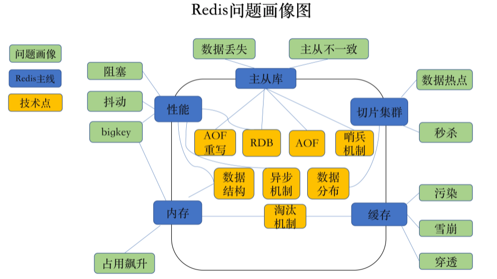
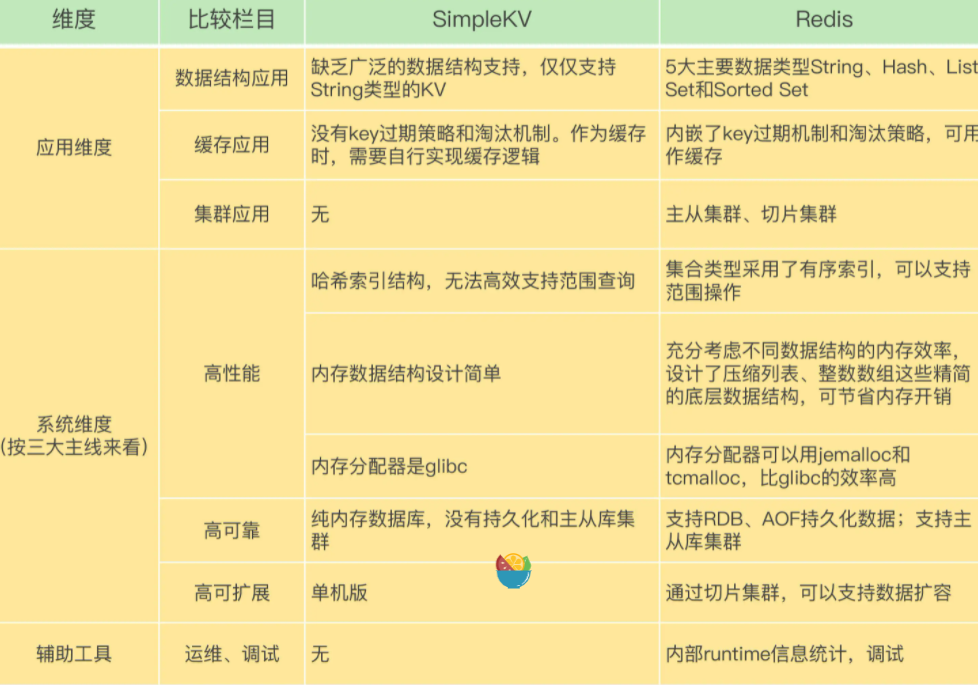
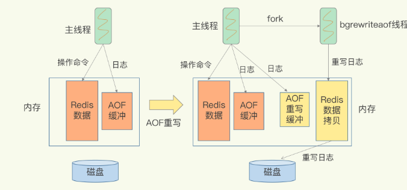
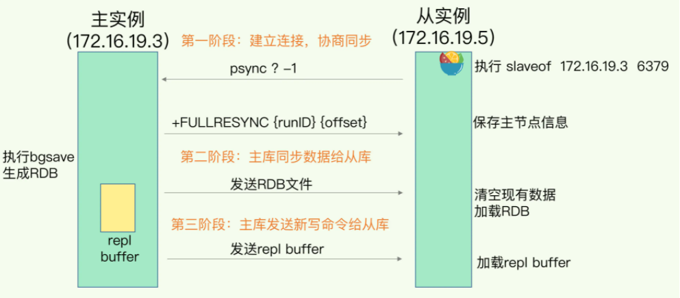
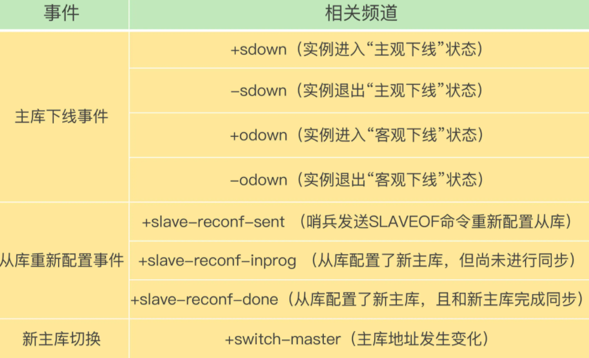
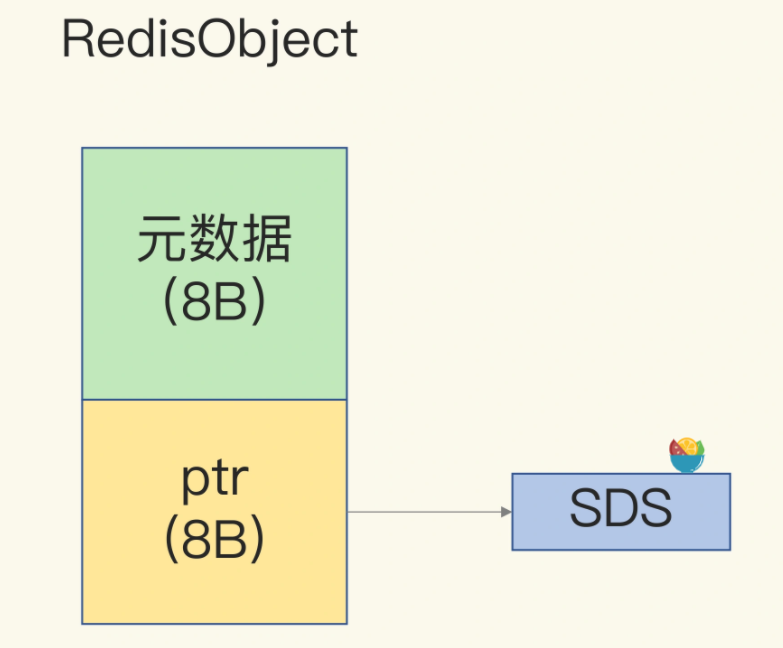
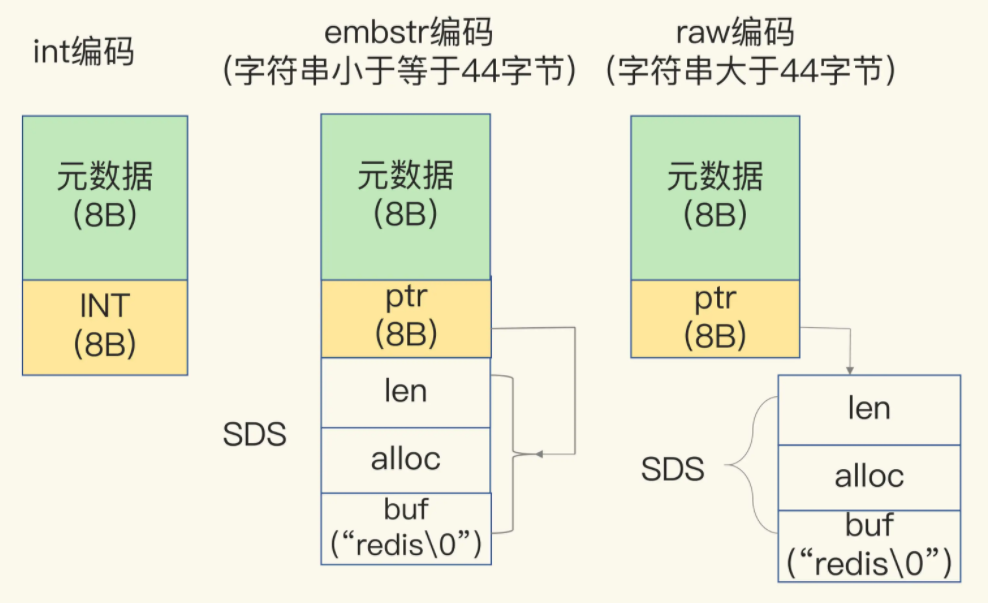
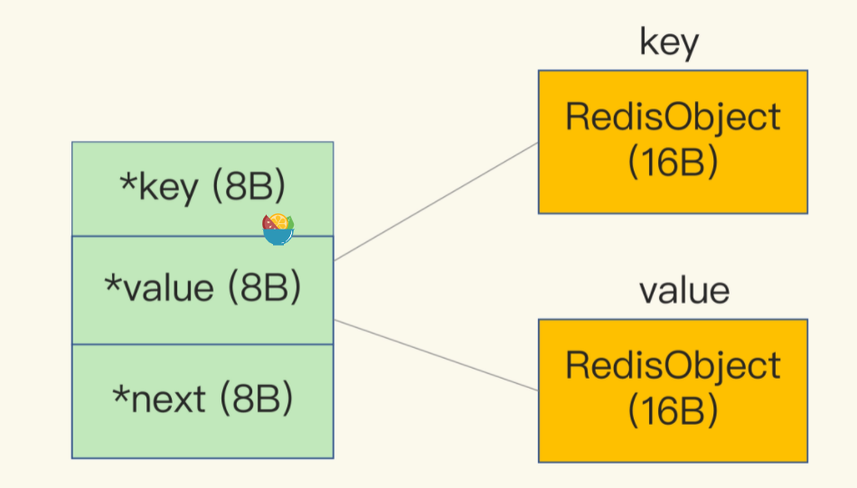
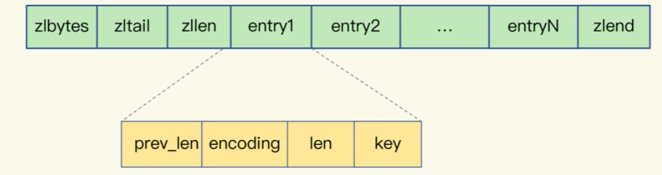
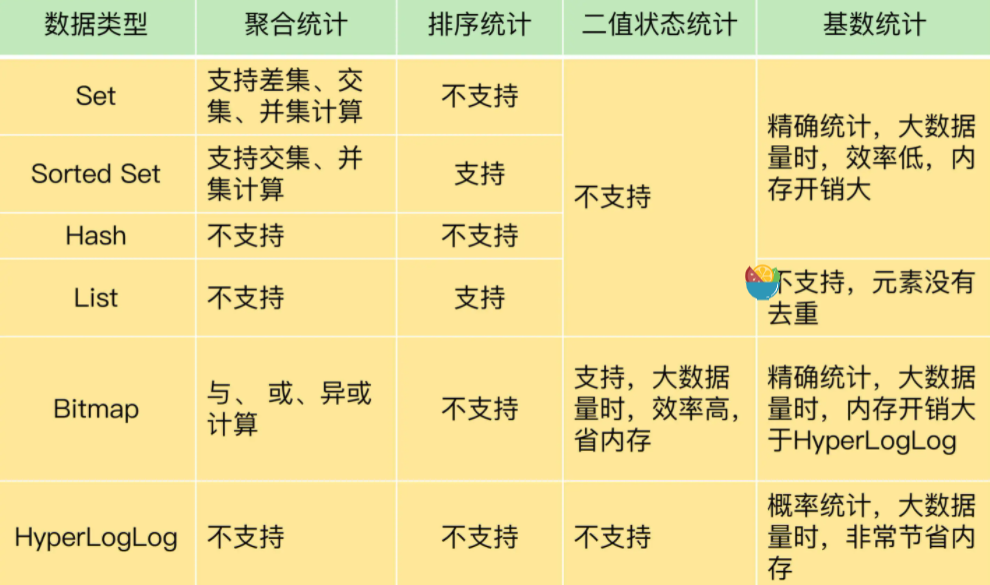

### 1.总览：redis有什么

Redis优势：

### 2.Redis怎么设计的

##### 高性能

**数据结构**：支持了非常丰富，各种场景下的数据结构，各种数据结构的内存分配器提供了多种选择，分配效率也不一样

**保存在内存：**内存的访问速度一般都在百ns级别。但是，潜在的风险是一旦掉电，所有的数据都会丢失。

**键值对数据库**：**访问框架、索引模块、操作模块和存储模块**

**访问框架：**访问模式通常有两种：一种是**通过函数库调用的方式供外部应用使用**，就是以动态链接库的形式链接到我们自己的程序中，提供键值存储功能；另一种是**通过网络框架以Socket通信的形式对外提供键值对操作**，RocksDB以动态链接库的形式使用，而Memcached和Redis则是通过网络框架访问，

通过网络框架访问就需要确定**IO模型**：IO多路复用

**索引模块：**Memcached和Redis采用哈希表作为key-value索引，而RocksDB则采用跳表作为内存中key-value的索引。

**操作模块：**对于PUT和DELETE两种操作来说，除了新写入和删除键值对，还需要**分配和释放内存**

**存储模块：**持久化功能

##### 高可用

哨兵机制

##### 可扩展

集群功能

### 3.数据结构设计

数据类型：字符串，*链表，字典hash*，跳跃表，整数集合，压缩列表

实现的数据结构：**字符串对象**、**列表对象**、**哈希对象**、**集合对象**和**有序集合对象**这五种类型的对象

实现从键到值的快速访问：哈希表（哈希冲突采用链地址法->过多冲突变慢->rehash操作->(渐进式rehash)）

value进行增删改查操作的效率：和**value的数据结构**有关（整数数组、双向链表、~~哈希表~~、压缩列表和跳表。）

**每个操作的复杂度：**单元素操作取决于value数据结构的复杂度,范围操作时间复杂度一般为O(n)redis2.8开始引入SCAN操作，渐进式遍历,统计集合元素个数时间复杂度为O(1),

整数数组和压缩列表在查找时间复杂度方面并没有很大的优势,但是他们的分配的是一块连续的内存空间，虽然数据结构本身没有时间复杂度的优势，避免一些内存碎片产生。

### 4.Redis的高性能IO模型

Redis是单线程，主要是指**Redis的网络IO和键值对读写是由一个线程来完成的，这也是Redis对外提供键值存储服务的主要流程**。但Redis的其他功能，比如持久化、异步删除、集群数据同步等，其实是由额外的线程执行的。

redis使用单线程的原因：1、	**共享资源的安全并发访问控制**，加锁又会拖慢redis速度，2.线程切换需要保存上下文

为什么Redis单线程比多线程快：**基于多路复用的高性能I/O模型**

##### 基于多路复用的高性能I/O模型

Linux中的IO多路复用机制是指一个线程处理多个IO流，就是我们经常听到的select/epoll机制。简单来说，在Redis只运行单线程的情况下，**该机制允许内核中，同时存在多个监听套接字和已连接套接字**。内核会一直监听这些套接字上的连接请求或数据请求。一旦有请求到达，就会交给Redis线程处理，这就实现了**一个Redis线程处理多个IO流**的效果。

linux中的select，poll，epoll

##### Redis 6.0中提出了多线程模型，为什么？

虽然单线程很快，没有锁的单线程更快借助CPU的多级缓存可以把性能发挥到最大。但是随着访问量的增加，以及数据量的增加，IO的写入写出会成为性能瓶颈。10个socket的IO吞吐处理肯定比1000个socket吞吐处理的快，为了解决这个问题，Redis6引入了IO多线程的方式以及client缓冲区，在实际指令处理还是单线程模式。在IO上变成的了【主线程】带着众多【IO线程】进行IO，IO线程听从主线程的指挥是写入还是写出。Read的时候IO线程会和主线程一起读取并且解析命令（RESP协议）存入缓冲区，写的时候会从缓冲区写出到Socket。IO线程听从主线程的指挥，在同一个时间点上主线程和IO线程会一起写出或者读取，并且主线程会等待IO线程的结束。但是这种模式的多线程会面临一给NUMA陷阱的问题，在最近的Redis版本中加强了IO线程和CPU的亲和性解决了这个问题。（不过目前官方在默认情况下并不推荐使用多线程IO模式，需要手动开启）

##### Redis单线程处理IO请求性能瓶颈主要包括2个方面：

1、任意一个请求在server中一旦发生耗时，都会影响整个server的性能，也就是说后面的请求都要等前面这个耗时请求处理完成，自己才能被处理到。耗时的操作包括以下几种：
         **a、**操作bigkey：写入一个bigkey在分配内存时需要消耗更多的时间，同样，删除bigkey释放内存同样会产生耗时；
     	**b、**使用**复杂度过高的命令**：例如SORT/SUNION/ZUNIONSTORE，或者O(N)命令，但是N很大，例如lrange key 0 -1一次查询全量数据；
		**c、**大量key集中过期：Redis的过期机制也是在主线程中执行的，大量key集中过期会导致处理一个请求时，耗时都在删除过期key，耗时变长；
		**d、**淘汰策略：淘汰策略也是在主线程执行的，当内存超过Redis内存上限后，每次写入都需要淘汰一些key，也会造成耗时变长；
		**e、**AOF刷盘开启always机制：每次写入都需要把这个操作刷到磁盘，写磁盘的速度远比写内存慢，会拖慢Redis的性能；
		**f、**主从全量同步生成RDB：虽然采用fork子进程生成数据快照，但fork这一瞬间也是会阻塞整个线程的，实例越大，阻塞时间越久；
		2、并发量非常大时，单线程读写客户端IO数据存在性能瓶颈，虽然采用IO多路复用机制，但是读写客户端数据依旧是同步IO，只能单线程依次读取客户端的数据，无法利用到CPU多核。

针对问题1，一方面需要业务人员去规避，一方面Redis在4.0推出了lazy-free机制，把bigkey释放内存的耗时操作放在了异步线程中执行，降低对主线程的影响。

针对问题2，Redis在6.0推出了多线程，可以在高并发场景下利用CPU多核多线程读写客户端数据，进一步提升server性能，当然，只是针对客户端的读写是并行的，每个命令的真正操作依旧是单线程的。

### 5.AOF日志

Redis的持久化主要有两大机制，即AOF日志和RDB快照

说到日志，我们比较熟悉的是**数据库的写前日志（Write Ahead Log, WAL）**，也就是说，在实际写数据前，先把修改的数据记到日志文件中，以便故障时进行恢复。不过，AOF日志是**写后日志**，“写后”的意思是Redis是先执行命令，把数据写入内存，然后才记录日志。

**为什么？**Redis在向AOF里面记录日志的时候，并不会先去对这些命令进行语法检查。所以，如果先记日志再执行命令的话，日志中就有可能记录了错误的命令，Redis在使用日志恢复数据时，就可能会出错。还有一个好处：它是在命令执行后才记录日志，所以**不会阻塞当前的写操作**。

但是也有两个缺点：1.如果刚执行完一个命令，还没有来得及记日志就宕机了，那么这个命令和相应的数据就有丢失的风险2.AOF虽然避免了对当前命令的阻塞，但可能会给下一个操作带来阻塞风险

仔细分析的话，你就会发现，这两个风险都是和**AOF写回磁盘的时机相关**的。这也就意味着，如果我们能够控制一个写命令执行完后AOF日志写回磁盘的时机，这两个风险就解除了。

**三种写回策略**：**Always**，**Everysec**，**No**

**AOF重写压缩日志**

##### 重写会引起阻塞问题

和AOF日志由主线程写回不同，重写过程是由后台线程bgrewriteaof来完成的，这也是为了避免阻塞主线程，导致数据库性能下降。

我把重写的过程总结为“**一个拷贝，两处日志**”。

“一个拷贝”就是指，每次执行重写时，主线程fork出后台的bgrewriteaof子进程。此时，fork会把主线程的内存拷贝一份给bgrewriteaof子进程，这里面就包含了数据库的最新数据。然后，bgrewriteaof子进程就可以在不影响主线程的情况下，逐一把拷贝的数据写成操作，记入重写日志。

“两处日志”又是什么呢？

因为**主线程未阻塞**，仍然可以处理新来的操作。此时，如果有写操作，**第一处日志就是指正在使用的AOF日志，Redis会把这个操作写到它的缓冲区**。这样一来，即使宕机了，这个AOF日志的操作仍然是齐全的，可以用于恢复。

而第二处日志，就是指新的**AOF重写日志。这个操作也会被写到重写日志的缓冲区**。这样，重写日志也不会丢失最新的操作。等到拷贝数据的所有操作记录重写完成后，重写日志记录的这些最新操作也会写入新的AOF文件，以保证数据库最新状态的记录。此时，我们就可以用新的AOF文件替代旧文件了。

### 6.RDB快照

因为AOF存储的是执行的所有的命令，所以当我们需要恢复数据的时候，必须执行完所有的命令，所以RDB内存快照就是指内存中的数据在某一个时刻的状态记录

Redis提供了两个命令来生成RDB文件，分别是save和bgsave。

- save：在主线程中执行，会导致阻塞；
- bgsave：创建一个子进程，专门用于写入RDB文件，避免了主线程的阻塞，这也是Redis RDB文件生成的默认配置。

##### 快照时数据能修改吗?

Redis就会借助操作系统提供的写时复制技术（Copy-On-Write, COW），在执行快照的同时，正常处理写操作

如果主线程要修改一块数据（例如图中的键值对C），那么，这块数据就会被复制一份，**生成该数据的副本**。把这个新写或修改后的数据写入到一个新的物理地址中，并修改自己的页表映射然后，**bgsave会把这个副本数据写入RDB文件**，而在这个过程中，主线程仍然可以直接修改原来的数据。

##### 可以每秒做一次快照吗？

不能，因为可能会出现两个问题：1.会给磁盘带来很大压力2.前一个快照还没有做完，后一个又开始做了，容易造成恶性循环，虽然rdb快照是通过子线程来进行快照的读写，但是fork这个创建过程本身会阻塞主线程，而且主线程的内存越大，阻塞时间越长。如果频繁fork出bgsave子进程，这就会频繁阻塞主线程了

所以我们可以做**增量快照**，所谓增量快照，就是指，做了一次全量快照后，后续的快照只对修改的数据进行快照记录，这样可以避免每次全量快照的开销。

而在Redis 4.0中提出了一个**混合使用AOF日志和内存快照**的方法。简单来说，内存快照以一定的频率执行，在两次快照之间，使用**AOF日志记录这期间的所有命令操作**。

RDB文件快速恢复的好处，又能享受到**AOF只记录操作命令的简单优势**，颇有点“鱼和熊掌可以兼得”的感觉

最后，关于AOF和RDB的选择问题，我想再给你提三点建议：

- 数据不能丢失时，内存快照和AOF的混合使用是一个很好的选择；
- 如果允许分钟级别的数据丢失，可以只使用RDB；
- 如果只用AOF，优先使用everysec的配置选项，因为它在可靠性和性能之间取了一个平衡。

### 7.数据同步：主从库如何实现数据一致？

Redis具有高可靠性，有两层含义：一是**数据尽量少丢失**，二是**服务尽量少中断**。AOF和RDB保证了前者，而对于后者，Redis的做法就是**增加副本冗余量**，将一份数据同时保存在多个实例上。即使有一个实例出现了故障，需要过一段时间才能恢复，其他实例也可以对外提供服务。

Redis提供了主从库模式，以保证数据副本的一致，主从库之间采用的是读写分离的方式。

- **读操作**：主库、从库都可以接收；
- **写操作**：首先到主库执行，然后，主库将写操作同步给从库。

##### 主从库间如何进行第一次同步？

1.**从库和主库建立起连接，并告诉主库即将进行同步，主库确认回复后，主从库间就可以开始同步了**

从库给主库发送psync命令，表示要进行数据同步，主库根据这个命令的参数来启动复制。psync命令包含了**主库的runID**和**复制进度offset**两个参数。

2

##### 主从库间网络断了怎么办？（增量复制）

Redis 2.8之前，如果主从库在命令传播时出现了网络闪断，那么，从库就会和主库重新进行一次全量复制，开销非常大。

从Redis 2.8开始，网络断了之后，主从库会采用增量复制的方式继续同步，主库会把断连期间收到的写操作命令，写入replication buffer，同时也会把这些操作命令也写入repl_backlog_buffer这个缓冲区。

repl_backlog_buffer是一个环形缓冲区，**主库会记录自己写到的位置，从库则会记录自己已经读到的位置**。所以可能会发现一种情况：**如果从库的读取速度比较慢，就有可能导致从库还未读取的操作被主库新写的操作覆盖了，这会导致主从库间的数据不一致**。所以我们需要适当增加repl_backlog_size值，来减少主从不一致的风险。

总结来说，有三种模式：全量复制、基于长连接的命令传播，以及增量复制

### 8.哨兵机制：主库挂了，如何不间断服务

哨兵就是一个运行在特殊模式下的Redis进程，主从库实例运行的同时，它也在运行。哨兵主要负责的就是三个任务：**监控、选主（选择主库）和通知**。

##### 监控：（判断主库从库下线）

监控是指哨兵进程在运行时，周期性地给所有的主从库发送PING命令，检测它们是否仍然在线运行。如果从库没有在规定时间内响应哨兵的PING命令，哨兵就会把它标记为“下线状态”；同样，如果主库也没有在规定时间内响应哨兵的PING命令，哨兵就会判定主库下线，然后开始**自动切换主库**的流程。

**选主：（选出新一轮的主库）**

主库挂了以后，哨兵就需要从很多个从库里，按照一定的规则选择一个从库实例，把它作为新的主库

**通知：（从库和新主库建立连接，同步）**

哨兵会把新主库的连接信息发给其他从库，让它们执行replicaof命令，和新主库建立连接，并进行数据复制。同时，哨兵会把新主库的连接信息通知给客户端，让它们把请求操作发到新主库上。

##### 主观下线、客观下线

当在集群网络压力较大、网络拥塞，或者是主库本身压力较大的情况下，ping命令可能会出现超时现象，但是这时的主库并没有下线，如果执行主库切换就会占用资源，所以引入了**哨兵集群**，当有N/2 + 1个实例判断主库为“主观下线”，才能最终判定主库为“客观下线

##### 如何选定主库

在多个从库中，先按照**一定的筛选条件**，把不符合条件的从库去掉。然后，我们再按照**一定的规则**，给剩下的从库逐个打分，将得分最高的从库选为新主库

打分条件：

1.**检查从库的当前在线状态，还要判断它之前的网络连接状态**，将不合格的从库筛选掉

2.**第一轮：优先级最高的从库得分高。**

3.**和旧主库同步程度最接近的从库得分高。**

4.**ID号小的从库得分高。**

##### 主库切换期间，客户端能否进行正常的请求呢？

如果客户端使用了**读写分离**，那么**读请求可以在从库上正常执行**，不会受到影响。但是由于此时主库已经挂了，而且哨兵还没有选出新的主库，所以在这期间写请求会失败，**失败持续的时间 = 哨兵切换主从的时间 + 客户端感知到新主库** 的时间。

如果不想让业务感知到异常，客户端只能把写失败的请求先缓存起来或写入消息队列中间件中，等哨兵切换完主从后，再把这些写请求发给新的主库，**但这种场景只适合对写入请求返回值不敏感的业务，而且还需要业务层做适配**，另外主从切换时间过长，也会导致客户端或消息队列中间件缓存写请求过多，切换完成之后重放这些请求的时间变长。

哨兵检测主库多久没有响应就提升从库为新的主库，这个时间是可以配置的（down-after-milliseconds参数）。配置的时间越短，哨兵越敏感，哨兵集群认为主库在短时间内连不上就会发起主从切换，这种配置很可能因为网络拥塞但主库正常而发生不必要的切换，当然，当主库真正故障时，因为切换得及时，对业务的影响最小。如果配置的时间比较长，哨兵越保守，这种情况可以减少哨兵误判的概率，但是主库故障发生时，业务写失败的时间也会比较久，缓存写请求数据量越多。

应用程序不感知服务的中断，还需要哨兵和客户端做些什么？当哨兵完成主从切换后，客户端需要及时感知到主库发生了变更，然后把缓存的写请求写入到新库中，保证后续写请求不会再受到影响，具体做法如下：

哨兵提升一个从库为新主库后，哨兵会把新主库的地址写入自己实例的pubsub（switch-master）中。客户端需要订阅这个pubsub，当这个pubsub有数据时，客户端就能感知到主库发生变更，同时可以拿到最新的主库地址，然后把写请求写到这个新主库即可，这种机制属于**哨兵主动通知客户端**。

如果客户端因为某些原因错过了哨兵的通知，或者哨兵通知后客户端处理失败了，安全起见，**客户端也需要支持主动去获取最新主从的地址进行访问。**所以，客户端需要访问主从库时，不能直接写死主从库的地址了，而是需要从哨兵集群中获取最新的地址（sentinel get-master-addr-by-name命令），这样当实例异常时，哨兵切换后或者客户端断开重连，都可以从哨兵集群中拿到最新的实例地址。

一般Redis的SDK都提供了通过哨兵拿到实例地址，再访问实例的方式，我们直接使用即可，不需要自己实现这些逻辑。当然，对于只有主从实例的情况，客户端需要和哨兵配合使用，而在分片集群模式下，这些逻辑都可以做在proxy层，这样客户端也不需要关心这些逻辑了，Codis就是这么做的。

另外再简单回答下哨兵相关的问题：

1、哨兵集群中有实例挂了，怎么办，会影响主库状态判断和选主吗？

这个属于分布式系统领域的问题了，指的是在分布式系统中，如果存在故障节点，整个集群是否还可以提供服务？而且提供的服务是正确的？

这是一个分布式系统容错问题，这方面最著名的就是分布式领域中的“拜占庭将军”问题了，“拜占庭将军问题”不仅解决了容错问题，还可以解决错误节点的问题

2、哨兵集群多数实例达成共识，判断出主库“客观下线”后，由哪个实例来执行主从切换呢？

哨兵集群判断出主库“主观下线”后，会选出一个“哨兵领导者”，之后整个过程由它来完成主从切换。

但是如何选出“哨兵领导者”？这个问题也是一个分布式系统中的问题，就是我们经常听说的共识算法，指的是集群中多个节点如何就一个问题达成共识。共识算法有很多种，例如Paxos、Raft，这里哨兵集群采用的类似于Raft的共识算法。

### 9.哨兵集群

##### 基于pub/sub机制的哨兵集群组成

**<u>哨兵实例之间可以相互发现</u>**，要归功于Redis提供的pub/sub机制，也就是发布/订阅机制。

哨兵只要和主库建立起了连接，就可以在主库上发布消息了，比如说发布它自己的连接信息（IP和端口）。同时，它也可以从主库上订阅消息，获得其他哨兵发布的连接信息。当多个哨兵实例都在主库上做了发布和订阅操作后，它们之间就能知道彼此的IP地址和端口。

除了哨兵实例，我们自己编写的应用程序也可以**通过Redis进行消息的发布和订阅**。所以，为了区分不同应用的消息，Redis会以频道的形式，对这些消息进行分门别类的管理。所谓的频道，实际上就是消息的类别。当消息类别相同时，它们就属于同一个频道。反之，就属于不同的频道。**只有订阅了同一个频道的应用，才能通过发布的消息进行信息交换**。在主从集群中，主库上有一个名为“`__sentinel__:hello`”的频道，不同哨兵就是通过它来相互发现，实现互相通信的。

<u>**哨兵是如何知道从库的IP地址和端口的呢**</u> 哨兵向主库发送INFO命令来完成的。哨兵2给主库发送INFO命令，主库接受到这个命令后，就会把从库列表返回给哨兵。接着，哨兵就可以根据从库列表中的连接信息，和每个从库建立连接，并在这个连接上持续地对从库进行监控

##### 基于pub/sub机制的客户端事件通知

如下图所示是哨兵机制提供的比较重要的订阅频道，可以执行`SUBSCRIBE +odown`命令，来订阅“所有实例进入客观下线状态的事件”：

##### 由哪个哨兵执行主从切换？

**Raft选举算法，**

如果哨兵集群只有2个实例，此时，一个哨兵要想成为Leader，必须获得2票，而不是1票。所以，如果有个哨兵挂掉了，那么，此时的集群是无法进行主从库切换的。因此，通常我们至少会配置3个哨兵实例。这一点很重要，你在实际应用时可不能忽略了。

##### 总结

- 基于pub/sub机制的哨兵集群组成过程；
- 基于INFO命令的从库列表，这可以帮助哨兵和从库建立连接；
- 基于哨兵自身的pub/sub功能，这实现了客户端和哨兵之间的事件通知。

假设有一个Redis集群，是“一主四从”，同时配置了包含5个哨兵实例的集群，quorum值设为2。在运行过程中，如果有3个哨兵实例都发生故障了，此时，Redis主库如果有故障，还能正确地判断主库“客观下线”吗？如果可以的话，还能进行主从库自动切换吗？此外，哨兵实例是不是越多越好呢，如果同时调大down-after-milliseconds值，对减少误判是不是也有好处呢？

- 经过实际测试，我的结论如下：

  1、哨兵集群**可以判定主库“主观下线”**。由于quorum=2，所以当一个哨兵判断主库“主观下线”后，询问另外一个哨兵后也会得到同样的结果，2个哨兵都判定“主观下线”，达到了quorum的值

  2、但哨兵**不能完成主从切换**。哨兵标记主库“客观下线后”，在选举“哨兵领导者”时，一个哨兵必须拿到超过多数的选票(5/2+1=3票)。但目前只有2个哨兵活着，无论怎么投票，一个哨兵最多只能拿到2票，永远无法达到多数选票的结果。

  但是投票选举过程的细节并不是大家认为的：每个哨兵各自1票，这个情况是不一定的。下面具体说一下：

  场景a：哨兵A先判定主库“主观下线”，然后马上询问哨兵B（注意，此时哨兵B只是被动接受询问，并没有去询问哨兵A，也就是它还没有进入判定“客观下线”的流程），哨兵B回复主库已“主观下线”，达到quorum=2后哨兵A此时可以判定主库“客观下线”。此时，哨兵A马上可以向其他哨兵发起成为“哨兵领导者”的投票，哨兵B收到投票请求后，由于自己还没有询问哨兵A进入判定“客观下线”的流程，所以哨兵B是可以给哨兵A投票确认的，这样哨兵A就已经拿到2票了。等稍后哨兵B也判定“主观下线”后想成为领导者时，因为它已经给别人投过票了，所以这一轮自己就不能再成为领导者了。

  场景b：哨兵A和哨兵B同时判定主库“主观下线”，然后同时询问对方后都得到可以“客观下线”的结论，此时它们各自给自己投上1票后，然后向其他哨兵发起投票请求，但是因为各自都给自己投过票了，因此各自都拒绝了对方的投票请求，这样2个哨兵各自持有1票。

  场景a是1个哨兵拿到2票，场景b是2个哨兵各自有1票，这2种情况都不满足大多数选票(3票)的结果，因此无法完成主从切换。

  经过测试发现，场景b发生的概率非常小，只有2个哨兵同时进入判定“主观下线”的流程时才可以发生。我测试几次后发现，都是复现的场景a。

  哨兵实例是不是越多越好？

  并不是，我们也看到了，哨兵在判定“主观下线”和选举“哨兵领导者”时，都需要和其他节点进行通信，交换信息，哨兵实例越多，通信的次数也就越多，而且部署多个哨兵时，会分布在不同机器上，节点越多带来的机器故障风险也会越大，这些问题都会影响到哨兵的通信和选举，出问题时也就意味着选举时间会变长，切换主从的时间变久。

  调大down-after-milliseconds值，对减少误判是不是有好处？

  是有好处的，适当调大down-after-milliseconds值，当哨兵与主库之间网络存在短时波动时，可以降低误判的概率。但是**调大down-after-milliseconds值也意味着主从切换的时间会变长**，对业务的影响时间越久，我们需要根据实际场景进行权衡，设置合理的阈值。

### 10.切片集群：数据增多了，是该加内存还是加实例？

**切片集群，也叫分片集群**，就是指启动多个Redis实例组成一个集群，然后按照一定的规则，把收到的数据划分成多份，每一份用一个实例来保存。如果把25GB的数据平均分成5份（当然，也可以不做均分），使用5个实例来保存，每个实例只需要保存5GB数据。

##### 如何保存更多数据？

分为**大内存云主机**和**切片集群**两种方法，对应纵向扩展（scale up）和横向扩展（scale out）两种方案

##### 数据切片和实例的对应分布关系

- 数据切片后，在多个实例之间如何分布？

> Redis Cluster方案采用哈希槽（Hash Slot，接下来我会直接称之为Slot），来处理数据和实例之间的映射关系。在Redis Cluster方案中，一个切片集群共有16384个哈希槽，这些哈希槽类似于数据分区，每个键值对都会根据它的key，被映射到一个哈希槽中,每个机器都会分配一定数量的槽，然后根据根据键值对的key，按照[CRC16算法](https://en.wikipedia.org/wiki/Cyclic_redundancy_check)计算一个16 bit的值；然后，再用这个16bit值对16384取模，得到0~16383范围内的模数，每个模数代表一个相应编号的哈希槽
>
> 注意：**在手动分配哈希槽时，需要把16384个槽都分配完，否则Redis集群无法正常工作**。

- 客户端怎么确定想要访问的数据在哪个实例上？

> 正常情况下通过计算得到槽再哪个实例上，如果发生数据迁移，则重定向
>
> Redis Cluster方案提供了一种**重定向机制，**所谓的“重定向”，就是指，客户端给一个实例发送数据读写操作时，这个实例上并没有相应的数据，客户端要再给一个新实例发送操作命令

### 11.“万金油”的String，为什么不好用了？

##### 字符串占用内存分析

Redis中使用字符串内存开销：1.SDS(**alloc**实际分配长度4B, **len **buf的已用长度4B,**buf**保存实际数据,\0结尾会多一个字节)

SDS的额外开销，还有一个来自于**RedisObject结构体**的开销。不同数据类型都有些相同的元数据要记录（比如最后一次访问的时间、被引用的次数等），所以，Redis会用一个RedisObject结构体来统一记录这些元数据，同时指向实际数据。

为了节省内存空间，Redis还对**Long类型整数**和**SDS的内存布局**做了专门的设计。

一方面，当保存的是Long类型整数时，RedisObject中的指针就直接赋值为整数数据了，这样就不用额外的指针再指向整数了，节省了指针的空间开销。

另一方面，当保存的是字符串数据，并且字符串小于等于44字节时，RedisObject中的元数据、指针和SDS是一块连续的内存区域，这样就可以避免内存碎片。这种布局方式也被称为**embstr编码方式**。

当然，当字符串大于44字节时，SDS的数据量就开始变多了，Redis就不再把SDS和RedisObject布局在一起了，而是会给SDS分配独立的空间，并用指针指向SDS结构。这种布局方式被称为**raw编码模式**

Redis会使用一个全局哈希表保存所有键值对，哈希表的每一项是一个dictEntry的结构体，用来指向一个键值对。dictEntry结构中有三个8字节的指针，分别指向key、value以及下一个dictEntry，三个指针共24字节

jemalloc在分配内存时，会根据我们申请的字节数N，找一个比N大，但是最接近N的2的幂次数作为分配的空间，这样可以减少频繁分配的次数。所以上面虽然只有24字节，但是会分配32字节的内存。

##### 用什么数据结构可以节省内存？

表头有三个字段zlbytes、zltail和zllen，分别表示列表长度、列表尾的偏移量，以及列表中的entry个数。压缩列表尾还有一个zlend，表示列表结束

其中每一个entry包含**prev_len**（前一个entry的长度，1B或者4B），**len**（自身长度,4B），**encoding**（编码方式，1B）**content**(实际数据)

##### 如何用集合类型保存单值的键值对？

在保存单值的键值对时，可以采用基于Hash类型的二级编码方法。这里说的二级编码，就是把一个单值的数据拆分成两部分，前一部分作为Hash集合的key，后一部分作为Hash集合的value，这样一来，我们就可以把单值数据保存到Hash集合中了。

**二级编码方法中采用的ID长度是有讲究的**，因为Redis规定我们往Hash集合中写入的元素个数**超过了hash-max-ziplist-entries**（哈希集合中的最大元素个数），或者写入的单个元素大小超过了hash-max-ziplist-value（单个元素的最大长度），Redis就会自动把Hash类型的实现结构由压缩列表转为哈希表

**为了能充分使用压缩列表的精简内存布局，我们一般要控制保存在Hash集合中的元素个数**

但是采用压缩列表来存储时，存储的元素不应该太多，太多会导致查询性能下降，而且压缩列表可能导致级联膨胀

另外，使用Hash和Sorted Set存储时，虽然节省了内存空间，但是设置过期变得困难（无法控制每个元素的过期，只能整个key设置过期，或者业务层单独维护每个元素过期删除的逻辑，但比较复杂）。而使用String虽然占用内存多，但是每个key都可以单独设置过期时间，还可以设置maxmemory和淘汰策略，以这种方式控制整个实例的内存上限。

##### 总结：

**Redis中的字符串简单，可以自己设置过期时间，但是占用内存比较多，而压缩列表占用内存比较小，但是可能会出现级联膨胀，并且查询性能比较差**

### 12.有一亿个keys要统计，应该用哪种集合？

##### 聚合统计

统计多个集合元素的聚合结果，包括：统计多个集合的共有元素（交集统计）；把两个集合相比，统计其中一个集合独有的元素（差集统计）；统计多个集合的所有元素（并集统计）。

##### 排序统计

再Redis数据结构中List，SortSet都是有序的，List集合时按照插入顺序来排序的，而SortSet时按照字段进行排序，但是在一些场景，比如分页展示商品评论，如果按照插入顺序，当我们显示第一页后，就可能会有新的元素插入进来，这时先前的插入顺序就会失效，所以在一些有字段进行排序的任务下，采用SortSet会更好

##### 二值状态统计

二值状态统计。这里的二值状态就是指集合元素的取值就只有0和1两种。在签到打卡的场景中，我们只用记录签到（1）或未签到（0），所以它就是非常典型的二值状态，

Bitmap本身是用String类型作为底层数据结构实现的一种统计二值状态的数据类型。String类型是会保存为二进制的字节数组，所以，Redis就把字节数组的每个bit位利用起来，用来表示一个元素的二值状态。你可以把Bitmap看作是一个bit数组。使用SETBIT ，GETBIT ，BITCOUNT (查看1的总数)，Bitmap支持用BITOP命令对多个Bitmap按位做“**与”“或”“异或”**的操作，操作的结果会保存到一个新的Bitmap中。

##### 基数统计

基数统计就是指统计一个集合中不重复的元素个数。类似统计网页的UV。UV统计需要我们去重，如果时重复的元素则不加入，虽然Set,Hash都可以实现去重的功能，但是这两个数据结构会随着元素增多，占用空间变大，所以就要用到Redis提供的**HyperLogLog**了。

HyperLogLog是一种用于统计基数的数据集合类型，它的最大优势就在于，当集合元素数量非常多时，它计算基数所需的空间总是固定的，而且还很小。

在Redis中，每个 HyperLogLog只需要花费 12 KB 内存，就可以计算接近 2^64 个元素的基数。你看，和元素越多就越耗费内存的Set和Hash类型相比，**HyperLogLog就非常节省空间**

### 13.GEO是什么？还可以定义新的数据类型吗？

面对海量数据时，使用基本数据类型内存开销很大，而且对于一些特殊的场景是无法支持的。所以，Redis还提供了3种扩展数据类型，分别是**Bitmap、HyperLogLog和GEO**。

##### 应用场景

日常生活中，我们越来越依赖搜索“附近的餐馆”、在打车软件上叫车，这些都离不开基于**位置信息服务（Location-Based Service，LBS）的应用**。LBS应用访问的数据是和人或物关联的一组<u>经纬度信息</u>，而且要能查询相<u>邻的经纬度范围</u>，GEO就非常适合应用在LBS服务的场景中

##### GEO的底层结构

首先分析一下LBS情景的特点：

1.  每一辆网约车都有一个**编号**（例如33），网约车需要将自己的**经度信息**（例如116.034579）和纬度信息（例如39.000452 ）发给叫车应用。
2.  用户在叫车的时候，叫车应用会根据用户的经纬度位置（例如经度116.054579，纬度39.030452），查找用户的**附近车辆，并进行匹配。**
3. 等把位置相近的用户和车辆匹配上以后，叫车应用就会**根据车辆的编号，获取用户附近的车辆的信息**，并返回给用户。

首先我们可能会想到使用**hash进行存储**，但是一旦**涉及到范围查询**，就意味着集合中的元素需要有序，但Hash类型的元素是无序的，所以根据范围查询就不能满足我们的要求。

那么**Sorted Set类型**是不是合适呢？Sorted Set类型也支持一个key对应一个value的记录模式，其中，key就是Sorted Set中的元素，而value则是元素的权重分数。更重要的是，**Sorted Set可以根据元素的权重分数排序，支持范围查询**。这就能满足LBS服务中查找相邻位置的需求了。但是原本的sorted set的value使用的是浮点数，而我们LBS应用value为经纬度两个，所以我们需要改变一下。

##### GeoHash的编码方法

Redis采用了业界广泛使用的GeoHash编码方法，这个方法的基本原理就是**“二分区间，区间编码”**。当我们要对一组经纬度进行GeoHash编码时，我们要先对经度和纬度分别编码，然后再把经纬度各自的编码组合成一个最终编码。

如上图，我们可以吧经纬度分成一个一个区间，当拿到一个经纬度值的时候，我们根据这个经纬度所处的区间，如果在这个区间，则第一位编码为1，否则为0,这样一步一步细分下去，有多少个区间就会分配多少个编码，<u>分区越多，每个方格能覆盖到的地理空间就越小，也就越精准</u>，通过这个编码方式的sorted set我们就能够使用hash来进行区间查找了，

##### 操作GEO

在使用GEO类型时，我们经常会用到两个命令，分别是GEOADD和GEORADIUS。

- GEOADD命令：用于把一组经纬度信息和相对应的一个ID记录到GEO类型集合中；
- **GEORADIUS命令：会根据输入的经纬度位置，查找以这个经纬度为中心的一定范围内的其他元素**。当然，我们可以自己定义这个范围。

##### redis自定义数据类型

##### 留言精选

<u>Redis也可以使用List数据类型当做队列使用</u>，rpush生产数据到Redis中，客户端使用lpop取出数据进行消费，基于内存存取非常快速，但是List没有ack机制和不支持多个消费者,所以适合那些对数据不敏感的业务。

Redis提供的PubSub，可以支持多个消费者进行消费，生产者发布一条消息，多个消费者同时订阅消费，如果任意一个消费者挂了，等恢复过来后，**在这期间的生产者的数据就丢失了**。PubSub只把数据发给在线的消费者，**消费者一旦下线，就会丢弃数据**。另一个缺点是，**PubSub中的数据不支持数据持久化**，当Redis宕机恢复后，其他类型的数据都可以从RDB和AOF中恢复回来，但PubSub不行

Redis 5.0推出了**Stream数据结构**，它借鉴了Kafka的设计思想，弥补了List和PubSub的不足。Stream类型数据可以持久化、支持ack机制、支持多个消费者、支持回溯消费，基本上实现了队列中间件大部分功能，比List和PubSub更可靠。

**基于Redis实现的布隆过滤器**，其底层实现利用的是String数据结构和位运算，可以解决业务层缓存穿透的问题，而且内存占用非常小，操作非常高效

### 24.替换策略：缓存满了怎么办？

**缓存数据的淘汰机制**。简单来说，数据淘汰机制包括两步：第一，根据一定的策略，筛选出对应用访问来说“不重要”的数据；第二，将这些数据从缓存中删除，为新来的数据腾出空间，

##### Redis缓存有哪些淘汰策略？

Redis 4.0之前一共实现了6种内存淘汰策略，在4.0之后，又增加了2种策略。我们可以按照是否会进行数据淘汰把它们分成两类：

- 不进行数据淘汰的策略，只有**noeviction这一种**。
- 会进行淘汰的7种其他策略。

会进行淘汰的7种策略，我们可以再进一步根据淘汰候选数据集的范围把它们分成两类：

- <u>在设置了过期时间的数据中进行淘汰</u>，包括volatile-random、volatile-ttl、volatile-lru、volatile-lfu（Redis 4.0后新增）四种。
- 在所有数据范围内进行淘汰，包括allkeys-lru、allkeys-random、allkeys-lfu（Redis 4.0后新增）三种。

对于allkeys-lru策略，由于维护双向链表和hash表过于占内存，所以redis对LRU算法作出了改进，Redis在决定淘汰的数据时，第一次会随机选出N个数据，把它们作为一个候选集合。接下来，Redis会比较这N个数据的lru字段，把lru字段值最小的数据从缓存中淘汰出去。

当需要再次淘汰数据时，Redis需要挑选数据进入候选集合。这儿的挑选标准是：**能进入候选集合的数据的lru字段值必须小于候选集合中最小的lru值**。当有新数据进入候选数据集后，如果候选数据集中的数据个数达到了maxmemory-samples，Redis就把候选数据集中lru字段值最小的数据淘汰出去。

##### 使用建议

- **优先使用allkeys-lru策略**。这样，可以充分利用LRU这一经典缓存算法的优势，把最近最常访问的数据留在缓存中，提升应用的访问性能。如果你的业务数据中有明显的冷热数据区分，我建议你使用allkeys-lru策略。
- 如果业务应用中的数据访问频率相差不大，没有明显的冷热数据区分，建议使用allkeys-random策略，随机选择淘汰的数据就行。
- **如果你的业务中有置顶的需求**，比如置顶新闻、置顶视频，那么，可以使用volatile-lru策略，同时不给这些置顶数据设置过期时间。这样一来，这些需要置顶的数据一直不会被删除，而其他数据会在过期时根据LRU规则进行筛选。

##### 留言精选

如何保证数据库和缓存的一致性？只读缓存模式，读写缓存模式+同步直写策略（Cache Aside策略，Read/Write Throught策略，Write Back策略）

### 25.缓存异常（上）：如何解决缓存和数据库的数据不一致问题？

**4个方面：**缓存中的数据和数据库中的<u>不一致</u>；<u>缓存雪崩；缓存击穿和缓存穿透</u>。

**对于读写缓存：**有**同步直写策略**（同时写缓存和数据库）, **异步写回策略**(先写缓存，等到数据从缓存中淘汰时，再写回数据库，可能丢失数据)

**对于读缓存：**[看这里的](../分布式&高并发\场景题.md)

### 26-缓存异常（下）：如何解决缓存雪崩、击穿、穿透难题？

缓存雪崩:1.大量key失效，导致请求都打到数据库中2.redis缓存实例宕机，可以**实现服务熔断或请求限流机制**，Redis缓存高可靠集群

缓存击穿：某个热点数据突然过期,导致大量请求打到数据库中。1.不设置过期时间

缓存穿透:访问的数据既不在Redis缓存中，也不在数据库中，导致请求在访问缓存时，发生缓存缺失，再去访问数据库时，发现数据库中也没有要访问的数据,这是也没有缓存该请求就会一直打到数据库，导致数据库宕机。解决办法：1.布隆过滤器，2.查询不到的缓存，可以在redis中设置一个空值3.前端进行限流，针对ip，cookie等

### 29-无锁的原子操作：Redis如何应对并发访问？

Redis如何保证原子操作

1. Redis提供了INCR/DECR命令原子增减操作，这些操作都是单命令操作，可以保证
2. 如果需要多个操作的原子性，可以将这些操作写到lua脚本中，在通过Redis的**EVAL命令**来执行脚本,**在编写Lua脚本时，你要避免把不需要做并发控制的操作写入脚本中**。

### 33.脑裂：一次奇怪的数据丢失

**脑裂**就是指在主从集群中，同时有两个主节点，它们都能接收写请求。而脑裂最直接的影响，就是客户端不知道应该往哪个主节点写入数据，结果就是不同的客户端会往不同的主节点上写入数据。而且，严重的话，脑裂会进一步导致数据丢失。

##### 为什么会发生脑裂？

第一步：确认是不是数据同步出现了问题,**主库的数据还没有同步到从库，结果主库发生了故障，等从库升级为主库后，未同步的数据就丢失了。**可以通过比对主从库上的复制进度差值来进行判断，也就是计算master_repl_offset和slave_repl_offset的差值

第二步：排查客户端的操作日志，发现脑裂现象.

第三步：发现是原主库假故障导致的脑裂

在切换过程中，既然客户端仍然和原主库通信，这就表明，**原主库并没有真的发生故障**（例如主库进程挂掉）。我们猜测，主库是由于某些原因无法处理请求，也没有响应哨兵的心跳，才被哨兵错误地判断为客观下线的。结果，在被判断下线之后，原主库又重新开始处理请求了，而此时，哨兵还没有完成主从切换，客户端仍然可以和原主库通信，客户端发送的写操作就会在原主库上写入数据了。为了验证原主库只是“假故障”，我们也查看了原主库所在服务器的资源使用监控记录。

的确，我们看到**原主库所在的机器有一段时间的CPU利用率突然特别高，这是我们在机器上部署的一个数据采集程序导致的**。因为这个程序基本把机器的CPU都用满了，导致Redis主库无法响应心跳了，在这个期间内，哨兵就把主库判断为客观下线，开始主从切换了。不过，这个数据采集程序很快恢复正常，CPU的使用率也降下来了。此时，原主库又开始正常服务请求了。

##### 为什么脑裂会导致数据丢失？

主从切换后，从库一旦升级为新主库，哨兵就会让原主库执行slave of命令，和新主库重新进行全量同步。而在全量同步执行的最后阶段，原主库需要清空本地的数据，加载新主库发送的RDB文件，这样一来，原主库在主从切换期间保存的新写数据就丢失了。