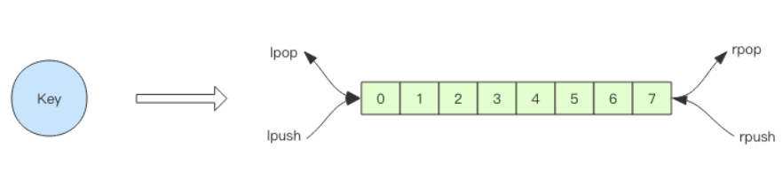

### 1.分布式锁

1.   setnx(set if not exists) 指令(可能會出现死锁, )

2.   set指令

3.   set 指令的 value 参数设置为一个随机数，释放锁时先匹配随机数是否一致，然后再删除 key。但是匹配 value 和删除 key 不是一个原子操作，Redis 也

     没有提供类似于 delifequals 这样的指令，这就需要使用 **Lua 脚本**来处理了

### 2.延时队列

Redis 的 list(列表) 数据结构常用来作为异步消息队列使用，使用rpush/lpush操作入队列，使用 lpop 和 rpop 来出队列

##### 阻塞队列

blpop/brpop在队列没有数据的时候，会立即进入休眠状态，一旦数据到来，则立刻醒过来。消息的延迟几乎为零。用 blpop/brpop 替代前面的 lpop/rpop

##### 加分布式锁出现锁冲突

1、直接抛出异常，通知用户稍后重试； 

2、sleep 一会再重试； 

3、将请求转移至延时队列，过一会再试；（合适）

##### **延时队列的实现**

延时队列可以通过 Redis 的 **zset(有序列表) 来实现**。我们将消息序列化成一个字符串作为 zset 的 value，这个消息的到期处理时间作为 score，然后用多个线程轮询 zset 获取到期的任务进行处理，多个线程是为了保障可用性，万一挂了一个线程还有其它线程可以继续处理。因为有多个线程，所以需要考虑并发争抢任务，确保任务不能被多次执行。

### 3.位图

setBit，getBit，bitCount（返回一个指定key中位的值为1的个数），bitOp（）

Redis 的 3.2 版本以后新增了bitfield指令，有了这条指令，不用管道也可以一次进行多个位的操作。 bitfield 有三个子指令，分别是get/set/incrby，它们都可以对指定位片段进行读写，但是最多只能处理 64 个连续的位，如果超过 64 位，就得使用多个子指令，bitfield 可以一次执行多个子指令。

### **HyperLogLog**

**统计PV:**给每个网页一个独立的 Redis 计数器就可以了，这个计数器的 key 后缀加上当天的日期。这样来一个请求，incrby 一次，最终就可以统计出所有的 PV 数据

##### 统计UV

<u>1.使用set 2.布隆过滤器+bitmap3.HyperLogLog</u> 

HyperLogLog 提供了两个指令 pfadd 和 pfcount，根据字面意义很好理解，一个是增加计数，一个是获取计数

<u>pfmerge，用于将多个 pf 计数值累加在一起形成一个新的 pf 值</u>。比如在网站中我们有两个内容差不多的页面，运营说需要这两个页面的数据进行合并。其中页面的 UV 访问量也需要合并，那这个时候 pfmerge 就可以派上用场了

##### **HyperLogLog** **实现原理**

基于概率估算，使用桶，计算调和平均，得到一个大概的值

