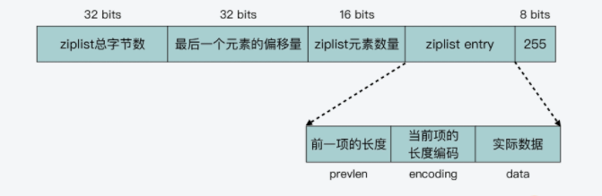
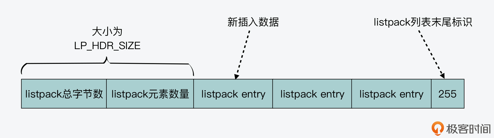
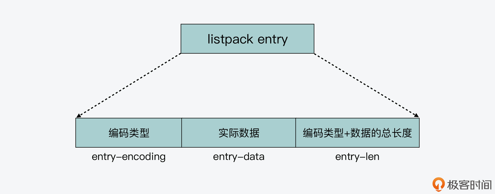
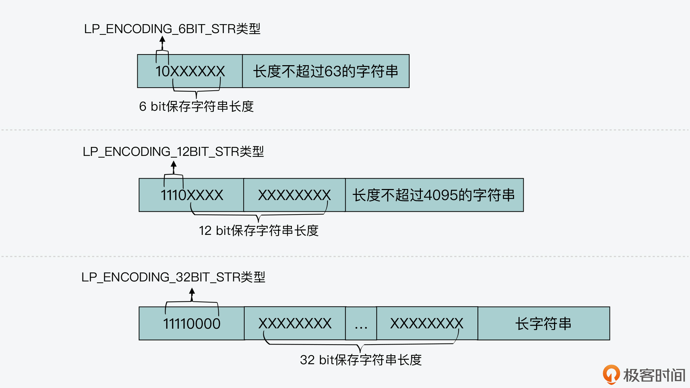
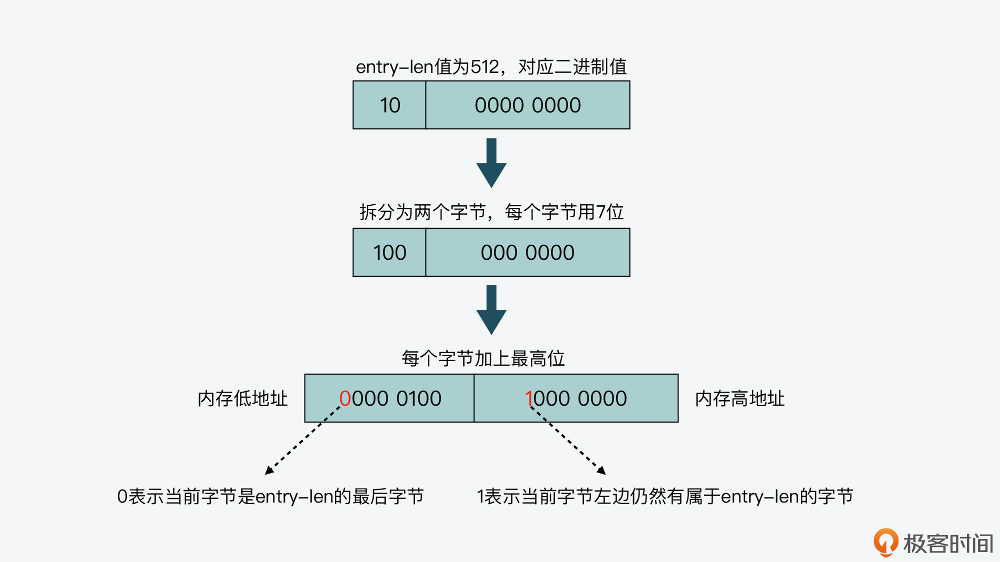
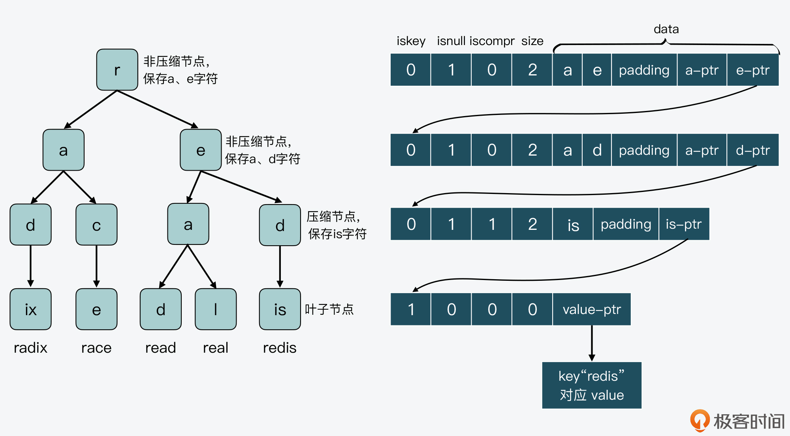
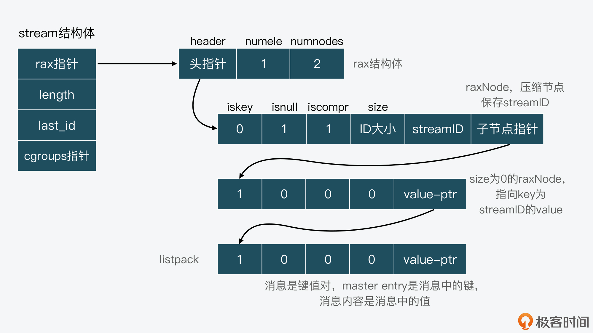

### 01.源码整体框架

对于 Redis 来说，在它的源码总目录下，一共包含了deps、src、tests、utils四个子目录：

***deps 目录：***包含了 Redis 依赖的第三方代码库，包括 Redis 的 C 语言版本客户端代码 hiredis、jemalloc 内存分配器代码、readline 功能的替代代码 linenoise，以及 lua 脚本代码。

src 目录：包含了 Redis 所有功能模块的代码文件，也是 Redis 源码的重要组成部分。

tests 目录：保存用于功能**模块测试和单元测试**的代码，分别是单元测试（对应 unit 子目录），Redis Cluster 功能测试（对应 cluster 子目录）、哨兵功能测试（对应 sentinel 子目录）、主从复制功能测试（对应 integration 子目录）

***utils 目录***：创建 Redis Cluster 的脚本、用于测试 LRU 算法效果的程序，以及可视化 rehash 过程的程序’

src目录下：Redis 代码结构中的 src 目录，包含了实现功能模块的 123 个代码文件。在这 123 个代码文件中，一般包括了实现该功能的 C 语言文件（.c 文件） 和对应的头文件（.h 文件）。比如，dict.c 和 dict.h 就是用于实现哈希表的 C 文件和头文件。

##### 服务器实例

如果你想了解 Redis 是如何开始运行的，那么就可以从 server.c 的 main 函数开始看起。

Redis 使用了基于事件驱动机制的网络通信框架，涉及的代码文件包括 ae.h/ae.c，ae_epoll.c，ae_evport.c，ae_kqueue.c，ae_select.c

Redis 对 TCP 网络通信的 Socket 连接、设置等操作进行了封装，这些封装后的函数实现在 anet.h/anet.c 中

##### 数据库数据类型与操作

###### 数据结构： 

-   字符串（t_string.c、sds.c、sdsalloc.h） 

-   位运算（bitops.c） - 链表（t_list.c、ziplist.c） 

-   双向链表（adlist.c、quicklist.c） 

    哈希表（t_hash.c、ziplist.c、dict.c、zipmap.c） 

    集合（t_set.c、intset.c） 

     有序集合（t_zset.c、ziplist.c、dict.c） 

     基数树（rax.c） 

     HyperLogLog（hyperloglog.c） 

    经纬度（geo.c、geohash.c、geohash_helper.c） 

    流（t_stream.c、rax.c、listpack.c） 

     Redis对象（object.c）

    ###### 算法： 

    排序（Sort.c、pqsort.c）

     哈希（spihash.c） 

     SHA（sha1.c、sha256.c） 

    CRC（crc16.c、crc16_slottable.h、crc64.c、crcspeed.c） 

    随机数（rand.c、mt19937-64.c）

     压缩（lzf_c.c、lzf_d.c、lzf_h.c） 

    微线图（sparkline.c）

除了实现了诸多的数据类型以外，Redis 作为数据库，还实现了对键值对的新增、查询、修改和删除等操作接口，这部分功能是在 db.c 文件

在**内存分配**方面，Redis 支持使用不同的内存分配器，包括 glibc 库提供的默认分配器 tcmalloc、第三方库提供的 jemalloc。Redis 把对内存分配器的封装实现在了 zmalloc.h/zmalloc.c。

在**内存回收**上，Redis 支持设置过期 key，并针对过期 key 可以使用不同删除策略，这部分代码实现在 expire.c 文件中。同时，为了避免大量 key 删除回收内存，会对系统性能产生影响，Redis 在 lazyfree.c 中实现了异步删除的功能，所以这样，我们就可以使用后台 IO 线程来完成删除，以避免对 Redis 主线程的影响。

针对**数据替换**，如果内存满了，Redis 还会按照一定规则清除不需要的数据，这也是 Redis 可以作为缓存使用的原因。Redis 实现的数据替换策略有很多种，包括 LRU、LFU 等经典算法。这部分的代码实现在了 `evict.c` 中。

##### 高可靠性和高可扩展性

持久化：RDB（rdb.c、redis-check-rdb.c)、AOF（aof.c、redis-check-aof.c） 

主从复制（replication.c） 

哨兵（sentinel.c） 

集群（cluster.c）

##### 辅助功能

Redis 在 `latency.h/latency.c` 中实现了操作延迟监控的功能；为了便于运维人员查找运行过慢的操作命令，Redis 在 `slowlog.h/slowlog.c` 中实现了慢命令的记录功能.

Redis 实现了**对系统进行性能评测**的功能，这部分代码在 redis-benchmark.c 中

###  02.字符串的实现

c语言中字符串使用char*数组实现，为什么不重用？看[redis字符串](./中间件\Redis\Redis的设计与实现\第一章-Redis的数据结构和对象.md)

SDS数据结构：len现有长度，alloc分配空间 ，flags SDS类型，buf[] 字符数组。

SDS 结构中有一个元数据 flags，表示的是 SDS 类型。事实上，SDS 一共设计了 5 种类型，分别是 <u>sdshdr5、sdshdr8、sdshdr16、sdshdr32 和 sdshdr64</u>。这 5 种类型的。区别在于: 它们数据结构中的<u>字符数组现有长度 len 和分配空间长度 alloc</u>，这两个元数据的数据类型不同。

```c++
struct __attribute__ ((__packed__)) sdshdr8 {
  uint8_t len; /* 字符数组现有长度*/
  uint8_t alloc; /* 字符数组的已分配空间，不包括结构体和\0结束字符*/
  unsigned char flags; /* SDS类型*/
  char buf[]; /*字符数组*/
};
//长度 len 和已分配空间 alloc 的数据类型都是 uint8_t。uint8_t 是 8位无符号整型，会占用 1 字节的内存空间。当字符串类型是 sdshdr8 时，它能表示的字符数组长度（包括数组最后一位\0）不会超过 256 字节（2 的 8 次方等于 256）。
//sdshdr16、sdshdr32、sdshdr64 三种类型来说，它们的 len 和 alloc 数据类型分别是 uint16_t、uint32_t、uint64_t，即它们能表示的字符数组长度，分别不超过 2 的 16次方、32 次方和 64 次方。占用的内存空间分别是 2 字节、4 字节和 8 字节。
```

除了设计不同类型的结构头，Redis 在编程上还使用了专门的编译优化来节省内存 空间,packed就是告诉编译器，在编译 sdshdr8 结构时，不要使用字节对齐的方式，而是采用紧凑的方式分配内存。这是因为在 默认情况下，编译器会按照 8 字节对齐的方式，给变量分配内存。也就是说，即使一个变 量的大小不到 8 个字节，编译器也会给它分配 8 个字节。

### 03.Hash表的基本实现

Redis 也使用一个全局 Hash 表来保存所有的键值对，从而既满足应用存取 Hash 结构数据需求，又能提供快速查询功能。

但是会受到<u>哈希冲突</u>和 <u>rehash 开销</u>的影响。而这两个问题的核心，其实都来自于 Hash 表要保存的数据量，超过了当前 Hash 表能容纳的数据量

针对哈希冲突，Redis 采用了链式哈希，在不扩容哈希表的前提下，将具有相同哈希值的数据链接起来；对于 rehash 开销，Redis 实现了渐进式 rehash 设计。

##### 链式Hash如何实现

Redis 中和 Hash 表实现相关的文件主要是 <u>dict.h 和 dict.c</u>。其中，dict.h 文件定义了 Hash 表的结构、哈希项，以及 Hash 表的各种操作函数，而 dict.c 文件包含了 Hash 表各种操作的具体实现代码。

```c
typedef struct dictht {
    dictEntry **table; //二维数组,每个元素是一个指向哈希项（dictEntry）的指针
    unsigned long size; //Hash表大小
    unsigned long sizemask;
    unsigned long used;
} dictht;
//每一个元素的结构
typedef struct dictEntry {
    void *key;
  //使用union，当值为整数或双精度浮点数时，由于其本身就是 64 位，就可以不用指针指向了，而是可以直接存在键值对的结构体中，这样就避免了再用一个指针，从而节省了内存空间。
    union {
        void *val;
        uint64_t u64;
        int64_t s64;
        double d;
    } v;
    struct dictEntry *next;//使用链地址法，找到下一个元素
} dictEntry;
```

##### Redis 如何实现 rehash

1.   准备了两个hash表

```
typedef struct dict {
    …
    dictht ht[2]; //两个Hash表，交替使用，用于rehash操作
    long rehashidx; //Hash表是否在进行rehash的标识，-1表示没有进行rehash
    …
} dict;
```

2.   所有的键值对写入哈希表 ht[0],当进行 rehash 时，键值对被迁移到哈希表 ht[1]中
3.   当迁移完成后，ht[0]的空间会被释放，并把 ht[1]的地址赋值给 ht[0]，ht[1]的表大小设置为 0。这样一来，又回到了正常服务请求的阶段，ht[0]接收和服务请求，ht[1]作为下一次 rehash 时的迁移表。

##### 触发Rehash

Redis 用来判断是否触发 rehash 的函数是 **_dictExpandIfNeeded**。

_dictExpandIfNeeded 函数中定义了三个扩容条件：

条件一：ht[0]的大小为 0。

条件二：ht[0]承载的元素个数已经超过了 ht[0]的大小，同时 Hash 表可以进行扩容。

条件三：ht[0]承载的元素个数，是 ht[0]的大小的 dict_force_resize_ratio 倍，其中，dict_force_resize_ratio 的默认值是 5。

(当前承载的元素个数（<u>d->ht[0].used</u>）和 Hash 表当前设定的大小（<u>d->ht[0].size</u>），这两个值的比值一般称为负载因子（load factor）,负载因子是否大于1，或者大于5)，大于5表明 Hash 表已经过载比较严重了，需要立刻进行库扩容，大于1Redis 还会再判断 **dict_can_resize** 这个变量值，查看当前是否可以进行扩容

**dict_can_resize** 的作用是启用和禁止哈希表执行 rehash 功能。当当前**没有 RDB 子进程，并且也没有 AOF 子进程**就可以执行扩容。


_dictExpandIfNeeded ->dictKeyIndex 函数调用->dictAddRaw ->dictAdd：用来往 Hash 表中添加一个键值对。dictRelace：用来往 Hash 表中添加一个键值对，或者键值对存在时，修改键值对。dictAddorFind：直接调用 dictAddRaw。

Redis 中触发 rehash 操作的关键，就是 _dictExpandIfNeeded 函数和 updateDictResizePolicy 函数。_dictExpandIfNeeded 函数会根据 Hash 表的负载因子以及能否进行 rehash 的标识，判断是否进行 rehash，而 updateDictResizePolicy 函数会根据 RDB 和 AOF 的执行情况，启用或禁用 rehash。

注意：渐进式rehash的时，是不能对对外提供增删改查服务的；但是rehash过程中，也就是ht[0]->ht[1]，如果有增删改查操作时，如果index大于rehashindex，访问ht[0]，否则访问ht[1]

##### 渐进式 rehash 如何实现

两个关键函数：dictRehash 和 _dictRehashStep

dictRehash 函数执行键拷贝，输入参数有两个分别是<u>全局哈希表</u>（ ht[0]和 ht[1]）和进行键拷贝的桶数量（bucket 数量）。

1.   进行键拷贝的 bucket 数量 n，依次完成这些 bucket 内部所有键的迁移
2.   判断 ht[0]表中数据是否都已迁移完。如果都迁移完了，那么 ht[0]的空间会被释放
3.    ht[1]赋值给 ht[0]后，它的大小被重置为 0，等待下一次 rehash。 rehashidx 变量会被标为 -1，表示 rehash 结束了。

```c
int dictRehash(dict *d, int n) {
    int empty_visits = n*10;
    ...
    //主循环，根据要拷贝的bucket数量n，循环n次后停止或ht[0]中的数据迁移完停止
    while(n-- && d->ht[0].used != 0) {
       ...
    }
    //判断ht[0]的数据是否迁移完成
    if (d->ht[0].used == 0) {
        //ht[0]迁移完后，释放ht[0]内存空间
        zfree(d->ht[0].table);
        //让ht[0]指向ht[1]，以便接受正常的请求
        d->ht[0] = d->ht[1];
        //重置ht[1]的大小为0
        _dictReset(&d->ht[1]);
        //设置全局哈希表的rehashidx标识为-1，表示rehash结束
        d->rehashidx = -1;
        //返回0，表示ht[0]中所有元素都迁移完
        return 0;
    }
    //返回1，表示ht[0]中仍然有元素没有迁移完
    return 1;
}
```

上面是整体Rehash过程，下面来看一下<u>渐进式 rehash 是如何按照 bucket 粒度拷贝数据的</u>，

rehashidx 变量表示的是当前 rehash 在对哪个 bucket 做数据迁移，由于在扩容期间主线程无法执行其它请求，所以渐进式 rehash 在执行时设置了一个变量 **empty_visits，用来表示已经检查过的空 bucket**，当检查了一定数量的空 bucket 后，这一轮的 rehash 就停止执行，转而继续处理外来请求，避免了对 Redis 性能的影响。

每做完一个哈希项的迁移，ht[0]和 ht[1]用来表示承载哈希项多少的变量 used，就会分别减一和加一。当然，如果当前 rehashidx 指向的 bucket 中数据都迁移完了，rehashidx 就会递增加 1，指向下一个 bucket。

```c
while(n-- && d->ht[0].used != 0) {
    ...
    //获得哈希表中哈希项
    de = d->ht[0].table[d->rehashidx];
    //如果rehashidx指向的bucket不为空
    while(de) {
        uint64_t h;
        //获得同一个bucket中下一个哈希项
        nextde = de->next;
        //根据扩容后的哈希表ht[1]大小，计算当前哈希项在扩容后哈希表中的bucket位置
        h = dictHashKey(d, de->key) & d->ht[1].sizemask;
        //将当前哈希项添加到扩容后的哈希表ht[1]中
        de->next = d->ht[1].table[h];
        d->ht[1].table[h] = de;
        //减少当前哈希表的哈希项个数
        d->ht[0].used--;
        //增加扩容后哈希表的哈希项个数
        d->ht[1].used++;
        //指向下一个哈希项
        de = nextde;
    }
    //如果当前bucket中已经没有哈希项了，将该bucket置为NULL
    d->ht[0].table[d->rehashidx] = NULL;
    //将rehash加1，下一次将迁移下一个bucket中的元素
    d->rehashidx++;
}
```

渐进式 rehash 相关的第二个关键函数 **_dictRehashStep**，这个函数实现了**每次只对一个 bucket 执行 rehash**。

具体实现就是dictAddRaw，dictGenericDelete，dictFind，dictGetRandomKey，dictGetSomeKeys调用 _dictRehashStep，然后调用dictRehash(d,1);注意传入参数为1，每次只对一个buket做迁移。

##### 使用的Hash算法

（SipHash 哈希算法是在 Redis 4.0 才开始使用的，3.0-4.0 使用的是 MurmurHash2 哈希算法，3.0 之前是 DJBX33A 哈希算法）

Redis为什么不像Java的HashMap一样引入红黑树呢？

   1、hash冲突不使用红黑树：redis需要高性能，如果hash冲突使用红黑树，**红黑树和链表的转换会引起不必要的开销**（hash冲突不大的情况下红黑树其实比链表沉重，还会浪多余的空间）    

  2、dict不采用红黑树：在负载因子较低，hash冲突较低的情况下，hash表的效率O(1)远远高于红黑树   

##### Redis中使用的dict

server.c/initServer() 方法中找到答案:

```c
for (j = 0; j < server.dbnum; j++) {
    // 创建基础 hashmap，也就是 set key value 所使用的 hashmap
    server.db[j].dict = dictCreate(&dbDictType,NULL);

    // 创建 expires hashmap，用于实现 TTL，调用可见 dbAsyncDelete()
    server.db[j].expires = dictCreate(&dbExpiresDictType,NULL);

    // 创建 blocking_keys hashmap，用于记录阻塞信息，调用可见 serveClientsBlockedOnListKey()
    server.db[j].blocking_keys = dictCreate(&keylistDictType,NULL);

    // 创建 ready_keys hashmap，调用可见 handleClientsBlockedOnKeys()
    server.db[j].ready_keys = dictCreate(&objectKeyPointerValueDictType,NULL);

    // 创建 watched_keys hashmap，调用可见 watchForKey()
    server.db[j].watched_keys = dictCreate(&keylistDictType,NULL);

    ......
}
//也就是说，Redis 在启动时将会创建 16 * 5 个功能性的 dict，这些 dcit 是实现 TTL、BLPOP/BRPOP 等功能的关键组件。
```

### 04 .内存友好的数据结构该如何细化设计？

Redis 数据结构在面向内存使用效率方面的优化，其中包括两方面的设计思路：一是**内存友好的数据结构设计**；二是**内存友好的数据使用方式**

#### 内存友好的数据结构

redis作为内存大户使用了对内存碎片更友好**内存分配器(jemalloc)**

在 Redis 中，有三种数据结构针对内存使用效率做了设计优化，分别是**简单动态字符串（SDS）**、**压缩列表（ziplist）**和**整数集合（intset）**   

##### SDS 的内存友好设计

1.   SDS 设计了不同类型的结构头，包括 sdshdr8、sdshdr16、sdshdr32 和 sdshdr64。适配不同大小的字符串，避免了内存浪费。

2.   位域定义方法

     >   redisObject 结构体：
     >
     >   ```c
     >   typedef struct redisObject {
     >       unsigned type:4; //redisObject的数据类型，4个bits，面向用户的
     >       unsigned encoding:4; //redisObject的编码类型，4个bits，面向底层的
     >       unsigned lru:LRU_BITS;  //redisObject的LRU时间，LRU_BITS为24个bits
     >       int refcount; //redisObject的引用计数，4个字节
     >       void *ptr; //指向值的指针，8个字节
     >   } robj;
     >   ```
     >
     >   在 type、encoding 和 lru 三个变量后面都有一个冒号，并紧跟着一个数值，表示该元数据占用的比特数。其中，type 和 encoding 分别占 4bits。而 lru 占用的比特数，是由 server.h 中的宏定义 LRU_BITS 决定的，它的默认值是 24bits.
     >
     >   这种变量后使用冒号和数值的定义方法。这实际上是 **C 语言中的位域定义方法**，可以用来有效地节省内存开销。

3.   嵌入式字符串

     >   SDS 在保存比较小的字符串时，会使用嵌入式字符串的设计方法，将字符串直接保存在 redisObject 结构体中。然后在 redisObject 结构体中，存在一个指向值的指针 ptr，而一般来说，这个 ptr 指针会指向值的数据结构。
     >
     >   创建一个String类型的字符，Redis 会调用 createStringObject 函数，来创建相应的 redisObject。createStringObject 函数会**根据要创建的字符串的长度**，决定具体调用哪个函数来完成创建。
     >
     >   ```c
     >   //两个参数，根据传入的len确定调用哪一个函数<44
     >   #define OBJ_ENCODING_EMBSTR_SIZE_LIMIT 44
     >   robj *createStringObject(const char *ptr, size_t len) {
     >       //创建嵌入式字符串，字符串长度小于等于44字节
     >       if (len <= OBJ_ENCODING_EMBSTR_SIZE_LIMIT)
     >           return createEmbeddedStringObject(ptr,len);
     >       //创建普通字符串，字符串长度大于44字节
     >       else
     >           return createRawStringObject(ptr,len);
     >   }
     >   robj *createRawStringObject(const char *ptr, size_t len) {
     >       return createObject(OBJ_STRING, sdsnewlen(ptr,len));
     >   }
     >   //创建OBJ_ENCODING_RAW
     >   robj *createObject(int type, void *ptr) {
     >       //给redisObject结构体分配空间
     >       robj *o = zmalloc(sizeof(*o));
     >       //设置redisObject的类型
     >       o->type = type;
     >       //设置redisObject的编码类型，此处是OBJ_ENCODING_RAW，表示常规的SDS
     >       o->encoding = OBJ_ENCODING_RAW;
     >       //直接将传入的指针赋值给redisObject中的指针。
     >       o->ptr = ptr;
     >       o->refcount = 1;
     >       …
     >       return o;
     >   }
     >   ```
     >
     >   embstr：小于44字节，redisObject 和 SDS 一起分配内存；
     >
     >   rawstr：大于44字节，用 rawstr（redisObject 和 SDS 分开存储）实现
     >
     >   为什么是44？Redis 规定嵌入式字符串**最大以 64 字节存储**，所以 N = 64 - 16(redisObject) - 3(sdshr8) - 1(\0)， <u>N = 44 字节。</u>

##### 压缩列表和整数集合的设计

List、Hash 和 Sorted Set 这三种数据类型，都可以使用压缩列表（ziplist）来保存数据。压缩列表的函数定义和实现代码分别在 **ziplist.h 和 ziplist.c 中**

```c
//创建一块连续的内存空间，大小为 ZIPLIST_HEADER_SIZE 和 ZIPLIST_END_SIZE 的总和，然后再把该连续空间的最后一个字节赋值为 ZIP_END，表示列表结束
unsigned char *ziplistNew(void) {
    //初始分配的大小
    unsigned int bytes = ZIPLIST_HEADER_SIZE+ZIPLIST_END_SIZE;
    unsigned char *zl = zmalloc(bytes);
    …
   //将列表尾设置为ZIP_END
    zl[bytes-1] = ZIP_END;
    return zl;
}
```

ziplist 列表项包括三部分内容，分别是前一项的长度（prevlen）、当前项长度信息的编码结果（encoding），以及当前项的实际数据（data)



在 ziplist 中，编码技术主要应用在列表项中的 prevlen 和 encoding 这两个元数据上。而当前项的实际数据 data，则正常用整数或是字符串来表示。

 **prevlen 编码:**

**encoding 的编码:**字符串还是整数，字符串大小<64,<16383字节,>大于16383,几种情况。

```c
//默认编码结果是1字节
  unsigned char len = 1;
  //如果是字符串数据
  if (ZIP_IS_STR(encoding)) {
      //字符串长度小于等于63字节（16进制为0x3f）
        if (rawlen <= 0x3f) {
            //默认编码结果是1字节
            …
        }
    //字符串长度小于等于16383字节（16进制为0x3fff） 
        else if (rawlen <= 0x3fff) {   
            //编码结果是2字节
            len += 1;
            …
        }
    //字符串长度大于16383字节
 
        else {
            //编码结果是5字节
            len += 4;
            …
        }
    } else {
        /* 如果数据是整数，编码结果是1字节*/
        if (!p) return len;
        ...
    }
```

整数集合：整数集合也是一块连续的内存空间，提升了内存使用效率

#### 节省内存的数据访问

Redis 就采用了共享对象的设计思想。设计思想很简单，把这些常用数据创建为**共享对象**，当上层应用需要访问它们时，**直接读取就行。**

```c
//创建共享对象
void createSharedObjects(void) {
   …
   //常见回复信息
   shared.ok = createObject(OBJ_STRING,sdsnew("+OK\r\n"));
   shared.err = createObject(OBJ_STRING,sdsnew("-ERR\r\n"));
   …
   //常见报错信息
 shared.nokeyerr = createObject(OBJ_STRING,sdsnew("-ERR no such key\r\n"));
 shared.syntaxerr = createObject(OBJ_STRING,sdsnew("-ERR syntax error\r\n"));
   //0到9999的整数
   for (j = 0; j < OBJ_SHARED_INTEGERS; j++) {
        shared.integers[j] =
          makeObjectShared(createObject(OBJ_STRING,(void*)(long)j));
        …
    }
   …
}
```

#### 总结

对于**实现数据结构**来说，如果想要节省内存：一个是使用连续的内存空间，避免内存碎片开销；二个是针对不同长度的数据，采用不同大小的元数据，以避免使用统一大小的元数据，造成内存空间的浪费。

在**数据访问**方面，使用共享对象其实可以避免重复创建冗余的数据，从而也可以有效地节省内存空间

### 05. 有序集合实现

有序集合（Sorted Set）是 Redis 中一种重要的数据类型，它本身是集合类型，同时也可以支持集合中的元素带有权重，并按权重排序。

有序集合支持的两种操作：

ZRANGEBYSCORE：按照元素权重返回一个范围内的元素。(O(logN)+M)

ZSCORE：返回某个元素的权重值。O(1)

##### Sorted Set 基本结构

Sorted Set 的实现代码在t_zset.c文件中，包括 Sorted Set 的各种操作实现，同时 Sorted Set 相关的结构定义在server.h文件中

### 06.从ziplist到quicklist，再到listpack的启发

1、ziplist 设计的初衷就是「节省内存」，在存储数据时，把内存利用率发挥到了极致： 

​	数字按「整型」编码存储，比直接当字符串存内存占用少。

​	数据「长度」字段，会根据内容的大小选择最小的长度编码 

​	甚至对于极小的数据，干脆把内容直接放到了「长度」字段中（前几个位表示长度，后几个位存数据） 

2、但 ziplist 的劣势也很明显：

-   寻找元素只能挨个遍历，存储过长数据，查询性能很低 
-   连锁更新风险

##### quicklist

3、想要缓解 ziplist 的问题，比较简单直接的方案就是，多个数据项，不再用一个 ziplist 来存，而是分拆到多个 ziplist 中，每个 ziplist 用指针串起来，这样修改其中一个数据项，即便发生级联更新，也只会影响这一个 ziplist，其它 ziplist 不受影响，这种方案就是 quicklist：

Redis3 .2版本开始对列表数据结构进行了改造，使用**快速列表（quicklist）代替了压缩列表（ziplist）和链表（linkedlist）**

quicklist 是一个链表，所以每个 quicklistNode 中，都包含了分别指向它前序和后序节点的<u>指针*prev和*next</u>。同时，每个 <u>quicklistNode 又是一个 ziplist</u>，所以，在 quicklistNode 的结构体中，还有指向 ziplist 的指针*zl。

将链表按段切分，每一段使用压缩列表进行内存的连续存储，多个压缩列表通过prev和next指针组成的双向链表。它结合了压缩列表和链表的优势，进一步压缩了内存的使用量，进一步提高了效率。

```go
typedef struct quicklistNode {
    struct quicklistNode *prev;     //前一个quicklistNode
    struct quicklistNode *next;     //后一个quicklistNode
    unsigned char *zl;              //quicklistNode指向的ziplist
    unsigned int sz;                //ziplist的字节大小
    unsigned int count : 16;        //ziplist中的元素个数 此段链表节点存储了多少ziplist元素
    unsigned int encoding : 2;   //编码格式，原生字节数组或压缩存储
    unsigned int container : 2;  //存储方式
    unsigned int recompress : 1; //数据是否被压缩
    unsigned int attempted_compress : 1; //数据能否被压缩
    unsigned int extra : 10; //预留的bit位
} quicklistNode;

typedef struct quicklist {
    quicklistNode *head;      //quicklist的链表头
    quicklistNode *tail;      //quicklist的链表尾
    unsigned long count;     //所有ziplist中的总元素个数
    unsigned long len;       //quicklistNodes的个数
    ...
} quicklist;
```

如上，对于每个quicklist包含quicklistNode的head和tail，每个quicklistNode包含一组ziplist，ziplist中包含zlbytes（总字节数），ztail（最后一个元素偏移量），zlen(总元素数量) ，entry1（具体每一个元素（prelen前一个元素长度，当前元素长度编码，实际数据）），entry2。

##### listpack 设计与实现

listpack 也叫紧凑列表，它的特点就是用一块连续的内存空间来紧凑地保存数据，同时为了节省内存空间，listpack 列表项使用了多种编码方式，来表示不同长度的数据，这些数据包括整数和字符串。

```c
//
unsigned char *lpNew(void) {
    //分配LP_HRD_SIZE+1
    unsigned char *lp = lp_malloc(LP_HDR_SIZE+1);//6+1
    if (lp == NULL) return NULL;
    //设置listpack的大小
    lpSetTotalBytes(lp,LP_HDR_SIZE+1);
    //设置listpack的元素个数，初始值为0
    lpSetNumElements(lp,0);
    //设置listpack的结尾标识为LP_EOF，值为255
    lp[LP_HDR_SIZE] = LP_EOF;
    return lp;
}
```



4 个字节是记录 listpack 的总字节数，2 个字节是记录 listpack 的元素数量,总共6个字节。

listpack 列表项也包含了**元数据信息和数据本身**。不过，为了避免 ziplist 引起的连锁更新问题，listpack 中的每个列表项只会包含三个方面内容，分别是**当前元素的编码类型**（entry-encoding）、**元素数据** (entry-data)，以及**编码类型和元素数据**这两部分的长度 (entry-len)，如下图所示。



listpack 元素会对不同长度的整数和字符串进行编码：

1、对于整数编码来说，类型为LP_ENCODING_7BIT_UINT ，第一位为0，后七位存储数据。类型为LP_ENCODING_13BIT_INT 表示元素的实际数据是 13 bit 的整数，前三位为110，后面十三位存储数据。剩下的 LP_ENCODING_**16**BIT_INT、LP_ENCODING_**24**BIT_INT、LP_ENCODING_32BIT_INT 和 LP_ENCODING_**64**BIT_INT

2、对于字符串编码来说，一共有三种类型，分别是 LP_ENCODING_6BIT_STR、LP_ENCODING_12BIT_STR 和 LP_ENCODING_32BIT_STR。



listpack 的遍历：***<u>（从左往右）</u>***首先调用lpFirst跳过开头的6字节，然后lpNext 调用lpSkip一个跳过一个列表项到达下一个列表项，lpSkip 函数会先后调用 **lpCurrentEncodedSize** 和 **lpEncodeBacklen** 这两个函数。

lpCurrentEncodedSize 函数是根据当前列表项第 1 个字节的取值，来计算当前项的编码类型，并根据编码类型，计算当前项编码类型和实际数据的总长度。

lpEncodeBacklen 函数会根据编码类型和实际数据的长度之和，进一步计算列表项最后一部分 entry-len 本身的长度。

**<u>*（从右往左）*</u>：**listpack 头中记录的 listpack 总长度，就可以直接定位到 listapck 的尾部结束标记。然后，我们可以调用 lpPrev 函数（**listpack 冗余了一个位在每个字节的最高位用于从右往前进行遍历**），该函数的参数包括指向某个列表项的指针，并返回指向当前列表项前一项的指针。lpPrev 函数中的关键一步就是调用 lpDecodeBacklen 函数。lpDecodeBacklen 函数会从右向左，逐个字节地读取当前列表项的 entry-len。



##### 总结

quicklist每个中每个ziplist 8KB；

要想彻底解决 ziplist 级联更新问题，本质上要修改 ziplist 的存储结构，也就是不要让每个元素保存「上一个」元素的长度即可，所以才有了 listpack

listpack 每个元素项不再保存上一个元素的长度，而是优化元素内字段的顺序，来保证既可以从前也可以向后遍历

listpack 是为了替代 ziplist 为设计的，但因为 List/Hash/ZSet 都严重依赖 ziplist，所以这个替换之路很漫长，目前只有 Stream 数据类型用到了 listpack。


### 07. 为什么Stream使用了Radix Tree？

##### Redis Stream

Redis Stream 是 Redis 5.0 版本新增加的数据结构。

Redis Stream 主要用于消息队列（MQ，Message Queue），Redis 本身是有一个 Redis 发布订阅 (pub/sub) 来实现消息队列的功能，但它有个缺点就是消息无法持久化，如果出现网络断开、Redis 宕机等，消息就会被丢弃。

简单来说发布订阅 (pub/sub) 可以分发消息，但无法记录历史消息。

而 Redis Stream 提供了消息的持久化和主备复制功能，可以让任何客户端访问任何时刻的数据，并且能记住每一个客户端的访问位置，还能保证消息不丢失。

在 Stream 数据类型的底层数据结构中，**采用了 Radix Tree 和 listpack 两种数据结构来保存消息**

Radix Tree这个数据结构的最大特点是**适合保存具有相同前缀的数据**，但它与前缀树不同的是

其中存在两类节点：第一类节点是非压缩节点，第二类节点是压缩节点,

```

typedef struct raxNode {
    uint32_t iskey:1;     //节点是否包含key
    uint32_t isnull:1;    //节点的值是否为NULL
    uint32_t iscompr:1;   //节点是否被压缩
    uint32_t size:29;     //节点大小
    unsigned char data[]; //节点的实际存储数据
} raxNode;
```




##### Stream 如何组合使用 Radix Tree 和 listpack？

Stream 保存的消息数据，按照 key-value 形式来看的话，消息 ID 就相当于 key，而消息内容相当于是 value。也就是说，Stream 会使用 **Radix Tree 来保存消息 ID**，**然后将消息内容保存在 listpack 中**，并作为消息 ID 的 value，用 raxNode 的 value 指针指向对应的 listpack。



##### Radix Tree 和b+树，跳表的不同

1、Radix Tree 优势 ：本质上是前缀树，所以存储有「公共前缀」的数据时，比 B+ 树、跳表节省内存 - 没有公共前缀的数据项，压缩存储，value 用 listpack 存储，也可以节省内存 - <u>查询复杂度是 O(K)，只与「目标长度」有关</u>，与总数据量无关 - 这种数据结构也经常用在搜索引擎提示、文字自动补全等场景

 Stream在存消息时，推荐使用默认自动生成的**「时间戳+序号」作为消息 ID**，不建议自己指定消息 ID，这样才能发挥 Radix Tree 公共前缀的优势。 

2、Radix Tree 不足 ： 如果数据集公共前缀较少，会导致内存占用多 - 增删节点需要处理其它节点的「分裂、合并」，Radix Tree能保证在索引key的前缀顺序，但是在保证数据顺序且连续性上不如跳表，不适合存储像UUID等，非对称结构的key

​		跳表只需调整前后指针即可 

​      B+ 树、跳表范围查询友好，直接遍历链表即可，Radix Tree 需遍历树结构 - 实现难度高比 B+ 树、跳表复杂