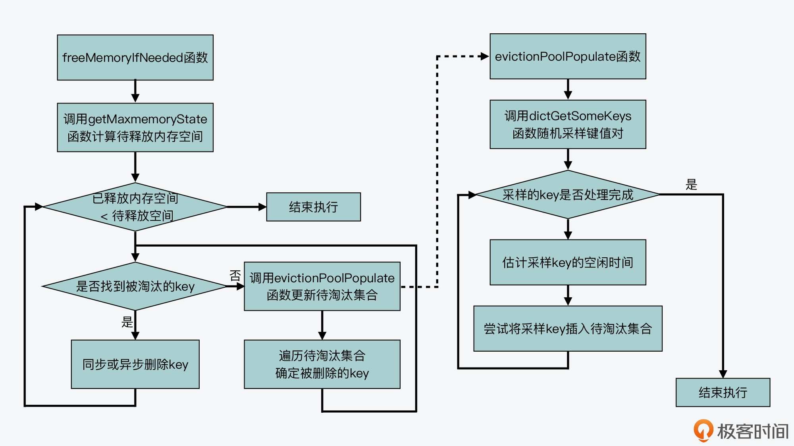
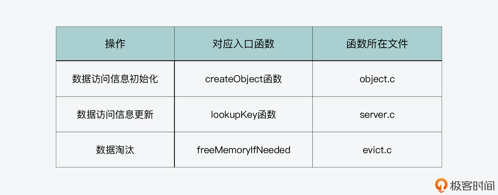

### 15.Redis中LRU算法的实现

Redis 配置文件 redis.conf 中的两个配置参数有关：

maxmemory，该配置项设定了 Redis server 可以使用的最大内存容量，一旦 server 使用的实际内存量超出该阈值时，server 就会根据 maxmemory-policy 配置项定义的策略，执行内存淘汰操作；

maxmemory-policy，该配置项设定了 Redis server 的内存淘汰策略，主要包括近似 LRU 算法、LFU 算法、按 TTL 值淘汰和随机淘汰等几种算法。

当maxmemory-policy设置为`allkeys-lru `或是 `volatile-lru` 时，近似 LRU 算法就被启用了,区别在于：采用 allkeys-lru 策略淘汰数据时，它是在所有的键值对中筛选将被淘汰的数据；而采用 volatile-lru 策略淘汰数据时，它是在设置了过期时间的键值对中筛选将被淘汰的数据

Redis 是如何实现近似 LRU 算法的:

**全局 LRU 时钟值的计算：**这部分包括，Redis 源码为了实现近似 LRU 算法的效果，是如何计算全局 LRU 时钟值的，以用来判断数据访问的时效性；

**键值对 LRU 时钟值的初始化与更新：**这部分包括，Redis 源码在哪些函数中对每个键值对对应的 LRU 时钟值，进行初始化与更新；

**近似 LRU 算法的实际执行：**这部分包括，Redis 源码具体如何执行近似 LRU 算法，也就是何时触发数据淘汰，以及实际淘汰的机制是怎么实现的。

##### 全局 LRU 时钟值的计算

保存：redisObject 结构体除了记录值的指针以外，它其实还会使用 **24 bits 来保存 LRU 时钟信息**，对应的是 lru 成员变量。所以这样一来，每个键值对都会把它最近一次被访问的时间戳，记录在 lru 变量当中。

计算：Redis server 使用了一个实例级别的全局 LRU 时钟，每个键值对的 LRU 时钟值会根据全局 LRU 时钟进行设置，这个全局 LRU 时钟保存在了 Redis 全局变量 server 的成员变量 lruclock 中。当 Redis server 启动后，调用 initServerConfig 函数初始化各项参数时，就会对这个**全局 LRU 时钟 lruclock 进行设置**。具体来说，initServerConfig 函数是调用 getLRUClock 函数，来设置 lruclock 的值，如下所示：

```c
void initServerConfig(void) {
...
unsigned int lruclock = getLRUClock(); //调用getLRUClock函数计算全局LRU时钟值
atomicSet(server.lruclock,lruclock);//设置lruclock为刚计算的LRU时钟值
...
}
```

getLRUClock 函数是在evict.c文件中实现的，它会调用 mstime 函数（在server.c文件中）获得以毫秒为单位计算的 UNIX 时间戳，然后将这个 UNIX 时间戳除以宏定义 LRU_CLOCK_RESOLUTION,将LRU精确到以毫秒为单位。这样一来，如果一个数据**前后两次访问的时间间隔小于 1 秒**，那么这两次访问的时间戳就是一样的。

serverCron 函数作为时间事件的回调函数，本身会按照一定的频率周期性执行，其频率值是由 Redis 配置文件 redis.conf 中的 hz 配置项决定的。hz 配置项的默认值是 10，掉膘100ms会运行一次，全局 LRU 时钟值就会按照这个函数的执行频率，定期调用 getLRUClock 函数进行更新。

##### 键值对 LRU 时钟值的初始化与更新

创建：LRU 时钟值最初是在这个键值对被创建的时候，进行初始化设置的，这个初始化操作是在 createObject 函数中调用的，当 Redis 要创建一个键值对时，就会调用这个函数。createObject 首先会给redisObject 结构体分配内存空间，然后初始化结构体中的lru变量（通过evict.c 文件中的LRU_CLOCK 函数）。

更新：当一个键值对被访问时，访问操作最终都会调用 lookupKey 函数，lookupKey 函数是在db.c文件中实现的，它会从全局哈希表中查找要访问的键值对。如果该键值对存在，那么 **lookupKey 函数**就会根据 maxmemory_policy 的配置值，来更新键值对的 LRU 时钟值，也就是它的访问时间戳。

##### 近似 LRU 算法的实际执行

何时触发算法执行？

>    近似 LRU 算法的主要逻辑是在 freeMemoryIfNeeded(evict.c 文件) 函数中实现的,
>
>   freeMemoryIfNeeded 函数是被 freeMemoryIfNeededAndSafe 函数（在 evict.c 文件中）调用，而 freeMemoryIfNeededAndSafe 函数又是被 processCommand 函数所调用的. <u>Redis 处理每个命令时都会调用processCommand</u> ，其中设置了两个是否调用freeMemoryIfNeededAndSafe 的条件。
>
>   条件一：设置了 maxmemory 配置项为非 0 值。
>
>   条件二：Lua 脚本没有在超时运行
>
>   freeMemoryIfNeededAndSafe 又会根据两个条件决定是否调用freeMemoryIfNeeded 
>
>   条件一：Lua 脚本在超时运行。
>
>   条件二：Redis server 正在加载数据。
>
>   只有在这两个条件都不成立的情况下，freeMemoryIfNeeded 函数才会被调用，然后maxmemory-policy 被设置为了 allkeys-lru 或 volatile-lru，那么近似 LRU 算法就开始被触发执行

算法具体如何执行？

>   程序执行分为三大步骤：判断当前内存使用情况、更新待淘汰的候选键值对集合、选择被淘汰的键值对并删除
>
>   1.   判断当前内存使用情况：
>
>   getMaxmemoryState 函数( evict.c 文件)评估当前的内存使用情况。判断当前 Redis server 使用的内存是否超过了 maxmemory 配置的值。
>
>   为了淘汰数据，Redis 定义了一个**数组 EvictionPoolLRU**，用来保存待淘汰的候选键值对。这个数组的元素类型是 evictionPoolEntry 结构体，该结构体保存了待淘汰键值对的空闲时间 idle、对应的 key 等信息
>
>   ```
>   static struct evictionPoolEntry *EvictionPoolLRU;
>   struct evictionPoolEntry {
>       unsigned long long idle;    //待淘汰的键值对的空闲时间
>       sds key;                    //待淘汰的键值对的key
>       sds cached;                 //缓存的SDS对象
>       int dbid;                   //待淘汰键值对的key所在的数据库ID
>   };
>   ```
>
>   2.   更新待淘汰的候选键值对集合
>
>        freeMemoryIfNeeded 调用 evictionPoolPopulate 函数调用 dictGetSomeKeys 函数随机获取一定数量的 key(redis.conf中可以配置数量)
>
>        evictionPoolPopulate 函数会调用 estimateObjectIdleTime 函数，来计算在采样集合中的每一个键值对的空闲时间，如果在数组中找到一个空闲时间小于采样键值对空闲时间的键值对，把采样键值对插入 EvictionPoolLRU 数组，完成查找
>
>   3.   选择被淘汰的键值对并删除
>
>        evictionPoolPopulate 函数已经更新了 EvictionPoolLRU 数组，而且这个数组里面的 key，是按照空闲时间从小到大排好序了。所以，freeMemoryIfNeeded 函数会遍历一次 EvictionPoolLRU 数组，从数组的最后一个 key 开始选择，如果选到的 key 不是空值，那么就把它作为最终淘汰的 key。一旦选到了被淘汰的 key，freeMemoryIfNeeded 函数就会根据 **Redis server 的惰性删除配置，**来执行同步删除或异步删除
>
>        

### 16.LFU算法

Redis4.0引入了LFU最不频繁使用算法，LFU 算法是根据**数据访问的频率**来选择被淘汰数据的，

##### LFU算法的实现

LFU 算法的启用，是通过设置 Redis 配置文件 redis.conf 中的 maxmemory 和 maxmemory-policy，maxmemory 设置为 **Redis 会用的最大内存容量**，而 maxmemory-policy 可以设置为 **allkeys-lfu 或是 volatile-lfu**，表示淘汰的键值对会分别从所有键值对或是设置了过期时间的键值对中筛选。

LFU 算法的实现可以分成三部分内容，分别是**键值对访问频率记录**、键值对访问频率**初始化和更新**，以及 **LFU 算法淘汰数据**。

##### 键值对访问频率记录

为了节省内存开销，Redis 源码就复用了 lru 变量来记录 LFU 算法所需的访问频率信息.

lru 变量用来记录 LFU 算法的所需信息时，它会用 24 bits 中的**低 8 bits 作为计数器**，来记录键值对的访问次数，同时它会用 24 bits 中的**高 16 bits**，记录访问的时间戳

##### 键值对访问频率的初始化与更新



访问信息初始化：

信息更新：

>   **第一步，根据距离上次访问的时长，衰减访问次数**
>
>   ​	updateLFU 函数首先会调用 LFUDecrAndReturn 函数（在 evict.c 文件中），对键值对的访问次数进行衰减操作，首先获取当前键值对的**上一次访问时间**，这是保存在 lru 变量高 16 位上的值。然后，LFUDecrAndReturn 函数会根据全局变量 server 的 **lru_decay_time 成员变量的取值**，来计算衰减的大小 num_period。LFUDecrAndReturn 函数会调用 LFUTimeElapsed 函数（在 evict.c 文件中），计算距离键值对的上一次访问已经过去的时长。这个时长也是以 1 分钟为精度来计算的。有了距离上次访问的时长后，LFUDecrAndReturn 函数会把这个时长除以 lfu_decay_time 的值，并把结果作为访问次数的衰减大小
>
>   默认情况下，访问次数的衰减大小就是等于上一次访问距离当前的分钟数，如果上一次访问距离当前的分钟数，已经超过访问次数的值了，那么访问次数就会被设置为 0，这就表示键值对已经很长时间没有被访问
>
>   **第二步，根据当前访问更新访问次数**
>
>   ​		updateLFU 函数会调用 LFULogIncr 函数，来增加键值对的访问次数，
>
>   ​		当前访问次数等于最大值 255：LFULogIncr 函数不再增加访问次数。
>
>   ​		当前访问次数小于 255：LFULogIncr 函数会计算一个阈值 p，以及一个取值为 0 到 1 之间的随机概率值 r。如果**概率 r 小于阈值 p**，那么 LFULogIncr 函数才会将访问次数加 1，否则的话，LFULogIncr 函数会返回当前的访问次数，不做更新。
>
>   ​		<u>阈值 p 的值大小：</u>1. 当前访问次数和宏定义 LFU_INIT_VAL 的差值 baseval 2. redis.conf 文件中定义的配置项 lfu-log-factor。所以p = baseval 和 lfu-log-factor 乘积后，加上 1，然后再取其倒数
>
>   ```
>   uint8_t LFULogIncr(uint8_t counter) {
>       if (counter == 255) return 255; //访问次数已经等于255，直接返回255
>       double r = (double)rand()/RAND_MAX;  //计算一个随机数
>       double baseval = counter - LFU_INIT_VAL;  //计算当前访问次数和初始值的差值
>       if (baseval < 0) baseval = 0; //差值小于0，则将其设为0
>       double p = 1.0/(baseval*server.lfu_log_factor+1); //根据baseval和lfu_log_factor计算阈值p
>       if (r < p) counter++; //概率值小于阈值时,
>       return counter;
>   }
>   ```
>
>   第三步，更新 lru 变量值
>
>   updateLFU 函数已经完成了键值对访问次数的更新。接着，它就会调用 LFUGetTimeInMinutes 函数，来获取当前的时间戳，并和更新后的访问次数组合，形成**最新的访问频率信息**，赋值给键值对的 lru 变量

##### LFU如何淘汰数据

与LRU算法相同

##### 问题

LFU 算法在初始化键值对的访问次数时，会将访问次数设置为 LFU_INIT_VAL，默认值是 5 次。如果 LFU_INIT_VAL 设置为 1，会发生什么情况？

如果开启了 LFU，那在写入一个新 key 时，需要初始化访问时间、访问次数（createObject 函数），如果访问次数初始值太小，那这些新 key 的访问次数，很有可能在短时间内就被「衰减」为 0，那就会面临马上被淘汰的风险。设置为5，那么**避免一个 key 在创建后，不会面临被立即淘汰的情况发生。**
