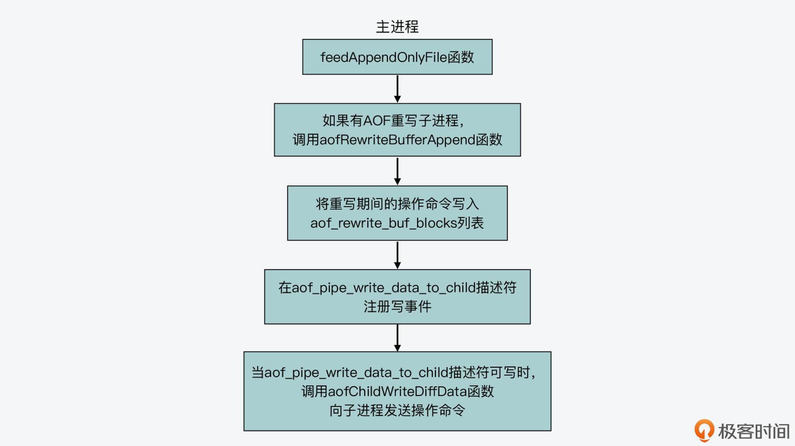
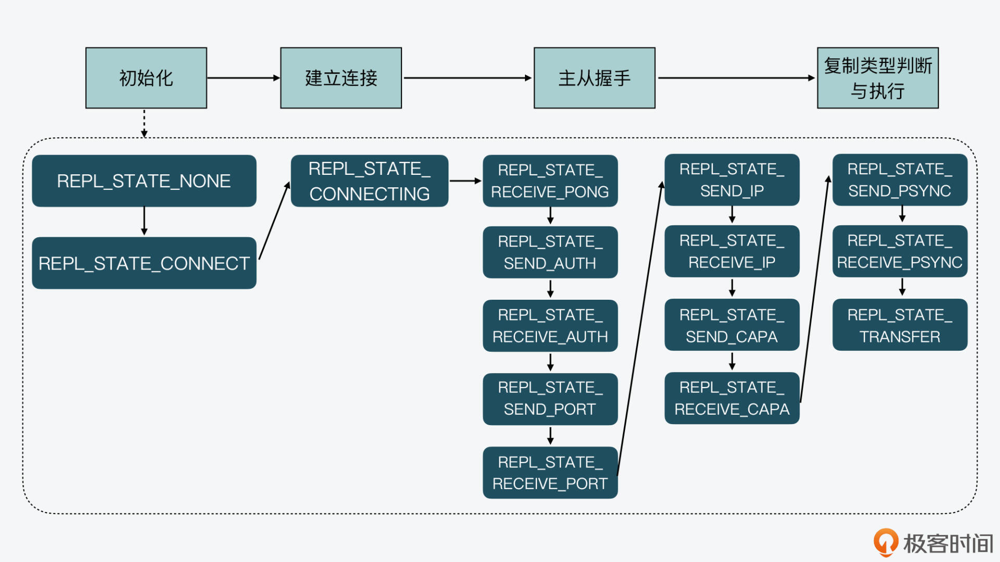

18.生成和解读RDB文件
--------------------

##### RDB 触发时机

Redis 源码中用来创建 RDB 文件的函数有三个，它们都是在`rdb.c`文件中实现的

1.   rdbSave 函数

     >   Redis 的 save 命令—>saveCommand函数->rdbSave 函数->rdbSaveRio 函数

2.   rdbSaveBackground 函数

     >   对应 Redis 的 bgsave 命令，调用实现函数 bgsaveCommand中被调用。 fork 创建一个子进程，让子进程调用 rdbSave 函数来继续创建 RDB 文件

3.   rdbSaveToSlavesSockets 函数

     >   Redis server 在采用不落盘方式传输 RDB 文件进行主从复制时，创建 RDB 文件的入口函数。
     >
     >    startBgsaveForReplication 函数–> replication.c 文件中 syncCommand(执行主从复制命令) 函数和 replicationCron 函数(周期性检测主从复制状态时触发)调用
     >
     >   dbSaveToSlavesSockets 函数也是通过 fork 创建子进程，让子进程生成 RDB。而rdbSaveToSlavesSockets 函数是通过**网络以字节流**的形式，直接发送 RDB 文件的二进制数据给从节点。

​	以上三个入口函数对应了RDB创建文件的三个时间，除了上面三个，还有rdbSave 还会在 `flushallCommand` 函数（在db.c文件中）、`prepareForShutdown` 函数（在server.c文件中）中被调用。这也就是说，Redis 在执行 flushall 命令以及正常关闭时，会创建 RDB 文件。

##### RDB 文件是如何生成的？

一个 RDB 文件主要是由三个部分组成的。

**文件头：**这部分内容保存了 Redis 的魔数、RDB 版本、Redis 版本、RDB 文件创建时间、键值对占用的内存大小等信息。

**文件数据部分：**这部分保存了 Redis 数据库实际的所有键值对。

**文件尾：**这部分保存了 RDB 文件的结束标识符，以及整个文件的校验值。这个校验值用来在 Redis server 加载 RDB 文件后，检查文件是否被篡改过。

查看 RDB 文件中二进制数据和对应的 ASCII 字符，你可以使用 **Linux 上的 od 命令**，这个命令可以用不同进制的方式展示数据，并显示对应的 ASCII 字符。

##### 生成文件头

1.   调用 rdbSaveType 函数写入一个操作码,标识接下来的内容是什么
2.   rdbSaveAuxField 函数调用 rdbSaveRawString 函数（在 rdb.c 文件中）写入属性信息的键，而键通常是一个字符串
3.   写入属性信息的值

##### 生成文件数据部分

rdbSaveRio 函数会先将 SELECTDB 操作码和对应的数据库编号写入 RDB 文件,再写入 **RESIZEDB 操作码**，用来标识全局哈希表和过期 key 哈希表中键值对数量的记录，接着执行一个循环流程，在该流程中，rdbSaveRio 函数会取出当前数据库中的每一个键值对，并**调用 rdbSaveKeyValuePair 函数**（在 rdb.c 文件中），将它写入 RDB 文件

```go
while((de = dictNext(di)) != NULL) {  //读取数据库中的每一个键值对
    sds keystr = dictGetKey(de);  //获取键值对的key
    robj key, *o = dictGetVal(de);  //获取键值对的value
    initStaticStringObject(key,keystr);  //为key生成String对象
    expire = getExpire(db,&key);  //获取键值对的过期时间
    //把key和value写入RDB文件
    if (rdbSaveKeyValuePair(rdb,&key,o,expire) == -1) goto werr;
    ...
}
if (expiretime != -1) {
    //写入过期时间操作码标识
   if (rdbSaveType(rdb,RDB_OPCODE_EXPIRETIME_MS) == -1) return -1;
   if (rdbSaveMillisecondTime(rdb,expiretime) == -1) return -1;
}
if (savelru) {
   ...
   //写入LRU空闲时间操作码标识
   if (rdbSaveType(rdb,RDB_OPCODE_IDLE) == -1) return -1;
   if (rdbSaveLen(rdb,idletime) == -1) return -1;
}
if (savelfu) {
   ...
   //写入LFU访问频率操作码标识
   if (rdbSaveType(rdb,RDB_OPCODE_FREQ) == -1) return -1;
   if (rdbWriteRaw(rdb,buf,1) == -1) return -1;
}
```

rdbSaveRio 会将键值对类型、键值对的 key 和 value , 键值对的过期时间、LRU 空闲时间或是 LFU 访问频率也都会记录到 RDB 文件中。这就生成 RDB 文件的数据部分。

##### 生成文件尾

文件尾的内容主要包括两个部分，一个是 RDB 文件结束的操作码标识，另一个是 RDB 文件的校验值

##### 总结

1、RDB 文件是 Redis 的数据快照，以「二进制」格式存储，相比 AOF 文件更小，写盘和加载时间更短 

2、RDB 在执行 SAVE / BGSAVE 命令、定时 BGSAVE、主从复制时产生 

3、RDB 文件包含文件头、数据部分、文件尾 

4、文件头主要包括 Redis 的魔数、RDB 版本、Redis 版本、RDB 创建时间、键值对占用的内存大小等信息 

5、文件数据部分包括整个 Redis 数据库中存储的所有键值对信息 - 数据库信息：db 编号、db 中 key 的数量、过期 key 的数量、键值数据 - 键值数据：过期标识、时间戳（绝对时间）、键值对类型、key 长度、key、value 长度、value 

6、文件尾保存了 RDB 的结束标记、文件校验值 

7、RDB 存储的数据，为了压缩体积，还做了很多优化: - 变长编码存储键值对数据 - 用操作码标识不同的内容 - 可整数编码的内容使用整数类型紧凑编码

19.AOF重写
----------

为什么需要重写？

##### AOF 重写函数与触发时机

实现 AOF 重写的函数是 `rewriteAppendOnlyFileBackground`，它是在`aof.c`文件中实现的。在这个函数中，会调用 fork 函数创建一个 AOF 重写子进程，来实际执行重写操作。对于这个函数，一共有三个地方调用：

1.   bgrewriteaofCommand 函数(aof.c 文件中)，对应了我们在 Redis server 上手动执行 bgrewriteaof 命令。（但是真正触发需要两个条件：1.是否已经有 AOF 重写的子进程正在执行 2. 是否有创建 RDB 的子进程）
2.   startAppendOnly 函数(aof.c 文件中)调用，它本身会被 `configSetCommand` 函数（在config.c文件中）和 restartAOFAfterSYNC 函数（在replication.c文件中）调用（对于前者对应了我们在 Redis 中执行 config 命令启用 AOF 功能,**就会立即进行一次重写**,对于后者，它会在主从节点的复制过程中被调用。简单来说，就是当主从节点在进行复制时，如果从节点的 AOF 选项被打开，那么在加载解析 RDB 文件时，**AOF 选项就会被关闭**。然后，无论从节点是否成功加载了 RDB 文件，restartAOFAfterSYNC 函数都会被调用，用来**恢复被关闭的 AOF 功能**。并且顺带执行一次AOF重写）
3.   serverCron 函数，serverCron 函数是会周期性执行。执行的过程中，会做两次判断来决定是否执行 AOF 重写。1.** serverCron 函数会检测当前是否没有 RDB 子进程和 AOF 重写子进程在执行，并检测是否有 AOF 重写操作被设置为了待调度执行，也就是 aof_rewrite_scheduled 变量值为 1。满足则调用rewriteAppendOnlyFileBackground进行重写

以上：AOF重写有自动定时进行和手动进行。共有四个时机;1.bgrewriteaof 命令2.主从复制完成 RDB 文件解析和加载3.AOF 重写被设置为待调度执行4.OF 文件的大小比例超出阈值

为了避免 AOF 文件过大导致占用过多的磁盘空间，以及增加恢复时长，可以设置 redis.conf 两个阈值，来让 Redis server 自动重写 AOF 文件。

`auto-aof-rewrite-percentage`：AOF 文件大小超出基础大小的比例，默认值为 100%，即超出 1 倍大小。

`auto-aof-rewrite-min-size`：AOF 文件大小绝对值的最小值，默认为 64MB

##### AOF 重写的基本过程

fork子进程，执行rewriteAppendOnlyFile ->rewriteAppendOnlyFileRio函数，具体来说，就是 rewriteAppendOnlyFileRio 函数会遍历 Redis server 的每一个数据库，**把其中的每个键值对读取出来**，然后**记录该键值对类型对应的插入命令**，以及**键值对本身的内容**。

另一方面，在父进程中，这个 rewriteAppendOnlyFileBackground 函数会把 aof_rewrite_scheduled 变量设置为 0，同时记录 AOF 重写开始的时间，以及记录 AOF 子进程的进程号。还会调用 updateDictResizePolicy 函数，**禁止在 进行 rehash 操作**

##### RDB和AOF的不同

1.   RDB是内存快照，AOF是命令 + 键值对
2.   在 AOF 重写或是创建 RDB 的过程中，主进程仍然可以接收客户端写请求。不过，因为 RDB 文件只需要记录某个时刻下数据库的所有数据就行，而 AOF 重写则需要尽可能地把主进程收到的写操作，也记录到重写的日志文件中。所以，<u>AOF 重写子进程就需要有相应的机制来和主进程进行通信</u>，以此来接收主进程收到的写操作

##### 如何使用管道进行父子进程间通信？

由于重写过程中还需要让父进程接受客户端的命令，所以子进程需要与主进程进行通信，通信就需要用到管道

AOF 重写函数 rewriteAppendOnlyFileBackground 在执行过程中，通过调用 aofCreatePipes 函数来完成管道的创建，分为三个步骤：

1.   aofCreatePipes 函数创建了包含 6 个文件描述符元素的数组 fds，每一个管道会对应两个文件描述符，所以， AOF 重写过程中要用到的三个管道

2.   aofCreatePipes 函数会调用 anetNonBlock 函数（在anet.c文件中），将 fds数组的第一和第二个描述符（fds[0]和 fds[1]）对应的管道<u>设置为非阻塞</u>。然后，aofCreatePipes 函数会调用 aeCreateFileEvent 函数，在数组 <u>fds 的第三个描述符 (fds[2]) 上注册了读事件的监听</u>，对应的回调函数是 aofChildPipeReadable。

3.   最后aofCreatePipes 函数会将数组 fds 中的六个文件描述符，分别复制给 **server 变量的成员变量**.

     ```
     …
     server.aof_pipe_write_data_to_child = fds[1];
     server.aof_pipe_read_data_from_parent = fds[0];
     server.aof_pipe_write_ack_to_parent = fds[3];
     server.aof_pipe_read_ack_from_child = fds[2];
     server.aof_pipe_write_ack_to_child = fds[5];
     server.aof_pipe_read_ack_from_parent = fds[4];
     …
     }
     ```

     创建的三个管道它们的用途：第一个：对应了主进程和重写子进程间用于传递操作命令的管道，它们分别对应读描述符和写描述符；第二个，对应了重写子进程向父进程发送 ACK 信息的管道，它们分别对应读描述符和写描述符。第三个：对应了父进程向重写子进程发送 ACK 信息的管道，它们分别对应读描述符和写描述符。

##### 操作命令传输管道的使用

###### 父进程发给子进程：

主进程的命令会正常通过feedAppendOnlyFile 命令写入AOF文件，feedAppendOnlyFile 函数在执行的最后一步，会判断当前是否有 AOF 重写子进程在运行。如果有的话，它就会调用 aofRewriteBufferAppend 函数，将参数 buf，**追加写到全局变量 server 的 aof_rewrite_buf_blocks 这个列表中**。列表中的每个元素是 aofrwblock 结构体类型，这个结构体中包括了一个字节数组，大小是 AOF_RW_BUF_BLOCK_SIZE，这样一来，aofrwblock 结构体就相当于是一个 10MB 的数据块，记录了 AOF 重写期间主进程收到的命令，而 aof_rewrite_buf_blocks 列表负责将这些数据块连接起来，如果当前数据块中的空间不够保存参数 buf 中记录的命令操作，会再分配一个 aofrwblock 数据块。

检查 aof_pipe_write_data_to_child 管道描述符上是否注册了写事件，也就是fds[1]，当这个管道可以写入数据时，写事件对应的回调函数 aofChildWriteDiffData（在 aof.c 文件中）就会被调用执行，从 aof_rewrite_buf_blocks 列表中逐个取出数据块，然后通过 aof_pipe_write_data_to_child 管道描述符，将数据块中的命令操作通过管道发给重写子进程。

```c
//将主进程中AOF日志发送给子进程
void aofChildWriteDiffData(aeEventLoop *el, int fd, void *privdata, int mask) {
...
while(1) {
   //从aof_rewrite_buf_blocks列表中取出数据块
   ln = listFirst(server.aof_rewrite_buf_blocks);
   block = ln ? ln->value : NULL;
   if (block->used > 0) {
      //调用write将数据块写入主进程和重写子进程间的管道
      nwritten = write(server.aof_pipe_write_data_to_child,
                             block->buf,block->used);
      if (nwritten <= 0) return;
            ...
        }
 ...}}
```



##### 子进程从管道中接收

aofReadDiffFromParent 函数会使用一个 64KB 大小的缓冲区，然后调用 read 函数，读取父进程和重写子进程间的操作命令传输管道中的数据。

aofReadDiffFromParent 函数会通过 aof_pipe_read_data_from_parent 描述符读取数据。然后，它会将读取的操作命令追加到全局变量 server 的 aof_child_diff 字符串中。而在 AOF 重写函数 rewriteAppendOnlyFile 的执行过程最后，aof_child_diff 字符串会被写入 AOF 重写日志文件

aofReadDiffFromParent 函数一共会被以下三个函数调用：

rewriteAppendOnlyFileRio 函数：这个函数是由重写子进程执行的，它负责遍历 Redis 每个数据库，生成 AOF 重写日志，在这个过程中，它会不时地调用 aofReadDiffFromParent 函数。

rewriteAppendOnlyFile 函数：这个函数是**重写日志的主体函数**，也是由重写子进程执行的，它本身会调用 rewriteAppendOnlyFileRio 函数。此外，它在调用完 rewriteAppendOnlyFileRio 函数后，还会多次调用 aofReadDiffFromParent 函数，以尽可能多地读取主进程在重写日志期间收到的操作命令。

rdbSaveRio 函数：这个函数是创建 RDB 文件的主体函数。当我们使用 AOF 和 RDB 混合持久化机制时，这个函数也会调用 aofReadDiffFromParent 函数。

##### ACK 管道的使用

在完成日志重写，以及多次向父进程读取操作命令后，就会调用 write 函数，向 aof_pipe_write_ack_to_parent 描述符对应的管道中写入“！”，这就是重写子进程向主进程发送 ACK 信号，让主进程停止发送收到的新写操作

##### 总结

使用管道通信，一共有三个管道：

1.   父进程传输数据给子进程的管道：发送 AOF 重写期间新的写操作 。
2.   子进程完成重写后通知父进程的管道：让父进程停止发送新的写操作 。
3.    父进程确认收到子进程通知的管道：父进程通知子进程已收到通知。

AOF 重写的完整流程是：父进程 fork 出子进程，子进程迭代实例所有数据，写到一个临时 AOF 文件，在写文件期间，父进程收到新的写操作，会先缓存到 buf 中，之后父进程把 buf 中的数据，通过管道发给子进程，子进程写完 AOF 文件后，会从管道中读取这些命令，再追加到 AOF 文件中，最后 rename 这个临时 AOF 文件为新文件，替换旧的 AOF 文件，重写结束。

20.主从复制
-----------

Redis 的主从复制主要包括了**全量复制、增量复制和长连接同步**三种情况。全量复制传输 RDB 文件，增量复制传输主从断连期间的命令，而长连接同步则是把主节点正常收到的请求传输给从节点。

Redis 是采用了基于状态机的设计思想，来清晰地实现不同状态及状态间的跳转。

##### 主从复制四大阶段

把一个 Redis 实例 A 设置为另一个实例 B 的从库时，

**初始化阶段：**实例 A 会完成初始化操作，主要是获得了主库的 IP 和端口号

**建立连接阶段:**尝试和主库建立 TCP 网络连接，并且会在建立好的网络连接上，监听是否有主库发送的命令

**主从握手阶段:**握手过程就是主从库间相互发送 PING-PONG 消息，同时从库根据配置信息向主库进行验证。最后，从库把自己的 IP、端口号，以及对无盘复制和 PSYNC 2 协议的支持情况发给主库.

**复制类型判断与执行阶段:**主从库之间的握手完成后，从库就会给主库发送 PSYNC 命令。紧接着，**主库根据从库发送的命令参数作出相应的三种回复**，分别是执行全量复制、执行增量复制、发生错误。最后，从库在收到上述回复后，就会根据回复的复制类型，开始执行具体的复制操作。


##### 基于状态机的主从复制实现

Redis 源码中采用的**基于状态机跳转的设计思路和主从复制的实现**,要考虑清楚在不同状态下具体要执行的操作，以及状态之间的跳转条件.

RedisServer 结构体中有repl_state字段，Redis 在进行主从复制时，从库就是根据这个变量值的变化，来实现不同阶段的执行和跳转

初始化阶段：

>   1.   当一个实例启动后，就会调用 server.c 中的 initServerConfig 函数，初始化 redisServer 结构体，把状态机的初始状态设置为 `REPL_STATE_NONE`
>
>   2.   执行了 replicaof masterip masterport 命令，调用replicaofCommand (replication.c),replicationSetMaster 还会把从库实例状态机设置REPL_STATE_CONNECT
>
>        ```go
>        /* 检查是否已记录主库信息，如果已经记录了，那么直接返回连接已建立的消息 */
>         if (server.masterhost && !strcasecmp(server.masterhost,c->argv[1]->ptr)&& server.masterport == port) {
>            serverLog(LL_NOTICE,"REPLICAOF would result into synchronization with the master we are already connected with. No operation performed.");
>          addReplySds(c,sdsnew("+OK Already connected to specified master\r\n"));
>              return;
>          }
>          /* 如果没有记录主库的IP和端口号，设置主库的信息 */
>          replicationSetMaster(c->argv[1]->ptr, port);
>        ```

建立连接阶段：

>    状态变成了 REPL_STATE_CONNECT之后，会通过Redis定期任务中有 replicationCron() 任务，这个任务的执行频率是每 1000ms 执行一次，在replicationCron()中会不断判断从库状态机状态，如果为REPL_STATE_CONNECT，那么从库就通过connectWithMaster() 函数开始和主库建立连接，当从库实例调用 connectWithMaster 函数后，会先通过 **anetTcpNonBlockBestEffortBindConnect 函数**和主库建立连接。一旦连接建立成功后，从库实例就会在连接上创建读写事件，并且注册对读写事件进行处理的**函数 syncWithMaster**。
>
>   ```c
>   replicationCron() {
>      …
>      /* 如果从库实例的状态是REPL_STATE_CONNECT，那么从库通过connectWithMaster和主库建立连接 */
>       if (server.repl_state == REPL_STATE_CONNECT) {
>           serverLog(LL_NOTICE,"Connecting to MASTER %s:%d",
>               server.masterhost, server.masterport);
>           if (connectWithMaster() == C_OK) {
>               serverLog(LL_NOTICE,"MASTER <-> REPLICA sync started");
>           }
>       }
>       …
>   }
>   
>   int connectWithMaster(void) {
>       int fd;
>       //从库和主库建立连接
>    fd = anetTcpNonBlockBestEffortBindConnect(NULL, server.masterhost,server.masterport,NET_FIRST_BIND_ADDR);
>       …
>    
>   //在建立的连接上注册读写事件，对应的回调函数是syncWithMaster
>    if(aeCreateFileEvent(server.el,fd,AE_READABLE|AE_WRITABLE,syncWithMaster, NULL) ==AE_ERR)
>       {
>           close(fd);
>           serverLog(LL_WARNING,"Can't create readable event for SYNC");
>           return C_ERR;
>       }
>    
>       //完成连接后，将状态机设置为REPL_STATE_CONNECTING
>       …
>       server.repl_state = REPL_STATE_CONNECTING;
>       return C_OK;
>   }
>   ```
>
>   最后从库实例的状态机置为 **REPL_STATE_CONNECTING**


**主从握手阶段：**

>    主从握手通信的目的，主要包括从库和主库进行验证，以及从库将自身的 IP 和端口号发给主库。
>
>   从库状态为REPL_STATE_CONNECTING实例会发送 PING 消息给主库，并将状态机置为 REPL_STATE_RECEIVE_PONG
>
>   从库收到主库返回的 PONG 消息后，接下来，从库会依次给主库发送验证信息、端口号、IP、对 RDB 文件和无盘复制的支持情况。每一次的握手通信发送消息时，都会对应从库的一组状态变迁。比如，当从库要给主库发送验证信息前，会将自身状态机置为 `REPL_STATE_SEND_AUTH`，然后，从库给主库发送实际的验证信息。验证信息发送完成后，从库状态机会变迁为 `REPL_STATE_RECEIVE_AUTH`，并开始读取主库返回验证结果信息。

**复制类型判断与执行阶段:**

>   当从库和主库完成握手后，从库会读取主库返回的 CAPA 消息响应，此时，状态机为 REPL_STATE_RECEIVE_CAPA。紧接着，从库的状态变迁为 REPL_STATE_SEND_PSYNC，表明要开始向主库发送 PSYNC 命令，开始实际的数据同步。
>
>   然后，从库调用的 slaveTryPartialResynchronization 函数，负责向主库发送数据同步的命令。主库收到命令后，会根据从库发送的主库 ID、复制进度值 offset，来判断是进行全量复制还是增量复制，或者是返回错误。
>
>   ```c
>   
>   int slaveTryPartialResynchronization(int fd, int read_reply) {
>      …
>      //发送PSYNC命令
>      if (!read_reply) {
>         //从库第一次和主库同步时，设置offset为-1
>     server.master_initial_offset = -1;
>     …
>     //调用sendSynchronousCommand发送PSYNC命令
>     reply =sendSynchronousCommand(SYNC_CMD_WRITE,fd,"PSYNC",psync_replid,psync_offset,NULL);
>      …
>      //发送命令后，等待主库响应
>      return PSYNC_WAIT_REPLY;
>      }
>    
>     //读取主库的响应
>     reply = sendSynchronousCommand(SYNC_CMD_READ,fd,NULL);
>    
>    //主库返回FULLRESYNC，全量复制
>     if (!strncmp(reply,"+FULLRESYNC",11)) {
>      …
>      return PSYNC_FULLRESYNC;
>      }
>    
>     //主库返回CONTINUE，执行增量复制
>     if (!strncmp(reply,"+ CONTINUE",11)) {
>     …
>     return PSYNC_CONTINUE;
>      }
>    
>     //主库返回错误信息
>     if (strncmp(reply,"-ERR",4)) {
>        …
>     }
>     return PSYNC_NOT_SUPPORTED;
>   }
>   ```
>
>   如果返回的是FULLRESYNC全量复制，从库会在和主库的网络连接上注册 readSyncBulkPayload 回调函数，并将状态机置为 REPL_STATE_TRANSFER




