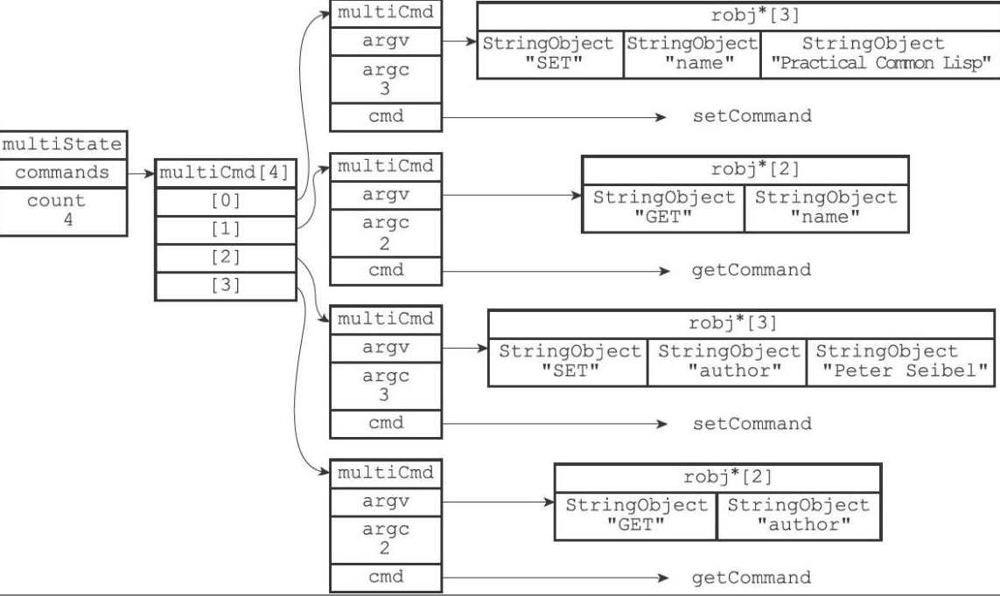
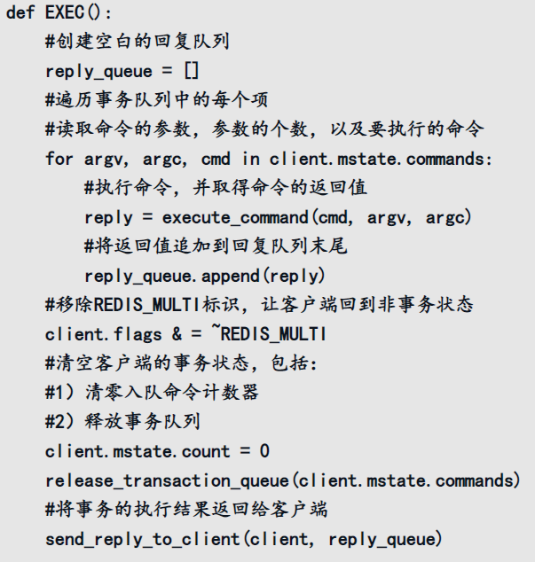

Redis的事务
-----------

Redis通过MULTI、EXEC、WATCH等命令来实现事务（transaction）功能。首先以一个**MULTI命令**为开始，接着将**多个命令放入事务**中，最后由**EXEC命令**将事务提交（commit）给服务器执行

MULTI命令会将客户端切换到事务状态，当客户端发送的命令为EXEC、DISCARD、WATCH、MULTI四个命令的其中一个，那么服务器立即执行这个命令，否则就先将命令入队，等待执行

##### 事务队列

在mutiState中，通过commands指针存放这多个mutiCmd，这些命令以FIFO的方式进行保存

##### EXEC执行逻辑

##### WATCH命令的实现

WATCH命令是一个**乐观锁**（optimistic locking），它可以在EXEC命令执行之前，监视任意数量的数据库键，并在EXEC命令执行时，检查被监视的键是否至少有一个已经被修改过了，如果是的话，服务器将拒绝执行事务，并向客户端返回代表事务执行失败的空回复。

在数据库中watched_keys字典会存储这监控的节点，所有对数据库进行修改的命令，执行后都会调用multi.c/touchWatchKey函数对watched_keys字典进行检查，查看是否有客户端正在监视刚刚被命令修改过的数据库键，如果有的话，那么touchWatchKey函数会将监视被修改键的客户端的REDIS_DIRTY_CAS标识打开，表示该客户端的事务安全性已经被破坏

当服务器接收到一个客户端发来的EXEC命令时，服务器会**根据这个客户端是否打开了REDIS_DIRTY_CAS标识来决定是否执行事务**：

❑如果客户端的REDIS_DIRTY_CAS标识已经被打开，那么说明客户端所监视的键当中，至少有一个键已经被修改过了，在这种情况下，客户端提交的事务已经不再安全，所以服务器会拒绝执行客户端提交的事务。

❑如果客户端的REDIS_DIRTY_CAS标识没有被打开，那么说明客户端监视的所有键都没有被修改过（或者客户端没有监视任何键），事务仍然是安全的，服务器将执行客户端提交的这个事务。

由于<u>**redis是单线程的，Redis的事务总是以串行的方式运行**的</u>，并且事务也总是具有隔离性的，可以保证在执行过程中不被修改，