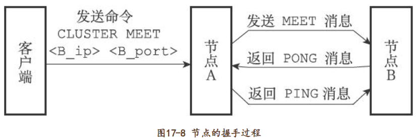

集群通过分片（sharding）来进行数据共享，并提供复制和故障转移功能。集群的**节点**、**槽指派**、**命令执行**、**重新分片**、**转向**、**故障转移**、**消息**

### 节点

添加节点：节点之间通过`CLUSTER MEET <ip><port>`

##### 集群数据结构：

clusterNode结构保存了一个节点的当前状态，比如节点的创建时间、节点的名字、节点当前的配置纪元、节点的IP地址和端口号等等

每个节点都会使用一个clusterNode结构来记录自己的状态，并为集群中的所有其他节点（包括主节点和从节点）都创建一个相应的clusterNode结构，以此来记录其他节点的状态：clusterNode中的clusterLink指针，该结构保存了连接节点所需的有关信息，比如套接字描述符，输入缓冲区和输出缓冲区

redisClient结构和clusterLink结构都有自己的套接字描述符和输入、输出缓冲区，<u>这两个结构的区别在于，redisClient结构中的套接字和缓冲区是用于连接客户端的，而clusterLink结构中的套接字和缓冲区则是用于连接节点的。</u>

每个节点都保存着一个clusterState结构，这个结构记录了在当前节点的视角下，集群目前所处的状态，例如集群是在线还是下线，集群包含多少个节点，集群当前的配置纪元

#####  CLUSTER MEET命令的实现

类似于TCP三次握手

### 槽指派

clusterState结构中的slots数组记录了集群中所有16384个槽的指派信息，如果slots[i]指针指向一个clusterNode结构，那么表示槽i已经指派给了clusterNode结构所代表的节点

##### CLUSTER ADDSLOTS命令的实现

### 在集群中实现命令

如果键所在的槽正好就指派给了当前节点，那么节点直接执行这个命令。

❑如果键所在的槽并没有指派给当前节点，那么节点会向客户端返回一个**MOVED错误**，指引客户端转向（redirect）至正确的节点，并再次发送之前想要执行的命令。

<u>计算键key属于哪个槽return CRC16(key)&16383</u> 

如果clusterState.slots[i]等于clusterState.myself，那么说明槽i由当前节点负责，节点可以执行客户端发送的命令。2）如果clusterState.slots[i]不等于clusterState.myself，那么说明槽i并非由当前节点负责，节点会根据clusterState.slots[i]指向的clusterNode结构所记录的节点IP和端口号，向客户端返回MOVED错误，指引客户端转向至正在处理槽i的节点。

moved错误会返回正确节点的ip，然后继续发送命令去请求另外一个服务器

### 重新分片

重新分片操作可以在线（online）进行，在重新分片的过程中，集群不需要下线，并且源节点和目标节点都可以继续处理命令请求。

Redis集群的重新分片操作是由Redis的集群管理软件redis-trib负责执行的，Redis提供了进行重新分片所需的所有命令，而redis-trib则通过向源节点和目标节点发送命令来进行重新分片操作。

1）redis-trib对目标节点发送CLUSTER SETSLOT＜slot＞IMPORTING＜source_id＞命令，让目标节点准备好从源节点导入（import）属于槽slot的键值对。     

2）redis-trib对源节点发送CLUSTER SETSLOT＜slot＞MIGRATING＜target_id＞命令，让源节点准备好将属于槽slot的键值对迁移（migrate）至目标节点。

3）redis-trib向源节点发送CLUSTER GETKEYSINSLOT＜slot＞＜count＞命令，获得最多count个属于槽slot的键值对的键名（key name）。

4）对于步骤3获得的每个键名，redis-trib都向源节点发送一个MIGRATE＜target_ip＞＜target_port＞＜key_name＞0＜timeout＞命令，将被选中的键原子地从源节点迁移至目标节点。

5）重复执行步骤3和步骤4，直到源节点保存的所有属于槽slot的键值对都被迁移至目标节点为止。每次迁移键的过程如图17-24所示。

6）**redis-trib向集群中的任意一个节点发送CLUSTER SETSLOT＜slot＞NODE＜target_id＞命令**，将槽slot指派给目标节点，这一指派信息会通过消息发送至整个集群，最终集群中的所有节点都会知道槽slot已经指派给了目标节点。

### ASK错误

