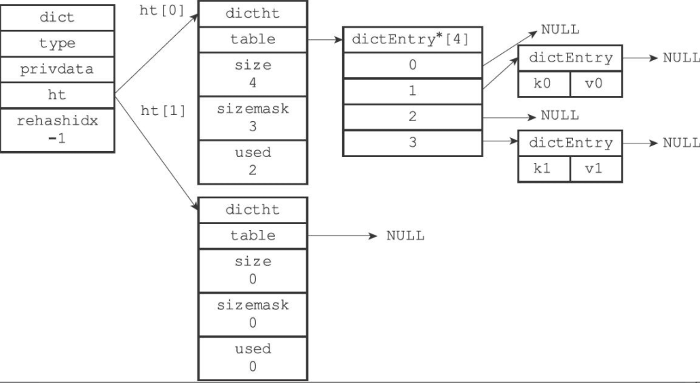
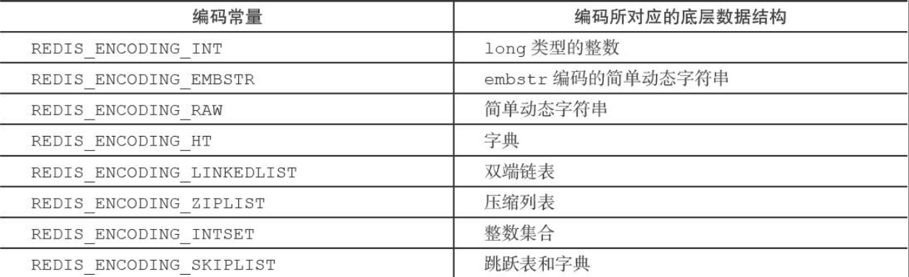
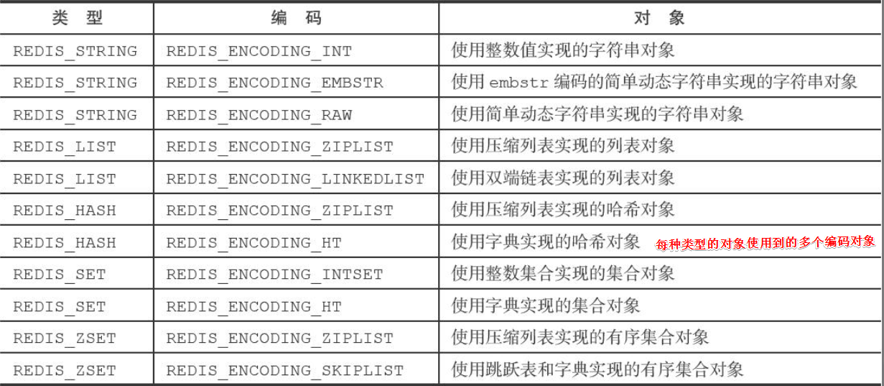
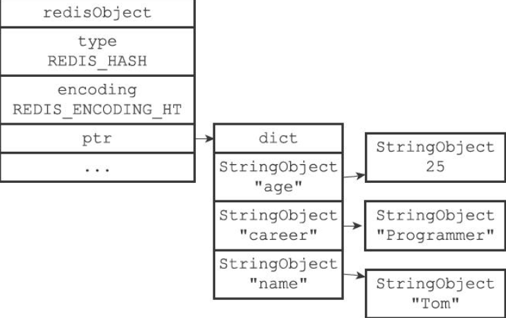

### **Redis底层的数据类型**

数据类型：字符串，*链表，字典*，跳跃表，整数集合，压缩列表，对象

实现的数据结构：字符串，哈希，列表，集合，有序集合

### 1.字符串

##### 1.redis底层实现的字符串SDS 和C语言的区别，SDS的优点。


​	SDS构成：int len已经使用空间，int free未使用空间，char buf []字节数组

>   1.  C字符串不记录长度信息，所以获取一个C字符串的长度，程序必须遍历整个字符串，复杂度为O（N）而SDS为O(1)
>   2.  SDS杜绝了发生缓冲区溢出的可能性：当需要对SDS进行修改时，API会先检查SDS的空间是否满足所需的要求，如果不满足，API自动将SDS的空间进行扩展，然后执行实际的修改操作。
>   3.  使用len来记录目前已有的长度，避免了字符串碰到\0,提前结束遍历，保证二进制安全问题。
>   4.  兼容部分c字符串函数

##### 2. 字符串SDS内存分配策略：

​	通过未使用空间，SDS实现了空间预分配和惰性空间释放两种优化策略。

***空间预分配：***

	1. 如果分配后SDS的长度小于1mb，则程序分配和len属性同样大小的未使用空间
	2. 如果大于1mb，则会分配固定1mb的未使用空间。

***惰性空间释放***：

​		当我们缩短字符串时，我们并不真正的执行内存重分配来回收空间，而是将其放入free中，等待下次使用

### 2.链表

当一个列表键**包含了数量比较多的元素**，又或者列表中包含的元素都**是比较长的字符串时**，Redis就会使用链表作为列表键的底层实现。

链表节点：ListNode{prev，next,value}；

list表示链表，有头尾结点head和tail，复制函数dup，释放函数free,对比函数match，list包含多个listnode节点。

### 3.字典

一种用于保存键值对（key-value pair）的抽象数据结构，类似于Map。而Redis的字典使用哈希表作为底层实现，一个哈希表里面可以有多个哈希表节点，而每个哈希表节点就保存了字典中的一个键值对。类似于Java的HashMap.

***字典的具体实现:***

字典由hash表(table,size总大小,sizemask计算索引值,used已经使用的大小)实现，hash表有多个hash节点（key表示健,union值,next下一个节点）

字典的数据结构组成：

```c++
Struct dict{ 
	 //类型特定函数
	 dictType *type；
	 //私有数据
	 void *privatedata;
	 //ht属性是一个包含两个项的数组，数组中的每个项都是一个dictht哈希表，一般情况下，字典只使用ht[0]哈希表，ht[1]哈希表只会在对ht[0]哈希表进行rehash时使用。
	 dictht ht[2];
	 int rehashidx// 记录了rehash目前的进度，如果目前没有在进行rehash，那么它的值为-1
}dict
```



***字典的应用场景：***数据库和哈希键，用作数据库的底层实现时，或哈希键的底层实现时，MurmurHash2算法来计算键的哈希值。

***字典的Hash计算：***

	1. 先使用HashFunction（key）计算hash值，
	2. 在使用Hash&sizemask计算索引值

字典被用作**数据库的底层实现**，或者**哈希键的底层实现**时，Redis使用**MurmurHash2算法**来计算键的哈希值。

***键冲突问题：***redis使用链地址法解决。

***rehash操作：***

​	为了保证哈希表的效率，当哈希表保存的键值对数量太多或者太少时，程序需要对哈希表的大小进行相应的**扩展或者收缩**

1.  为字典的ht[1]哈希表分配空间，执行的是扩展操作，ht[1]大小为第一个大于等于ht[0].used*2的2 n（2的n次方幂），如果执行的是收缩操作，那么ht[1]的大小为第一个大于等于ht[0].used的2 n;
2.  将保存在ht[0]中的所有键值对rehash到ht[1]上面：重新计算索引，放到ht[1]上；
3.  将ht[1]变为ht[0]

当以下条件中的任意一个被满足时，程序会自动开始对哈希表执行扩展操作：

1）服务器目前没有在执行BGSAVE命令或者BGREWRITEAOF命令，并且哈希表的负载因子大于等于1。

2）服务器目前**正在执行BGSAVE命令或者BGREWRITEAOF命令**，并且哈希表的**负载因子大于等于5**。（load_factor =used/size）

3) 当哈希表的负载因子小于0.1时，程序自动开始对哈希表执行收缩操作。

***渐进式rehash***:

索引计数器变量rehashidx初始为0, rehashidx来记录已经rehash的个数，逐渐增加，hash完成后rehashidx设为-1

此外：**渐进式rehash的过程中，字典会使用两个哈希表，所以渐进式rehash期间，字典的删除（delete）、查找（find）、更新（update）等操作会在两个哈希表上进行**，新添加到字典的键值对一律会被保存到ht[1]里面，而ht[0]则不再进行任何添加操作。

### 4.跳跃表

跳跃表（skiplist）是一种有序数据结构，它通过在每个节点中维持多个指向其他节点的指针，从而达到快速访问节点的目的

支持平均O（logN）、最坏O（N）复杂度的节点查找，还可以通过顺序性操作来批量处理节点，效率可以和平衡树相媲美，并且实现较简单。如果一个有序集合包含的元素数量比较多，又或者有序集合中元素的成员（member）是比较长的字符串时，Redis就会使用跳跃表来作为有序集合键的底层实现。

Redis的跳跃表实现由**zskiplist和zskiplistNode**两个结构组成，其中zskiplist用于保存跳跃表信息（比如表头节点、表尾节点、长度），而zskiplistNode则用于表示跳跃表节点。zskiplistNode由前进指针，跨度，后退指针，分值，成员对象（一个指针指向字符串对象）。

### 5.整数集合

整数集合（intset）是集合键的底层实现之一，当一个集合只包含整数值元素，并且这个集合的元素数量不多时，Redis就会使用整数集合作为集合键的底层实现。

集合中元素**从小到大进行排列**，并且**不会重复**

***四个属性：***

❑encoding属性的值为INTSET_ENC_INT64，表示整数集合的底层实现为int64_t类型的数组，而数组中保存的都是int64_t类型的整数值。

❑length属性的值为4，表示整数集合包含四个元素。

❑contents数组按从小到大的顺序保存着集合中的四个元素。

❑因为每个集合元素都是int64_t类型的整数值，所以contents数组的大小为sizeof（int64_t）*4=64*4=256位

***集合升级操作***：

当加入元素比整数集合当前所有元素的类型都要长时，需要对集合进行升级，对底层数组空间进行重分配，再将每个元素移到对应位置上，将encoding，length属性进行更改。

***升级的好处：***

1.  提高灵活性，可以随机将不同大小的值加入到整数集合中，不用担心错误。

2.  节约内存

***降级操作***：不支持降级，一旦升上去了就不会降回来。

### 压缩列表

压缩列表（ziplist）是列表键和哈希键的底层实现之一。当一个列表键只包含少量列表项，并且每个列表项要么就是小整数值，要么就是长度比较短的字符串，那么Redis就会使用压缩列表来做列表键的底层实现。

构成：zlbytes表示压缩列表总长。zltail表明起始地址+zltail的值就可以得到为节点的地址。zllen表示压缩列表包含多少节点。

每个压缩列表节点可以保存**一个字节数组**或者**一个整数值**，都是由previous_entry_length、encoding、content三个部分组成

***previous_entry_length***属性以字节为单位，记录了压缩列表中前一个节点的长度。previous_entry_length属性的长度可以是1字节或者5字节：**前一节点的长度**小于254字节，则为1字节；如果大于254字节，则previous_entry_length长度为5字节。通过这个属性我们可以得到前一个节点的地址，这样我们就可以从表尾向表头进行遍历。

***encoding***：属性记录了节点的content属性所保存数据的类型以及长度；

***content***属性负责保存节点的值，节点值可以是一个字节数组或者整数，值的类型和长度由节点的encoding属性决定。

***连锁更新的操作：***

添加新节点到压缩列表，或者从压缩列表中删除节点，可能会导致previous_entry_length从1字节变为5字节，然后导致节点超过254字节，再次引发后面的节点previous_entry_length值变化，导致的连续扩张或者收缩，会引发连锁更新操作，但这种操作出现的几率并不高

-------------------------------------------

### 对象

前面我们介绍了Redis的基本数据结构：**SDS字符串**，**双端链表**，**字典**，**压缩列表**，**整数集合**。但Redis并没有直接使用这些数据结构来实现键值对数据库，而是基于这些数据结构创建了一个<u>对象系统</u>，这个系统包含**字符串对象**、**列表对象**、**哈希对象**、**集合对象**和**有序集合对象**这五种类型的对象

Redis的对象系统还实现了**基于引用计数技术的内存回收机制**，当程序不再使用某个对象的时候，这个对象所占用的内存就会被自动释放；另外，Redis还通过引用计数技术实现了**对象共享机制**，这一机制可以在适当的条件下，通过让多个数据库键共享同一个对象来<u>节约内存</u>。

Redis的对象带有**访问时间记录信息**，该信息可以用于<u>计算数据库键的空转时长</u>，在服务器启用了maxmemory功能的情况下，空转时长较大的那些键可能会优先被服务器删除。

Redis中的每个对象都由一个**redisObject结构**表示，该结构中和保存数据有关的三个属性分别是**type属性**、encoding属性和**ptr属性**；

***type属性:***type指向Redis的值对象的数据结构；

***encoding***属性记录了对象所使用的编码，也即是说这个对象使用了什么数据结构作为对象的底层实现；

下图为常用的编码方式，每个类型对象使用了两种不同的编码，





Redis可以根据不同的使用场景来为一个对象设置不同的编码，从而优化对象在某一场景下的效率

##### 字符串对象

字符串对象的编码可以是**int、raw或者embstr**。

如果一个字符串对象保存的是整数值，并且这个整数值可以用long类型来表示，则此字符串对象的编码设置为int。

若字符串长度大于32，使用**raw**来编码

小于32使用emstr来编码，保存短字符串

***raw和emstr编码的区别：***

​	embstr编码是专门用于保存短字符串的一种优化编码方式，这种编码和raw编码一样，都使用redisObject结构和sdshdr结构来表示字符串对象，但raw编码会调用两次内存分配函数来分别创建redisObject结构和sdshdr结构，而embstr编码则通过调用一次内存分配函数来分配一块连续的空间，空间中依次包含redisObject和sdshdr两个结构。

***embstr编码的优势：***

​	❑embstr编码将创建字符串对象所需的内存分配次数从raw编码的**两次降低为一次**。

​    ❑释放embstr编码的字符串对象只需要调用一次内存释放函数，而释放raw编码的字符串对象需要**调用两次内存释放函数**。			❑因为embstr编码的字符串对象都保存在连续的内存里，这种编码的字符串对象能够更好地**利用缓存带来的优势**

##### 列表对象

使用ziplist或者linkedlist作为底层实现，

==如何选择编码？==

1.  列表对象保存的元素的长度小于64字节;

2.  列表对象保存的元素数量小于512个；不能满足这两个条件的列表对象需要使用linkedlist编码。

##### 哈希对象

使用ziplist或者hashtable作为底层编码，

***使用压缩列表怎么存储的？***

​	

使用hashtable怎么存储的？

​	


当哈希对象可以同时满足以下两个条件时，哈希对象使用ziplist编码：

1.  哈希对象保存的所有键值对的键和值的字符串长度都==小于64字节==；
2.  哈希对象保存的键值对数量==小于512个==；不能满足这两个条件的哈希对象需要使用hashtable编码。·

##### 集合对象

集合对象的编码可以是**intset（整数集合）或者hashtable（字符串）**。

当集合对象可以同时满足以下两个条件时，对象使用intset编码：❑集合对象保存的所有元素都是==整数值==；❑集合对象保存的元素数量==不超过512个==

##### 有序集合对象

有序集合的编码是**ziplist**或者**skiplist（zset）**。

当有序集合对象可以同时满足以下两个条件时，对象使用ziplist编码：❑有序集合保存的元素数量==小于128个==；❑有序集合保存的所有元素成员的长度都==小于64字节==

***为什么有序集合需要同时使用跳跃表和字典来实现？***效率问题

##### redis的类型检查

其中一种命令可以对任何类型的键执行，比如说**DEL命令、EXPIRE命令、RENAME命令、TYPE命令、OBJECT命令**

而另一种命令只能对特定类型的键执行，比如说：

❑SET、GET、APPEND、STRLEN等命令只能对字符串键执行；

❑HDEL、HSET、HGET、HLEN等命令只能对哈希键执行；

❑RPUSH、LPOP、LINSERT、LLEN等命令只能对列表键执行；

❑SADD、SPOP、SINTER、SCARD等命令只能对集合键执行；

❑ZADD、ZCARD、ZRANK、ZSCORE等命令只能对有序集合键执行；

在执行命令之前，会根据redisObject结构type属性先进行类型检查，正确才会执行，错误则会报错。

还会根据底层编码方式进行命令选择，大部分执行命令数多态的，可以根据具体的编码方式，执行不同的命令。

DEL、EXPIRE等命令和LLEN等命令的区别在于，前者==是基于类型的多态==——一个命令可以同时用于处理多种不同类型的键，而后者是==基于编码的多态==——一个命令可以同时用于处理多种不同编码。

##### redis内存回收

基于引用计数器，在适当的时候自动释放对象并进行内存回收。

引用计数信息由redisObject结构的**refcount属性记录**

##### 对象共享

在Redis中，让多个键共享同一个值对象需要执行以下两个步骤：

1）将数据库键的值指针指向一个现有的值对象；

2）将被共享的值对象的引用计数增一。

Redis会共享值为0到9999的字符串对象，下次有需要就可以直接返回，不用重新创建。

***为什么Redis不共享包含字符串的对象？***

​	 因为如果想要共享字符串，则需要判断字符串相同，而判断字符串相等的时间复杂度是非常高的，整数值的时间复杂度为O(1),而字符串为O(n)

##### 空转时长

redisObject结构包含的最后一个属性为**lru属性**，该属性记录了**对象最后一次被命令程序访问的时间**

如果服务器打开了maxmemory选项，并且服务器用于回收内存的算法为volatile-lru或者allkeys-lru，那么当服务器占用的内存数超过了maxmemory选项所设置的上限值时，空转时长较高的那部分键会优先被服务器释放，从而回收内存