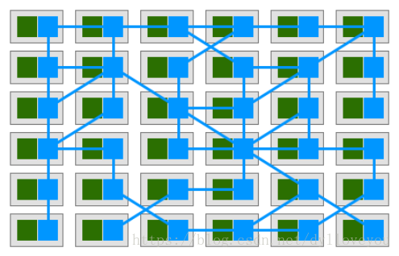

>   分布式，云原生，Spring cloud，微服务，Service Mesh，DevOps, kubernetes,Docker,ServiceLess，Restful api

### 微服务1.0时代

SOA（面向服务的体系结构）10年前引入国内，其是一种粗粒度、松耦合服务架构，服务之间通过简单、精确定义接口进行通讯，之后引入了Dubbo，开启了服务治理。

2011年10月27日，阿里巴巴开源了自己的SOA服务化治理方案的核心框架Dubbo，服务治理和SOA的设计理念开始逐渐在国内软件行业中落地，并被广泛应用。

Dubbo作为一个分布式服务框架，以及SOA治理方案，Dubbo其功能主要包括：高性能NIO通讯及多协议集成，服务动态寻址与路由，软负载均衡与容错，依赖分析与服务降级等。Dubbo最大的特点是按照分层的方式来架构，使用这种方式可以使各个层之间解耦合（或者最大限度地松耦合）

Dubbo 3.0将以Streaming为内核，不再是Dubbo时代的RPC，但是RPC会在Dubbo 3.0中变成远程Streaming对接的一种可选形态。Dubbo 3.0将支持可选Service Mesh，多加一层IPC，这主要是为了兼容老系统，而内部则会优先尝试内嵌模式

但是Dubbo只能算是一个服务治理框架，而不能算是一个微服务框架，并不能形成一个完整的微服务架构体系，而Spring Cloud则通过集成众多的组件的形式实现了相对完整的微服务技术栈

Spring Cloud是基于Spring Boot进行的开发，因此使用Spring Cloud就必须使用到Spring Boot。

Spring Cloud中有的组件：

>   ●  Eureka：服务注册中心，一个基于REST的服务，用于定位服务，以实现微服务架构中服务发现和故障转移。
>   		● Hystrix：熔断器，容错管理工具，旨在通过熔断机制控制服务和第三方库的节点,从而对延迟和故障提供更强大的容错能力。
>   		● Turbine：Turbine是聚合服务器发送事件流数据的一个工具，用来监控集群下Hystrix的Metrics情况。
>   		● Zuul：API网关，Zuul是在微服务中提供动态路由、监控、弹性、安全等边缘服务的框架。
>   		● Ribbon：提供微服务中的负载均衡功能，有多种负载均衡策略可供选择，可配合服务发现和断路器使用。
>   		● Feign：Feign是一种声明式、模板化的HTTP客户端。
>   		● Spring Cloud Config：配置管理工具包，让你可以把配置放到远程服务器，集中化管理集群配置，目前支持本地存储、Git以及Subversion。
>   		● Spring Cloud Security：基于Spring Security的安全工具包，为微服务的应用程序添加安全控制。
>   		● Spring Cloud Sleuth：日志收集工具包，封装了Dapper和log-based追踪以及Zipkin和HTrace操作，为SpringCloud应用实现了一种分布式追踪解决方案。
>
>   除了上面介绍的基础组件外，常见的Spring Cloud组件还有非常多种，涉及到了微服务以及应用开发的方方面面：
>   		● Spring Cloud Starters：Spring Boot式的启动项目，为Spring Cloud提供开箱即用的依赖管理。
>   		● Archaius：配置管理API，包含一系列配置管理API，提供动态类型化属性、线程安全配置操作、轮询框架、回调机制等功能。
>   		● Consul：封装了Consul操作，Consul是一个服务发现与配置工具，与Docker容器可以无缝集成。
>   		● Spring Cloud Stream：数据流操作开发包，封装了与Redis,Rabbit、Kafka等发送接收消息。
>   		● Spring Cloud CLI：基于 Spring Boot CLI，可以让你以命令行方式快速建立云组件。
>   		● Spring Cloud Task：提供云端计划任务管理、任务调度。
>   		● Spring Cloud Bus：事件、消息总线，用于在集群（例如，配置变化事件）中传播状态变化，可与Spring Cloud Config联合实现热部署。
>   		● Spring Cloud Data Flow：大数据操作工具，作为Spring XD的替代产品，它是一个混合计算模型，结合了流数据与批量数据的处理方式。
>   		● Spring Cloud Zookeeper：操作Zookeeper的工具包，用于使用zookeeper方式的服务发现和配置管理。
>   		● Spring Cloud Connectors：便于云端应用程序在各种PaaS平台连接到后端，如：数据库和消息代理服务。

从上面可以看到Spring Cloud组件多如牛毛，学习成本比较高，并且代码侵入性较强，而且只支持Java语言，无法支持其他语言开发的系统

所以就有了微服务2.0

### 微服务2.0时代

Service Mesh的概念则是在2016年左右提出，在Service Mesh架构中，给每一个微服务实例部署一个Sidecar Proxy。该Sidecar Proxy负责接管对应服务的入流量和出流量，并将微服务架构中的服务订阅、服务发现、熔断、限流、降级、分布式跟踪等功能从服务中抽离到该Proxy中。

Sidecar以一个独立的进程启动，可以每台宿主机共用同一个Sidecar进程，也可以每个应用独占一个Sidecar进程。所有的服务治理功能，都由Sidecar接管，应用的对外访问仅需要访问Sidecar即可。当该Sidecar在微服务中大量部署时，这些Sidecar节点自然就形成了一个服务网格。

第一代的Service Mesh的代表为Linkerd和Envoy。Linkerd基于Twitter的Fingle，使用Scala编写，Envoy底层基于C++，性能上优于使用Scala的Linkerd

第二代Service Mesh主要改进集中在更加强大的控制面功能，典型代表有**Istio和Conduit**。Istio是Google、IBM和Lyft合作的开源项目，是目前最主流的Service Mesh方案，也是事实上的第二代Service Mesh标准。在Istio中，直接把Envoy作为Sidecar。除了Sidecar，Istio中的控制面组件都是使用Go语言编写。

Istio版本存在的不足：

*   目前的Istio大部分能力与Kubernetes是强关联的。而我们在构建微服务的时候往往是希望服务层与容器层是解耦的，服务层在设计上需要能够对接多种容器层平台。
*   Istio至今未有稳定版本，截至本文编写时为止，Istio的最新版本为0.8版本，预计在2018年内会发布1.0版本，目前(2022年4月)已经更新到了1.9

##### ServiceLess

**ServiceLess无服务器架构 = Fass负责计算+Bass负责存储**

优点：入门门槛低(各个云服务厂商都提供了丰富的示例),无主机(服务器厂商会自动帮你处理所以的升级，也不需要关心，代码运行在哪里),无状态（运行代码的计算容器将由平台自动创建和销毁）, 弹性（资源随着使用的增多而增多，如果使用减少，则资源会被回收）,分布式（Distributed）事件驱动（Event-driven）

缺点：

1.   严重依赖云平台厂商，每个平台提供的Fass接口不同，我们很难在不同云平台厂商之前进行系统迁移
2.   开发调试困难
3.   底层硬件不确定 

### DevOps, kubernetes,Docker的关系

##### 容器编排

