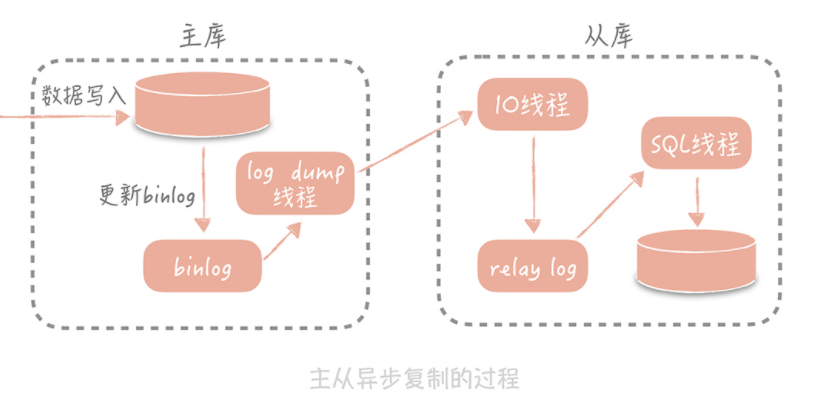
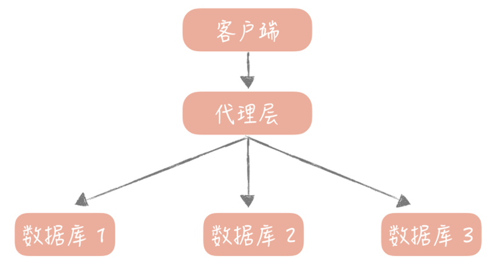

### **1.池化技术**

**数据库连接池：**数据库建立连接需要经过TCP/IP三次握手，四次挥手，所以如果每一个请求都建立一个连接，那将非常耗时，所以我么可以再数据库启动时（根据**最小连接数和最大连接数**）建立一定数量连接，使用完毕后再归还给数据库连接池。如果当发现某个连接出现问题，则丢弃，在重新申请一个连接

**线程池：**JDK 1.5 中引入的 ThreadPoolExecutor 就是一种线程池的实现，它有两个重要的参数：coreThreadCount 和 maxThreadCount，这两个参数需要设置合适，否则可能会出现任务处理较慢的情况。而且任务队列**不要设置为无界队列**

总结：

- 池子的最大值和最小值的设置很重要，初期可以依据经验来设置，后面还是需要根据实际运行情况做调整。
- 池子中的对象需要在使用之前预先初始化完成，这叫做**池子的预热**，比方说使用线程池时就需要预先初始化所有的核心线程。如果池子未经过预热可能会导致系统重启后产生比较多的慢请求。
- 池化技术核心是一种**空间换时间优化方法**的实践，所以要关注空间占用情况，避免出现空间过度使用出现内存泄露或者频繁垃圾回收等问题。

### **2.主从读写分离**

两个问题：

1. 一个是数据的拷贝，我们称为**主从复制**；
2. 如何**屏蔽主从分离带来的访问数据库方式的变化**，像是在使用单一数据库一样

##### 主从复制

**主从复制的过程是这样的：**首先从库在连接到主节点时会创建一个 IO 线程，用以请求主库更新的 binlog，并且把接收到的 binlog 信息写入一个叫做 relay log 的日志文件中，而主库也会创建一个 log dump 线程来发送 binlog 给从库；同时，从库还会创建一个 SQL 线程读取 relay log 中的内容，并且在从库中做回放，最终实现主从的一致性。这是一种比较常见的主从复制方式。



**无限制地增加从库的数量就可以抵抗大量的并发呢？**随着从库数量增加，从库连接上来的 IO 线程比较多，主库也需要创建同样多的 **log dump 线程**来处理复制的请求，对于主库资源消耗比较高，同时受限于主库的网络带宽，所以在实际使用中，一般一个**主库最多挂 3～5 个从库**

##### **主从延迟的读写不一致怎么解决呢？**

因为我们查询都是从库上查询，而在主库上进行写入。

**第一种方案是数据的冗余。**你可以在发送消息队列时不仅仅发送微博 ID，而是发送队列处理机需要的所有微博信息，借此避免从数据库中重新查询数据。

**第二种方案是使用缓存。**我可以在同步写数据库的同时，也把微博的数据写入到 Memcached 缓存里面，这样队列处理机在获取微博信息的时候会优先查询缓存，这样也可以保证数据的一致性。

**最后一种方案是查询主库。**我可以在队列处理机中不查询从库而改为查询主库。不过，这种方式使用起来要慎重，要明确查询的量级不会很大，是在主库的可承受范围之内，否则会对主库造成比较大的压力。

##### 主从分离后如何访问数据库

**为了降低实现的复杂度，业界涌现了很多数据库中间件来解决数据库的访问问题，这些中间件可以分为两类**

第一类以**淘宝的 TDDL（ Taobao Distributed Data Layer）为代表，以代码形式内嵌运行在应用程序内部**。你可以把它看成是一种数据源的代理，它的配置管理着多个数据源，每个数据源对应一个数据库，可能是主库，可能是从库。当有一个数据库请求时，中间件将 SQL 语句发给某一个指定的数据源来处理，然后将处理结果返回。

这一类中间件的优点是简单易用，没有多余的部署成本，因为它是植入到应用程序内部，与应用程序一同运行的，所以比较适合运维能力较弱的小团队使用；缺点是缺乏多语言的支持，

另一类是**单独部署的代理层方案**，这一类方案代表比较多，如早期阿里巴巴开源的 Cobar，基于 Cobar 开发出来的 Mycat，360 开源的 Atlas，美团开源的基于 Atlas 开发的 DBProxy 等等。

这一类中间件部署在独立的服务器上，业务代码如同在使用单一数据库一样使用它，实际上它内部管理着很多的数据源，当**有数据库请求时，它会对 SQL 语句做必要的改写，然后发往指定的数据源**。



### 3.分库分表

###  分库分表

https://segmentfault.com/a/1190000023914691

遇到的问题：用户请求量太大（负载均衡到多个服务器上，）单库太大（切分成更多更小的库）单表太大（索引膨胀，查询超时 解决方法：切分成多个数据集更小的表）

又分为：**垂直切分**和**水平切分**

##### **垂直切分：**

按照业务类型来拆分，核心思想是**专库专用**，将业务耦合度比较高的表拆分到单独的库中

**垂直分表：**因为**表多而数据多**，使用垂直切分，根据业务切分成不同的库。也就是“大表拆小表”，基于列字段进行的。一般是表中的字段较多，将不常用的， 数据较大，长度较长（比如text类型字段）的拆分到“扩展表“。 一般是针对那种几百列的大表，也避免查询时，数据量太大造成的“跨页”问题。

**垂直分库：**如果放在一个数据库服务器上， 随着用户量增大，这会让单个数据库的处理能力成为瓶颈，还有单个服务器的磁盘空间，内存，tps等非常吃紧。 所以我们要拆分到多个服务器上，放在不同的服务器上缓解压力

##### **水平切分**

水平分表：针对数据量巨大的单张表（比如订单表），按照某种规则（RANGE,HASH取模，实践等），切分到多张表里面去。 但是这些表还是在同一个库中，所以库级别的数据库操作还是有IO瓶颈。

水平分库分表：将单张表的数据切分到多个服务器上去，每个服务器具有相应的库与表，只是表中数据集合不同。 水平分库分表能够有效的缓解单机和单库的性能瓶颈和压力，突破IO、连接数、硬件资源等的瓶颈。

**缺点：**跨分片的事务一致性难以保证，跨库的join关联查询性能较差，数据多次扩展难度和维护量极大

### 分库分表后的全局id：发号器

[UUID和雪花算法](https://jasonkayzk.github.io/2020/02/09/UUID%E7%94%9F%E6%88%90%E7%AE%97%E6%B3%95-UUID%E8%BF%98%E6%98%AFsnowflake/)

|                       | 描述                                         | 优点                                                         | 缺点                                                         |
| --------------------- | -------------------------------------------- | ------------------------------------------------------------ | ------------------------------------------------------------ |
| UUID                  | 通过一行代码生成的16位字符串                 | 生成足够简单，本地生成无网络消耗，具有唯一性                 | 1.不具备自增特性不好存储。2.长度过长，占用较大空间，3.非递增所以索引效率低下 |
| 数据库自增id          |                                              | 实现简单，ID单调自增，数值类型查询速度快                     | 1.高并发场景，2.分库分表，需要改造3，自增数据量泄露          |
| 号段模式              | 每个数据库号段对应一个范围，生成对应范围的id | 不强依赖于数据库，不会频繁的访问数据库，对数据库的压力小很多 |                                                              |
| Redis自增id           | 利用`redis`的 `incr`命令实现ID的原子性自增   | 性能好                                                       | 数据丢失，自增数据量泄露                                     |
| 雪花算法（SnowFlake） | 经典的分布式id生成算法                       | 不依赖外部组件，性能好                                       | 时钟回拨                                                     |
|                       |                                              |                                                              |                                                              |

```java
/**
 * Twitter的SnowFlake算法,使用SnowFlake算法生成一个整数，然后转化为62进制变成一个短地址URL
 * https://github.com/beyondfengyu/SnowFlake
 */
public class SnowFlakeShortUrl {
    /**
     * 起始的时间戳
     */
    private final static long START_TIMESTAMP = 1480166465631L;
    /**
     * 每一部分占用的位数
     */
    private final static long SEQUENCE_BIT = 12;   //序列号占用的位数
    private final static long MACHINE_BIT = 5;     //机器标识占用的位数
    private final static long DATA_CENTER_BIT = 5; //数据中心占用的位数
    /**
     * 每一部分的最大值
     */
    private final static long MAX_SEQUENCE = -1L ^ (-1L << SEQUENCE_BIT);
    private final static long MAX_MACHINE_NUM = -1L ^ (-1L << MACHINE_BIT);
    private final static long MAX_DATA_CENTER_NUM = -1L ^ (-1L << DATA_CENTER_BIT);
    /**
     * 每一部分向左的位移
     */
    private final static long MACHINE_LEFT = SEQUENCE_BIT;
    private final static long DATA_CENTER_LEFT = SEQUENCE_BIT + MACHINE_BIT;
    private final static long TIMESTAMP_LEFT = DATA_CENTER_LEFT + DATA_CENTER_BIT;
    private long dataCenterId;  //数据中心
    private long machineId;     //机器标识
    private long sequence = 0L; //序列号
    private long lastTimeStamp = -1L;  //上一次时间戳
    private long getNextMill() {
        long mill = getNewTimeStamp();
        while (mill <= lastTimeStamp) {
            mill = getNewTimeStamp();
        }
        return mill;
    }
    private long getNewTimeStamp() {
        return System.currentTimeMillis();
    }
    /**
     * 根据指定的数据中心ID和机器标志ID生成指定的序列号
     *
     * @param dataCenterId 数据中心ID
     * @param machineId    机器标志ID
     */
    public SnowFlakeShortUrl(long dataCenterId, long machineId) {
        if (dataCenterId > MAX_DATA_CENTER_NUM || dataCenterId < 0) {
            throw new IllegalArgumentException("DtaCenterId can't be greater than MAX_DATA_CENTER_NUM or less than 0！");
        }
        if (machineId > MAX_MACHINE_NUM || machineId < 0) {
            throw new IllegalArgumentException("MachineId can't be greater than MAX_MACHINE_NUM or less than 0！");
        }
        this.dataCenterId = dataCenterId;
        this.machineId = machineId;
    }
    /**
     * 产生下一个ID
     *
     * @return
     */
    public synchronized long nextId() {
        long currTimeStamp = getNewTimeStamp();
        if (currTimeStamp < lastTimeStamp) {
            throw new RuntimeException("Clock moved backwards.  Refusing to generate id");
        }
        if (currTimeStamp == lastTimeStamp) {
            //相同毫秒内，序列号自增
            sequence = (sequence + 1) & MAX_SEQUENCE;
            //同一毫秒的序列数已经达到最大
            if (sequence == 0L) {
                currTimeStamp = getNextMill();
            }
        } else {
            //不同毫秒内，序列号置为0
            sequence = 0L;
        }
        lastTimeStamp = currTimeStamp;
        return (currTimeStamp - START_TIMESTAMP) << TIMESTAMP_LEFT //时间戳部分
                | dataCenterId << DATA_CENTER_LEFT       //数据中心部分
                | machineId << MACHINE_LEFT             //机器标识部分
                | sequence;                             //序列号部分
    }
    public static void main(String[] args) {
        SnowFlakeShortUrl snowFlake = new SnowFlakeShortUrl(2, 3);

        for (int i = 0; i < (1 << 4); i++) {
            //10进制
            System.out.println(snowFlake.nextId());
        }
    }
}
```

### Sql和NoSql互补

- Redis、LevelDB 这样的 KV 存储。这类存储相比于传统的数据库的优势是极高的读写性能，一般对性能有比较高的要求的场景会使用。
- Hbase、Cassandra 这样的列式存储数据库。这种数据库的特点是数据不像传统数据库以行为单位来存储，而是以列来存储，适用于一些离线数据统计的场景。
- 像 MongoDB、CouchDB 这样的文档型数据库。这种数据库的特点是 Schema Free（模式自由），数据表中的字段可以任意扩展，比如说电商系统中的商品有非常多的字段，并且不同品类的商品的字段也都不尽相同，使用关系型数据库就需要不断增加字段支持，而用文档型数据库就简单很多了。

在 NoSQL 数据库刚刚被应用时，它被认为是可以替代关系型数据库的银弹，在我看来，也许因为以下几个方面的原因：

- 弥补了传统数据库在性能方面的不足；
- 数据库变更方便，不需要更改原先的数据结构；
- 适合互联网项目常见的大数据量的场景；

##### 使用 NoSQL 提升写入性能

很多 NoSQL 数据库都在使用的**基于 LSM 树的存储引擎**

它的思想很简单，数据首先会写入到一个叫做 MemTable 的内存结构中，在 MemTable 中数据是按照写入的 Key 来排序的。为了防止 MemTable 里面的数据因为机器掉电或者重启而丢失，一般会通过写 Write Ahead Log 的方式将数据备份在磁盘上。

MemTable 在累积到一定规模时，它会被刷新生成一个新的文件，我们把这个文件叫做 SSTable（Sorted String Table）。当 SSTable 达到一定数量时，我们会将这些 SSTable 合并，减少文件的数量，因为 SSTable 都是有序的，所以合并的速度也很快。

当从 LSM 树里面读数据时，我们首先从 MemTable 中查找数据，如果数据没有找到，再从 SSTable 中查找数据。因为存储的数据都是有序的，所以查找的效率是很高的，只是因为数据被拆分成多个 SSTable，所以读取的效率会低于 B+ 树索引。

##### Nosql的优势

1. 在性能方面，NoSQL 数据库使用一些算法将对磁盘的随机写转换成顺序写，提升了写的性能；

2. 在某些场景下，比如全文搜索功能，关系型数据库并不能高效地支持，需要 NoSQL 数据库的支持；

3. 在扩展性方面，NoSQL 数据库天生支持分布式，支持数据冗余和数据分片的特性。