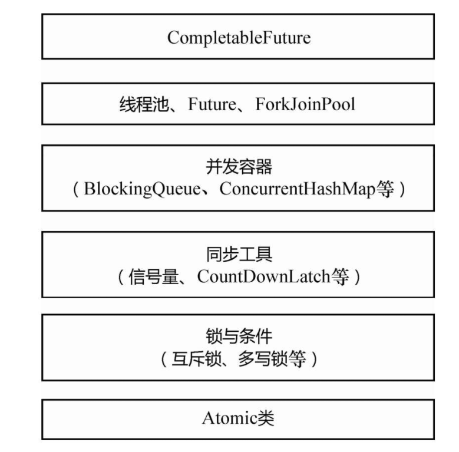

[TOC]




#### 1. 用那种方式创建线程最好

1. 通过继承Thread类，重写run方法；
2. 通过实现runable接口；

#### 2. 指令的重排序


#### 3. 创建线程的多种方式

实现runnable,集成thread，定时器，匿名内部类，Lamdba表达式，callable,FutureTask

#### 4. start和run启动线程的区别

- start() 方法会启动一个新的线程，以及线程的一些准备工作(状态检查，加入通知线程组)，然后 Java 虚拟机==有空就会==调用此线程的 run() 方法；**并不立即执行**。不能多次执行start
  1. 首先检查线程状态 threadStatus 是否为 0，0 状态代表线程的 “NEW” 状态，不为 0 会抛出 IllegalThreadStateException 异常；
  2. 将线程加入线程组；
  3. 然后调用一个 native 类型的 start0() 方法，此方法会在 JVM 中调用此线程的 run() 方法，使线程进入 READY 状态；

- run() 方法是直接执行 Runnable 对象的 run() 方法，是 main 线程下的一个普通线程，并不是多线程执行；

#### 5. 怎么停止线程

**普通情况**：设置interrupt中断，并通过isinterrupted去循环判断

**正在sleep时候中断**：会抛出异常，sleep外有try catch会响应中断，

**while内try catch问题**：程序会抛出错误信息，然后继续进行循环，另外，程序抛出异常后，interrupt中断标志位就会被置为false，所以我们如果需要isinterrupted来判断的话，需要try catch后重新进行设置中断。

**正确停止线程的方法：**传递中断(将异常向上抛出，由调用方去处理这个异常)，恢复中断(重新置中断)

错误的停止方法：1. stop,suspend ,resume ( 破坏完整的代码逻辑，破坏原子操作) 2. 用volatile 设置标志位（当线程阻塞时，可能执行不到判断volatile 关键字的那部分代码）

#### sleep() VS wait()

1. sleep()方法是Thread的静态方法，而wait是Object实例方法
2. wait()方法必须要在同步方法或者同步块中调用，也就是必须已经获得对象锁。而sleep()方法没有这个限制可以在任何地方种使用。另外，wait()方法会释放占有的对象锁，使得该线程进入等待池中，等待下一次获取资源。而sleep()方法只是会让出CPU并不会释放掉对象锁；
3. sleep()方法在休眠时间达到后如果再次获得CPU时间片就会继续执行，而wait()方法必须等待Object.notift/Object.notifyAll通知后，才会离开等待池，并且再次获得CPU时间片才会继续执行。

#### yield 和sleep


#### 守护线程

线程可以通过setDaemon(true)的方法将线程设置为守护线程

**守护线程在退出的时候并不会执行finnaly块中的代码，所以将释放资源等操作不要放在finnaly块中执行，这种操作是不安全的**

#### 如何处理不可中断线程

sleep()和yield()方法，同样都是当前线程会交出处理器资源，而它们不同的是，sleep()交出来的时间片其他线程都可以去竞争，也就是说都有机会获得当前线程让出的时间片。而yield()方法只允许与当前线程具有相同优先级的线程能够获得释放出来的CPU时间片。


#### 协程，子进程，子线程，守护线程


#### 无锁状态、偏向锁状态、轻量级锁状态和重量级锁状态


#### 什么是内存语义

#### volatile内存语义实现—内存屏障

**StoreStore屏障**：禁止上面的普通写和下面的volatile写重排序；

**StoreLoad屏障**：防止上面的volatile写与下面可能有的volatile读/写重排序

**LoadLoad屏障**：禁止下面所有的普通读操作和上面的volatile读重排序

**LoadStore屏障**：禁止下面所有的普通写操作和上面的volatile读重排序

#### happens-before语义和as-if-serial语义

使用happens-before的概念来指定两个操作之间的执行顺序。由于这两个操作可以在一个线程之内，也可以是在不同线程之间。因此，JMM可以通过happens-before关系向程序员提供**跨线程的内存可见性保证**（如果A线程的写操作a与B线程的读操作b之间存在happens-before关系，尽管a操作和b操作在不同的线程中执行，但**JMM向程序员保证a操作将对b操作可见**）。

1. as-if-serial语义保证*单线程内程序的执行结果不被改变*，happens-before关系保证*正确同步的多线程程序的执行结果不被改变*。
2. as-if-serial语义给编写单线程程序的程序员创造了一个幻境：单线程程序是按程序的顺序来执行的。happens-before关系给编写正确同步的多线程程序的程序员创造了一个幻境：正确同步的多线程程序是按happens-before指定的顺序来执行的。
3. as-if-serial语义和happens-before这么做的目的，都是为了在不改变程序执行结果的前提下，尽可能地提高程序执行的并行度。

#### synchronized和volatile

volatile变量转换成汇编代码，会比普通变量多一行==LOCK代码==（1）将当前处理器缓存行的数据写回到系统内存。2）写回内存的操作会使在其他CPU里缓存了该内存地址的数据无效。）

#### final

修饰变量，方法，类

#### final修饰的类变量和实例变量什么时候可以修改


#### final修饰的引用数据类型变量是否可以修改

#### 读/写final域重排序规则

1 读final域重排序规则为：**在一个线程中，初次读对象引用和初次读该对象包含的final域，JMM会禁止这两个操作的重排序。**

读final域的重排序规则可以确保：在读一个对象的final域之前，一定会先读包含这个final域的对象的引用。在这个示例程序中，如果该引用不为null，那么引用对象的final域一定已经被A线程初始化过了。

#### JMM的三大性质

原子性，有序性，可见性

#### 为什么volatile不能保证原子性

#### IA32 IA64 X64

#### 各种锁的分类

悲观/乐观锁，共享/独占锁(ReentrantReadWriteLock)，公平/非公平锁，可重入/不可重入锁，可中断/不可中断。自旋锁

#### AQS的几个核心关键点

Java中的大部分同步类（Lock、Semaphore、ReentrantLock等）都是基于AbstractQueuedSynchronizer（简称为AQS）实现的。AQS是一种提供了原子式**管理同步状态、阻塞和唤醒线程功能**以及*队列模型*的简单框架

AQS主要由volatile int state（表示当前资源状态），static final class Node（表示需要进入队列等待的线程），transient volatile Node head，transient volatile Node tail;

###### transient的作用及使用方法

一个对象只要实现了Serilizable接口，这个对象就可以被序列化，只要这个类实现了Serilizable接口，这个类的所有属性和方法都会自动序列化。

  然而有些类的有些属性需要序列化，而其他属性不需要被序列化（用户有一些敏感信息），这些信息对应的变量就可以加上transient关键字来不被序列化

transient关键字只能修饰变量，而不能修饰方法和类，一个静态变量不管是否被transient修饰，均不能被序列化。

###### AQS原理

以ReentrantLock为例：

ReentrantLock有sync内部类，sync实现的AbstractQueuedSynchronizer抽象类，然后如果是非公平锁NonfairSync继承sync ，实现其lock方法

1.lock

```java
final void lock() {
  //compareAndSetState调用unsafe的compareAndSwapInt
    if (compareAndSetState(0, 1))//通过CAS来获取锁，成功则将当前锁设为当前线程拥有
        setExclusiveOwnerThread(Thread.currentThread());
    else
        acquire(1);//失败则执行acquire方法
}
```

2.acquire

进入acquire方法，首先会再次获取锁tryAcquire，成功则跳出，不执行if，失败则执行acquireQueued中的逻辑

```java
public final void acquire(int arg) {
    if (!tryAcquire(arg) &&
        acquireQueued(addWaiter(Node.EXCLUSIVE), arg))
        selfInterrupt();
}
```

3.tryacquire

对于tryacquire方法

```java
protected final boolean tryAcquire(int acquires) {//首先调用NonfairSync中的tryAcquire方法，
    return nonfairTryAcquire(acquires);//然后被转到nonfairTryAcquire
```

```java
final boolean nonfairTryAcquire(int acquires) {//acquires传入为1
    final Thread current = Thread.currentThread();
    int c = getState();
    if (c == 0) {//查看状态，0代表没有使用，就进去将使用者设为自己
        if (compareAndSetState(0, acquires)) {
            setExclusiveOwnerThread(current);
            return true;
        }
    }
    else if (current == getExclusiveOwnerThread()) {//查看当前线程是否已经占用
        int nextc = c + acquires;
        if (nextc < 0) // overflow
            throw new Error("Maximum lock count exceeded");
        setState(nextc);
        return true;
    }
    return false;//上面都没有，返回false;
}
```

4.addWaiter

一般如果资源没有被使用者，tryacquire就会获取资源，否则执行addWaiter(Node.EXCLUSIVE)方法，

```java
private Node addWaiter(Node mode) {//mode代表此锁类型EXCLUSIVE（独占锁），SHARED（共享锁）
    Node node = new Node(Thread.currentThread(), mode);
    // Try the fast path of enq; backup to full enq on failure
  //先判断tail是否为空，最初的队列一定为空，所以跳过执行enq
    Node pred = tail;
    if (pred != null) {
        node.prev = pred;
        if (compareAndSetTail(pred, node)) {
            pred.next = node;
            return node;
        }
    }
    enq(node);//enq源码在下方，将node放入队列
    return node;
}
```

```java
//将node放入队列，就是一个双链表节点入队操作
private Node enq(final Node node) {
    for (;;) {//自旋
        Node t = tail;
        if (t == null) { // 首先初始化链表，tail为空
            if (compareAndSetHead(new Node()))//创建一个全新的哨兵节点
                tail = head;//将head，tail全部指向这个创建的新节点
        } else {//经过第一次创建新节点上t==null的分支不会再走，执行此处的else分支
            node.prev = t;//将node连入双链表tail指向node，完成入队操作
            if (compareAndSetTail(t, node)) {
                t.next = node;
                return t;
            }
        }
    }
}
```

5.acquireQueued 

```java
//阻塞队列不断查看资源状态，并提供出队方法
final boolean acquireQueued(final Node node, int arg) {
    boolean failed = true;
    try {
        boolean interrupted = false;
        for (;;) {//自旋，或者说死循环
            final Node p = node.predecessor();
            if (p == head && tryAcquire(arg)) {//判断前驱节点是不是头节点，第一次为true，再次获取锁成功就更改队列头节点，失败跳出if，执行shouldParkAfterFailedAcquire，然后再次自旋，直到获取到锁
                setHead(node);
                p.next = null; // help GC
                failed = false;
                return interrupted;
            }
            if (shouldParkAfterFailedAcquire(p, node) &&
                parkAndCheckInterrupt())//查看是否中断
                interrupted = true;
        }
    } finally {
        if (failed)//如果有中断，则取消退出
            cancelAcquire(node);
    }
}
```

```java
// 上面我们再次获取锁，没有得到，就需要在这个方法中去阻塞这个线程，将其挂起，等待锁的释放
private static boolean shouldParkAfterFailedAcquire(Node pred, Node node) {
    int ws = pred.waitStatus;//哨兵节点waitStatus为-1
    if (ws == Node.SIGNAL)
        /*
         * This node has already set status asking a release
         * to signal it, so it can safely park.
         */
        return true;
    if (ws > 0) {
        /*
         * Predecessor was cancelled. Skip over predecessors and
         * indicate retry.
         */
        do {
            node.prev = pred = pred.prev;
        } while (pred.waitStatus > 0);
        pred.next = node;
    } else {
        /*
         * waitStatus must be 0 or PROPAGATE.  Indicate that we
         * need a signal, but don't park yet.  Caller will need to
         * retry to make sure it cannot acquire before parking.
         */
        compareAndSetWaitStatus(pred, ws, Node.SIGNAL);//将状态改为-1
    }
    return false;
}
```

#### java并发关键字

**concurrent包**:集成所有有关的java并发包

**AbstractQueuedSynchronizer(AQS)：**独占锁/共享锁的一些方法，实现了对**同步状态的管理，以及对阻塞线程进行排队，等待通知**等等一些底层的实现处理。AQS的核心也包括了这些方面:**同步队列，独占式锁的获取和释放，共享锁的获取和释放以及可中断锁，超时等待锁获取这些特性的实现**，而这些实际上则是AQS提供出来的模板方法

**Lock：**concurrent包下的一个子包，可以和synchronized一样进行加锁，但多了很多synchronized没有的特性（tryLock，Lockinterrupt(在等锁期间可以中断),unlock ）

**ReentrantLock**：可重入锁，非公平锁，CAS+AQS实现

**ConcurrentHashMap**：

**CopyOnWriteArrayList**：

**ThreadLocal**

**ThreadPoolExecutor**

**FutureTask**

**atomic**：原子类

**CountDownLatch，CyclicBarrier**

**ReentrantReadWriteLock**: 读写锁，

**Locksupport**:

#### unsafe是什么

jdk中用来提供硬件级别的原子操作的类，所有的方法都是native的 采用c语言编写，Unsafe为我们提供了访问底层的机制，这种机制仅供java核心类库使用，而不应该被普通用户使用，普通用户直接调用会出现SecurityException异常，但是我们可以通过反射拿到theUnsafe对象，有下面几个作用（1）实例化一个类；（2）修改私有字段的值；（3）抛出checked异常；（4）使用堆外内存；（5）CAS操作；（6）阻塞/唤醒线程；

#### unsafe为什么是不安全的

1. 它可以通过反射获取到theUnsafe属性，对他进行一系列操作
2. 使用Unsafe的putXXX()方法，我们可以修改任意私有字段的值。
3. 使用Unsafe的allocateMemory()我们可以直接在堆外分配内存，这个内存不受JVM管理，因此我们要调用freeMemory()方法手动释放它。

#### Unsafe的实例怎么获取？

通过反射：

```java
Field f = Unsafe.class.getDeclaredField("theUnsafe");
f.setAccessible(true);
Unsafe unsafe = (Unsafe) f.get(null);
```

#### Unsafe的CAS操作？

JUC下面大量使用了CAS操作，它们的底层是调用的Unsafe的CompareAndSwapXXX()方法。unsafe是用来实现硬件级别的原子操作的，涉及到操作系统原语，这种方式广泛运用于**无锁算法**，与java中标准的悲观锁机制相比，它可以利用CAS处理器指令提供极大的加速。


#### Unsafe的阻塞/唤醒操作？

底层调用park和unpark，LockSupport.park()/unpark()，它们底层都是调用的Unsafe的这两个方法。

#### 实例化类的六种方式？

（1）通过构造方法实例化一个类；

（2）通过Class实例化一个类；

（3）通过反射实例化一个类；

（4）通过克隆实例化一个类；

（5）通过反序列化实例化一个类；

（6）通过Unsafe实例化一个类；

（9）原子操作是什么？

（10）原子操作与数据库ACID中A的关系？

 Atomic类
---------

#### AtomicInteger解决了什么问题？怎么实现原子操作的？

1、 解决了多线程下int类型值自增的问题

2、乐观锁的原理，使用CAS实现，

自旋锁+CAS+Unsafe类

自旋锁：do/while循环

CAS：底层调用Unsafe的compareAndSet，先通过反射（getDeclaredField）获取value成员变量对应的Field对象，再通过objectFieldOffset函数转化成valueOffset。此处的valueOffset就代表了value变量本身，后面执行CAS操作的时候，不是直接操作value，而是操作valueOffset。

unsafe底层为native方法，


#### AtomicInteger有哪些缺点？

可能会产生ABA问题，多线程下可能会很慢，自旋锁一直占用资源

#### ABA是什么，危害，解决方法？

比如栈中有两个A1值，先查看为A1，然后宁外一个线程进行两次出栈，栈顶值变为A1,之前那个线程当前查看为A1以为没更改就可以修改 ，但其实A1已经变化了

可以使用**AtomicStampedReference带有时间戳的对象引用**，在比较值的同时也比较版本号，或者时间戳。


Integer型或者Long型的CAS没有办法同时比较两个变量，于是只能把值和版本号封装成一个对象，也就是这里面的Pair 内部类，然后通过对象引用的CAS来实现，所以没有AtomicStampedInteger,因为需要封装为对象

#### AtomicXXXFieldUpdater是什么，作用，原理

如果一个类是自己编写的，则可以在编写的时候把成员变量定义为Atomic类型。但如果是一个已经有的类，在不能更改其源代码的情况下，要想实现对其成员变量的原子操作，就需要AtomicIntegerFieldUpdater

AtomicXXXFieldUpdater构造函数是protected的，所以不能直接调用，需要通过newUpdater传入需要修改的类，内部通过反射拿到这个类的成员变量，然后包装成一个AtomicIntegerFieldUpdater对象

#### AtomicIntegerArray实现

针对数组的原子实现，其底层的CAS函数用的还是compareAndSwapInt，但是把数组下标i转化成对应的内存偏移量

计算机组成原理中有个《偏移寻址》直接使用指针来操作内存修改，

#### CPU的缓存架构是怎样的？


#### Striped64与LongAdder

针对Long型的原子操作，Java又提供了LongAdder、LongAccumulator；针对Double类型，Java提供了DoubleAdder、DoubleAccumulator


#### LongAdder的实现方式？

AtomicLong内部是一个volatile long型变量，由多个线程对这个变量**进行CAS操作**。多个线程同时对一个变量进行CAS操作，在高并发的场景下仍不够快，所以有了LongAdder，把一个变量拆成多份，变为多个变量，把一个Long型拆成一个base变量外加多个Cell，每个Cell包装了一个Long型变量


##### LongAdder是怎么消除伪共享的？

伪共享问题：主内存中有变量X、Y、Z（假设每个变量都是一个Long型），被CPU1和CPU2分别读入自己的缓存，放在了同一行Cache Line里面。当CPU1修改了X变量，它要失效整行Cache Line，也就是往总线上发消息，通知CPU 2对应的Cache Line失效。由于*Cache Line是数据交换的基本单位，无法只失效X，要失效就会失效整行的Cache Line，这会导致Y、Z变量的缓存也失效*，需要解决这个问题就需要*缓存行填充*，分别在X、Y、Z后面加上7个无用的Long型，填充整个缓存行，让X、Y、Z处在三行不同的缓存行中

因为Cell数组元素的内存地址是连续的，所以数组内的多个元素能经常共享缓存行，因此这里*使用@sun.misc.Contended注解对Cell类进行字节填充*，防止数组中多个元素共享一个缓存行，提升性能。

##### LongAdder什么时候扩容？

即当前cells的元素个数小于当前机器CPU个数并且当前多个线程访问了cells中同一个元素，从而导致冲突使其中一个线程CAS失败时才会进行扩容操作。因为最好让每个CPU只运行一个线程时效果最好，扩容也会进行casCellsBusy()操作。扩容后将原来的复制到新的数组中，剩余的还未初始化，为Null。每次扩容都是增长2倍

#### LongAdder中的cells数组是无限扩容的吗？

应该是Int最大值，因为int m是int类型

#### CPU的缓存行是什么？


#### 内存屏障又是什么？


#### 伪共享是什么原因导致的？


#### 怎么避免伪共享？

缓存行填充

#### 消除伪共享在java中的应用？


#### CopyOnWriteArrayList

（1）CopyOnWriteArrayList使用ReentrantLock重入锁加锁，保证线程安全；

（2）CopyOnWriteArrayList的写操作都要先拷贝一份新数组，在新数组中做修改，修改完了再用新数组替换老数组，所以空间复杂度是O(n)，性能比较低下；

（3）CopyOnWriteArrayList的读操作支持随机访问，时间复杂度为O(1)；

（4）CopyOnWriteArrayList采用读写分离的思想，读操作不加锁，写操作加锁，且写操作占用较大内存空间，所以适用于读多写少的场合；

（5）CopyOnWriteArrayList只保证最终一致性，不保证实时一致性；

#### ConcurrentHashMap

##### JDK1.7

ConcurrentHashMap内部是使用（数组 + 链表 + 红黑树）的结构

1.构造方法

2.添加元素putval::添加元素操作中使用的锁主要有（自旋锁 + CAS + synchronized + 分段锁）

#### CountDownLatch原理

使一个获多个线程等待其他线程各自执行完毕后再执行，

#### CyclicBarrier

当一组线程到达一个状态后再全部同时执行，但是当所有等待线程执行完毕，并重置CyclicBarrier的状态后它可以被重用,即使所有的线程没有到齐，CyclicBarrier 会响应中断，count恢复初始值

基于ReentrantLock+Condition实现

ReentrantLock+Condition+parties+count


#### 线程池

##### 1.1.为什么使用线程池?

##### 1.2.线程池执行原理?

##### 1.3.线程池参数有哪些?

##### 1.4.线程池大小怎么设置?

##### 1.5.线程池的类型有哪些?适用场景?

#### 2.进程线程

##### 2.1.线程的生命周期

##### 2.2.讲一下线程中断?

##### 2.3.创建线程有哪几种方式?

##### 2.4.什么是线程死锁?

##### 2.5.线程死锁怎么产生?怎么避免?

##### 2.6.线程run和start的区别?

##### 2.7.线程都有哪些方法?

##### 3.volatile底层原理


##### 4.AQS原理

##### 5.synchronized的用法有哪些?

##### 6.Synchronized的作用有哪些?

##### 7.synchronized底层实现原理?

##### 8.ReentrantLock 是如何实现可重入性的?

##### 9. ReentrantLock和synchronized区别

##### 10. wait()和sleep()的区别

##### 11.wait(),notify()和suspend(),resume()之间的区别

##### 12.Runnable和Callable有什么区别?

##### 13.线程执行顺序怎么控制?

##### 14.乐观锁一定就是好的吗?

##### 15.守护线程是什么?

##### 16.线程间通信方式

##### 16.1.volatile

##### 16.2.synchronized

##### 16.3.等待通知机制

##### 17.ThreadLocal

##### 17.1.ThreadLocal原理

##### 17.2.ThreadLocal内存泄漏的原因?

##### 17.3.ThreadLocal使用场景有哪些?18.锁的分类

##### 18.1.公平锁与非公平锁

##### 18.2.共享式与独占式锁

##### 18.3.悲观锁与乐观锁

##### 19.CAS

##### 19.1.什么是CAS?

##### 19.2.CAS存在的问题?

##### 20.并发工具

##### 20.1.CountDownLatch

##### 20.2. CyclicBarrier

##### 20.3.CyclicBarrier和CountDownLatch区别

##### 20.4.Semaphore

##### 21.原子类

##### 21.1.基本类型原子类

##### 21.2.数组类型原子类

##### 21.3.引用类型原子类
