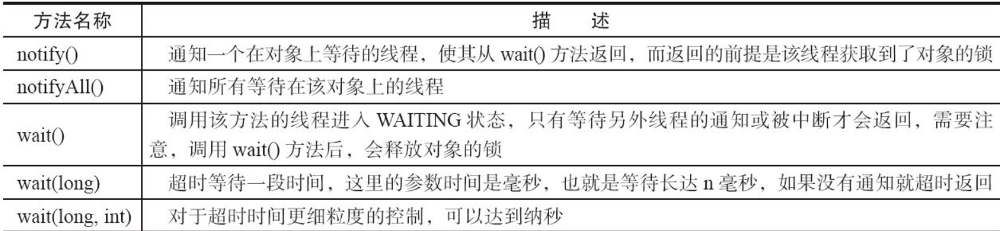
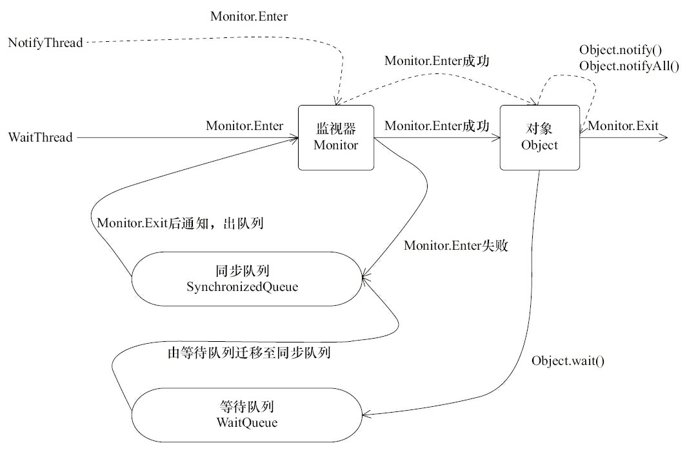

# 并发编程基础

[TOC]


#### 什么是线程和进程?他们的区别，优缺点

1. <u>（回答进程线程是什么）</u>进程是具有一定独立功能的程序，关于某个数据集合上的一次运行活动，**进程是系统进行资源分配和调度的一个独立单位**，线程是进程的一个实体，是**CPU调度和分派的基本单位**,线程自己基本上不拥有系统资源，只拥有一点在运行中必不可少的资源（程序的计数器、一组寄存器和栈）

2. <u>（他们之间区别）</u>进程之间是独立的，他们有相互独立的地址空间；而线程有自己的**堆栈和局部变量**，但线程之间没有单独的地址空间，一个线程死掉就等于整个进程死掉，所以**多进程的程序要比多线程的程序健壮**，但在进程切换时，耗费资源较大，效率要差一些。但对于一些**要求同时进行并且又要共享某些变量的并发操作**，只能用线程，不能用进程。

3. <u>（回答优缺点）</u>进程的引入提高了CPU的利用率，但是由于进程之间切换代价过大，所以频繁的进程切换会浪费CPU利用率；线程的引入提高了进程的并发度可以有效的利用多处理器和多核计算机，但是但同属于某个进程下的线程不可预知的原因导致死掉就会导致整个进程奔溃。

   

   从JVM角度来说，一个进程中可以有多个线程，多个线程共享进程的**堆**和**方法区 (JDK1.8 之后的元空间)\**资源，但是每个线程有自己的\**程序计数器**、**虚拟机栈** 和 **本地方法栈**。

#### 说说并发与并行的区别?

* **并发：** 同一时间段，多个任务都在执行 (单位时间内不一定同时执行)；

* **并行：** 单位时间内，多个任务同时执行。

#### 使用多线程可能带来的问题和好处

问题：内存泄漏、死锁、线程不安全等等.

好处：

1. **更多的处理器核心**：一个线程在一个时刻只能运行在一个处理器核心上，如果只有单线程无法充分利用多个处理器。（反过来就是说，一个处理器的时候，不一定适合用多线程？）。
2. **更快的响应时间**：可以将数据一致性不强的操作派发给其他线程处理（也可以使用消息队列），例如描述，订单信息、库存信息同时处理。
3. **更好的编程模型**：Java自己提供了模型，有利于研究如何写好，而不是怎么写。


#### 线程的生命周期

java线程的生命周期有：NEW,RUNNABLE,BLOCKED,WAITING,TIME_WAITING,TERMINATED

wait状态：调用Object对象的wait方法，但没有指定超时值。调用Thread对象的join方法，但没有指定超时值。调用LockSupport对象的park方法。（会释放锁）

bolocked状态：当前线程在等待一个monitor lock，比如等待执行synchronized代码块或者使用synchronized标记的方法。（只与synchronized有关）


操作系统线程的生命周期：**初始状态**（NEW)，**可运行状态**（READY），**运行状态**（RUNNING)，等待状态（WAITING)（该状态在 Java中被划分为了 **BLOCKED**，**WAITING**，**TIMED_WAITING** 三种状态），终止状态 （TERMINATED）

java线程共有6种状态，而**操作系统的线程只有3种状态**ready ：表示线程已经被创建，正在等待系统调度分配CPU使用权。running：表示线程获得了CPU使用权，正在进行运算   waiting：表示线程等待（或者说挂起），让出CPU资源给其他线程使用

#### 守护线程：

1. 一种支持型线程，主要被用作程序中后台调度以及支持性工作。
2. 当JVM不存在非Daemon线程的时候，JVM就会退出。
3. 可以通过Thread.setDaemon(true)将线程设置为Daemon线程，但是这个设置要在start之前。
4. Daemon的finally块不一定会执行，所以不要依赖finally块中的内容来确保执行关闭或清理资源的逻辑
   

#### 什么是上下文切换?

线程在执行过程中会有自己的运行条件和状态（也称上下文），比如上文所说到过的程序计数器，栈信息等。当出现如下情况的时候，线程会从占用 CPU 状态中退出。

* 主动让出 CPU，比如调用了 `sleep()`, `wait()` 等。
* 时间片用完，因为操作系统要防止一个线程或者进程长时间占用CPU导致其他线程或者进程饿死。
* 调用了阻塞类型的系统中断，比如请求 IO，线程被阻塞。
* 被终止或结束运行

这其中前三种都会发生线程切换，**线程切换意味着需要保存当前线程的上下文，留待线程下次占用 CPU 的时候恢复现场**。并加载下一个将要占用 CPU 的线程上下文。这就是所谓的 **上下文切换**。

#### 线程创建与启动，停止


#### 用那种方式创建线程最好

1. 通过继承Thread类，重写run方法；

```java
// 通过new MyThread().start来调用
 class MyThread extends Thread{//继承Thread类
    public void run(){
        //重写run方法
        System.out.println(1);
    }

}
```

2. 通过实现runable接口；

```java
//通过new Thread(new MyThread2()).start(); 来启动
class MyThread2 implements Runnable {//实现Runnable接口
    public void run(){
    //重写run方法
        System.out.println(1);
    }
}
```

本质上，实现线程只有一种方式，而要想实现线程执行的内容，却有两种方式，也就是可以**通过实现 Runnable 接口的方式**，或是**继承 Thread 类重写 run() 方法的方式**，把我们想要执行的代码传入，让线程去执行，在此基础上，如果我们还想有更多实现线程的方式，比如线程池和 Timer 定时器，只需要在此基础上进行封装即可。

#### 2.实现 Runnable 接口比继承 Thread 类实现线程要好

下面我们来对刚才说的两种实现线程内容的方式进行对比，也就是为什么说实现 Runnable 接口比继承 Thread 类实现线程要好？好在哪里呢？

首先，我们从代码的架构考虑，实际上，Runnable 里只有一个 run() 方法，它定义了需要执行的内容，在这种情况下，实现了 Runnable 与 Thread 类的解耦，Thread 类负责线程启动和属性设置等内容，权责分明。

第二点就是在某些情况下可以提高性能，使用继承 Thread 类方式，每次执行一次任务，都需要新建一个独立的线程，执行完任务后线程走到生命周期的尽头被销毁，如果还想执行这个任务，就必须再新建一个继承了 Thread 类的类，如果此时执行的内容比较少，比如只是在 run() 方法里简单打印一行文字，那么它所带来的开销并不大，相比于整个线程从开始创建到执行完毕被销毁，这一系列的操作比 run() 方法打印文字本身带来的开销要大得多，相当于捡了芝麻丢了西瓜，得不偿失。**如果我们使用实现 Runnable 接口的方式，就可以把任务直接传入线程池，使用一些固定的线程来完成任务，不需要每次新建销毁线程，大大降低了性能开销。**

第三点好处在于 Java 语言**不支持双继承**，如果我们的类一旦继承了 Thread 类，那么它后续就没有办法再继承其他的类，这样一来，如果未来这个类需要继承其他类实现一些功能上的拓展，它就没有办法做到了，相当于限制了代码未来的可拓展性。

综上所述，我们应该优先选择通过实现 Runnable 接口的方式来创建线程。

#### 3. 创建线程的多种方式

实现runnable,继承thread，定时器，匿名内部类，Lamdba表达式，callable, FutureTask

```java
//匿名内部类
new Thread(new Runnable() {
        @Override
        public void run() {
            System.out.println(Thread.currentThread().getName());
        }
    }).start();
//Lamdba表达式
    new Thread(() -> System.out.println(Thread.currentThread().getName())).start();
}
//线程池
static class DefaultThreadFactory implements ThreadFactory {
    DefaultThreadFactory() {
        SecurityManager s = System.getSecurityManager();
        group = (s != null) ? s.getThreadGroup() :
            Thread.currentThread().getThreadGroup();
        namePrefix = "pool-" +poolNumber.getAndIncrement() + "-thread-";
    }
    public Thread newThread(Runnable r) {
        Thread t = new Thread(group, r,
                    namePrefix + threadNumber.getAndIncrement(),0);
        if (t.isDaemon())
            t.setDaemon(false);
        if (t.getPriority() != Thread.NORM_PRIORITY)
            t.setPriority(Thread.NORM_PRIORITY);
        return t;
    }
}
```

#### 4. start和run启动线程的区别

* start() 方法会启动一个新的线程，以及线程的一些准备工作(状态检查，加入通知线程组)，然后 Java 虚拟机==有空就会==调用此线程的 run() 方法；**并不立即执行**。不能多次执行start
  1. 首先检查线程状态 threadStatus 是否为 0，0 状态代表线程的 “NEW” 状态，不为 0 会抛出 IllegalThreadStateException 异常；
  2. 将线程加入线程组；
  3. 然后调用一个 native 类型的 start0() 方法，此方法会在 JVM 中调用此线程的 run() 方法，使线程进入 READY 状态；
* run() 方法是直接执行 Runnable 对象的 run() 方法，是 main 线程下的一个普通线程，并不是多线程执行；

#### 5. 怎么停止线程

**普通情况**：设置interrupt中断，并通过isinterrupted去循环判断

**正在sleep时候中断**：会抛出异常，sleep外有try catch会响应中断，

**while内try catch问题**：程序会抛出错误信息，然后继续进行循环，另外，程序抛出异常后，interrupt中断标志位就会被置为false，所以我们如果需要isinterrupted来判断的话，需要try catch后重新进行设置中断。

**正确停止线程的方法：**传递中断(将异常向上抛出，由调用方去处理这个异常)，恢复中断(重新置中断)

错误的停止方法：1. stop,suspend ,resume ( 破坏完整的代码逻辑，破坏原子操作) 2. 用volatile 设置标志位（当线程阻塞时，可能执行不到判断volatile 关键字的那部分代码）

#### 多线程会带来哪些问题，为什么

##### 线程安全问题

死锁，活锁，饥饿,多线程运行错误，初始化错误

##### 性能问题

***1. 调度开销***：1）上下文切换带来的开销是比较大的，假当任务内容非常短，比如只进行简单的计算，可能发生我们上下文切换带来的性能开销比执行线程本身内容带来的开销还要大2)频繁的上下文切换可能导致缓存失效。

什么情况会导致密集的上下文切换呢？如果**程序频繁地竞争锁**，或者由于 **IO 读写等原因导致频繁阻塞**，那么这个程序就可能需要更多的上下文切换，这也就导致了更大的开销。

***2.协作开销***

线程协作：线程之间如果有共享数据，为了避免数据错乱，为了保证线程安全，就有可能**禁止编译器和 CPU 对其进行重排序等优化**，也可能出于同步的目的，反复把线程工作内存的数据 flush 到主存中，然后再从主内存 refresh 到其他线程的工作内存中，在多线程中为了确保数据的正确性，就不得不采取上述方法，因为线程安全的优先级要比性能优先级更高，这也间接降低了我们的性能。

#### 二、基础线程机制

#### sleep() VS wait()

相同点：

> 1. 它们都可以让线程阻塞。
> 2. 它们都可以响应 interrupt 中断：在等待的过程中如果收到中断信号，都可以进行响应，并抛出 InterruptedException 异常。

不同点：

> 1. sleep()方法是Thread的静态方法，而wait是Object实例方法
>
> 2. 首先，wait()方法必须要在同步方法或者同步块中调用，也就是必须已经获得对象锁（获取synchronized隐式锁的线程，才能调用wait()方法）。而sleep()方法没有这个限制可以在任何地方种使用。
>
>    其次：wait()方法会**释放占有的对象锁**，使得该线程进入等待池中，等待下一次获取资源。而**sleep()方法只是会让出CPU并不会释放掉对象锁**；
>
> 3. sleep()方法在休眠时间达到后如果再次获得CPU时间片就会继续执行，而wait()方法必须等待Object.notift/Object.notifyAll通知后，才会离开等待池，并且再次获得CPU时间片才会继续执行。

#### yield 和sleep

参考：https://www.jianshu.com/p/25e959037eed

①sleep方法给其他线程运行机会时不考虑线程的优先级,因此会给低线程优先级运行的机会,而yield方法只会给相同优先级或者更高优先级线程运行的机会

②线程执行sleep()方法后转入阻塞状态,所以,执行sleep()方法的线程在指定的时间内不会被执行,而yield()方法只是使当前线程重新回到可执行状态,所以执行yield()方法的线程可能在进入可执行状态后马上又被执行

③sleep()方法声明抛出InterruptedException,而yield()方法没有声明任何异常

**易错：**当调用t.sleep()的时候，会暂停线程t。这是不对的，因为**Thread.sleep是一个静态方法，它会使当前线程而不是线程t进入休眠状态。**

#### 为什么 wait/notify/notifyAll 被定义在 Object 类中，而 sleep 定义在 Thread 类中？

1.  因为 Java 中每个对象都有一把称之为 monitor 监视器的锁，由于每个对象都可以上锁，这就要求在对象头中有一个用来保存锁信息的位置。这个锁是对象级别的，而非线程级别的，wait/notify/notifyAll 也都是锁级别的操作，它们的锁属于对象，所以把它们定义在 Object 类中是最合适，因为 Object 类是所有对象的父类。
2.  因为如果把 wait/notify/notifyAll 方法定义在 Thread 类中，会带来很大的局限性，比如一个线程可能持有多把锁，以便实现相互配合的复杂逻辑，假设此时 wait 方法定义在 Thread 类中，如何实现让一个线程持有多把锁呢？又如何明确线程等待的是哪把锁呢？既然我们是让当前线程去等待某个对象的锁，自然应该通过操作对象来实现，而不是操作线程。

#### **过期的suspend()、resume()、stop()**：

suspend()、resume()和stop()方法完成了线程的暂停、恢复和终止工作，而且非常“人性化”。但是这些API是过期的，也就是不建议使用的。

不建议使用的原因主要有：

1. 以suspend()方法为例，在调用后，线程不会释放已经占有的资源（比如锁），而是占有着资源进入睡眠状态，这样容易引发死锁问题。
2. **stop()方法在终结一个线程时不会保证线程的资源正常释放**，通常是没有给予线程完成资源释放工作的机会，因此会导致程序可能工作在不确定状态下。

暂停和恢复操作可以用后面提到的**等待/通知机制**来替代。

#### **等待/通知机制**



```java
package com.morris.concurrent.volatiledemo;
import java.text.SimpleDateFormat;
import java.util.Date;
import java.util.concurrent.TimeUnit;

public class WaitNotify {
    static boolean flag = true;
    // 指定一个对象作为锁
    static Object lock = new Object();

    public static void main(String[] args) throws InterruptedException {
        Thread waitThread = new Thread(new Wait(), "WaitThread");
        waitThread.start();
        TimeUnit.SECONDS.sleep(1);
        Thread notifyThread = new Thread(new Notify(), "NotifyThread");
        notifyThread.start();
    }

    static class Wait implements Runnable{
        @Override
        public void run() {
            System.out.println("11111");
            // 加锁，拥有lock的监视器
            synchronized (lock){
                // 使用while，这样就可以在从wait返回后仍然判断条件
                while (flag){
                    // 持续wait，同时释放了lock的锁
                    try {
                        System.out.println(Thread.currentThread() + " flag is true " + new SimpleDateFormat("HH:mm:ss").format(new Date()));
                        lock.wait();
                    } catch (InterruptedException e) {
                        e.printStackTrace();
                    }
                }
                System.out.println(Thread.currentThread() + " flag is false  " + new SimpleDateFormat("HH:mm:ss").format(new Date()));
            }
        }
    }
    static class Notify implements Runnable{
        @Override
        public void run() {
            // 加锁
            synchronized (lock){
                // 获取了锁，然后进行通知，通知不会释放lock锁
                // 直到当前线程释放了lock后，WaitThread才能从wait方法中返回
                System.out.println(Thread.currentThread() + " hold lock " + new SimpleDateFormat("HH:mm:ss").format(new Date()));
                lock.notifyAll();
                flag = false;
                try {
                    Thread.sleep(5000);
                } catch (InterruptedException e) {
                    e.printStackTrace();
                }
            }
            // 再次加锁
            // 一个方法两个同步代码块
            synchronized (lock){
                System.out.println(Thread.currentThread() + " hold lock again " + new SimpleDateFormat("HH:mm:ss").format(new Date()));
                try {
                    Thread.sleep(5000);
                } catch (InterruptedException e) {
                    e.printStackTrace();
                }
            }
        }
    }
}

```

上面运行结果：

```
11111
Thread[WaitThread,5,main] flag is true 20:13:11
Thread[NotifyThread,5,main] hold lock 20:13:12
Thread[NotifyThread,5,main] hold lock again 20:13:17
Thread[WaitThread,5,main] flag is false  20:13:22
```

分析：

1. 先执行的Wait类的start()，所以该类先获得lock，然后执行lock.wait()，让该线程进入了等待状态，此时会释放lock的监视器。
2. 一秒后，执行Notify，并且获得了lock，此时第一个加锁代码块执行了lock.notifyAll()，此时Wait线程进入阻塞状态，进入到同步队列等待锁。
   如果notifyAll()执行完之后释放锁的话，下面应执行的是Wait线程，但是实际不是，所以说执行了通知之后并不会释放锁，锁还是在自己的线程(Notify)内，因此第二个同步块又拿到了锁，最后线程的run执行结束，释放锁。（从这里是不是能看出锁是归线程所有，而不是线程的同步代码块所有？）
   此时lock已经被释放，同步队列中的Wait线程就可以获得锁了，开始从上次执行lock.wait()的位置继续执行。

**总结细节：**

1.  wait()、notify()、notifyAll()的执行都需要先对调用对象加锁。（为什么需要加锁https://www.cnblogs.com/chen--biao/p/11358016.html）
2. 调用notify()、notifyAll()的线程释放锁后，等待线程才有机会从wait()返回。
3. notify()函数是随机对一个当前锁设置的wait线程进行通知。
4. 从wait()方法放回的前提是获得了调用对象的锁。
   

#### Thread.join()的使用

在A线程中执行B线程的`join()`方法，即`B.join()`，则A进入等待状态，直到B线程终止后才返回。这个函数开可以设置参数，`join(long millis)`，即如果在给定时间里没有终止，那么就从超时方法里返回。

```java
class Join {
     public static void main(String[] args) throws InterruptedException {
         // 获取main线程
         Thread previous = Thread.currentThread();
         for (int i = 0; i < 10; i++) {
             // 每个线程拥有前一个线程的引用，需要等待前一个线程终止，才能从等待中返回
             Thread thread = new Thread(new Domino(previous), String.valueOf(i));
             thread.start();
             previous = thread;
         }
         Thread.sleep(5000);
         System.out.println("main 结束：" + Thread.currentThread().getName());
     }

     static class Domino implements Runnable {
         private Thread thread;

         public Domino(Thread thread) {
             this.thread = thread;
         }

         @Override
         public void run() {
             System.out.println(Thread.currentThread().getName() + "开始");
             try {
                 // 等传入的线程终止才从这继续
                 thread.join();
             } catch (InterruptedException e) {
                 e.printStackTrace();
             }
             System.out.println(Thread.currentThread().getName() + "结束");
         }
     }
 }
```


#### 守护线程

线程可以通过setDaemon(true)的方法将线程设置为守护线程

**守护线程在退出的时候并不会执行finnaly块中的代码，所以将释放资源等操作不要放在finnaly块中执行，这种操作是不安全的**

#### 如何处理不可中断线程

sleep()和yield()方法，同样都是当前线程会交出处理器资源，而它们不同的是，sleep()交出来的时间片其他线程都可以去竞争，也就是说都有机会获得当前线程让出的时间片。而yield()方法只允许与当前线程具有相同优先级的线程能够获得释放出来的CPU时间片。


#### 协程，子进程，子线程，守护线程

https://www.cnblogs.com/secondtonone1/p/11803961.html

https://www.cnblogs.com/Survivalist/p/11527949.html#%E8%BF%9B%E7%A8%8B

最初：进程是拥有资源和独立运行的最小单位，也是程序执行的最小单位，任务调度采用的是时间片轮转的抢占式调度方式，而进程是任务调度的最小单位，每个进程有各自独立的一块内存，使得各个进程之间内存地址相互隔离。后来由于进程之间切换开销巨大，**引入了线程**。目前很多主机都是多核处理器，多核指的是多个**内核级线程**，用户级线程和内核级线程之间有对应关系（一对一，多对一，**多对多**），现在，几乎所有的现代操作系统采用的都是**时间片轮转**的抢占式调度方式，在时间片内线程可以自由使用CPU,但是如果这段时间该线程需要处理IO,那么这个时间片的时间就会被浪费，所以我们引入了协程，协程是比线程更小的单位，用户可以编写代码，当我们等待IO的时候，可以换上另外一个协程来使用CPU，

多对多模型的优点有：

1.  一个用户线程的阻塞不会导致所有线程的阻塞，因为此时还有别的内核线程被调度来执行；
2.  多对多模型对用户线程的数量没有限制；
3.  在多处理器的操作系统中，多对多模型的线程也能得到一定的性能提升，但提升的幅度不如一对一模型的高。

#### 线程间通信

1. 关键字volatile可以用来修饰字段（成员变量），就是告知程序任何对该变量的访问均需要从共享内存中获取，而对它的改变必须同步刷新回共享内存，它能保证所有线程对变量访问的可见性。
2. 关键字synchronized可以修饰方法或者以同步块的形式来进行使用，它主要确保多个线程在同一个时刻，只能有一个线程处于方法或者同步块中，它保证了线程对变量访问的可见性和排他性

#### 线程安全

如果某个对象是线程安全的，那么对于使用者而言，在使用时就不需要考虑方法间的协调问题，比如不需要考虑不能同时写入或读写不能并行的问题，也不需要考虑任何额外的同步问题，比如不需要额外自己加 synchronized 锁，那么它才是线程安全的，可以看出对线程安全的定义还是非常苛刻的。分为三个情况。

1. 运行结果错误；
2. 发布和初始化导致线程安全问题；
3. 活跃性问题。

##### 1.运行结果错误

```java
//多个线程去操作一个volatile变量
class WrongResult {
    volatile static int i;
    public static void main(String[] args) throws InterruptedException {
        Runnable r = new Runnable() {
            @Override
            public void run() {
                for (int j = 0; j < 10000; j++) {
                    i++;
                }
            }
        };
        Thread thread1 = new Thread(r);
        thread1.start();
        Thread thread2 = new Thread(r);
        thread2.start();
        thread1.join();
        thread2.join();
        System.out.println(i);
    }
}
```

##### 2发布和初始化导致线程安全问题

```java
 class WrongInit {
    private Map<Integer, String> students;
    public WrongInit() {
        new Thread(new Runnable() {
            @Override
            public void run() {
                students = new HashMap<>();
                students.put(1, "王小美");
                students.put(2, "钱二宝");
                students.put(3, "周三");
                students.put(4, "赵四");
            }
        }).start();
    }
    public Map<Integer, String> getStudents() {
        return students;
    }
    public static void main(String[] args) throws InterruptedException {
        /**
         * students 这个成员变量是在构造函数中新建的线程中进行的初始化和赋值操作，而线程的启动需要一定的时间，
         *  但是我们的 main 函数并没有进行等待就直接获取数据，导致 getStudents 获取的结果为 null，
         *  这就是在错误的时间或地点发布或初始化造成的线程安全问题。
         */
        WrongInit multiThreadsError6 = new WrongInit();
//        Thread.sleep(3000);
        System.out.println(multiThreadsError6.getStudents().get(1));
    }
}
```

```java
Exception in thread "main" java.lang.NullPointerException at lesson6.WrongInit.main(WrongInit.java:32)
```

##### 3.活跃性问题。

最典型的有三种，分别为死锁、活锁和饥饿。

###### 死锁

最常见的活跃性问题是死锁，死锁是指两个线程之间相互等待对方资源，但同时又互不相让，都想自己先执行，如代码所示。

```java
 public class MayDeadLock {
    Object o1 = new Object();
    Object o2 = new Object();
    public void thread1() throws InterruptedException {
        synchronized (o1) {
            Thread.sleep(500);
            synchronized (o2) {
                System.out.println("线程1成功拿到两把锁");
           }
        }
    }
    public void thread2() throws InterruptedException {
        synchronized (o2) {
            Thread.sleep(500);
            synchronized (o1) {
                System.out.println("线程2成功拿到两把锁");
            }
        }
    }
    public static void main(String[] args) {
        MayDeadLock mayDeadLock = new MayDeadLock();
        new Thread(new Runnable() {
            @Override
            public void run() {
                try {
                    mayDeadLock.thread1();
                } catch (InterruptedException e) {
                    e.printStackTrace();
                }
            }
        }).start();
        new Thread(new Runnable() {
            @Override
            public void run() {
                try {
                    mayDeadLock.thread2();
                } catch (InterruptedException e) {
                    e.printStackTrace();
                }
            }
        }).start();
    }
}
```

首先，代码中创建了两个 Object 作为 synchronized 锁的对象，线程 1 先获取 o1 锁，sleep(500) 之后，获取 o2 锁；线程 2 与线程 1 执行顺序相反，先获取 o2 锁，sleep(500) 之后，获取 o1 锁。 假设两个线程几乎同时进入休息，休息完后，线程 1 想获取 o2 锁，线程 2 想获取 o1 锁，这时便发生了死锁，两个线程不主动调和，也不主动退出，就这样死死地等待对方先释放资源，导致程序得不到任何结果也不能停止运行。

###### 活锁

第二种活跃性问题是活锁，活锁与死锁非常相似，也是程序一直等不到结果，但对比于死锁，活锁是活的，什么意思呢？因为正在运行的线程并没有阻塞，它始终在运行中，却一直得不到结果。

举一个例子，假设有一个消息队列，队列里放着各种各样需要被处理的消息，而某个消息由于自身被写错了导致不能被正确处理，执行时会报错，可是队列的重试机制会重新把它放在队列头进行优先重试处理，但这个消息本身无论被执行多少次，都无法被正确处理，每次报错后又会被放到队列头进行重试，周而复始，最终导致线程一直处于忙碌状态，但程序始终得不到结果，便发生了活锁问题。

###### 饥饿

第三个典型的活跃性问题是饥饿，饥饿是指线程需要某些资源时始终得不到，尤其是CPU 资源，就会导致线程一直不能运行而产生的问题。在 Java 中有线程优先级的概念，Java 中优先级分为 1 到 10，1 最低，10 最高。如果我们把某个线程的优先级设置为 1，这是最低的优先级，在这种情况下，这个线程就有可能始终分配不到 CPU 资源，而导致长时间无法运行。或者是某个线程始终持有某个文件的锁，而其他线程想要修改文件就必须先获取锁，这样想要修改文件的线程就会陷入饥饿，长时间不能运行。