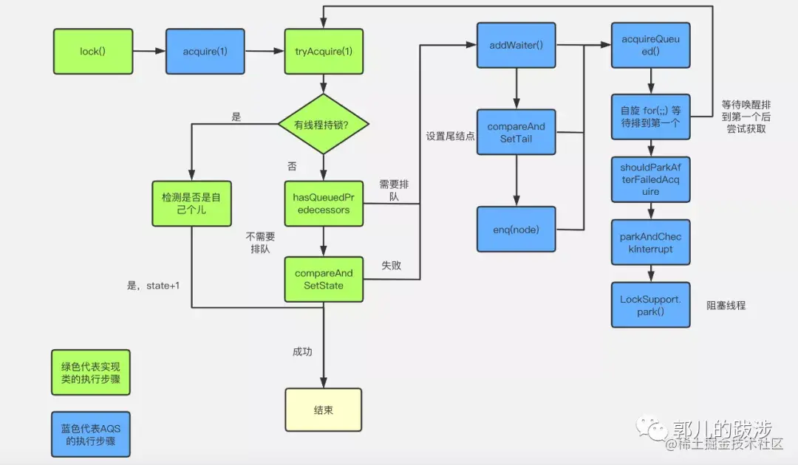

## AQS原理

https://segmentfault.com/a/1190000022918705

https://juejin.cn/post/6844903997438951437

>   AQS的关键点：1.AQS是什么，2.lock，没有CAS获取成功→acquire，再次获取锁，没有成功则加入队列→tryAcquire→acquireQueued(addWaiter(Node.EXCLUSIVE), arg))→addWaiter→

#### AQS的几个核心关键点

Java中的大部分同步类（Lock、Semaphore、ReentrantLock等）都是基于AbstractQueuedSynchronizer（简称为AQS）实现的。AQS是一种提供了原子式**管理同步状态、阻塞和唤醒线程功能**以及*队列模型*的简单框架

AQS主要由volatile int state（表示当前资源状态），static final class Node（表示需要进入队列等待的线程），transient volatile Node head，transient volatile Node tail;

###### transient的作用及使用方法

一个对象只要实现了Serilizable接口，这个对象就可以被序列化，只要这个类实现了Serilizable接口，这个类的所有属性和方法都会自动序列化。

  然而有些类的有些属性需要序列化，而其他属性不需要被序列化（用户有一些敏感信息），这些信息对应的变量就可以加上transient关键字来不被序列化

transient关键字只能修饰变量，而不能修饰方法和类，一个静态变量不管是否被transient修饰，均不能被序列化。

#### AQS源码

以ReentrantLock为例：

ReentrantLock有sync内部类，sync实现的AbstractQueuedSynchronizer抽象类，然后如果是非公平锁NonfairSync继承sync ，实现其lock方法

##### 1.lock

```java
final void lock() {
  //compareAndSetState调用unsafe的compareAndSwapInt
    if (compareAndSetState(0, 1))//通过CAS来获取锁，成功则将当前锁设为当前线程拥有
        setExclusiveOwnerThread(Thread.currentThread());
    else
        acquire(1);//失败则执行acquire方法
}
```

##### 2.acquire

进入acquire方法，首先会再次获取锁tryAcquire，成功则跳出，不执行if，失败则执行acquireQueued中的逻辑

```
public final void acquire(int arg) {
    if (!tryAcquire(arg) &&
        acquireQueued(addWaiter(Node.EXCLUSIVE), arg))
        selfInterrupt();
}
```

##### 3.tryacquire

对于tryacquire方法

```java
protected final boolean tryAcquire(int acquires) {//首先调用NonfairSync中的tryAcquire方法，
    return nonfairTryAcquire(acquires);//然后被转到nonfairTryAcquire
```

```java
final boolean nonfairTryAcquire(int acquires) {//acquires传入为1
    final Thread current = Thread.currentThread();
    int c = getState();
    if (c == 0) {//查看状态，0代表没有使用，就进去将使用者设为自己
        if (compareAndSetState(0, acquires)) {
            setExclusiveOwnerThread(current);
            return true;
        }
    }
    else if (current == getExclusiveOwnerThread()) {//查看当前线程是否已经占用，
        int nextc = c + acquires;
        if (nextc < 0) // overflow
            throw new Error("Maximum lock count exceeded");
        setState(nextc);
        return true;
    }
    return false;//上面都没有，返回false;
}
```

##### 4.addWaiter(添加Node节点到队列中)

一般如果资源没有被使用者，tryacquire就会获取资源，否则执行addWaiter(Node.EXCLUSIVE)方法，

```java
private Node addWaiter(Node mode) {//mode代表此锁类型EXCLUSIVE（独占锁），SHARED（共享锁）
    Node node = new Node(Thread.currentThread(), mode);
    // Try the fast path of enq; backup to full enq on failure
  //先判断tail是否为空，最初的队列一定为空，所以跳过执行enq
    Node pred = tail;
    if (pred != null) {
        node.prev = pred;
        if (compareAndSetTail(pred, node)) {
            pred.next = node;
            return node;
        }
    }
    enq(node);//enq源码在下方，将node放入队列
    return node;
}
```

```java
//将node放入队列，就是一个双链表节点入队操作
private Node enq(final Node node) {
    for (;;) {//自旋
        Node t = tail;
        if (t == null) { // 首先初始化链表，tail为空
            if (compareAndSetHead(new Node()))//创建一个全新的哨兵节点
                tail = head;//将head，tail全部指向这个创建的新节点
        } else {//经过第一次创建新节点上t==null的分支不会再走，执行此处的else分支
            node.prev = t;//将node连入双链表tail指向node，完成入队操作
            if (compareAndSetTail(t, node)) {
                t.next = node;
                return t;
            }
        }
    }
}
```

##### 5. acquireQueued

```java
//阻塞队列不断查看资源状态，并提供出队方法
final boolean acquireQueued(final Node node, int arg) {
    boolean failed = true;
    try {
        boolean interrupted = false;//标记等待过程中是否被中断过
        for (;;) {//自旋，或者说死循环
            final Node p = node.predecessor();
            if (p == head && tryAcquire(arg)) {//判断前驱节点是不是头节点，第一次为true，再次获取锁成功就更改队列头节点，失败跳出if，执行shouldParkAfterFailedAcquire，然后再次自旋，直到获取到锁
                setHead(node);
                p.next = null; // help GC
                failed = false;
                return interrupted;
            }
            if (shouldParkAfterFailedAcquire(p, node) &&
                parkAndCheckInterrupt())//查看是否中断
                interrupted = true;
        }
    } finally {
        if (failed)//如果有中断，则取消退出
            cancelAcquire(node);
    }
}
```

```java
// 上面我们再次获取锁，没有得到，就需要在这个方法中去阻塞这个线程，将其挂起，等待锁的释放
private static boolean shouldParkAfterFailedAcquire(Node pred, Node node) {
    int ws = pred.waitStatus;//哨兵节点waitStatus为-1
    if (ws == Node.SIGNAL)
        /*
         * This node has already set status asking a release
         * to signal it, so it can safely park.
         */
        return true;
    if (ws > 0) {
        /*
         * Predecessor was cancelled. Skip over predecessors and
         * indicate retry.
          前一节点已被取消，跳过，再向前找节点
         */
        do {
            node.prev = pred = pred.prev;
        } while (pred.waitStatus > 0);//向前找到waitStatus不>0的节点
        pred.next = node;
    } else {
        /*
         * waitStatus must be 0 or PROPAGATE.  Indicate that we
         * need a signal, but don't park yet.  Caller will need to
         * retry to make sure it cannot acquire before parking.
         CAS 设置前一节点等待唤醒
         */
        compareAndSetWaitStatus(pred, ws, Node.SIGNAL);//将状态改为-1
    }
    return false;
}
```

```java
private final boolean parkAndCheckInterrupt() {
    // 阻塞线程
    LockSupport.park(this);
    return Thread.interrupted();
}
```

>   1、通过 acquireQueued 将当前节点加入队尾，并设置阻塞。自旋，判断如果当前节点的前驱节点。是头结点（head 节点不排队，只记录状态，head 的后驱节点才是真正第一个排队的），则再次尝试 tryAcquire() 获取锁。 2、可以看到自旋的跳出条件是当前节点是队列中第一个，并且获取锁。 3、如果一直自旋，则会消耗 CPU 资源，因此使用 shouldParkAfterFailedAcquire 判断是否需要将当前线程阻塞，如果是则通过 parkAndCheckInterrupt 阻塞线程的运行。 4、LockSupport.park() 是通过 native 方法 UNSAFE.park() 实现的线程阻塞。


