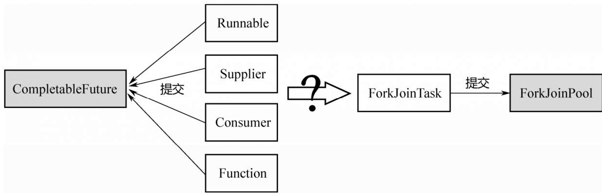

## Future和CompletableFuture源码

https://zhuanlan.zhihu.com/p/165030484

CompletableFuture是java1.8提供的一个新类，是对Future的增强，吸收了guava异步线程的特点，可以实现一系列的异步线程操作。

##### Future


##### 用法

###### 1.提交任务：runAsync与supplyAsync

```java
//runAsync（Runnable），传入的Runnable接口
CompletableFuture<Void> cf = CompletableFuture.runAsync(()->{
    System.out.println("sdsdsdsss");
    try {
        TimeUnit.SECONDS.sleep(1);
    } catch (InterruptedException e) {
        e.printStackTrace();
    }
});
cf.get();
//supplyAsync（Supplier）有返回值的任务，提交的是Supplier，返回的是CompletableFuture<String>
CompletableFuture<String> future1 = CompletableFuture.supplyAsync(new Supplier<String>() {
            @Override
            public String get() {
                try {
                    TimeUnit.SECONDS.sleep(3);
                } catch (InterruptedException e) {
                    e.printStackTrace();
                }
                return "test";
            }
        });
String res = future1.get();
```

2.链式的CompletableFuture：thenRun、thenAccept和thenApply

对于Future，在提交任务之后，只能调用get（）等结果返回；但对于CompletableFuture，可以在结果上面再加一个callback，当得到结果之后，**再接着执行callback**

```java
CompletableFuture<Void> test1 = CompletableFuture.supplyAsync(()->{
            try {
                TimeUnit.SECONDS.sleep(1);
            } catch (InterruptedException e) {
                e.printStackTrace();
            }
            return "test1";
        }).thenRun(()->{
            System.out.println("后面的thenRun");
        });
CompletableFuture<Void> test2 = CompletableFuture.supplyAsync(()->{
            try {
                TimeUnit.SECONDS.sleep(1);
            } catch (InterruptedException e) {
                e.printStackTrace();
            }
            return "test1";
        }).thenAccept((res)->{
            System.out.println(res);
        });
CompletableFuture<String> test3 = CompletableFuture.supplyAsync(()->{
            try {
                TimeUnit.SECONDS.sleep(1);
            } catch (InterruptedException e) {
                e.printStackTrace();
            }
            return "test1";
        }).thenApply((res)->{
            return res+"after";
        });
```

三个例子都是在任务执行完成之后，再紧急执行一个callback，只是callback的形式有所区别：

（1）thenRun后面跟的是一个**无参数、无返回值**的方法，即Runnable，所以最终的返回值是CompletableFuture<Void>；类型。

（2）thenAccept 后面跟的是一个**有参数、无返回值**的方法，称为Consumer，返回值也是CompletableFuture<Void>；类型。顾名思义，只进不出，所以称为Consumer；前面的Supplier，是无参数，有返回值，只出不进，和Consumer刚好相反。

（3） thenApply 后面跟的是一个**有参数、有返回值**的方法，称为Function。返回值是CompletableFuture<String>；类型。而参数接收的是前一个任务，即supplyAsync（..）这个任务的返回值。因此这里只能用supplyAsync，不能用runAsync。因为runAsync没有返回值，不能为下一个链式方法传入参数。

###### 3.CompletableFuture的组合：thenCompose与thenCombine

thenCompose: 可以返回CompletableFuture类型的对象，而上面的thenApply智能返回基本类型对象。

thenCombine：要在2个CompletableFuture 完成之后，把2个CompletableFuture的返回值传进去，再额外做一些事情


##### 源码分析

CompletableFuture类实现了Future接口和CompletionStage接口，Future大家都经常遇到，但是这个CompletionStage接口就有点陌生了，这里的CompletionStage实际上是一个任务执行的一个“阶段”,

###### CompletionStage接口

##### CompletableFuture内部原理

###### 1.任务适配转换

CompletableFuture中任务的执行同样依靠**ForkJoinPool**，ForkJoinPool接受的任务是ForkJoinTask 类型，而我们向CompletableFuture提交的任务是Runnable/Supplier/Consumer/Function。因此，肯定需要一个适配机制，把这四种类型的任务转换成ForkJoinTask，然后提交给ForkJoinPool



为了完成这些转换，CompletableFuture内部定义了一系列的内部类：

1.   在supplierAsync（..）函数内部，会把一个Supplier 转换成一个AsyncSupply，然后提交给ForkJoinPool执行；
2.   在runAsync（..）函数内部，会把一个Runnable转换成一个AsyncRun，然后提交给ForkJoinPool执行；
3.   在thenRun/thenAccept/thenApply 内部，会分别把Runnable/Consumer/Function 转换成**UniRun/UniAccept/UniApply对象**，然后提交给ForkJoinPool执行；
4.   除此之外，还有两种CompletableFuture 组合的情况，**分为“与”和“或”，所以有对应的Bi和Or类型的Completion类型**

###### 2.链式执行过程(TODO )https://weread.qq.com/web/reader/6de3271071dbddc06de1a75k72b327f023972b32a1f7e2d

以`CompletableFuture future1=CompletableFuture.supplyAsync（…）`为例，

```java
public static <U> CompletableFuture<U> supplyAsync(Supplier<U> supplier) {
  //传入asyncPool对象，和supplier任务
        return asyncSupplyStage(asyncPool, supplier);
}
static <U> CompletableFuture<U> asyncSupplyStage(Executor e,Supplier<U> f) {
        if (f == null) throw new NullPointerException();
        CompletableFuture<U> d = new CompletableFuture<U>();
  			/**
  			构造AsyncSupply对象，
  			（1）它继承自ForkJoinTask，所以能够提交ForkJoinPool来执行。
  			(2）它封装了Supplier f，即它所执行任务的具体内容。
  			（3）该任务的返回值，即CompletableFuture d，也被封装在里面。
  			**/
        e.execute(new AsyncSupply<U>(d, f));
        return d;
    }
```


之前future需要等待isDone为true才能知道任务跑完了。或者就是用get方法调用的时候会出现阻塞。而使用completableFuture的使用就可以用then，when等等操作来防止以上的阻塞和轮询isDone的现象出现。

```java
//CompletionStage确保了CompletableFuture能够进行链式调用
public class CompletableFuture<T> implements Future<T>, CompletionStage<T> {
	volatile Object result;       // CompletableFuture的结果值或者是一个异常的报装对象AltResult
    volatile Completion stack;    // 依赖操作栈的栈顶
    ...
    // CompletableFuture的方法
    ... 
	// Unsafe mechanics
    private static final sun.misc.Unsafe UNSAFE;
    private static final long RESULT;
    private static final long STACK;
    private static final long NEXT;
    static {
        try {
            final sun.misc.Unsafe u;
            UNSAFE = u = sun.misc.Unsafe.getUnsafe();
            Class<?> k = CompletableFuture.class;
            RESULT = u.objectFieldOffset(k.getDeclaredField("result")); //计算result属性的位偏移量
            STACK = u.objectFieldOffset(k.getDeclaredField("stack")); //计算stack属性的位偏移量
            NEXT = u.objectFieldOffset 
                (Completion.class.getDeclaredField("next"));  //计算next属性的位偏移量
        } catch (Exception x) {
            throw new Error(x);
        }
    }
}
```

##### **postComplete**

```java
final void postComplete() {
        CompletableFuture<?> f = this; Completion h;    //this表示当前的CompletableFuture
        while ((h = f.stack) != null ||                                  //判断stack栈是否为空
               (f != this && (h = (f = this).stack) != null)) {    
            CompletableFuture<?> d; Completion t;      
            if (f.casStack(h, t = h.next)) {                          //通过CAS出栈，
                if (t != null) {
                    if (f != this) {
                        pushStack(h);             //如果f不是this，将刚出栈的h入this的栈顶
                        continue;
                    }
                    h.next = null;    // detach   帮助GC
                }
                f = (d = h.tryFire(NESTED)) == null ? this : d;        //调用tryFire
            }
        }
    }
```

##### **uniAccept**

```java
final <S> boolean uniAccept(CompletableFuture<S> a,
                                Consumer<? super S> f, UniAccept<S> c) {
        Object r; Throwable x;
        if (a == null || (r = a.result) == null || f == null)    //判断当前CompletableFuture是否已完成，如果没完成则返回false；如果完成了则执行下面的逻辑。
            return false;
        tryComplete: if (result == null) {
            if (r instanceof AltResult) {   //判断任务结果是否是AltResult类型
                if ((x = ((AltResult)r).ex) != null) {
                    completeThrowable(x, r);
                    break tryComplete;
                }
                r = null;
            }
            try {
                if (c != null && !c.claim()) //判断当前任务是否可以执行
                    return false;
                @SuppressWarnings("unchecked") S s = (S) r;   //获取任务结果
                f.accept(s);    //执行Comsumer
                completeNull();
            } catch (Throwable ex) {
                completeThrowable(ex);
            }
        }
        return true;
    }
```

##### AsyncSupply源码

```
static final class AsyncSupply<T> extends ForkJoinTask<Void>
        implements Runnable, AsynchronousCompletionTask {
    CompletableFuture<T> dep; Supplier<T> fn;
    AsyncSupply(CompletableFuture<T> dep, Supplier<T> fn) {
        this.dep = dep; this.fn = fn;
    }

    public final Void getRawResult() { return null; }
    public final void setRawResult(Void v) {}
    public final boolean exec() { run(); return true; }

    public void run() {
        CompletableFuture<T> d; Supplier<T> f;
        if ((d = dep) != null && (f = fn) != null) {
            dep = null; fn = null;
            if (d.result == null) {
                try {
                    d.completeValue(f.get());
                } catch (Throwable ex) {
                    d.completeThrowable(ex);
                }
            }
            d.postComplete();
        }
    }
}
```