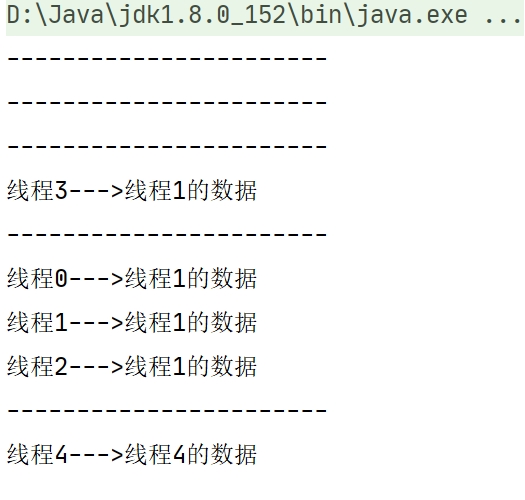
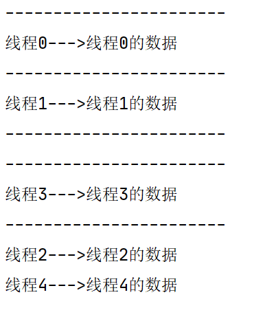
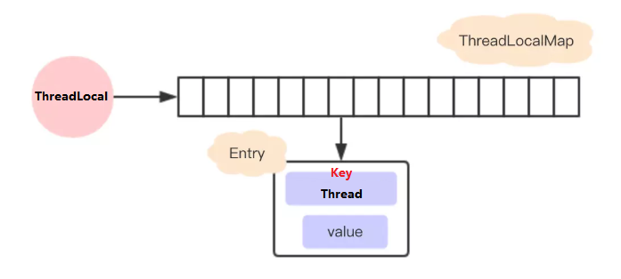
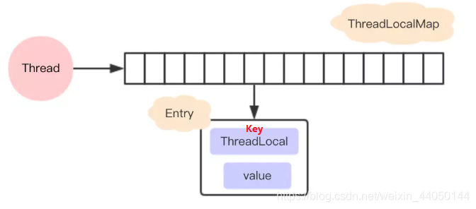
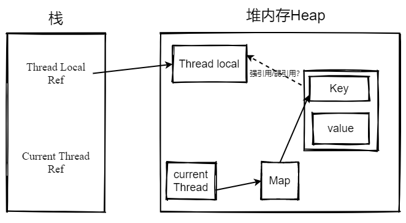

ThreadLocal
-----------

#### ThreadLocal 简介

ThreadLocal类用来提供线程内部的局部变量。这种变量在多线程环境下访问（通过get和set方法访问）时能保证各个线程的变量相对独立于其他线程内的变量。ThreadLocal实例通常来说都是private static类型的，用于关联线程和线程上下文。

我们可以得知 ThreadLocal 的作用是：**提供线程内的局部变量，不同的线程之间不会相互干扰，**这种变量在线程的生命周期内起作用，减少同一个线程内多个函数或组件之间一些公共变量传递的复杂度。

***我们先来看一个例子：***

```java
public class MyDemo {
    private String content;

    private String getContent() {
        return content;
    }

    private void setContent(String content) {
        this.content = content;
    }

    public static void main(String[] args) {
        final MyDemo demo = new MyDemo();
        for (int i = 0; i < 5; i++) {
            Thread thread = new Thread(new Runnable() {
                @Override
                public void run() {
                    demo.setContent(Thread.currentThread().getName() + "的数据");
                    System.out.println("-----------------------");
                    System.out.println(Thread.currentThread().getName() + "--->" + demo.getContent());
                }
            });
            thread.setName("线程" + i);
            thread.start();
        }
    }
}
```

上面的例子通过for循环创建一个线程，在每个线程启动之前会通过setContent设置MyDemo中的content内容，然后getContent打印，出content的内容，



我们可以看到在多线程情况下，各个线程获得CPU是没有规律的，这导致了我们设置的content被其他线程所读取，可以看出各个线程的变量是共享的，其他线程是可以随意读取的，也就是说线程间的数据没有隔离。

***下面我们来看一个线程之间隔离的例子***

```java
public class MyDemo1 {

    private static ThreadLocal<String> tl = new ThreadLocal<>();

    private String content;

    private String getContent() {
        return tl.get();
    }

    private void setContent(String content) {
         tl.set(content);
    }

    public static void main(String[] args) {
        MyDemo demo = new MyDemo();
        for (int i = 0; i < 5; i++) {
            Thread thread = new Thread(new Runnable() {
                @Override
                public void run() {
                    demo.setContent(Thread.currentThread().getName() + "的数据");
                    System.out.println("-----------------------");
                    System.out.println(Thread.currentThread().getName() + "--->" + demo.getContent());
                }
            });
            thread.setName("线程" + i);
            thread.start();
        }
    }
}
```



这样我们不管执行多少次，每个线程都只能拿到他自己设置的数据，我们就实现了使用threadLocal解决线程隔离问题。

### ThreadLocal类与synchronized关键字

#### synchronized同步方式

 这里可能有的朋友会觉得在上述例子中我们完全可以通过加锁来实现这个功能。我们首先来看一下用synchronized代码块实现的效果:

```java
public class Demo02 {
    
    private String content;

    public String getContent() {
        return content;
    }

    public void setContent(String content) {
        this.content = content;
    }

    public static void main(String[] args) {
        Demo02 demo02 = new Demo02();
        
        for (int i = 0; i < 5; i++) {
            Thread t = new Thread(){
                @Override
                public void run() {
                    synchronized (Demo02.class){
                        demo02.setContent(Thread.currentThread().getName() + "的数据");
                        System.out.println("-------------------------------------");
                        String content = demo02.getContent();
                        System.out.println(Thread.currentThread().getName() + "--->" + content);
                    }
                }
            };
            t.setName("线程" + i);
            t.start();
        }
    }
}
```

从结果可以发现, 加锁确实可以解决这个问题，因为我们在set和get这几个操作中加上了锁，在这些操作结束前其他线程是不能进来的，所以也就间接实现了线程隔离的操作，但是在这里我们强调的是线程数据隔离的问题，并不是多线程共享数据的问题, 在这个案例中使用synchronized关键字是不合适的。

####  ThreadLocal与synchronized的区别

|        | **synchronized**                                             | **ThreadLocal**                                              |
| ------ | ------------------------------------------------------------ | ------------------------------------------------------------ |
| 原理   | 同步机制采用’以时间换空间’的方式, 只提供了一份变量,让不同的线程排队访问 | ThreadLocal采用’以空间换时间’的方式, 为每一个线程都提供了一份变量的副本,从而实现同时访问而相不干扰 |
| 侧重点 | 多个线程之间访问资源的同步                                   | 多线程中让每个线程之间的数据相互隔离                         |

### ThreadLocal 原理

##### JDK1.8以前的threadLocal

每个`ThreadLocal`都创建一个`Map`，然后用线程作为`Map`的`key`，要存储的局部变量作为`Map`的`value`，这样就能达到各个线程的局部变量隔离的效果。这是最简单的设计方法，JDK最早期的`ThreadLocal` 确实是这样设计的，但现在早已不是了。



##### 现在的设计

但是，JDK后面优化了设计方案，在JDK8中 `ThreadLocal`的设计是：每个`Thread`维护一个`ThreadLocalMap`，这个Map的`key`是`ThreadLocal`实例本身，`value`才是真正要存储的值`Object`。

具体的过程是这样的：

每个Thread线程内部都有一个Map (ThreadLocalMap)

Map里面存储ThreadLocal对象（key）和线程的变量副本（value）

Thread内部的Map是由ThreadLocal维护的，由ThreadLocal负责向map获取和设置线程的变量值。（什么意思呢？）

 对于不同的线程，每次获取副本值时，别的线程并不能获取到当前线程的副本值，形成了副本的隔离，互不干扰。



#####  这样设计的好处

这个设计与我们一开始说的设计刚好相反，这样设计有如下两个优势：

* 这样设计之后每个Map存储的Entry数量就会变少。因为之前的存储数量由Thread的数量决定，现在是**由ThreadLocal的数量决定**。在实际运用当中，往往ThreadLocal的数量要少于Thread的数量。
* 当Thread销毁之后，对应的ThreadLocalMap也会随之销毁，能减少内存的使用。

##### ThreadLocal的核心方法源码

除了构造方法之外， ThreadLocal对外暴露的方法有以下4个：

|        **方法声明**        |           **描述**           |
| :------------------------: | :--------------------------: |
| protected T initialValue() | 返回当前线程局部变量的初始值 |
| public void set( T value)  |  设置当前线程绑定的局部变量  |
|       public T get()       |  获取当前线程绑定的局部变量  |
|    public void remove()    |  移除当前线程绑定的局部变量  |

###### set方法

```java
**
     * 设置当前线程对应的ThreadLocal的值
     *
     * @param value 将要保存在当前线程对应的ThreadLocal的值
     */
    public void set(T value) {
        // 获取当前线程对象
        Thread t = Thread.currentThread();
        // 获取此线程对象中维护的ThreadLocalMap对象
        ThreadLocalMap map = getMap(t);
        // 判断map是否存在
        if (map != null)
            // 存在则调用map.set设置此实体entry
            map.set(this, value);//调用ThreadLocalMap的map方法
        else
            // 1）当前线程Thread 不存在ThreadLocalMap对象
            // 2）则调用createMap进行ThreadLocalMap对象的初始化
            // 3）并将 t(当前线程)和value(t对应的值)作为第一个entry存放至ThreadLocalMap中
            createMap(t, value);
    }

 /**
     * 获取当前线程Thread对应维护的ThreadLocalMap 
     * 
     * @param  t the current thread 当前线程
     * @return the map 对应维护的ThreadLocalMap 
     */
    ThreadLocalMap getMap(Thread t) {
        return t.threadLocals;
    }
	/**
     *创建当前线程Thread对应维护的ThreadLocalMap 
     *
     * @param t 当前线程
     * @param firstValue 存放到map中第一个entry的值
     */
	void createMap(Thread t, T firstValue) {
        //这里的this是调用此方法的threadLocal
        t.threadLocals = new ThreadLocalMap(this, firstValue);
    }
```

###### get方法

```java
 /**
     * 返回当前线程中保存ThreadLocal的值
     * 如果当前线程没有此ThreadLocal变量，
     * 则它会通过调用{@link #initialValue} 方法进行初始化值
     *
     * @return 返回当前线程对应此ThreadLocal的值
     */
    public T get() {
        // 获取当前线程对象
        Thread t = Thread.currentThread();
        // 获取此线程对象中维护的ThreadLocalMap对象
        ThreadLocalMap map = getMap(t);
        // 如果此map存在
        if (map != null) {
            // 以当前的ThreadLocal 为 key，调用getEntry获取对应的存储实体e
            ThreadLocalMap.Entry e = map.getEntry(this);
            // 对e进行判空 
            if (e != null) {
                @SuppressWarnings("unchecked")
                // 获取存储实体 e 对应的 value值
                // 即为我们想要的当前线程对应此ThreadLocal的值
                T result = (T)e.value;
                return result;
            }
        }
        /*
        	初始化 : 有两种情况有执行当前代码
        	第一种情况: map不存在，表示此线程没有维护的ThreadLocalMap对象
        	第二种情况: map存在, 但是没有与当前ThreadLocal关联的entry
         */
        return setInitialValue();
    }

    /**
     * 初始化
     *
     * @return the initial value 初始化后的值
     */
    private T setInitialValue() {
        // 调用initialValue获取初始化的值
        // 此方法可以被子类重写, 如果不重写默认返回null
        T value = initialValue();
        // 获取当前线程对象
        Thread t = Thread.currentThread();
        // 获取此线程对象中维护的ThreadLocalMap对象
        ThreadLocalMap map = getMap(t);
        // 判断map是否存在
        if (map != null)
            // 存在则调用map.set设置此实体entry
            map.set(this, value);
        else
            // 1）当前线程Thread 不存在ThreadLocalMap对象
            // 2）则调用createMap进行ThreadLocalMap对象的初始化
            // 3）并将 t(当前线程)和value(t对应的值)作为第一个entry存放至ThreadLocalMap中
            createMap(t, value);
        // 返回设置的值value
        return value;
    }
```

remove方法和**initialValue**都很简单


##### ThreadLocalMap源码分析

细读：https://www.cnblogs.com/micrari/p/6790229.html

### ThreadLocal内存泄漏

##### 强引用

就是我们最常见的普通对象引用，只要还有强引用指向一个对象，就能表明对象还“活着”，垃圾回收器就不会回收这种对象。

##### 软引用

缓存

内存不够就会被回收

##### 弱引用

垃圾回收器一旦发现了只具有弱引用的对象，不管当前内存空间足够与否，都会回收它的内存

遇到GC就会被回收

```java
static class Entry extends WeakReference<ThreadLocal<?>> {
            /** The value associated with this ThreadLocal. */
            Object value;

            Entry(ThreadLocal<?> k, Object v) {
                super(k);
                value = v;
            }
        }
```


##### 虚引用

管理堆外内存 ，

##### 弱引用与内存泄漏？

面试过程中有时候会问到ThreadLocal内存泄漏是由于Entry中使用了弱引用的key，这和理解对不对呢？其实是不对的。

* Memory overflow:**内存溢出**，没有足够的内存提供申请者使用。
* Memory leak: **内存泄漏**是指程序中已动态分配的堆内存由于某种原因程序未释放或无法释放，造成系统内存的浪费，导致程序运行速度减慢甚至系统崩溃等严重后果。内存泄漏的堆积终将导致内存溢出。



上图为ThreadLocal引用图，我们假设key强引用了Thread Local，这是当我们的threadLocal Ref不需要使用了，被回收了之后threadLocalMap的Entry（也就是key）**强引用了threadLocal，造成threadLocal无法被回收**，就有可能造成内存泄漏，这是其一，

但是如果key弱引用Threadlocal又是怎样呢？

我们会发现：

 同样假设在业务代码中使用完ThreadLocal ，threadLocal Ref被回收了。

 由于ThreadLocalMap只持有ThreadLocal的弱引用，没有任何强引用指向threadlocal实例, 所以threadlocal就可以顺利被gc回收，此时Entry中的key=null。

 但是在没有手动删除这个Entry以及CurrentThread依然运行的前提下，也存在有强引用链 threadRef->currentThread->threadLocalMap->entry -> value ，value不会被回收， 而这块value永远不会被访问到了，导致value内存泄漏。

 也就是说，ThreadLocalMap中的key使用了弱引用， 也有可能内存泄漏。

 通过以上两种情况，我们就会发现，**内存泄漏的发生跟ThreadLocalMap中的key是否使用弱引用是没有关系的**。那么内存泄漏的的真正原因是什么呢？**1.key强引用ThreadLocal 2 没有手动删除Entry 3 CurrentThread正在运行**

 第一点很好理解:Threadlocal还有强引用，所以不能被回收，我们使用弱引用就能避免这个问题

 第二点，只要在使用完ThreadLocal，调用其remove方法删除对应的Entry，就能避免内存泄漏。

 第三点稍微复杂一点， 由于ThreadLocalMap是Thread的一个属性，被当前线程所引用，所以它的生命周期跟Thread一样长。那么在使用完ThreadLocal之后，如果当前Thread也随之执行结束，ThreadLocalMap自然也会被gc回收，从根源上避免了内存泄漏

##### 怎么解决呢

相对第一种方式，第二种方式显然更不好控制，特别是使用线程池的时候，线程结束是不会销毁的。

只要记得在使用完ThreadLocal及时的调用remove，无论key是强引用还是弱引用都不会有问题。那么为什么key要用弱引用呢？

 事实上，在ThreadLocalMap中的set/getEntry方法中，会对key为null（也即是ThreadLocal为null）进行判断，如果为null的话，那么是会对value置为null的。

 这就意味着使用完ThreadLocal，CurrentThread依然运行的前提下，就算忘记调用remove方法，弱引用比强引用可以多一层保障：弱引用的ThreadLocal会被回收，对应的value在下一次ThreadLocalMap调用set,get,remove中的任一方法的时候会被清除，从而避免内存泄漏。

##### hash冲突的解决

 hash冲突的解决是Map中的一个重要内容。我们以hash冲突的解决为线索，来研究一下ThreadLocalMap的核心源码。

**ThreadLocalMap中的set方法**：

```java
private void set(ThreadLocal<?> key, Object value) {
        ThreadLocal.ThreadLocalMap.Entry[] tab = table;
        int len = tab.length;
        //计算索引(重点代码，刚才分析过了）
        int i = key.threadLocalHashCode & (len-1);
        /**
         * 使用线性探测法查找元素（重点代码）
         */
        for (ThreadLocal.ThreadLocalMap.Entry e = tab[i];
             e != null;
             e = tab[i = nextIndex(i, len)]) {
            ThreadLocal<?> k = e.get();
            //ThreadLocal 对应的 key 存在，直接覆盖之前的值
            if (k == key) {
                e.value = value;
                return;
            }
           // key为 null，但是值不为 null，说明之前的 ThreadLocal 对象已经被回收了，
           // 当前数组中的 Entry 是一个陈旧（stale）的元素
            if (k == null) {
                //用新元素替换陈旧的元素，这个方法进行了不少的垃圾清理动作，防止内存泄漏
                replaceStaleEntry(key, value, i);
                return;
            }
        }
    	//ThreadLocal对应的key不存在并且没有找到陈旧的元素，则在空元素的位置创建一个新的Entry。
            tab[i] = new Entry(key, value);
            int sz = ++size;
            /**
             * cleanSomeSlots用于清除那些e.get()==null的元素，
             * 这种数据key关联的对象已经被回收，所以这个Entry(table[index])可以被置null。
             * 如果没有清除任何entry,并且当前使用量达到了负载因子所定义(长度的2/3)，那么进行				 * rehash（执行一次全表的扫描清理工作）
             */
            if (!cleanSomeSlots(i, sz) && sz >= threshold)
                rehash();
}

 /**
     * 获取环形数组的下一个索引
     */
    private static int nextIndex(int i, int len) {
        return ((i + 1 < len) ? i + 1 : 0);
    }
```

 代码执行流程：

A. 首先还是根据key计算出索引 i，然后查找i位置上的Entry，

B. 若是Entry已经存在并且key等于传入的key，那么这时候直接给这个Entry赋新的value值,

C. 若是Entry存在，但是key为null，则调用replaceStaleEntry来更换这个key为空的Entry,

D. 不断循环检测，直到遇到为null的地方，这时候要是还没在循环过程中return，那么就在这个null的位置新建一个Entry，并且插入，同时size增加1。

 最后调用cleanSomeSlots，清理key为null的Entry，最后返回是否清理了Entry，接下来再判断sz 是否>= thresgold达到了rehash的条件，达到的话就会调用rehash函数执行一次全表的扫描清理。

```java
cleanSomeSlots的源码
 private boolean cleanSomeSlots(int i, int n) {
            boolean removed = false;
            Entry[] tab = table;
            int len = tab.length;
            do {
                i = nextIndex(i, len);
                Entry e = tab[i];
                if (e != null && e.get() == null) {
                    n = len;
                    removed = true;
                    i = expungeStaleEntry(i);//expungeStaleEntries删除陈旧entry的核心方法
                }
            } while ( (n >>>= 1) != 0);
            return removed;
        }
```


**重点分析 ： ThreadLocalMap使用线性探测法来解决哈希冲突的**

举个例子，假设当前table长度为16，也就是说如果计算出来key的hash值为14，如果table[14]上已经有值，并且其key与当前key不一致，那么就发生了hash冲突，这个时候将14加1得到15，取table[15]进行判断，这个时候如果还是冲突会回到0，取table[0],以此类推，直到可以插入。

 按照上面的描述，可以把Entry[] table看成一个环形数组


参考：https://blog.csdn.net/weixin_44050144/article/details/113061884

##### ThreadLocal应用场景

参考：https://www.cnblogs.com/dennyzhangdd/p/7978455.html