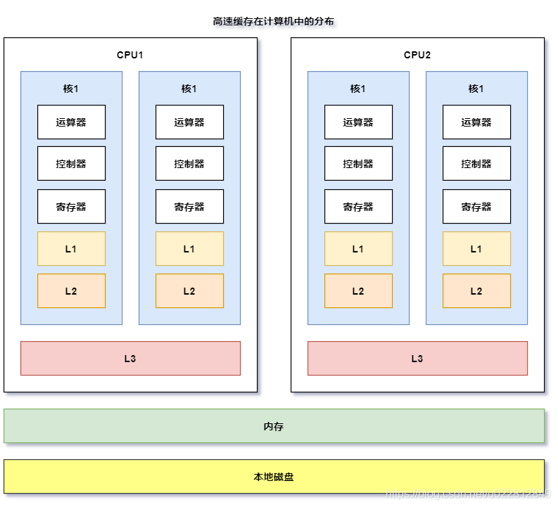

## volatile关键字

>   先说说volatile的两个作用

参考：

1. https://blog.csdn.net/u022812849/article/details/109257860
2. 并发编程的艺术

两个作用：1.可见性   2.防止指令重排序。

CPU对高速缓存的读取速度差不多是对内存的100倍，相差两个数量级。

#### 缓存行

​                                                                                                                                                                                                                                                                                                                                                                                                                                                                                                                                                                                                                                                                                                                                                                                                                                                                                                                                                                                                                                                                                                                                                                                                                                                                                                                                                                                                                                                                                                                                                                                                                                                                                                                                                                                                                                                                                                                                                                                                                                                                                                                                                                                                                                                                                                                                                                                                                                                                                                                                                                                                                                                                                                                                                                                                                                                                                                                                                                                                                                                                                                                                                                                                                                                                                                                                                                                                                                                                                                                                                                                                                                                                                                                                                                                                                                                                                                                                                                                                                                                                                                                                                                                                                                                                                                                                                                                                                                                                                                                                                                                                                                                                                                                                                                                                                                                                                                                                                                                                                                                                                                                                                                                                                                                                                                                                                                 缓存行（CacheLine）是位于**CPU和内存中间的高速缓存**。高速缓存一般分为三级，分别为L1、L2、L3，在计算机中的分布如下图：



一级缓存可分为一级指令缓存和一级数据缓存，一级指令缓存用于暂时存储并向CPU递送各类运算指令；一级数据缓存用于暂时存储并向CPU递送运算所需数据，这就是一级缓存的作用。CPU执行指令的速度非常快，所以要先预读一些指令到一级指令缓存中，如果数据和指令都放在L1中，一旦数据覆盖了指令，那么计算机将无法正确执行了，因此L1需要划分为两个区域，而L2和L3不需要参与指令的预读，所以不需要划分。

### 缓存一致性协议

在多核CPU中，由于存在高速缓存，一个数据会在多个核的高速缓存中存在副本，当一个核中的数据发生修改时，另一个核中的数据就会发生不一致性问题，而缓存一致性协议就是为了解决CPU的高速缓存中数据不一致的问题。

缓存一致性协议有很多种，如MSI，MESI，MOSI，Synapse，Firefly及DragonProtocol等。

下面主要介绍英特尔芯片提供的缓存一致性协议MESI，MESI是下面四个状态首字母大写的组合：

| 状态         | 描述 | 说明                                                         |
| ------------ | ---- | ------------------------------------------------------------ |
| M(modify)    | 修改 | 当前CPU刚修改完数据的状态，当前CPU拥有最新数据，其他CPU拥有失效数据，而且和主存数据不一致 |
| E(exclusive) | 独占 | 只有当前CPU中有数据，其他CPU中没有改数据，当前CPU的数据和主存的数据是一致的 |
| S(shared)    | 共享 | 当前CPU和其他CPU中都有共同的数据，并且和主存中的数据一致     |
| I(invalid)   | 失效 | 当前CPU中的数据失效，数据应该从主存中获取，其他CPU中可能有数据也可能无数据；当前CPU中的数据和主存中的数据被认为不一致。 |

MESI的主要原理为：当前CPU修改完数据后，当前CPU的数据状态为M（修改），修改其他CPU中的数据状态为I（失效），这样当其他CPU对这个数据进行操作时会先从内存中读取，从而保证数据的一致性。

### 局部性原理与缓存行

时间局部性：CPU读取数据时的顺序为寄存器->L1->L2->L3->内存，当从内存中读取到数据时，会一次将数据放入L3、L2、L1中，这样下次CPU再读取这个数据时直接从L1中获取，无需读取内存。CPU认为程序在短时间内有多次操作同一个数据的倾向，所以会将数据存储在高速缓存中。

空间局部性：CPU认为从内存中读取一个数据，下一次访问的很有可能是它旁边的数据，所以会进行预读取，目前工业界一次性预读取的大小一般为64Byte，这64个字节的大小一般称为缓冲行，也就是说CPU在读取数据的时候一次性读取一个缓冲行大小。

### volatile具体实现

在X86处理器下通过工具获取JIT编译器生成的汇编指令来查看对volatile进行写操作时，在X86处理器下通过工具获取JIT编译器生成的汇编指令来查看对volatile进行写操作时

1）将当前处理器缓存行的数据写回到系统内存。

2）这个写回内存的操作会使在其他CPU里缓存了该内存地址的数据无效。

为了提高处理速度，处理器不直接和内存进行通信，而是**先将系统内存的数据读到内部缓存（L1，L2或其他）后再进行操作**，但操作完不知道何时会写到内存。对声明了**volatile**的变量进行写操作，**JVM就会向处理器发送一条Lock前缀的指令，将这个变量所在缓存行的数据写回到系统内存**。但是，就算写回到内存，如果其他处理器缓存的值还是旧的，再执行计算操作就会有问题。所以，在多处理器下，为了保证各个处理器的缓存是一致的，就会实现**缓存一致性协议**，每个处理器通过**嗅探在总线上传播的数据来检查自己缓存的值是不是过期了**，当处理器发现自己缓存行对应的内存地址被修改，就会将当前处理器的缓存行设置成无效状态，当处理器对这个数据进行修改操作的时候，会重新从系统内存中把数据读到处理器缓存里。

也就是说lock指令有两个作用: 1.Lock前缀指令会引起处理器缓存回写到内存2.一个处理器的缓存回写到内存会导致其他处理器的缓存无效

### 使用优化

Linked-TransferQueue，它在使用volatile变量时，用一种追加字节的方式来优化队列出队和入队的性能。

***如何理解？***在使用Linked-TransferQueue时需要频繁的对队头和队尾进行操作，因为对于英特尔酷睿i7、酷睿、Atom和NetBurst，以及Core Solo和Pentium M处理器的L1、L2或L3缓存的**高速缓存行是64个字节宽**，**不支持部分填充缓存行**，这意味着，如果**队列的头节点和尾节点都不足64字节的话，处理器会将它们都读到同一个高速缓存行中**，在多处理器下每个处理器都会缓存同样的头、尾节点，当一个处理器试图修改头节点时，会将整个缓存行锁定，那么在缓存一致性机制的作用下，会导致其他处理器不能访问自己高速缓存中的尾节点，而队列的入队和出队操作则需要不停修改头节点和尾节点，所以在多处理器的情况下将会严重影响到队列的入队和出队效率。Doug lea使用追加到64字节的方式来填满高速缓冲区的缓存行，**避免头节点和尾节点加载到同一个缓存行，使头、尾节点在修改时不会互相锁定**.

不适用缓存行填充的情况：1缓存行非64字节宽的处理器，2共享变量不会被频繁地写.

### volatile防止指令重排序

```java
package com.morris.concurrent.volatiledemo;

public class DisOrder {
    private static int x = 0, y = 0;
    private static int a = 0, b = 0;
    public static void main(String[] args) throws InterruptedException {
        int i = 0;
        for (; ; ) {
            i++;
            x = 0;
            y = 0;
            a = 0;
            b = 0;
            Thread one = new Thread(() -> {
                a = 1;
                x = b;
            });

            Thread other = new Thread(() -> {
                b = 1;
                y = a;
            });
            one.start();
            other.start();
            one.join();
            other.join();
            if (x == 0 && y == 0) {
                System.err.println("第" + i + "次 (" + x + "," + y + "）");
                break;
            }
        }
    }
}
```

运行结果如下：

```java
第2082次 (0,0）
```

运行结果分析：假如不存在指令重排序，上面代码的执行顺序只会有以下几种情况

// 情况1
a = 1; // t1 | a=1
x = b; // t1 | x=0
b = 1; // t2 | b=1
y = a; // t2 | y = 1

// 情况2
b = 1; // t2 | b = 1
y = a; // t2 | y = 0
a = 1; // t1 | a = 1
x = b; // t1 | x= 1

// 情况3
a = 1; // t1 | a = 1
x = b; // t2 | x = 0
b = 1; // t2 | b = 1
y = a; // t1 | y = 1

// 情况4
x = b; // t2 | x = 0
a = 1; // t1 | a = 1
y = a; // t1 | y = 1
b = 1; // t2 | b = 1

不管出现哪种情况，x和y不可能同时为0，只有出现指令重排序，x和y才会同时为0，程序才会退出。

#### 单例模式标准写法

正因为有了指令重排序，才有了下面的**双重检查同步锁（Double Check Lock）+volatile实现懒汉式单例。**

如果对这个变量使用**volatile修饰**，那么jvm就会使用**内存屏障来防止指令重排序**。

#### ***那么什么时候可进行指令重排序呢？***

在JMM中，如果一个操作执行的结果需要对另一个操作可见，那么这两个操作之间必须要存在**happens- before关系**。这里提到的两个操作既可以是在一个线程之内，也可以是在不同线程之间。

对cpu来说，基本上任何指令都可以实现重排序，因为这样可以提高性能，除了一些lock或禁止重排序的指令外。

对jvm来说，jvm规范中提到了happens-before原则，也就是**不在下面8条原则中的指令都可以重排序**：

1.   程序次序原则：在一个线程内，代码按照编写时的次序执行（jvm会对指令重排序，但是会保证最终一致性）。

2.   锁定原则：如果一个锁是锁定状态，要先unlock后才能lock。

3.   volatile变量规则：对变量的写操作要先于对变量的读操作。

4.   传递规则：A先于B，B先于C，那么A先于C。

5.   线程启动规则：线程的start()方法先于run()方法运行。

6.   线程中断规则：线程收到了中断信号，那么之前一定有interrupt()。

7.   线程终结规则：线程的任务执行单元要发生在线程死亡之前。

8.   对象的终结规则：线程的初始化先于finalize()方法之前。

     

### 内存屏障又是如何防止指令重排序

内存屏障包含下面四条指令：

1. LoadLoad屏障：对于这样的语句Load1; LoadLoad; Load2，在Load2及后续读取操作要读取的数据被访问前，保证Load1要读取的数据被读取完毕。
2. StoreStore屏障：对于这样的语句Store1; StoreStore; Store2，在Store2及后续写入操作执行前，保证Store1的写入操作对其它处理器可见。
3. LoadStore屏障：对于这样的语句Load1; LoadStore; Store2，在Store2及后续写入操作被执行前，保证Load1要读取的数据被读取完毕。
4. StoreLoad屏障：对于这样的语句Store1; StoreLoad; Load2，在Load2及后续所有读取操作执行前，保证Store1的写入对所有处理器可见。