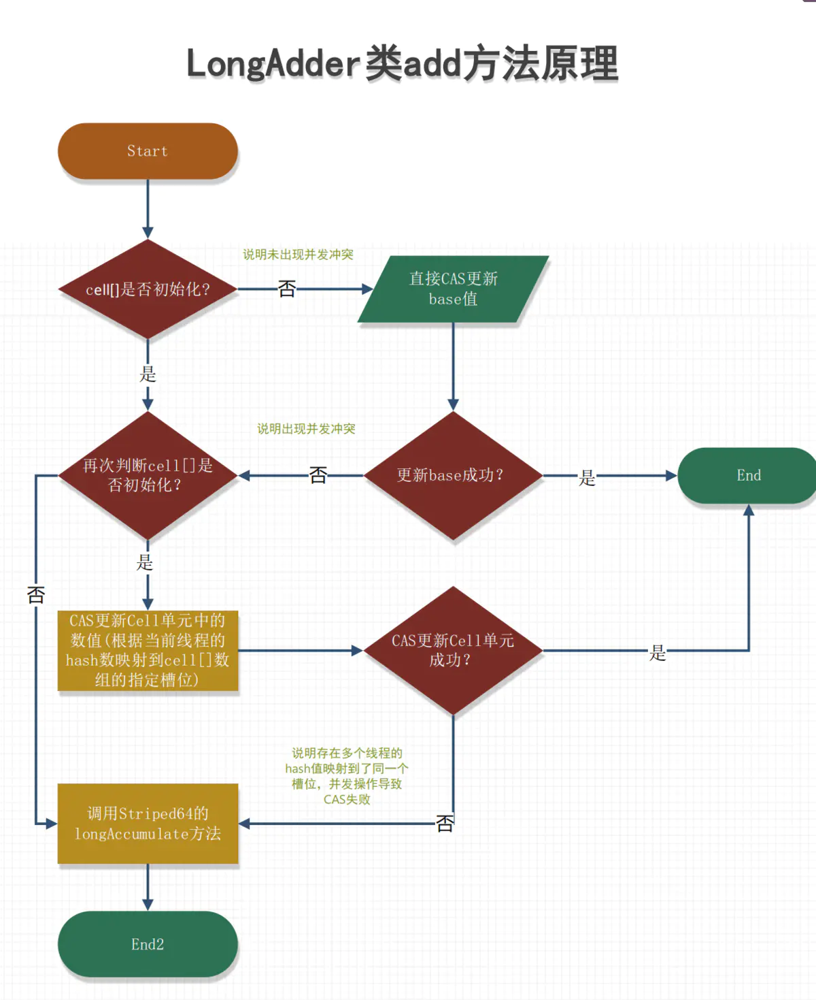
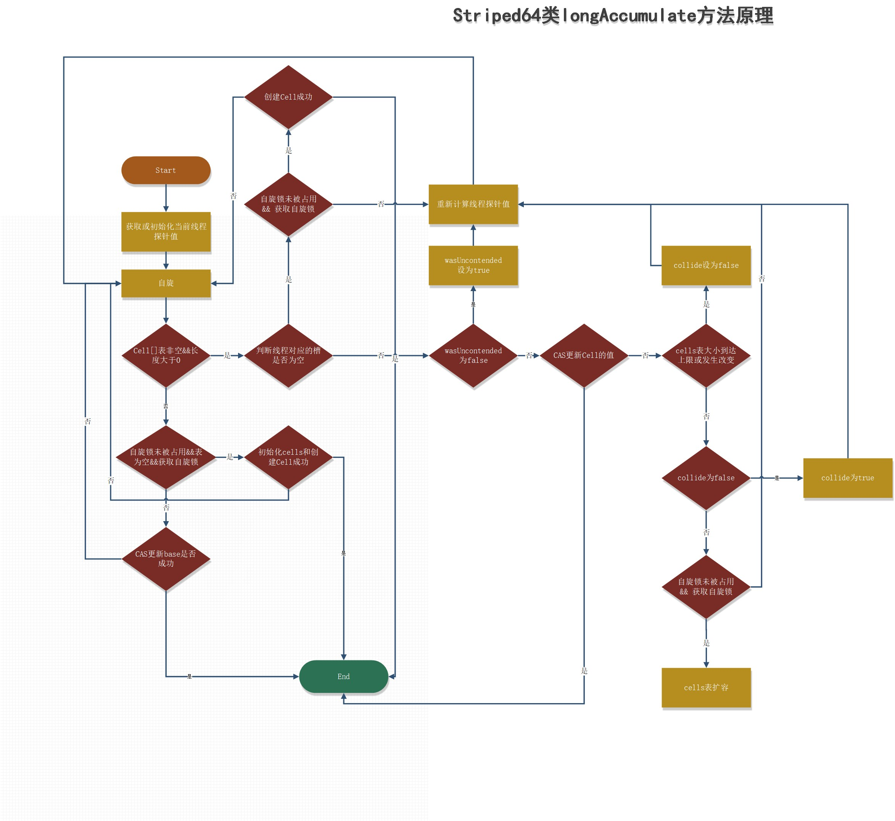

# 原子类解析

**AtomicLong**类的实现原理以及JDK 8中新增的**LongAdder**和**LongAccumulator**类的原理

### **AtomicLong 

 AtomicLong是作用是对长整形进行原子操作，是java.util.concurrent.atomic包下的一个提供原子操作的Long类型数据的类。在32位操作系统中，**64位的long 和 double 变量由于会被JVM当作两个分离的32位来进行操作**，所以不具有原子性。而使用AtomicLong能让long的操作保持原子型。

AtomicLong继承了Number类和Serializable接口，**一句话来说明Number类：所有的包装类（Integer、Long、Byte、Double、Float、Short）都是抽象类Number的子类**。

```java
public class AtomicLong extends Number implements java.io.Serializable{
    private static final Unsafe unsafe = Unsafe.getUnsafe();//获取底层的Unsafe实例
    private static final long valueOffset;//AtomicLong的值在内存地址的偏移量
    //记录底层JVM是否支持无锁比较和交换long。
	  // 虽然Unsafe.compareAndSwapLong方法在这两种情况下都可以工作
	  // 但是一些结构应该在Java级别进行处理，以避免锁定用户可见的锁。
	static final boolean VM_SUPPORTS_LONG_CAS = VMSupportsCS8();
	//AtomicLong当前值
	private volatile long value;
    static {
    	try {
        //获取valueOffset的偏移量，利用Unsafe类的内部方法进行对“value”获取其内存的偏移地址的，利用static的特性在类加载到内存中就获取到valueOffset的值。
        	valueOffset = unsafe.objectFieldOffset
            	(AtomicLong.class.getDeclaredField("value"));
    	} catch (Exception ex) { throw new Error(ex); }
	}

}
    
```

AtomicLong中的方法基本都是调用unsafe实例下的native方法来实现

```java
public final boolean compareAndSet(long expect, long update) {
    return unsafe.compareAndSwapLong(this, valueOffset, expect, update);
}
public final long getAndIncrement() {
        return unsafe.getAndAddLong(this, valueOffset, 1L);
    }
```

### LongAdder源码

https://www.jianshu.com/p/73ec78b4e336

**1）LongAdder的结构是怎样的？（2）当前线程应该访问Cell数组里面的哪一个Cell元素？（3）如何初始化Cell数组？（4）Cell数组如何扩容？（5）线程访问分配的Cell元素有冲突后如何处理？（6）如何保证线程操作被分配的Cell元素的原子性？**

AtomicLong通过CAS提供了**非阻塞的原子性操作**，但是**在高并发下大量线程会同时去竞争更新同一个原子变量**，但是由于同时只有一个线程的CAS操作会成功，在大量线程竞争失败后，会通过无限循环不断进行自旋尝试CAS的操作，白白浪费CPU资源。因此JDK 8新增了一个**原子性递增或者递减类LongAdder用来克服在高并发下使用AtomicLong的缺点**。既然AtomicLong的性能瓶颈是由于过多线程同时去竞争一个变量的更新而产生的，那么如果把一个变量分解为多个变量，让同样多的线程去竞争多个资源，是不是就解决了性能问题？是的，LongAdder就是这样做的。

LongAdder类继承自Striped64类，在Striped64内部维护着三个变量。LongAdder的真实值其实是base的值与Cell数组里面所有Cell元素中的value值的累加，base是个基础值，默认为0。cellsBusy用来实现自旋锁，状态值只有0和1，当创建Cell元素，扩容Cell数组或者初始化Cell数组时，使用CAS操作该变量来保证同时只有一个线程可以进行其中之一的操作。

##### cells源码

```java
@sun.misc.Contended static final class Cell {//让不同的cell元素不在一个缓存行，防止操作系统锁定缓存行
        volatile long value;//保证可见性
        Cell(long x) { value = x; }
        final boolean cas(long cmp, long val) {//对于每个段采用cas修改
            return UNSAFE.compareAndSwapLong(this, valueOffset, cmp, val);
        }
        // Unsafe mechanics
        private static final sun.misc.Unsafe UNSAFE;
        private static final long valueOffset;
        static {
            try {
                UNSAFE = sun.misc.Unsafe.getUnsafe();
                Class<?> ak = Cell.class;
                valueOffset = UNSAFE.objectFieldOffset
                    (ak.getDeclaredField("value"));
            } catch (Exception e) {
                throw new Error(e);
            }
        }
    }
```


##### add操作



```java
public void add(long x) {
    Cell[] as; long b, v; int m; Cell a;
  		/**
         * 如果一下两种条件则继续执行if内的语句
         * 1. cells数组不为null（不存在争用的时候，cells数组一定为null，一旦对base的cas操作失败，才会初始化cells数组）
         * 2. 如果cells数组为null，如果casBase执行成功，则直接返回，如果casBase方法执行失败（casBase失败，说明第一次争用冲突产生，需						要对cells数组初始化）进入if内；
         * casBase方法很简单，就是通过UNSAFE类的cas设置成员变量base的值为base+要累加的值
         * casBase执行成功的前提是无竞争，这时候cells数组还没有用到为null，可见在无竞争的情况下是类似于AtomticInteger处理方式，使用						cas做累加。
         */
    if ((as = cells) != null || !casBase(b = base, b + x)) {
        boolean uncontended = true;
    			 /** 如果进入if语句执行longAccumulate方法,有三种情况
             1. 前两个条件代表cells没有初始化，
             2. 第三个条件指当前线程hash到的cells数组中的位置还没有其它线程做过累加操作，
             3. 第四个条件代表产生了冲突,uncontended=false
             **/
        if (as == null || (m = as.length - 1) < 0 ||
            //getProbe（）则用于获取当前线程中变量threadLocalRandomProbe的值，这个值一开始为0
            (a = as[getProbe() & m]) == null ||!(uncontended = a.cas(v = a.value, v + x)))
            longAccumulate(x, null, uncontended);
    }
}
```

##### LongAccumulator类源码

LongAdder类是LongAccumulator的一个特例，LongAccumulator提供了比LongAdder更强大的功能，如下构造函数，其中accumulatorFunction是一个双目运算器接口，根据输入的两个参数返回一个计算值，identity则是LongAccumulator累加器的初始值。

```java
public LongAccumulator(LongBinaryOperator accumulatorFunction,long identity) {
        this.function = accumulatorFunction;
        base = this.identity = identity;
}
public interface LongBinaryOperator {
       //根据两个参数计算返回一个值
       long applyAsLong(long left, long right);
}
```

```java

LongAdder adder = new LongAdder();
//通过传入计算规则，LongAccumulator可以根据LongBinaryOperator去计算
LongAccumulator accumulator = new LongAccumulator(new LongBinaryOperator() {
        @Override
        public long applyAsLong(long left, long right) {
            return left + right;
        }
    }, 0);
```

```java
final void longAccumulate(long x, LongBinaryOperator fn,boolean wasUncontended) {
   
        int h;
        if ((h = getProbe()) == 0) {
            ThreadLocalRandom.current(); // force initialization
            h = getProbe();
            wasUncontended = true;
        }
  //collide=false表示cas冲突标志，表示当前线程hash到的Cells数组的位置，做cas累加操作时与其它线程发生了冲突，cas失败；collide=true代表有冲突，collide=false代表无冲突
        boolean collide = false;                // True if last slot nonempty
        for (;;) {
            Cell[] as; Cell a; int n; long v;
            //说明已经有cells数组，则从cells数组找到对应元素。
          	//这个主干if有三个分支
            //1.CASE1：处理cells数组已经正常初始化了的情况（这个if分支处理add方法的四个条件中的3和4）
            //2.CASE2：处理cells数组没有初始化或者长度为0的情况；（这个分支处理add方法的四个条件中的1和2）
            //3.CASE3：处理如果cell数组没有初始化，并且其它线程正在执行对cells数组初始化的操作，及cellbusy=1；则尝试将累加值通过cas累							加到base上
            //先看主分支一
            if ((as = cells) != null && (n = as.length) > 0) {
              /**
                 *CASE1：这个是处理add方法内部if分支的条件3：如果被hash到的位置为null，说明没有线程在这个位置设置过值，没有竞争，可以直接使用，则用x值作为初始值创建一个新的Cell对象，对cells数组使用cellsBusy加锁，然后将这个Cell对象放到cells[m%cells.length]位置上
                 */
                if ((a = as[(n - 1) & h]) == null) {//对应位置空
                    if (cellsBusy == 0) {       //cellsBusy == 0 代表当前没有线程cells数组做修改
                        Cell r = new Cell(x);   // Optimistically create
                        if (cellsBusy == 0 && casCellsBusy()) {//上锁
                            boolean created = false;
                            try {               // Recheck under lock
                                Cell[] rs; int m, j;
                                if ((rs = cells) != null &&
                                    (m = rs.length) > 0 &&
                                    rs[j = (m - 1) & h] == null) {
                                    rs[j] = r;
                                    created = true;//证明元素放进去了
                                }
                            } finally {
                                cellsBusy = 0;//自旋锁放开，别人可以对cells数组进行修改操作了
                            }
                            if (created)
                                break;
                            continue;           // Slot is now non-empty
                        }
                    }
                    collide = false;
                }
              /**
                 * case2：如果add方法中条件4的通过cas设置cells[m%cells.length]位置的Cell对象中的value值设置为v+x失败,说明已经发生									竞争，将wasUncontended设置为true，跳出内部的if判断，最后重新计算一个新的probe，然后重新执行循环;
                 */
                else if (!wasUncontended)       // CAS already known to fail
                    wasUncontended = true;      // Continue after rehash
               /**
                 * case3：新的争用线程参与争用的情况：处理刚进入当前方法时threadLocalRandomProbe=0的情况，也就是当前线程第一次参与cell争用的cas失败，这里会尝试将x值加到cells[m%cells.length]的value ，如果成功直接退出
                 */
                else if (a.cas(v = a.value, ((fn == null) ? v + x :
                     fn.applyAsLong(v, x))))
                    break;
                //当前cells的元素个数小于当前机器CPU个数并且当前多个线程访问了cells中同一个元素，从而导致冲突使其中一个线程CAS失败时才会进行扩容操作
              	 /**
                 *  case4:case3处理新的线程争用执行失败了，这时如果cells数组的长度已经到了最大值（大于等于cpu数量），或者是当前cells已经做了扩容，则将collide设置为false，后面重新计算prob的值
                 */
                else if (n >= NCPU || cells != as)
                    collide = false;            // At max size or stale
              
                else if (!collide)
                    collide = true;
                //扩容两倍
              
              /**
                 * case6:扩容cells数组，新参与cell争用的线程两次均失败，且符合库容条件，会执行该分支
                 */
                else if (cellsBusy == 0 && casCellsBusy()) {
                    try {
                        if (cells == as) {      // Expand table unless stale
                            Cell[] rs = new Cell[n << 1];
                            for (int i = 0; i < n; ++i)
                                rs[i] = as[i];
                            cells = rs;
                        }
                    } finally {
                        cellsBusy = 0;
                    }
                    collide = false;
                    continue;                   // Retry with expanded table
                }
                h = advanceProbe(h);//对CAS失败的线程重新计算当前线程的随机值threadLocalRandomProbe，以减少下次访问cells元素时的冲突机会
            }
            //初始化cells数组
          	//这个大的分支处理add方法中的条件1与条件2成立的情况，如果cell表还未初始化或者长度为0，先尝试获取cellsBusy锁。
            else if (cellsBusy == 0 && cells == as && casCellsBusy()) {
                boolean init = false;
                try {                           // Initialize table
                    if (cells == as) {
                        Cell[] rs = new Cell[2];
                        rs[h & 1] = new Cell(x);
                        cells = rs;
                        init = true;
                    }
                } finally {
                    cellsBusy = 0;
                }
                if (init)
                    break;
            }
            else if (casBase(v = base, ((fn == null) ? v + x :
                                        fn.applyAsLong(v, x))))
                break;                          // Fall back on using base
        }
    }
```



##### getProbe()方法hash的生成

在LongAdder的父类Striped64里通过getProbe方法获取当前线程的threadLocalRandomProbe值，线程对LongAdder的累加操作，在没有进入longAccumulate方法前，threadLocalRandomProbe一直都是0，当发生争用后才会进入longAccumulate方法中，进入该方法第一件事就是判断threadLocalRandomProbe是否为0，如果为0，则将其设置为`0x9e3779b9`。ThreadLocalRandom.current();判断如果probe的值为0，则执行locaInit()方法，将当前线程的probe设置为非0的值

```
static final void localInit() {
        //private static final int PROBE_INCREMENT = 0x9e3779b9;
        int p = probeGenerator.addAndGet(PROBE_INCREMENT);
        //prob不能为0
        int probe = (p == 0) ? 1 : p; // skip 0
        long seed = mix64(seeder.getAndAdd(SEEDER_INCREMENT));
        //获取当前线程
        Thread t = Thread.currentThread();
        UNSAFE.putLong(t, SEED, seed);
        //将probe的值更新为probeGenerator的值
        UNSAFE.putInt(t, PROBE, probe);
    }
```

##### 求和

***`需要注意的是，sum方法只能得到某个时刻的近似值，这也就是LongAdder并不能完全替代LongAtomic的原因之一。`\***
