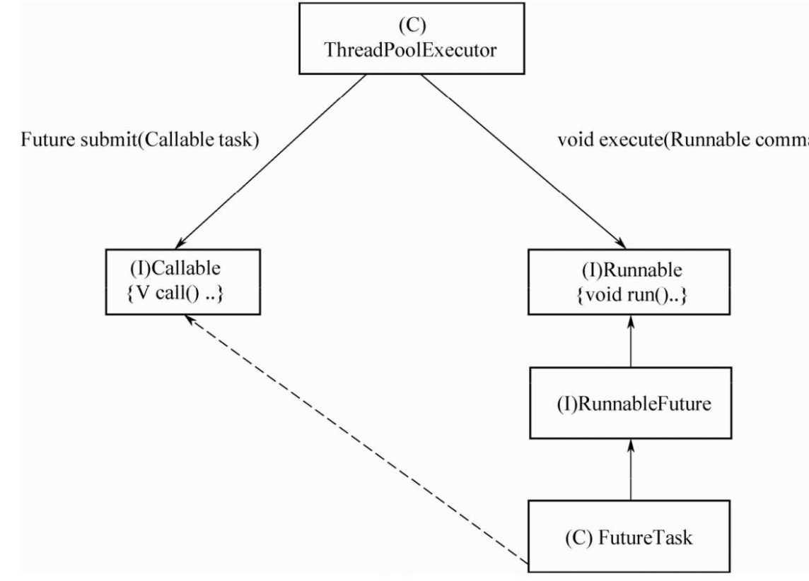

线程池
------

>   ##### 线程池的核心考点：
>
>   1.   创建方法，参数含义，自带线程池有哪些，阻塞队列有哪些，拒绝策略
>   2.   线程池线程数量计算
>   3.   线程池中的任务执行过程
>   4.   ctl前三位表示线程池状态，后29位表示线程的个数，线程池的状态有五种，分别是RUNNING、SHUTDOWN、STOP、TIDYING和TERMINATED
>   5.   线程池关闭shutDown->awaitTermination
>   6.   线程执行execute–>addWorker(新开一个线程worker去执行任务)
>   7.   worker源码：调用runWorker，加锁，获取任务，并执行线程的run方法->getTask(判断线程池状态，查看是否被中断，队列为空就会阻塞)

线程池 = 线程集合workerSet+阻塞队列workQueue，当用户向线程池提交一个任务(也就是线程)时，线程池会先将任务放入workQueue中。workerSet中的线程会不断的从workQueue中获取线程然后执行。当workQueue中没有任务的时候，worker就会阻塞，直到队列中有任务了就取出来继续执行。

https://blog.csdn.net/u013332124/article/details/79587436


#### 使用线程池的好处

我们不需要一个任务创建一个线程，节省了创建线程时候的开销，而且也线程执行完也不需要进行垃圾回收，减轻了垃圾回收的压力

### 创建线程池的几种方法

下面有两大类方法去创建线程，但是在《阿里巴巴Java开发手册》中，**明确禁止使用Executors创建线程池**（也就是第一种），并要求开发者**直接使用ThreadPoolExector或ScheduledThreadPoolExecutor进行创建**。这样做是为了强制开发者明确线程池的运行策略，使其对线程池的每个配置参数皆做到心中有数，以规避因使用不当而造成资源耗尽的风险。**而且六种现成的线程池他们使用的任务队列都是没有任务限制的，所以会有OOM或者内存不足的风险**。


###### 1.使用Executors创建线程池(不推荐，容易出错)

```java
 class TestThreadPoolExecutor {
    public static void main(String[] args) {
        //创建使用单个线程的线程池
        ExecutorService es1 = Executors.newSingleThreadExecutor();
        for (int i = 0; i < 10; i++) {
            es1.submit(new Runnable() {
                @Override
                public void run() {
                    System.out.println(Thread.currentThread().getName() + "正在执行任务");
                }
            });
        }
        //创建使用固定线程数的线程池
        ExecutorService es2 = Executors.newFixedThreadPool(3);
        for (int i = 0; i < 10; i++) {
            es2.submit(new Runnable() {
                @Override
                public void run() {
                    System.out.println(Thread.currentThread().getName() + "正在执行任务");
                }
            });
        }
        //创建一个会根据需要创建新线程的线程池
        ExecutorService es3 = Executors.newCachedThreadPool();
        for (int i = 0; i < 20; i++) {
            es3.submit(new Runnable() {
                @Override
                public void run() {
                    System.out.println(Thread.currentThread().getName() + "正在执行任务");
                }
            });
        }
        //创建拥有固定线程数量的定时线程任务的线程池
        ScheduledExecutorService es4 = Executors.newScheduledThreadPool(2);
        System.out.println("时间：" + System.currentTimeMillis());
        for (int i = 0; i < 5; i++) {
            es4.schedule(new Runnable() {
                @Override
                public void run() {
                    System.out.println("时间："+System.currentTimeMillis()+"--"+Thread.currentThread().getName() + "正在执行任务");
                }
            },3, TimeUnit.SECONDS);
        }
        //创建只有一个线程的定时线程任务的线程池
        ScheduledExecutorService es5 = Executors.newSingleThreadScheduledExecutor();
        System.out.println("时间：" + System.currentTimeMillis());
        for (int i = 0; i < 5; i++) {
            es5.schedule(new Runnable() {
                @Override
                public void run() {
                    System.out.println("时间："+System.currentTimeMillis()+"--"+Thread.currentThread().getName() + "正在执行任务");
                }
            },3, TimeUnit.SECONDS);
        }
    }
}
```

###### 2.使用ThreadPoolExector或ScheduledThreadPoolExecutor进行创建

```java
/**
参数：
   corePoolSize: 规定线程池有几个线程(worker)在运行。
   maximumPoolSize: 当workQueue满了,不能添加任务的时候，这个参数才会生效。规定线程池最多只能有多少个线程(worker)在执行。
   keepAliveTime: 超出corePoolSize大小的那些线程的生存时间,这些线程如果长时间没有执行任务并且超过了    keepAliveTime设定的时间，就会消亡。
   workQueue: 存放任务的队列
   threadFactory: 创建线程的工厂
   handler: 当workQueue已经满了，并且线程池线程数已经达到maximumPoolSize，将执行拒绝策略
**/
class TestThreadPoolExecutr {
    public static void test( int size){
        ThreadPoolExecutor poolExecutor = new ThreadPoolExecutor(5, 20, 2, TimeUnit.SECONDS, new LinkedBlockingQueue<>(5));

        for (int i = 0; i < size; i++) {
            poolExecutor.execute(new DemoTask(i));
            System.out.println("poolSize:" + poolExecutor.getPoolSize());
            System.out.println("corePoolSize:" + poolExecutor.getCorePoolSize());
            System.out.println("maximumPoolSize:" + poolExecutor.getMaximumPoolSize());
            System.out.println("queue:" + poolExecutor.getQueue().size());
            System.out.println("completedTaskCount:" + poolExecutor.getCompletedTaskCount());
            System.out.println("largestPoolSize:" + poolExecutor.getLargestPoolSize());
            System.out.println("keepAliveTime:" + poolExecutor.getKeepAliveTime(TimeUnit.SECONDS));
        }
        poolExecutor.shutdown();
    }
    public static void main(String[] args) {
    test(10);
    }
}
class DemoTask implements Runnable {

    private int taskNum;

    public DemoTask(int taskNum) {
        this.taskNum = taskNum;
    }
    @Override
    public void run() {
        System.out.println("正在执行" + taskNum+"20=");
        try {
            Thread.sleep(2000);
        } catch (InterruptedException e) {
            e.printStackTrace();
        }
        System.out.println("执行完毕" + taskNum+"20=");
    }

```

#### 任务提交


用户通过submit提交一个任务。线程池会执行如下流程:

1. 判断当前运行的worker数量是否超过corePoolSize,如果不超过corePoolSize。就创建一个worker直接执行该任务。—— 线程池最开始是没有worker在运行的
2. 如果正在运行的worker数量超过或者等于corePoolSize,那么就将该任务加入到workQueue队列中去。
3. 如果workQueue队列满了,也就是offer方法返回false的话，就检查当前运行的worker数量是否小于maximumPoolSize,如果小于就创建一个worker直接执行该任务。
4. 如果当前运行的worker数量是否大于等于maximumPoolSize，那么就执行RejectedExecutionHandler来拒绝这个任务的提交

##### 线程池的拒绝策略

当线程数超过最大线程数，且任务队列满，则会执行给定的拒绝策略，拒绝策略共有四种现成的，分别是：

- 第一种拒绝策略是 AbortPolicy，这种拒绝策略在拒绝任务时，会直接**抛出一个类型为 RejectedExecutionException 的 RuntimeException**，让你感知到任务被拒绝了，于是你便可以根据业务逻辑选择重试或者放弃提交等策略。
- 第二种拒绝策略是 DiscardPolicy，这种拒绝策略正如它的名字所描述的一样，**当新任务被提交后直接被丢弃掉，也不会给你任何的通知**，相对而言存在一定的风险，因为我们提交的时候根本不知道这个任务会被丢弃，可能造成数据丢失。
- 第三种拒绝策略是 DiscardOldestPolicy，如果线程池没被关闭且没有能力执行，则会**丢弃任务队列中的头结点，通常是存活时间最长的任务**，这种策略与第二种不同之处在于它丢弃的不是最新提交的，而是队列中存活时间最长的，这样就可以腾出空间给新提交的任务，但同理它也存在一定的数据丢失风险。
- 第四种拒绝策略是 CallerRunsPolicy，相对而言它就比较完善了，**当有新任务提交后，如果线程池没被关闭且没有能力执行，则把这个任务交于提交任务的线程执行，也就是谁提交任务，谁就负责执行任务。**这样做主要有两点好处。
  - 第一点新提交的任务不会被丢弃，这样也就不会造成业务损失。
  - 第二点好处是，由于谁提交任务谁就要负责执行任务，这样提交任务的线程就得负责执行任务，而执行任务又是比较耗时的，在这段期间，提交任务的线程被占用，也就不会再提交新的任务，减缓了任务提交的速度，相当于是一个负反馈。在此期间，线程池中的线程也可以充分利用这段时间来执行掉一部分任务，腾出一定的空间，相当于是给了线程池一定的缓冲期。

#### 六种常见的线程池

| 线程池                        | 说明                                                         | 任务队列            |
| ----------------------------- | ------------------------------------------------------------ | ------------------- |
| FixedThreadPool               | 核心线程数和最大线程数是一样的，到了核心线程就把任务放队列，不会再增加 | LinkedBlockingQueue |
| CachedThreadPool              | 线程数是几乎可以无限增加的（实际最大可以达到 Integer.MAX_VALUE，为 2^31-1 | SynchronousQueue    |
| ScheduledThreadPool           | 支持定时或周期性执行任务                                     | DelayedWorkQueue    |
| SingleThreadExecutor          | 核心线程和最大线程数都为1，可以用来保证线程的执行顺序        | LinkedBlockingQueue |
| SingleThreadScheduledExecutor | 核心线程为1，最大线程没有限制                                | LinkedBlockingQueue |
| ForkJoinPool                  | 可进行子任务的并行计算，然后再join合并结果                   | DelayedWorkQueue    |

#### 合适的线程数应该是多少

##### 	CPU 密集型任务

任务最佳的线程数为 CPU 核心数的 1~2 倍

###### 耗时 IO 型任务

任务最大线程数一般会大于 CPU 核心数很多倍，因为 IO 读写速度相比于 CPU 的速度而言是比较慢的，如果我们设置过少的线程数，就可能导致 CPU 资源的浪费。而如果我们设置更多的线程数，那么当一部分线程正在等待 IO 的时候，它们此时并不需要 CPU 来计算，那么另外的线程便可以利用 CPU 去执行其他的任务，互不影响，这样的话在任务队列中等待的任务就会减少，可以更好地利用资源。

> 《Java并发编程实战》的作者 Brain Goetz 推荐的计算方法:
>
>  				**线程数 = CPU 核心数 *（1+平均等待时间/平均工作时间）**
>
> 如果任务的平均等待时间长，线程数就随之增加，而如果平均工作时间长，也就是对于我们上面的 CPU 密集型任务，线程数就随之减少

#### 线程池停止方法

> - void shutdown;
>
> 调用 shutdown() 方法之后线程池会在执行完正在执行的任务和队列中等待的任务后才彻底关闭。后面如果还有新的任务被提交，线程池则会根据拒绝策略直接拒绝后续新提交的任务。
>
> - boolean isShutdown;
>
> 判断线程池是否已经开始了关闭工作，也就是是否执行了 shutdown 或者 shutdownNow 方法。
>
> - boolean isTerminated;
>
> 检测线程池是否真正“终结”了，这不仅代表线程池已关闭，同时代表线程池中的所有任务都已经都执行完毕了
>
> - boolean awaitTermination(long timeout, TimeUnit unit) throws InterruptedException;
>
> 传入一个时间，在这个时间中如果线程关闭返回true，如果在此期间被中断，抛出 InterruptedException 异常
>
> - List shutdownNow;
>
> 直接关闭

### 源码

#### 1. 提交任务相关源码

```java
public void execute(Runnable command) {
        if (command == null)
            throw new NullPointerException();
  //ctl把int的高3位拿来充当线程池状态的标志位,后29位拿来充当当前运行worker的数量
        int c = ctl.get();
        //workerCountOf(c)会获取当前正在运行的worker数量,利用前三位
        if (workerCountOf(c) < corePoolSize) {
            //如果workerCount小于corePoolSize,就创建一个worker然后直接执行该任务
            if (addWorker(command, true))
                return;
            c = ctl.get();//获取更新后ctl状态
        }
        //isRunning(c)是判断线程池是否在运行中,如果线程池被关闭了就不会再接受任务
        //workQueue将任务加入到队列中
        if (isRunning(c) && workQueue.offer(command)) {
            //如果添加到队列成功了,会再检查一次线程池的状态
            int recheck = ctl.get();
            //如果线程池关闭了,就将刚才添加的任务从队列中移除
            if (! isRunning(recheck) && remove(command))
                //执行拒绝策略
                reject(command);
            else if (workerCountOf(recheck) == 0)
                addWorker(null, false);
        }
        //如果加入队列失败,就尝试直接创建worker来执行任务
        else if (!addWorker(command, false))
            //如果创建worker失败,就执行拒绝策略
            reject(command);
}
```

##### addWorker源码

```java
private boolean addWorker(Runnable firstTask, boolean core) {
        retry:
        //使用自旋+cas失败重试来保证线程竞争问题
        for (;;) {
            //先获取线程池的状态
            int c = ctl.get();
            int rs = runStateOf(c);//runStateOf来表示work的数量
            // 如果线程池是关闭的,或者workQueue队列非空,就直接返回false,不做任何处理
          //分别对应（I）当前线程池状态为STOP、TIDYING或TERMINATED。（II）当前线程池状态为SHUTDOWN并且已经有了第一个任务。·（III）当前线程池状态为SHUTDOWN并且任务队列为空
            if (rs >= SHUTDOWN &&
                ! (rs == SHUTDOWN &&
                   firstTask == null &&
                   ! workQueue.isEmpty()))
                return false;
          /*
						自旋CAS来添加线程数量
          */
            for (;;) {
                int wc = workerCountOf(c);
                //根据入参core 来判断可以创建的worker数量是否达到上限,如果达到上限了就拒绝创建worker
                if (wc >= CAPACITY ||
                    wc >= (core ? corePoolSize : maximumPoolSize))
                    return false;
                //没有的话就尝试修改ctl添加workerCount的值。这里用了cas操作,如果失败了下一个循环会继续重试,直到设置成功
                if (compareAndIncrementWorkerCount(c))
                    //如果设置成功了就跳出外层的那个for循环
                    break retry;
                //CAS失败，则重读一次ctl,如果线程池的状态改变了，而且上面也更改失败,代表有别的线程对c有修改，会再重新循环一次，进行更改
                c = ctl.get();  // Re-read ctl
                if (runStateOf(c) != rs)//runStateOf来表示work的数量，在获取一次看是否与之前相同
                    continue retry;
            }
        }
					/*
						到这里说明上面的自旋CAS来添加线程数量，添加成功了，
						则下面开始真正的创建worker，将其加入到workers线程池中
          */
        boolean workerStarted = false;
        boolean workerAdded = false;
        Worker w = null;
        try {
            final ReentrantLock mainLock = this.mainLock;
            //创建一个worker,将提交上来的任务直接交给worker
            w = new Worker(firstTask);
            final Thread t = w.thread;
            if (t != null) {
                //加锁,防止竞争
                mainLock.lock();
                try {
                    int c = ctl.get();
                    int rs = runStateOf(c);
                    //还是判断线程池的状态
                    if (rs < SHUTDOWN ||
                        (rs == SHUTDOWN && firstTask == null)) {
                        //如果worker的线程已经启动了,会抛出异常
                        if (t.isAlive()) 
                              throw new IllegalThreadStateException();
                        //添加新建的worker到线程池中
                        workers.add(w);
                        int s = workers.size();
                        //更新历史worker数量的最大值
                        if (s > largestPoolSize)
                            largestPoolSize = s;
                        //设置新增标志位
                        workerAdded = true;
                    }
                } finally {
                    mainLock.unlock();
                }
                //如果worker是新增的,就启动该线程
                if (workerAdded) {
                    t.start();
                     //成功启动了线程,设置对应的标志位
                    workerStarted = true;
                }
            }
        } finally {
            //如果启动失败了,会触发执行相应的方法
            if (! workerStarted)
                addWorkerFailed(w);
        }
        return workerStarted;//返回标志位，看是否添加成功
}
```

##### 2. Worker的结构

用户线程提交任务到线程池后，由ThreadPoolExector的Worker来执行

ThreadPoolExecutor的runWorker方法：

```java
final void runWorker(Worker w) {
        //获取当前线程
        Thread wt = Thread.currentThread();
        Runnable task = w.firstTask;
        w.firstTask = null;
        //执行unlock方法,允许其他线程来中断自己
        w.unlock(); // allow interrupts
        boolean completedAbruptly = true;
        try {
            //如果前面的firstTask有值,就直接执行这个任务
            //如果没有具体的任务,就执行getTask()方法从队列中获取任务
            //这里会不断执行循环体,除非线程中断或者getTask()返回null才会跳出这个循环
            while (task != null || (task = getTask()) != null) {
                //执行任务前先锁住,这里主要的作用就是给shutdown方法判断worker是否在执行中的
                //shutdown方法里面会尝试给这个线程加锁,如果这个线程在执行,就不会中断它
                w.lock();
               //判断线程池状态,如果线程池被强制关闭了,就马上退出
                if ((runStateAtLeast(ctl.get(), STOP) ||
                     (Thread.interrupted() &&
                      runStateAtLeast(ctl.get(), STOP))) &&
                    !wt.isInterrupted())
                    wt.interrupt();
                try {
                    //执行任务前调用。预留的方法,可扩展
                    beforeExecute(wt, task);
                    Throwable thrown = null;
                    try {
                        //真正的执行任务，执行线程的run方法
                        task.run();
                    } catch (RuntimeException x) {
                        thrown = x; throw x;
                    } catch (Error x) {
                        thrown = x; throw x;
                    } catch (Throwable x) {
                        thrown = x; throw new Error(x);
                    } finally {
                       //执行任务后调用。预留的方法,可扩展
                        afterExecute(task, thrown);
                    }
                } finally {
                    task = null;
                    //记录完成的任务数量
                    w.completedTasks++;
                    w.unlock();
                }
            }
            completedAbruptly = false;
        } finally {
            processWorkerExit(w, completedAbruptly);
        }
}
```

getTask方法

```java
Runnable getTask() {
        boolean timedOut = false; 
        for (;;) {
            int c = ctl.get();
            int rs = runStateOf(c);
            // 如果线程池已经关闭了,就直接返回null,
            //如果这里返回null,调用的那个worker就会跳出while循环,然后执行完销毁线程
            //SHUTDOWN状态表示执行了shutdown()方法
            //STOP表示执行了shutdownNow()方法
            if (rs >= SHUTDOWN && (rs >= STOP || workQueue.isEmpty())) {
                decrementWorkerCount();
                return null;
            }
            //获取当前正在运行中的worker数量
            int wc = workerCountOf(c);

            // 如果设置了核心worker也会超时或者当前正在运行的worker数量超过了corePoolSize,就要根据时间判断是否要销毁线程了
            //其实就是从队列获取任务的时候要不要设置超时间时间,如果超过这个时间队列还没有任务进来,就会返回null
            boolean timed = allowCoreThreadTimeOut || wc > corePoolSize;
            //如果上一次循环从队列获取到的未null,这时候timedOut就会为true了
            if ((wc > maximumPoolSize || (timed && timedOut))
                && (wc > 1 || workQueue.isEmpty())) {
                //通过cas来设置WorkerCount,如果多个线程竞争,只有一个可以设置成功
                //最后如果没设置成功,就进入下一次循环,说不定下一次worker的数量就没有超过corePoolSize了,也就不用销毁worker了
                if (compareAndDecrementWorkerCount(c))
                    return null;
                continue;
            }
            try {
                //如果要设置超时时间,就设置一下咯
                //过了这个keepAliveTime时间还没有任务进队列就会返回null,那worker就会销毁
                Runnable r = timed ?
                    workQueue.poll(keepAliveTime, TimeUnit.NANOSECONDS) :
                    workQueue.take();
                if (r != null)
                    return r;
                //如果r为null,就设置timedOut为true
                timedOut = true;
            } catch (InterruptedException retry) {
                timedOut = false;
            }
        }
}
```


##### 关闭线程

>   1.   加锁
>   2.   更改线程池状态，设置中断标志位
>   3.   interruptIdleWorkers循环所有线程，将所有线程中断
>   4.   通过tryTerminate来切换状态，唤醒所有线程
>   5.   awaitTermination循环去判断线程池状态是否到达TERMINATED，并返回

调用hreadPoolExecutor的shutdown方法中断线程池，此时线程池就不会再接受新的任务了，但是工作队列里面的任务还是要执行的。该方法会立刻返回，并不等待队列任务完成再返回

```java
//ThreadPoolExecutor的方法
public void shutdown() {
        final ReentrantLock mainLock = this.mainLock;
        mainLock.lock();
        try {
          	//权限检查
            checkShutdownAccess();
            //设置线城市状态为SHUTDOWN
            advanceRunState(SHUTDOWN);
          //将中断标志位设置为true
            interruptIdleWorkers();//
            onShutdown(); // hook for ScheduledThreadPoolExecutor
        } finally {
            mainLock.unlock();
        }
        tryTerminate();
    }
```

将所有的空闲线程设置为中断

```java
private void interruptIdleWorkers(boolean onlyOne) {
        final ReentrantLock mainLock = this.mainLock;
        mainLock.lock();//上锁
        try {
            for (Worker w : workers) {//遍历所有的线程
                Thread t = w.thread;
                if (!t.isInterrupted() && w.tryLock()) {//如果没有被中断，且没有正在运行
                    try {
                        t.interrupt();
                    } catch (SecurityException ignore) {
                    } finally {
                        w.unlock();
                    }
                }
                if (onlyOne)
                    break;
            }
        } finally {
            mainLock.unlock();
        }
    }
```

tryTerminate通过CAS更改线程池的状态也就是c，

```java
//当workerCount为0，workerQueue为空时，先把状态切换到TIDYING，然后调用钩子函数terminated（）。当钩子函数执行完成时，把状态从TIDYING 改为TERMINATED，接着调用termination.sinaglAll（），通知前面阻塞在awaitTermination的所有调用者线程。
final void tryTerminate() {
    for (;;) {
        int c = ctl.get();
//      判断线程池状态
        if (isRunning(c) ||
            runStateAtLeast(c, TIDYING) ||
            (runStateOf(c) == SHUTDOWN && ! workQueue.isEmpty()))
            return;
        if (workerCountOf(c) != 0) { // Eligible to terminate
            interruptIdleWorkers(ONLY_ONE);
            return;
        }

        final ReentrantLock mainLock = this.mainLock;
        mainLock.lock();
        try {
          //CAS自旋更改状态
            if (ctl.compareAndSet(c, ctlOf(TIDYING, 0))) {
                try {
                    terminated();
                } finally {
                  //TERMINATED设置状态
                    ctl.set(ctlOf(TERMINATED, 0));
                  //唤醒因为调用termination的await方法被阻塞的线程
                    termination.signalAll();
                }
                return;
            }
        } finally {
            mainLock.unlock();
        }
        // else retry on failed CAS
    }
}
```

调用shutdownNow方法后，线程池就不会再接受新的任务了，并且会丢弃工作队列里面的任务，正在执行的任务会被中断，该方法会立刻返回，并不等待激活的任务执行完成。返回值为这时候队列里面被丢弃的任务列表

```java
public List<Runnable> shutdownNow() {
    List<Runnable> tasks;
    final ReentrantLock mainLock = this.mainLock;
    mainLock.lock();
    try {
        checkShutdownAccess();
        advanceRunState(STOP);
        interruptWorkers();//中断所有线程
        tasks = drainQueue();
    } finally {
        mainLock.unlock();
    }
    tryTerminate();
    return tasks;
}
```

通过shutdown来中断线程和awaitTermination来确认线程是否全部都关闭，当线程调用awaitTermination方法后，当前线程会被阻塞，直到线程池状态变为TERMINATED才返回，或者等待时间超时才返回

termination.signalAll()用来激活调用条件变量termination的await系列方法被阻塞的所有线程，所以如果在调用awaitTermination之后又调用了shutdown方法，并且在shutdown内部将线程池状态设置为TERMINATED，则termination.awaitNanos方法会返回。

另外在工作线程Worker的runWorker方法内，当工作线程运行结束后，会调用processWorkerExit方法，在processWorkerExit方法内部也会调用tryTerminate方法测试当前是否应该把线程池状态设置为TERMINATED，如果是，则也会调用termination. signalAll（）用来激活调用线程池的awaitTermination方法而被阻塞的线程。

而且当等待时间超时后，termination.awaitNanos也会返回，这时候会重新检查当前线程池状态是否为TERMINATED，如果是则直接返回，否则继续阻塞挂起自己。

```java

//定时的检测线程池是否关闭，
    public boolean awaitTermination(long timeout, TimeUnit unit)
        throws InterruptedException {
        long nanos = unit.toNanos(timeout);
        final ReentrantLock mainLock = this.mainLock;
        mainLock.lock();
        try {
            for (;;) {
//                查看线程池状态是不是TERMINATED
                if (runStateAtLeast(ctl.get(), TERMINATED))
                    return true;
//                查看设置的超时时间是否到达
                if (nanos <= 0)
                    return false;
                nanos = termination.awaitNanos(nanos);
            }
        } finally {
            mainLock.unlock();
        }
    }
```

### Callable与Future

Callable其实是用Runnable实现的。在submit内部，把Callable通过**FutureTask这个Adapter转化成Runnable**，然后通过execute执行。如图所示为Callable被转换成Runnable示意图




```java
public <T> Future<T> submit(Callable<T> task) {
        if (task == null) throw new NullPointerException();
  //传入Callable返回通过new FutureTask<T>(callable)返回RunnableFuture
        RunnableFuture<T> ftask = newTaskFor(task);
        execute(ftask);
        return ftask;
    }
```

FutureTask是一个Adapter对象。一方面，它实现了**Runnable接口，也实现了Future接口**；另一方面，它的内部包含了一个Callable对象，从而实现了把Callable转换成Runnable。

```java
public FutureTask(Callable<V> callable) {
        if (callable == null)
            throw new NullPointerException();
        this.callable = callable;
        this.state = NEW;       // ensure visibility of callable
}
//基于CASstate变量+park/unpark（）来实现阻塞—唤醒机制
public void run() {
        if (state != NEW ||
            !UNSAFE.compareAndSwapObject(this, runnerOffset,
                                         null, Thread.currentThread()))
            return;
        try {
            Callable<V> c = callable;
            if (c != null && state == NEW) {
                V result;
                boolean ran;
                try {
                    result = c.call();
                    ran = true;
                } catch (Throwable ex) {
                    result = null;
                    ran = false;
                    setException(ex);
                }
                if (ran)
                    set(result);
            }
        } finally {
            // runner must be non-null until state is settled to
            // prevent concurrent calls to run()
            runner = null;
            // state must be re-read after nulling runner to prevent
            // leaked interrupts
            int s = state;
            if (s >= INTERRUPTING)
                handlePossibleCancellationInterrupt(s);
        }
    }
```

### 线程池中用到的设计模式

##### 策略模式

在新创建一个线程池的时候，会在构造方法传入一个拒绝的策略，jdk内部封装了几个常用的拒绝策略，并抽象了拒绝策略的接口，供开发者去实现。

##### 装饰器模式

在使用到Executors类的时候，用到了`newSingleThreadExecutor`方法

```javascript
public static ExecutorService newSingleThreadExecutor(ThreadFactory threadFactory) {
    return new FinalizableDelegatedExecutorService (new 
    ThreadPoolExecutor(1, 1,0L, TimeUnit.MILLISECONDS, new 
   LinkedBlockingQueue<Runnable>(), threadFactory));
 }
```

在这里，jdk在创建单个线程池的时候用到了装饰器模式，原因是因为如果用`ThreadPoolExecutor`类，则用户可以手动修改核心线程的个数，这样就违背了单线程池的初衷，因此将`ThreadPoolExecutor`类装饰起来，取消掉setCoreSize等方法，仅暴露出`AbstractExecutorService`提供的抽象方法实现

```javascript
 static class DelegatedExecutorService extends AbstractExecutorService {
        private final ExecutorService e;
//间接调用该实现 为了屏蔽setXXX方法
        DelegatedExecutorService(ExecutorService executor) { e = executor; }
//...
        public void execute(Runnable command) { e.execute(command); }
        }
```
