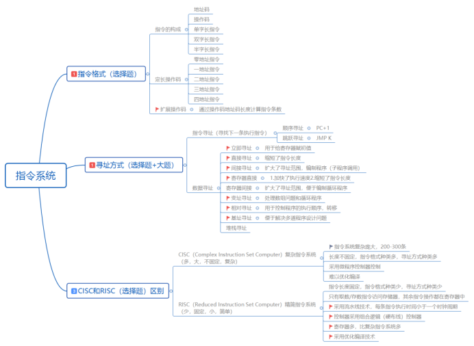

###  中断，异常，硬中断，软中断

***<u>外中断：</u>***指来自CPU执行指令以处的事件的发生，如设备发出的I/O结束中断，表示设备输入/输出处理已经完成，希望处理机能够向设备发下一个输入/输出请求，

同时让完成输入输出后的程序继续运行。**时钟中断**，表示一个固定的时间片已到，让处理机处理计时、启动定时运行的任务等。这一类中断通常是与当前程序运行无关的事件，即它们与当前处理机运行的程序无关。

*<u>**异常：**</u>*也叫内中断, cpu指令内部事件，分为自愿中断和强迫中断，非法操作码，地址越界

 **<u>*软中断*</u>**：由软件程序所引起的中断，**大部分都是人为主动引起的**，在内核中，硬中断可能会产生一个软中断，让其他线程去处理事件

*<u>**硬中断**</u>*：也叫硬件中断, 是由与系统相连的外设(比如网卡 硬盘 键盘等)自动产生的. 每个设备或设备集都有他自己的IRQ(中断请求)。

>  内中断中有一部分属于硬中断，即强迫中断中的硬件故障部分。外中断中外设的请求也会触发软中断。
>
> 硬中断的中断号是由中断控制器提供的（NMI 硬中断中断号系统指定为 02H）；软中断的中断号由指令直接给出，无需使用中断控制器。
>
> 软中断是由程序调用发生的,而硬中断是由外设引发的
>
> 硬件中断处理程序要确保它能快速地完成它的任务,这样程序执行时才不会等待较长时间。故而一般情况硬中断都要快与软中断结合使用。

##### **5.** 并发和并行的区别

##### **6.** 为什么要引入进程，进程定义，有什么组成

更好的支持和管理多道程序并发执行，

独立功能的程序在一个数据集上运行的过程，分配资源和调度的基本单位

### 进程的通信（IPC）

进程之间交换的信息量很少，比如仅仅交换某个状态信息，可以通过同步与互斥机制完成。但是大多数情况下，**进程之间需要交换大批数据**，比如传送一批信息或整个文件，这就需要通过一种新的通信机制来完成，也就是所谓的**进程通信**（交换数据）。

##### 1.管道通信（共享文件）

***匿名管道：***`command1 | command2`将前一个命令（command1）的输出，作为后一个命令（command2）的输入, 但是如果想实现相互通信（**全双工通信**），我们需要创建两个管道才行。用完了就会被自动销毁。只能用于父子进程之间的通信。管道就是一个文件，一种存在于内存中的文件。

> **匿名管道实现进程间通信的步骤：**
>
> 1）父进程创建两个匿名管道，管道 1（fd1[0]和 fd1[1]）和管道 2（fd2[0] 和 fd2[1]）；因为管道的数据是单向流动的，所以要想实现数据双向通信，就需要两个管道，每个方向一个。
>
> 2）父进程 fork 出子进程，于是对于这两个匿名管道，子进程也分别有两个文件描述符指向匿名管道的读写两端；
>
> 3）父进程关闭管道 1 的读端 fd1[0] 和 管道 2 的写端 fd2[1]，子进程关闭管道 1 的写端 fd1[1] 和 管道 2 的读端 fd2[0]，这样，管道 1 只能用于父进程写、子进程读；管道 2 只能用于父进程读、子进程写。管道是用**[环形队列](https://www.zhihu.com/search?q=环形队列&search_source=Entity&hybrid_search_source=Entity&hybrid_search_extra={"sourceType"%3A"answer"%2C"sourceId"%3A2342210654})**实现的，数据从写端流入从读端流出，这就实现了父子进程之间的双向通信。

**有名管道**：有名管道也就是提供一个路径名与之关联，这样，即使与创建有名管道的进程不存在亲缘关系的进程，只要可以访问该路径，就能够通过这个有名管道进行相互通信，使用`mkfifo myPipe`来进行创建，`echo "hello" > myPipe`写入数据，`cat < myPipe`读取数据

##### 2.消息队列（消息传递）

管道这种进程通信方式虽然使用简单，但是效率比较低，不适合进程间频繁地交换数据，并且管道只能传输无格式的字节流，**消息队列的本质就是存放在内存中的消息的链表，而消息本质上是用户自定义的数据结构**。如果进程从消息队列中读取了某个消息，这个消息就会被从消息队列中删除

> 它的特点：
>
> 1. 允许多个进程读写数据
> 2. 消息队列的生命周期随内核，如果没有释放消息队列或者没有关闭操作系统，消息队列就会一直存在
> 3. 但是消息队列的读写数据，会发生从用户态**拷贝**数据到内核态的过程，**如果数据量较大，使用消息队列就会造成频繁的系统调用，也就是需要消耗更多的时间以便内核介入**


##### 3.共享存储

**共享内存**就是允许不相干的进程将同一段物理内存连接到它们各自的地址空间中，使得这些进程可以访问同一个物理内存，这个物理内存就成为共享内存，对于共享内存机制来说，**仅在建立共享内存区域时需要系统调用，一旦建立共享内存，所有的访问都可作为常规内存访问**，无需借助内核，所以共享内存是最快的进程通信方式。

但是共享内存可能会遇到线程安全问题，需要考虑多个线程共同修改一块内存应该怎么办，而且共享内存的回收由创建的那个线程进行回收

##### 4.信号量和 PV 操作

对于多CPU系统，消息传递的性能其实是要优于共享内存的，因为**消息队列无需避免冲突，而共享内存机制可能会发生冲突**。由于需要避免冲突所以我们需要进行进程的同步和互斥工作，同步和互斥被称为进程的低级通信

信号量就是一个初始值为1的变量，用户进程可以通过使用操作系统提供的一对原语来对信号量进行操作，从而很方便的实现进程互斥或同步。这一对原语就是 PV 操作。**P 操作**：将信号量值减 1，表示**申请占用一个资源**；**V 操作**：将信号量值加 1，表示**释放一个资源**

所以使用信号量和PV操作我们可以实现进程的同步和互斥操作

> 同步操作：先执行的进行p操作，v操作释放资源了，后者执行的在进行p操作
>
> 互斥操作：同时进行p操作，等一个释放，剩下的在进行p操作

##### 5. 信号

信号是进程通信机制中唯一的**异步**通信机制，它可以在任何时候发送信号给某个进程。**通过发送指定信号来通知进程某个异步事件的发送，以迫使进程执行信号处理程序。信号处理完毕后，被中断进程将恢复执行**。用户、内核和进程都能生成和发送信号。

信号事件的来源主要有**硬件来源和软件来源**。所谓硬件来源就是说我们可以**通过键盘输入某些组合键给进程发送信号**，比如常见的组合键 Ctrl+C 产生 SIGINT 信号，表示终止该进程；而软件来源就是通过 **kill 系列的命令给进程发送信号**，比如 kill -9 1111 ，表示给 PID 为 1111 的进程发送 SIGKILL 信号，让其立即结束。

##### 6.Socket

用来**跨网络与不同主机上的进程进行通信**，

##### **8.** 为什么引入线程

减少程序并发执行所付出的时空开销，提高操作系统的并发性能，同一个进程中的线程切换只需要很少的

##### **9.** 线程和进程的区别

1.调度(进程)2.拥有资源（进程）3.并发(线程也可以)4.地址空间(线程内部独立)5.系统开销（线程）6.通信(进程通信，线程可以直接读取数据)

##### 10.调度的层次

作业调度，中级调度，进程调度，

作业调度是按照一定的规从处于后备状态的作业挑选一个或多个。给他们分配内存。输入输出设备等相应的资源并建立相应的进程。

中级调度室时那些暂时不能运行的进程。调至外存等待。

进程调度是按照某种方法和策略从就绪队列中选取一个进程，将处理机分配给他。是一种最基本的调度。

##### **10.** 调度算法。

先来先服务。短作业优先。优先级调度算法。高响应比优先(作业)。时间片轮转调度。多级反馈队列调度算法。

##### **11.** 为什么要使用处理机调度？

使用处理机调度可以让那些需要等待资源的进程调质外层等待。把当前处理积分配给有需要的进程。从而提高处理器的利用率和你的处女计算机软硬件资源

##### 12.为什么要引入进程同步？

在多道程序环境下，进程是并发执行的，不同的进程之间存在着不同的相互制约，由此引入了进程同步的概念。

 

##### 13.不同的进程之间会存在什么关系？

##### 14.原语，信号量

##### **15.** 经典的同步问题

生产者消费者问题。读者写者问题。哲学家进餐问题。吸烟者问题。

##### 5,什么是死锁,为什么会思索？产生死锁的条件。

因为竞争资源而造成的一种僵局。若无外力作用。这些进程将无法推进。

https://blog.csdn.net/qq_26553393/article/details/122281044

系统资源的竞争。进程顺序非法。 死锁产生的四个必要条件（**互斥条件**（一般不能破坏），**不可剥夺条件**（1.进程请求的资源一直不能满足，则释放手里的资源2.当进程需要的资源被其他线程所占有，可以由操作系统协助，将资源进行剥夺，实现起来复杂，也能造成之前的工作白费，降低系统吞吐量），**请求保持条件**（请求了一个资源，正在请求另外一个，没有满足就一直等待，可以一次将进程所需要的资源全部分配），循环等待条件（存在你等我，我等你的这种现象，可以采用顺序资源分配法，按资源编号递增的去申请资源））

写出线程死锁的代码：

```java
public class DeadLockDemo {
    private static Object resource1 = new Object();//资源 1
    private static Object resource2 = new Object();//资源 2
    public static void main(String[] args) {
        new Thread(() -> {
            synchronized (resource1) {
                System.out.println(Thread.currentThread() + "get resource1");
                try {
                    Thread.sleep(1000);
                } catch (InterruptedException e) {
                    e.printStackTrace();
                }
                System.out.println(Thread.currentThread() + "waiting get resource2");
                synchronized (resource2) {
                    System.out.println(Thread.currentThread() + "get resource2");
                }
            }
        }, "线程 1").start();

        new Thread(() -> {
            synchronized (resource2) {
                System.out.println(Thread.currentThread() + "get resource2");
                try {
                    Thread.sleep(1000);
                } catch (InterruptedException e) {
                    e.printStackTrace();
                }
                System.out.println(Thread.currentThread() + "waiting get resource1");
                synchronized (resource1) {
                    System.out.println(Thread.currentThread() + "get resource1");
                }
            }
        }, "线程 2").start();
    }
}
```


### 死锁的处理策略

预防死锁：

1. **破坏请求与保持条件** ：一次性申请所有的资源。
2. **破坏不剥夺条件** ：占用部分资源的线程进一步申请其他资源时，如果申请不到，可以主动释放它占有的资源。
3. **破坏循环等待条件** ：靠按序申请资源来预防。按某一顺序申请资源，释放资源则反序释放。破坏循环等待条件。

避免死锁（银行家算法），

检测和解除死锁。

##### **17.** 进程与程序的区别。

1. 进程包括程序。
2. 进程是程序及其数据在计算机上的一次运行活动是动态的概念。是一组有序指令的集合，是静态的概念。
3. 进程是程序的一次执行过程，它是动态的创建和消亡的。具有一定的生命周期。暂时存在的。而程序是一组代码的集合，是永远存在的。
4. 一个进程可以执行多个程序，一个程序也可构成多个进程，进程可创建进程，而程序不能形成新的程序。

##### **18.** 同步互斥的区别。

##### **19.** 要进行内存管理。

##### **20.** 逻辑地址和物理地址

##### **21.** 地址重定位，覆盖和交换

交换四把处等待状态。个程序。内存移到辅存把空间腾出来，这一过程叫做换出。把准备好竞争CPU的程序移到内存这个过程叫做换入。

##### **22.** 连续分配的方式

单一连续分配（内部碎片）。固定分区分配（内部碎片）。动态分区分配（外部碎片）。

##### **23.** ***\*非连续分配管理方式\****

##### 24.快表，局部性原理

时间局部性：循环操作

空间：数组类型

### 虚拟内存

##### **25.**为什么要引入虚拟内存

 多道程序并发执行，不仅使进程之间共享了存储器，还共享了主存。然而随着对处理器需求的，进程的执行速度会以某种平滑的方式慢下来。但是如果同时运行太多的进程，那就需要很多的内存。当一个程序没有足够的内存空间死件件下。应尝试一些其他可行的方法在逻辑上来扩充内存。

##### **26.** 虚拟内存怎么做到的

虚拟内存使用的外存上的空间来扩充内存空间。尽量的换入的的内存容量。所以虚拟内存技术调换页面时需要频繁的访问外存，会导致平均访问时间的下降。

##### **27.** 虚拟内存大小由什么决

虚拟内存大小<=内存+外存

虚拟内存<=计算机地址位数最大容量

##### 虚拟内存如何映射为物理内存

需要：

##### **28.** 文件共享

1. 与索引节点的共享方式(硬链接)。利用符号链实现文件共享。

##### 29.文件存储空间管理。

空闲表法。空闲链表法。位视图法，成组链接法

##### **30.**磁盘读写时间

寻找时间 磁头移到指定的磁道+延迟时间定位到扇区+传输时间 写入数据

##### **31.** 磁盘调度算法

先来先服务，最短寻找时间优先，扫描算法 循环扫描

##### **32.** DmA控制方式与中断控制方式的区别

中断控制方式在每个数据传输完成后中端cpu儿dma控制方式是在所要求传送素食中断CPU。

中断控制方式的数据在中断处理时是由CPU控制完成。而DMA控制方式是在dma控制器下完成。

dma存储器为中心，中断控制方式以cpu为中心。

DMA传输批量数据中断控制方式以字节为单位。

##### **33.** 假脱机技术

为了缓和CPU的高速性和iOS设备的低速性矛盾，引入了假脱机技术。该技术利用专门的外围控制机传输到高速磁盘上。输入井和输出井。输入缓冲区和输出缓冲区。输入进程和输出进程。

##### **34.** ***\*分页分段有什么异同？\****

目的，长度，地址空间，碎片，绝对地址

分页和分段都是采用离散分配方式，而且都要通过地址映射机构来实现地址变换。

不同点：①从功能上看，页是信息的物理单位，分页是为实现离散分配方式，以消除内存的外零头，提供内存利用率，是为了满足系统管理的需要；而段是信息的逻辑单位，它含有一组意义相对完整的信息，是为了满足用户的需要。②页的大小是由系统确定且固定不变的，而段的长度不固定，取决于用户编写的程序。④分页的作业地址空间是一维的，分段的作业地址空间是二维的。

##### ***\*34\*******\*.有哪些常用文件分配方式?分别有什么优缺点?\****

答：文件分配对应于文件的物理结构，是指如何为文件分配磁盘块。常用的磁盘空间分配方

法有三种：连续分配、链接分配和索引分配。

（1)连续分配，要求每个文件在磁盘上占有一组连续的块。优点：实现简单；存取速度快。缺点：文件长度不宜动态增加：反复增删文件后会产生外部碎片；只适用于长度固定的文件。

（2）链接分配，采取离散分配的方式，分为隐式链接分配和显式链接分配。隐式链接分配方式中，每个文件对应一个磁盘块的链表，磁盘块任意分布，除最后一个盘块外，每一个盘块都有指向下一个盘块的指针（类似数据结构中的链表)。优点：提高了磁盘空间利用率；对文件的增、删、改非常方便。缺点：无法直接访问盘块，只能通过指针顺序访问文件；指针消耗了一定的存储空间。显示链接，是指把用于链接文件各物理块的指针提取出来，显式地存放在内存里的一张链接表中，该表整个磁盘仅设置一张，由于分配给文件的所有盘块号都放在该表中，故称该表为文件分配表(FAT)。优点：显著提高了检素速度；减少了访问磁盘的次数。

(3)索引分配，把每个文件的所有的盘块号集中在一起构成索引块（表)。优点：可以随机

访问：易于文件的增删。缺点：索引表增加了存储空间的开销：索引表的查找策略对文件系统效率影响较大。

##### ***\*35\*******\*.引入缓冲区的目的是什么?\****

(1)缓和CPU与I/0设备间速度不匹配的矛盾。

(2)减少对CPU的中断频率，放宽对CPU中断响应时间的限制。

(3)解决基本数据单元大小(即数据粒度)不匹配的问题。

(4)提高CPU和I/0设备之间的并行性。

***\*36.\*******\*线程同步的方式有哪些？\****

临界区，互斥对象，信号量：计算机内部用来控制一个资源访问一种机制，通过PV操作来完成的

##### **37.** ***\*IO控制方式\****

程序直接控制：

中断驱动方式：

DMA方式：DMA方式的工作过程是：CPU接收到IO设备的DMA请求时，它给

IO控制器发出一条命令，启动DMA控制器，然后继续其他工作。之后CPU 就把控制操作委托给DMA控制器，由该控制器负责处理。DMA控制器直接与存储器交互，传送整个数据块，每次传送一个字，这个过程不需要CPU参与。当传送完成后，DMA控制器发送一个中断信号给处理器。因此只有在传送开始和结束时才需要CPU的参与。

DMA控制方式与中断驱动方式的主要区别是中断驱动方式在每个数据需要传输时中断

PU，而DMA控制方式则是在所要求传送的一批数据全部传送结束时才中断CPU：此外，中断区动方式数据传送是在中断处理时由CPU控制完成的，而DMA控制方式则是在DMA控制器的制下完成的。

通道方式：IO通道是指专门负责输入输出的处理机：IO通道方式是DMA方式的发展，它可以进一步减少CPU的干预，即把对一个数据块的读（或写）为单位的干预，减少为对一组数据块的读（或写）及有关的控制和管理为单位的干预。同时，又可以实现CPU、通道和IO设备三者的并行操作，从而更有效地提高整个系统的资源利用率。

##### ***\*38.DMA控制方式与中断控制方式\****

1）中断控制方式在每个数据传送完成后中断CPU，而DMA控制方式则是在所要求传送的一批数据全部传送结束时中断CPU。

2）中断控制方式的数据传送在电断处理时由CPU控制完成，而DMA控制方式则是在DNMA控制器的控制下完成。不过，在DMA控制方式中，数据传送的方向、存放数据的内存始址及传送数据的长度等仍然由CPU控制。

3）DMA方式以存储器为核心，中断控制方式以CPU为核心。因此DMA方式能与CPU并行工作。

4）DMA方式传输批量的数据，中断控制方式传输则以字节为单位。

##### 39.DMA控制方式与通道方式

在DMA控制方式中，在DMA控制器控制下设备和主存之间可以成批地进行数据交换而不

用CPU干预，这样既减轻了CPU的负担，也大大提高了IO数据传送的速度。通道控制方式与DMA控制方式类似，也是一种以内存为中心实现设备与内存直接交换数据的控制方式。不过在通道控制方式中，CPU只需发出启动指令，指出通道相应的操作和VO设备，该指令就可以启动通道并使通道从内存中调出相应的通道程序执行。与DMA控制方式相比，通道控制方式所需的CPU干预更少，并且一个通道可以控制多台设备，进一步减轻CPU的负担。另外，对通道来说，可以使用一些指令灵活改变通道程序，这点DMA控制方式无法做到。

 

2020年05.07结束

##### 页面置换算法

最佳置换算法，先进先出算法，**最近最少使用**，LFU（最少访问）

### MESI缓存一致性协议

程序局部性原理

### 从键盘输入一个字母，到显示出来，经过了哪些步骤？

https://www.cnblogs.com/xiaolincoding/p/13550711.html

当用户输入了键盘字符，**键盘控制器**就会产生扫描码数据，并将其缓冲在键盘控制器的寄存器中，紧接着键盘控制器通过总线给 CPU 发送**中断请求**（硬中断）。CPU 收到中断请求后，操作系统会**保存被中断进程的 CPU 上下文**，然后调用键盘的**中断处理程序**（软中断）。

键盘的中断处理程序是在**键盘驱动程序**初始化时注册的，那键盘**中断处理函数**的功能就是从键盘控制器的寄存器的缓冲区读取扫描码，再根据扫描码找到用户在键盘输入的字符，如果输入的字符是显示字符，那就会把扫描码翻译成对应显示字符的 ASCII 码，比如用户在键盘输入的是字母 A，是显示字符，于是就会把扫描码翻译成 A 字符的 ASCII 码。

得到了显示字符的 ASCII 码后，就会把 ASCII 码放到「读缓冲区队列」，接下来就是要把显示字符显示屏幕了，显示设备的驱动程序会定时从「读缓冲区队列」读取数据放到「写缓冲区队列」，最后把「写缓冲区队列」的数据一个一个写入到显示设备的控制器的寄存器中的数据缓冲区，最后将这些数据显示在屏幕里。显示出结果后，**恢复被中断进程的上下文**。

### CPU执行程序过程

冯诺依曼计算机模型：**中央处理器（CPU）、内存、输入设备、输出设备、总线**（*地址总线*）（*数据总线*）（*控制总线*）

拿Java程序的a = 1+2来看，首先会将程序编译为字节码文件->汇编语言->机器语言，从汇编语言来看，对于1,2由于是数据，所以通过load执行存放到内存，翻译为四条指令，load1 load2 add 和store四个指令。

上面是汇编代码的指令，我们会将汇编代码转为机器语言去执行，对于不同的操作系统指令集有不同的机器语言指令，这就分为了<u>复杂指令集和精简指令集</u>

指令也有操作数和操作码，还有不同的寻址方式



### Java程序是怎么执行的

 编译(.class字节码)，加载（类加载器），解释（字节码->汇编指令->机器指令，JIT及时编译），分配内存和资源（将指令加载到内存中），执行指令

分配内存后：将指令加载到内存中，装载到指令寄存器->译码器->读主存（缓存行，缓存填充）-》为每个进程分配时间片-》

内存空间：每个进程有自己的内存空间（映射为虚拟内存），

### 系统调用过程发生了什么

https://juejin.cn/post/6844903778278178824

> 操作系统通过中断从用户态转为内核态，中断一般有两个属性，**一个是中断号，一个是中断处理程序**。不同的中断有不同的中断号，每个中断号都对应了一个中断处理程序。在内核中有一个叫**中断向量表的数组**来映射这个关系。当中断到来时，cpu会暂停正在执行的代码，根据中断号去中断向量表找出对应的中断处理程序并调用。中断处理程序执行完成后，会继续执行之前的代码。
>
> 中断分为硬件中断和软件中断，我们这里说的是软件中断，软件中断通常是一条指令，使用这条指令用户可以手动触发某个中断
>
> 中断号是有限的，所有不会用一个中断来对应一个系统调用（系统调用有很多）。Linux下用int 0x80触发所有的系统调用，那如何区分不同的调用呢？对于每个系统调用都有一个系统调用号，在触发中断之前，会将系统调用号放入到一个固定的寄存器，0x80对应的中断处理程序会读取该寄存器的值，然后决定执行哪个系统调用的代码。

1. 执行到系统调用函数。系统调用函数通过int 0x80指令进入系统调用入口程序，并且把**系统调用号**放入%eax寄存器中，如果需要传递参数，则把参数放入%ebx，%ecx和%edx寄存器中，
2. 进入系统调用入口程序后，将相关寄存器压入内核堆栈，保护现场，然后检查系统调用号，在通过中断向量表取查找对应的系统调用，并执行，恢复现场

### 虚拟地址怎么进行转换

