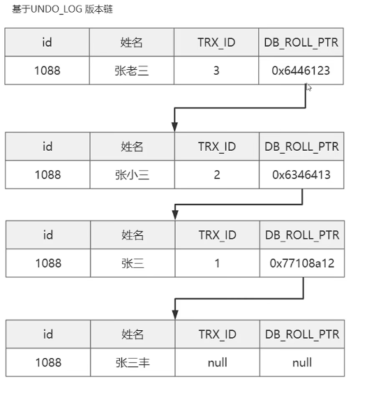

>   45讲核心点：
>   ------------
>
>   ***事务 :***03, **08，20**
>
>   **日志:**
>
>   **主从(分布式):**
>
>   **锁 :**06,07
>
>   **索引:**04,05,09,10,18,

### 第1&2讲：查询语句和更新语句都是怎么执行的

##### 查询语句：

mysql分为**server和存储引擎**，分别有**连接器，缓存，分析器，优化器，执行器**，分别经过这些地方，

再分析每个位置各自做的事情连接器(用户权限认证,管理连接)，查询缓存（弊大于利，已删除，通常使用外部缓存）,分析器（词法分析，语法分析，对sql做解析，查看语法有没有错误），优化器（使用什么索引&join表的连接顺序）,执行器（先判断有没有执行权限，一行一行的去判断（有索引则去满足索引条件的第一行，没有则去数据库第一行））

**分析器做的事情：**先做词法分析后做语法分析,词法分析主要做的是根据mysql的关键字进行验证和解析，而语法分析会在词法解析的基础上进一步做表名和字段名称的验证和解析；

##### 更新语句

更新语句会执行查询语句的每一个步骤，并且在更新之后，还涉及到两个重要的日志模块：redo log（重做日志）和 binlog（归档日志）。

***Redo Log:***

​	在更新的时候会先更新redo log和内存，在适当的时候进行刷盘

***Bin Log:***

​	binlog是归档日志

***两阶段提交：***第一阶段为prepare 第二阶段为commit。

>   1.  介绍Redo log和bin log，他们之间的区别
>   2.  两阶段提交是什么，不使用可不可以

### 第3讲：事务隔离

***事务四大特性：***ACID

***事务执行可能出现的问题：***脏读（dirty read）、不可重复读（non-repeatable read）、幻读（phantom read）

***事务隔离级别：***读未提交（read uncommitted）、读提交（read committed）、可重复读（repeatable read）和串行化（serializable ）

***事务启动方式：***

1.  显式启动事务语句， begin 或 start transaction。配套的提交语句是 commit，回滚语句是 rollback。 

2.  set autocommit=0，这个命令会将这个线程的自动提交关掉。意味着如果你只执行一个 select 语句，这个事务就启动了，而且并不会自动提交。这个事务持续存在直到你主动执行 commit 或 rollback 语句，或者断开连接。（尽量全设计为set autocommit=1）

    >   长事务的危害：会导致数据库中存在过早的事务视图，不能被删除，大量占用存储空间。
    >
    >   如何避免长事务对业务的影响？：

### 第4讲：索引（上）

***索引的实现方式：***

1.  hash表：哈希表这种结构适用于只有等值查询的场景，没有范围查询
2.  数组：有序数组索引只适用于静态存储引擎，也就是不会改变的数据
3.  N叉搜索树：最常用

**索引类型：**主键索引（聚簇）和非主键索引（需要回表）

### 第5讲：索引（下）

mysql中分为：普通索引，唯一索引，联合索引

**覆盖索引：**如果直接在非主键索引上查到需要的字段，则不需要回表

**最左前缀原则：**

**索引下推**：可以在索引遍历过程中，对**索引中包含的字段先做判断**，直接过滤掉不满足条件的记录，减少回表次数。

### 06 &07 | ：全局锁|表锁|行锁

### 第8讲： 事务到底是隔离的还是不隔离的？

##### 事务的启动时机

 **begin/start transaction** 命令当执行到它们之后的第一个操作 InnoDB 表的语句，事务才真正启动。这时**一致性视图是在第执行第一个快照读语句时创建的；**

**start transaction with consistent snapshot** 马上启动一个事务，立即创建一个一致性视图

##### “快照”在 MVCC 里是怎么工作的？

在可重复读隔离级别下，事务在启动的时候就“拍了个快照”。注意，这个快照是基于整库的。但是并不是把所有数据给拷贝出来，而是生成了一个唯一的事务 ID，叫作 transaction id，并且**顺序严格递增**的

**快照读：**read-view是一个数据结构里面存储了{m_ids:当前活跃事务编号集合；min_trx_id:最小活跃事务id;max_trx_id预分配id，也就是当前最大事务编号+1；creator_trx_id:read_view创建者事务编号}

**read-view版本访问规则：**1.判断是否为当前事务访问，是则可以，2.判断trx_id<min_trx_id，说明事务已经提交，可以访问3.判断trx_id>max_trx_id说明事务是在read-view之后生成的，不能访问 4.判断min_trx_id<trx_id<max_trx_id,成立则去m_ids中寻找，**找到则不能访问**

 InnoDB 为每个事务构造了一个数组，用来保存这个事务启动瞬间，当前正在“活跃”的所有事务 ID。“活跃”指的就是，启动了但还没提交。

总的来说在可重复读下，事务提交有三种情况：

1.  版本未提交，不可见；
2.  版本已提交，但是是在视图创建后提交的，不可见；
3.  版本已提交，而且是在视图创建前提交的，可见。

但是有一种情况比较特殊：**当前读：**updata语句， lock in share mode 或 for update，也都可以读到当前最新的数据

所以在当前读发生时，所有的操作都是基于当前版本已经提交的最新数据来查询或者更新的

##### undoLog版本链

UNDO_LOG版本链不会立即删除，而是mysql确定它一定不会被引用

##### **事务的可重复读的能力是怎么实现的？**

可重复读的核心就是**一致性读**（consistent read）；而事务更新数据的时候，只能用当前读。**如果当前的记录的行锁被其他事务占用的话，就需要进入锁等待。**

而读提交的逻辑和可重复读的逻辑类似，它们最主要的区别是：

*   在可重复读隔离级别下，只需要在事务开始的时候**创建一致性视图**，之后事务里的其他查询都共用这个一致性视图；
*   在读提交隔离级别下，**每一个语句执行前都会重新算出一个新的视图**。

##### 事务是如何实现的MVCC呢?

MVCC是基于数据版本对并发事务进行访问

(1)每个事务都有一个事务ID,叫做transaction id(严格递增)
		(2)事务在启动时,找到已提交的最大事务ID记为up_limit_id。
		(3)事务在更新一条语句时,比如id=1改为了id=2.会把id=1和该行之前的row trx_id写到undo log里,
并且在数据页上把id的值改为2,并且把修改这条语句的transaction id记在该行行头

注意：

*   **在快照读情况下，MySQL通过mvcc来避免幻读。**
*   **在当前读情况下，MySQL通过next-key来避免幻读**

##### 为什么rr能实现可重复读而rc不能,分两种情况

(1)快照读的情况下,rr不能更新事务内的up_limit_id,而rc每次会把up_limit_id更新为快照读之前最新已提交事务的transaction id,则rc不能可重复读
		(2)当前读的情况下,rr是利用record lock+gap lock来实现的,而rc没有gap,所以rc不能可重复读

### 第9讲：普通索引和唯一索引，应该怎么选择

##### 索引查询（性能差距不大）

**普通索引：**需要查找下一个记录，直到碰到第一个不满足条件的记录。

**唯一索引：**查找到第一个满足条件的记录后，就会停止

##### 更新过程

当更新一个数据页时，如果数据页在内存中就直接更新，如果数据页还没有在内存中，InooDB 会将这些更新操作**缓存在 change buffer** 中，在下次查询需要访问这个数据页的时候，将数据页读入内存，然后执行 change buffer 中与这个页有关的操作。将 change buffer 中的操作应用到原数据页，得到最新结果的过程称为 merge。除了访问这个数据页会触发 merge 外，系统有后台线程会定期 merge。在数据库正常关闭（shutdown）的过程中，也会执行 merge 操作。

而对于唯一索引来说：每次插入都需要判断是否违反**唯一性约束**，所以需要将数据页读入内存中，既然这样对于唯一索引的更新就可以直接在数据页上更新，不需要change buffer 。而普通索引不需要唯一性判断，所以可以使用change buffer 去更新，所以尽量使用普通索引可以提高性能

##### change buffer是写内存的，如果机器掉电重启，会不会导致 change buffer 丢失

会导致change buffer丢失，会导致本次未完成的操作数据丢失，但不会导致已完成操作的数据丢失。
		change buffer中分两部分，一部分是本次写入未写完的，一部分是已经写入完成的。
			1.针对未写完的，此部分操作，还未写入redo log，因此事务还未提交，所以没影响。
			2.针对，已经写完成的，可以通过redo log来进行恢复

### 第10讲: MySQL为什么有时候会选错索引？

##### 慢查询日志

long_query_time：超过这个值的sql语句会被记录在日志中，默认为10；可以看到具体语句，再使用分析工具分析

日志分析工具mysqldumpslow

>   mysqldumpslow是官方提供的慢查询日志分析工具。主要功能包括统计不同慢 sql 的
>
>   *   出现次数(Count)
>   *   执行耗费的平均时间和累计总耗费时间(Time)
>   *   等待锁耗费的时间(Lock)
>   *   发送给客户端的行总数(Rows)
>   *   扫描的行总数(Rows)
>   *   用户以及 SQL 语句本身(抽象了一下格式，比如 limit 1, 20 用 limit N,N 表示)

##### 优化器选择索引

优化器会根据扫描行数，是否回表，是否使用索引，临时表等信息来判断使用哪个索引效率更高。

**扫描行数是怎么判断的？**一个索引上不同的值越多，这个索引的区分度就越好。而一个索引上不同的值的个数，我们称之为“基数”（cardinality）。也就是说，这个基数越大，索引的区分度越好。通过**show index的cardinality可以查看区分度**，但是这个区分度其实是通过**取样**来得到的，所以结果可能不准确，而选错索引的罪魁祸首也是它

##### 索引选择异常和处理

有时候Mysql会选错索引，导致Sql语句很慢，所以我们可以考虑使用**force index 强行选择一个索引**，来矫正mysql的选择，如果不想这样做（因为需要更改sql语句，并且索引变化，还需要更改sql）,那我们可以修改我们的语句，让其自动选择我们期望的索引，第三种方法我们可以**新建一个更合适的索引，来提供给优化器做选择，或删掉误用的索引。**

### 11 | 怎么给字符串字段加索引？

1.   前缀索引：但是需要定义好长度，增加区分度，否则可能会增加很多扫描的次数；还有可能对覆盖索引有影响。
2.   **倒序存储**：不支持范围查询,只支持等值查询，会增加扫描次数
3.   **hash 字段**: 不支持范围查询，支持等值查询，查询比较快，稳定

### 12讲：Mysql突然变慢的原因分析

##### 刷脏页

1.   Redo log满：redos log 满了之后，innodb需要将数据刷入磁盘

2.   内存不足：内存不足的时候需要淘汰页面，这个页面可能是脏页所以需要将脏页进行刷盘

3.   Mysql认为空闲的时候
4.   Mysql关闭的时候

##### InnoDB 刷脏页的控制策略

所以为了防止这种情况我们需要有控制脏页比例的机制，来尽量避免上面的这两种情况

*   怎么去确定自己innodb_io_capacity的大小，通过脏页比例和redo log写入速度来决定。
*   innodb_flush_neighbors 参数就是用来控制刷脏页时相邻脏页也刷，innodb_flush_neighbors 值为 1 的时候会有上述的“连坐”机制，值为 0 时表示不找邻居，自己刷自己的。

### 13 | 表数据删掉一半，表文件大小不变？

一个 InnoDB 表包含两部分，即：表结构定义和数据。在MySQL 8.0 版本前，表结构是存在以.frm 为后缀的文件里。 MySQL 8.0 版本，<u>可以把表结构定义放在系统数据表中。因为表结构定义占用的空间很小</u>，所以我们今天主要讨论的是表数据。

##### 参数 innodb_file_per_table

表数据既可以存在共享表空间里，也可以是单独的文件。由参数 innodb_file_per_table 控制的：建议设置为ON

1.  这个参数设置为 OFF 表示的是，表的数据放在系统共享表空间，也就是跟数据字典放在一起；
2.  这个参数设置为 ON 表示的是，每个 InnoDB 表数据存储在一个以 .ibd 为后缀的文件中

##### 数据删除流程

删除某个记录，Innodb会将记录标为删除，下次直接复用盘文件的大小并不会缩小。如果删除了整个页，则整个数据页就可以被复用。

但是数据页是可以复用在任何地方的，而记录只能是满足上下条件的进行复用。

进一步地，如果我们用 delete 命令把整个表的数据删除呢？结果就是，所有的数据页都会被标记为可复用。但是磁盘上，文件不会变小。

以上我们称为空洞现象，不但删除会造成**空洞**，**插入也会**。也就是说，经过大量增删改的表，都是可能是存在空洞的。所以，如果能够把这些空洞去掉，就能达到收缩表空间的目的。

##### 重建表

MySQL 5.5 版本之前，可以使用 alter table A engine=InnoDB 命令来重建表，如果在这个过程中，有新的数据要写入到表 A 的话，就会造成数据丢失。因此，在整个 DDL 过程中，表 A 中不能有更新。也就是说，这个 DDL 不是 Online 的。

**MySQL 5.6 版本开始引入的 Online DDL，对这个操作流程做了优化**。

Online DDL 流程，**允许增删改查**

1.  建立一个临时文件，扫描表 A 主键的所有数据页；
2.  用数据页中表 A 的记录生成 B+ 树，存储到临时文件中；
3.  生成临时文件的过程中，将所有对 A 的操作记录在一个日志文件（row log）中；
4.  临时文件生成后，将日志文件中的操作应用到临时文件，得到一个逻辑数据上与表 A 相同的数据文件；
5.  用临时文件替换表 A 的数据文件。

 GitHub 开源的 gh-ost ，可以更安全的实现重建表

##### Online 和 inplace？（TODO）

使用 optimize table、analyze table 和 alter table 这三种方式重建表的区别：

*   从 MySQL 5.6 版本开始，alter table t engine = InnoDB（也就是 recreate）默认的就是上面图 4 的流程了；
*   analyze table t 其实不是重建表，只是对表的索引信息做重新统计，没有修改数据，这个过程中加了 MDL 读锁；
*   optimize table t 等于 recreate+analyze。
*   Truncate =drop+create

### 14.count(*)为什么这么慢

##### count(*) 的实现方式

*   MyISAM 引擎把一个表的总行数存在了磁盘上，因此执行 count(*) 的时候会直接返回这个数，效率很高。
*   InnoDB 引擎执行 count(*) 的时候，需要把数据一行一行地从引擎里面读出来，然后累积计数。

##### 为什么 InnoDB 不跟 MyISAM 一样把数字存起来呢？

多版本并发控制（MVCC）的原因，即使是在同一个时刻的多个查询，InnoDB 表“应该返回多少行”也是不确定的

##### count(*) 优化方式

普通索引树比主键索引树小很多。对于 count(*) 这样的操作，遍历哪个索引树得到的结果逻辑上都是一样的。因此，MySQL 优化器会找到最小的那棵树来遍历，而` show table status 命令`输出中的TABLE_ROWS 用于显示这个表当前有多少行，他是通过随机采样进行估算的，官方文档说误差可能达到 40% 到 50%。**所以，show table status 命令显示的行数也不能直接使用**

##### 其他的计数方式

1.   缓存，可能会丢失更新，最重要的是可能出现数据不一致问题
2.   将计算值存在数据库中，使用数据库事务来解决不一致的问题。

##### 不同的 count 用法

count(*)、count(主键 id) 和 count(1) 都表示返回满足条件的结果集的总行数；而 count(字段），则表示返回满足条件的数据行里面，参数“字段”不为 NULL 的总个数。

**对于 count(主键 id) 来说**，InnoDB 引擎会遍历整张表，把每一行的 id 值都取出来，返回给 server 层。server 层拿到 id 后，判断不爲空，就按行累加。

**对于 count(1) 来说**，InnoDB 引擎遍历整张表，但不取值。server 层对于返回的每一行，放一个数字“1”进去，判断是不可能为空的，按行累加。

**对于 count(字段) 来说**：

1.  如果这个“字段”是定义为 not null 的话，一行行地从记录里面读出这个字段，判断不能为 null，按行累加；
2.  如果这个“字段”定义允许为 null，那么执行的时候，判断到有可能是 null，还要把值取出来再判断一下，不是 null 才累加。

按照效率排序的话，count(字段)<count(主键 id)<count(1)≈count(* )，所以我建议你，尽量使用 count(*)

### 16 | “order by”是怎么工作的？

##### 全字段排序

在我们执行`select city,name,age from t where city='杭州' order by name limit 1000  ;`语句时，mysql会进行全字段排序，也就是将city=杭州的从索引中查找出来，放到内存中，进行快排，然后去前100个结果，不过可能由于数据太大，品牌需也有可能需要使用外部排序，这取决于排序所需的内存和参数sort_buffer_size，我们可以通过打开`SET optimizer_trace='enabled=on'; `查看 OPTIMIZER_TRACE 的结果来确认的，你可以从 number_of_tmp_files 中看到是否使用了临时文件。

number_of_tmp_files 表示的是，排序过程中使用的临时文件数,外部排序一般使用归并排序算法。，**将排序的数据分成 12 份，每一份单独排序后存在这些临时文件中。然后把这 12 个有序文件再合并成一个有序的大文件。**

##### rowid 排序

`max_length_for_sort_data`，是 MySQL 中专门控制用于排序的行数据的长度的一个参数。如果单行的长度超过这个值，MySQL 就认为单行太大，要换一个算法,单行太大，加载到内存的就是需要排序的字段+id，排序完后就可以通过主键索引id去查找剩余的字段，所以**rowid 排序多访问了一次表 t 的主键索引**

所以对比<u>rowid 排序</u>和<u>全字段排序</u>如果内存够mysql就会优先使用内存，提高效率，但是内存不够就只能多访问一次磁盘。

##### order by不用排序的情况

当mysql取出的数据天然有序的话，就不会再使用排序算法排序，而是直接将访问的记录添加到结果集，**使用了覆盖索引**

### 17 | 如何正确地显示随机消息？

从数据库随机去三个值，我们应该怎么做`mysql> select word from words order by rand() limit 3;`使用这个sql语句会发生什么，通过explain 命令我们可以看到Extra 字段显示 Using temporary，表示的是需要使用临时表；Using filesort，表示的是需要执行排序操作。

具体他是怎么做的呢？对于上节的Order by排序**对于 InnoDB 表来说**有全字段排序和rowId排序，全字段排序主要是用于减少磁盘访问，而对于内存表，mysql就会使用rowid 排序，具体的执行流程：

1.  创建一个临时表。这个临时表使用的是 memory 引擎，表里有两个字段，第一个字段是 double 类型，为了后面描述方便，记为字段 R，第二个字段是 varchar(64) 类型，记为字段 W。并且，这个表没有建索引。
2.  从 words 表中，按主键顺序取出所有的 word 值。对于每一个 word 值，调用 rand() 函数生成一个大于 0 小于 1 的随机小数，并把这个随机小数和 word 分别存入临时表的 R 和 W 字段中，到此，扫描行数是 10000。
3.  现在临时表有 10000 行数据了，接下来你要在这个没有索引的内存临时表上，按照字段 R 排序。
4.  初始化 sort_buffer。sort_buffer 中有两个字段，一个是 double 类型，另一个是整型。
5.  从内存临时表中一行一行地取出 R 值和位置信息（我后面会和你解释这里为什么是“位置信息”），分别存入 sort_buffer 中的两个字段里。这个过程要对内存临时表做全表扫描，此时扫描行数增加 10000，变成了 20000。
6.  在 sort_buffer 中根据 R 的值进行排序。注意，这个过程没有涉及到表操作，所以不会增加扫描行数。
7.  排序完成后，取出前三个结果的位置信息，依次到内存临时表中取出 word 值，返回给客户端。这个过程中，访问了表的三行数据，总扫描行数变成了 20003。

由上**order by rand() 使用了内存临时表，内存临时表排序的时候使用了 rowid 排序方法。**

##### 磁盘临时表

tmp_table_size 这个配置限制了内存临时表的大小，默认值是 16M。如果临时表大小超过了 tmp_table_size，那么内存临时表就会转成磁盘临时表。

磁盘临时表使用的引擎默认是 InnoDB，是由参数 internal_tmp_disk_storage_engine 控制的。

但是我们把tmp_table_size 设置成非常小，再次执行order by rand() limit 3语句，会发现OPTIMIZER_TRACE中的number_of_tmp_files 临时文件为0，这是因为MySQL 5.6 版本引入的一个新的排序算法，即：**优先队列排序算法**，也就是说我们使用最小堆，只需要存储三个最小的R值就可以了，不需要对剩余的数据进行排序，但是还有一个问题， limit 1000那我们就需要维护超过1000的堆，超过设置的 sort_buffer_size 大小，就不能使用优先队列算法。

##### 随机排序方法

只选择一个随机值，如何做：

1.  取得这个表的主键 id 的最大值 M 和最小值 N;
2.  用随机函数生成一个最大值到最小值之间的数 X = (M-N)*rand() + N;
3.  取不小于 X 的第一个 ID 的行。

但是上面算法的问题在于 id 分别是 1、2、40000、40001，那么渠道后面40000、40001的几率就会远大于1,2的几率。

为了得到严格随机的结果，你可以用下面这个流程:

1.  取得整个表的行数，并记为 C。
2.  取得 Y = floor(C * rand())。 floor 函数在这里的作用，就是取整数部分。
3.  再用 limit Y,1 取得一行。

但是如果出现Y非常大，那么也可能会导致limit耗时较大，但直接 order by rand() 比起来，执行代价还是小很多的（因为此算法limit获取数据的时候是根据主键排序获取的，主键天然索引排序。获取到第9999条的数据也远比order by rand()方法的组成临时表R字段排序再获取rowid代价小的多。）

随机取三行，扫描行数为C+(Y1+1)+(Y2+1)+(Y3+1)

假设Y1，Y2，Y3是由小到大的三个数，则可以优化成这样，这样扫描行数为Y3

1.   id1 = select * from t limit @Y1，1；

2.   id2= select * from t where id > id1 limit @Y2-@Y1，1；
3.   select * from t where id > id2 limit @Y3 - @Y2，1；

### 18 | 导致索引失效？

##### 案例一：对索引字段进行函数操作

注意，对字段进行函数计算，<u>并不是会使数据库完全放弃使用这个索引</u>，还可能使用这个索引，但是<u>可能会全索引扫描</u>

注意：索引字段不能进行**函数操作**，但是索引字段的参数可以玩函数（其参数可以使用函数）

##### 案例二：隐式类型转换

##### 案例三：隐式字符编码转换

两个比较，字符集不同，那么可能会造成字符隐式转换

### 19 | 为什么我只查一行的语句，也执行这么慢

##### 第一类：长时间不返回

1.等 MDL 锁

https://segmentfault.com/a/1190000021212804（MDL锁）

**MDL锁**主要作用是维护表元数据的数据一致性，在表上有活动事务的时候，不可以对元数据进行写入操作。

大概率是表 t 被锁住了。一般都是首先执行一下 <u>show processlist 命令</u>，看看当前语句处于什么状态，state字段可以显示当前语句的状态，可以找到持有MDL锁的语句kill掉

2.等 flush

有一个线程正要对表 t 做 flush 操作，不过正常情况下flush操作也很快，非常有可能flush操作被别的线程堵住了

3.等行锁

##### 第二类：查询慢

带 lock in share mode 的 SQL 语句，是**当前读**，所以速度很快；而 select * from t where id=1 这个语句，是一致性读，因此需要从 最新的结果开始开始，依次执行 undo log，执行了 100 万次以后，才将 一致性读的 结果返回。

### 20 | 幻读是什么，幻读有什么问题？

**脏读:** 对于两个事物 T1, T2, T1 读取了已经被 T2 更新但还没有被提交的字段. 之后, 若 T2 回滚, T1读取的内容就是临时且无效的. 

**不可重复读:** 对于两个事物 T1, T2, T1 读取了一个字段, 然后 T2 更新了该字段. 之后, T1再次读取同一个字段, 值就不同了. 

**幻读:** 对于两个事物 T1, T2, T1 从一个表中读取了一个字段, 然后 T2 在该表中插入了一些新的行. 之后, 如果 T1 再次读取同一个表, 就会多出几行. 

|                         事务隔离级别                         | 可能出现的问题         | 解决办法 |
| :----------------------------------------------------------: | ---------------------- | -------- |
|                 读未提交（read uncommitted）                 | 脏读、不可重复读和幻读 |          |
|        读提交（read committed）可以读到已经提交的数据        | 不可重复读和幻读问题   |          |
| 可重复读（repeatable read）//除非当前读，否则不能读到已提交的数据 | 幻读                   |          |
|                   串行化（serializable ）                    | 所有问题都可以避免     |          |

##### 为什么可重复读可能发生幻读

首先：只有<u>当前读</u>模式下，才有可能发生幻读问题，幻读问题是因为出现了之前查询没有出现的行，如果是对已有的行进行操作，会加锁，但是对于没有出现的行，则没有办法加锁，所以才会出现两次的查询结果不同

所以如何解决这个问题呢？引入了间隙锁（Gap Lock），间隙锁和行锁合称 next-key lock，每个 next-key lock 是**前开后闭区间**，**Gap Lock为开区间**，虽然Gap Lock的引入解决了幻读问题，但是又引入了新的问题--**死锁**，如果不想使用间隙锁，可以考虑将隔离级别设为读提交，这样就没有间隙锁了，但需要解决可能出现的数据和日志不一致问题，需要把 binlog 格式设置为 row，这也是现在不少公司使用的配置组合。

##### 半一致性读

这是一种夹在**普通读和锁定读**之间的一种读取方式。它只在<u>`READ COMMITTED`隔离级别下使用`UPDATE`语句</u>时才会使用。具体的含义就是当`UPDATE`语句读取已经被其他事务加了锁的记录时，`InnoDB`会将该记录的最新提交的版本读出来，然后判断该版本是否与`UPDATE`语句中的`WHERE`条件相匹配，如果不匹配则不对该记录加锁，从而跳到下一条记录；如果匹配则再次读取该记录并对其进行加锁。这样子处理只是为了让`UPDATE`语句尽量少被别的语句阻塞。

### 21 | 深入理解间隙锁的加锁原则？

**我总结的加锁规则里面，包含了两个“原则”、两个“优化”和一个“bug”。**

1.  原则 1：加锁的基本单位是 next-key lock。希望你还记得，next-key lock 是前开后闭区间。
2.  原则 2：查找过程中访问到的对象才会加锁。
3.  优化 1：索引上的等值查询，给唯一索引加锁的时候，next-key lock 退化为行锁。
4.  优化 2：索引上的等值查询，向右遍历时且最后一个值不满足等值条件的时候，next-key lock 退化为间隙锁。
5.  一个 bug：唯一索引上的范围查询会访问到不满足条件的第一个值为止。

### 23 | MySQL是怎么保证数据不丢的？

##### page cache和Buffer cache

##### binlog 的写入机制

事务执行过程中，先把日志写到 binlog cache，事务提交的时候，再把 binlog cache 写到 binlog 文件（先到文件系统的page cache）中。

一个事务的 **binlog 是不能被拆开的**，因此不论这个事务多大，也要确保一次性写入。这就涉及到了 binlog cache 的保存问题。

每个线程有自己 binlog cache，但是共用同一份 binlog 文件。

*   图中的 write，指的就是指把日志写入到<u>文件系统的 page cache</u>，并没有把数据持久化到磁盘，所以速度比较快。
*   图中的 fsync，才是将数据持久化到磁盘的操作。一般情况下，我们认为 f<u>sync 才占磁盘的 IOPS</u>。

write 和 fsync 的时机，是由参数 sync_binlog 控制的：

1.  sync_binlog=0 的时候，表示每次提交事务都只 write，不 fsync；
2.  sync_binlog=1 的时候，表示每次提交事务都会执行 fsync；
3.  sync_binlog=N(N>1) 的时候，表示每次提交事务都 write，但累积 N 个事务后才 fsync。

##### redo log 的写入机制

 <u>redo log buffer和change buffer？？</u>

事务在执行过程中，生成的 redo log 是要先写到 redo log buffer 的。然后在wirte到文件系统的page cache上 ，在持久化到磁盘上

为了控制 redo log 的写入策略，InnoDB 提供了 innodb_flush_log_at_trx_commit 参数，它有三种可能取值：

1.  设置为 0 的时候，表示每次事务提交时都只是把 redo log 留在 redo log buffer 中 ;
2.  设置为 1 的时候，表示每次事务提交时都将 redo log 直接持久化到磁盘；
3.  设置为 2 的时候，表示每次事务提交时都只是把 redo log 写到 page cache。

***什么情况下会出现没有提交的事务写入到磁盘？***

1.   InnoDB 有一个后台线程，每隔 1 秒，就会把 **redo log buffer 中的日志**，调用 write 写到文件系统的 page cache，然后调用 fsync 持久化到磁盘。

注意，事务执行中间过程的 redo log 也是直接写在 redo log buffer 中的，这些 redo log 也会被后台线程一起持久化到磁盘。也就是说，一个没有提交的事务的 redo log，也是可能已经持久化到磁盘的。

2.   **redo log buffer 占用的空间即将达到 innodb_log_buffer_size 一半的时候，后台线程会主动写盘**
3.   **并行的事务提交的时候，顺带将这个事务的 redo log buffer 持久化到磁盘**

##### 组提交

TODO(没懂)

### 24 | MySQL是怎么保证主备一致的？

一个事务日志同步的完整过程是这样的：

1.  在备库 B 上通过 change master 命令，设置主库 A 的 IP、端口、用户名、密码，以及要从哪个位置开始请求 binlog，这个位置包含文件名和日志偏移量。
2.  在备库 B 上执行 start slave 命令，这时候备库会启动两个线程，就是图中的 io_thread 和 sql_thread。其中 io_thread 负责与主库建立连接。
3.  主库 A 校验完用户名、密码后，开始按照备库 B 传过来的位置，从本地读取 binlog，发给 B。
4.  备库 B 拿到 binlog 后，写到本地文件，称为中转日志（relay log）。
5.  sql_thread 读取中转日志，解析出日志里的命令，并执行。

##### binLog的三种格式

statement：记录的SQL语句的原文

row：binlog 里面记录了真实删除行的主键 id，优点是安全，缺点是很占空间。比如你用一个 delete 语句删掉 10 万行数据，用 statement 的话就是一个 SQL 语句被记录到 binlog 中，占用几十个字节的空间。但如果用 row 格式的 binlog，就要把这 10 万条记录都写到 binlog 中

mixed：两种方式的混合，

##### 对于三种SQL语句delete、insert 和 update：

​	执行的是 delete 语句，row 格式的 binlog 也会把被删掉的行的整行信息保存起来。所以，如果你在执行完一条 delete 语句以后，发现删错数据了，可以直接把 binlog 中记录的 delete 语句转成 insert，把被错删的数据插入回去就可以恢复了。

如果你是执行错了insert 语句呢？那就更直接了。row 格式下，insert 语句的 binlog 里会记录所有的字段信息，这些信息可以用来精确定位刚刚被插入的那一行。这时，你直接把 insert 语句转成 delete 语句，删除掉这被误插入的一行数据就可以了。

如果执行的是 update 语句的话，binlog 里面会记录修改前整行的数据和修改后的整行数据。所以，如果你误执行了 update 语句的话，只需要把这个 event 前后的两行信息对调一下，再去数据库里面执行，就能恢复这个更新操作了

##### 循环复制

双M结构，如果两个服务器互为备库，那么在A服务器上生成的binlog会发给B服务器，B服务器在生成binlog，发给A就可能造成循环复制的问题，所以如何解决呢？

MySQL 在 binlog 中记录了**这个命令第一次执行时所在实例的 server id**。因此，我们可以用下面的逻辑，来解决两个节点间的循环复制的问题：

1.  规定两个库的 server id 必须不同，如果相同，则它们之间不能设定为主备关系；
2.  一个备库接到 binlog 并在重放的过程中，**生成与原 binlog 的 server id 相同的新的 binlog；**
3.  每个库在收到从自己的主库发过来的日志后，先判断 server id，如果跟自己的相同，表示这个日志是自己生成的，就直接丢弃这个日志。

### 25 | MySQL是怎么保证高可用的？

seconds_behind_master，用于表示当前备库延迟了多少秒。

##### 主备延迟

1.   备库机器性能比主库差
2.   备库上除了处理主库过来的同步日志，还做了其他的一些工作，导致多个任务都在争抢资源，备库来不及处理同步日志，导致主备延迟
3.   大事务，如果一个事务在主库上执行10分钟，那么在同步到从库上，就可能导致主备延迟较久，所以不要**一次性地用 delete 语句删除太多数**，可以考虑分组多批次的进行删除

##### 主备延迟如何解决

**可靠性优先策略：**等待备库完成同步，再开启查询，但是主备延迟时间或长或短，如果太长可能导致系统长时间不可用

**可用性优先策略：**将binlog设置为row格式，数据不一致问题更容易被发现，如果为statement，则可能悄无声息的导致数据不可用问题

### 26 |备库并行复制

这节主要的话题是：**备库并行复制能力**

**在主库上，**影响并发度的原因就是各种锁了。由于 InnoDB 引擎支持行锁，除了所有并发事务都在更新同一行（热点行）这种极端场景外，它对业务并发度的支持还是很友好的。

**在备库上的执行**，就是图中备库上 sql_thread 更新数据 (DATA) 的逻辑。如果是用单线程的话，就会导致备库应用日志不够快，造成主备延迟。所以Mysql引入了**多线程并行复制**。

但多线程复制由于多个线程顺序的不确定性，所以可能会出现一些问题：

1. 如果采用轮询，不同事物分给不同的worker，那么同一行上的两个事务，在主库和备库上的执行顺序相反，会导致主备不一致的问题。
2. 同一个事务的多个更新语句，一个事务更新了表 t1 和表 t2 中的各一行，如果这两条更新语句被分到不同 worker 的话，虽然最终的结果是主备一致的，但如果表 t1 执行完成的瞬间，备库上有一个查询，就会看到这个事务“更新了一半的结果”，破坏了事务逻辑的隔离性。

所以有了以下两个规定：

1.  不能造成更新覆盖。这就要求更新同一行的两个事务，必须被分发到同一个 worker 中。
2.  同一个事务不能被拆开，必须放到同一个 worker 中。

##### MySQL 5.5 版本的并行复制策略

**按表分发：**如果两个事务更新不同的表，它们就可以并行，但如果有跨表的事务，还是要把两张表放在一起考虑的

每个事务在分发的时候，跟所有 worker 的冲突关系包括以下三种情况：

1.  如果跟所有 worker 都不冲突，coordinator 线程就会把这个事务**分配给最空闲的 woker**;
2.  如果跟多于一个 worker 冲突，coordinator 线程就进入等待状态，直到和这个事务存在冲突关系的 worker 只剩下 1 个；
3.  如果只跟一个 worker 冲突，coordinator 线程就会把这个事务分配给这个存在冲突关系的 worker。

所以这种策略在多个表负载均匀的场景里应用效果很好。但是，如果碰到热点表，所有事务都会被分配到同一个 worker 中，就变成单线程复制了

**按行分发**：：如果两个事务没有更新相同的行，它们在备库上可以并行执行。显然，这个模式要求 binlog 格式必须是 row。

##### MySQL 5.6 版本的并行复制策略

用于决定分发策略的 hash 表里，key 就是数据库名。

相比于按表和按行分发，这个策略有两个优势：

1.  构造 hash 值的时候很快，只需要库名；而且一个实例上 DB 数也不会很多，不会出现需要构造 100 万个项这种情况。
2.  不要求 binlog 的格式。因为 statement 格式的 binlog 也可以很容易拿到库名。

但是，如果你的主库上的表都放在同一个 DB 里面，这个策略就没有效果了

##### MySQL 5.7 的并行复制策略

没懂 还要再看

### 27 | 主库出问题了，从库怎么办？

本节说的是一主多从情况下，主库故障后的主备切换问题。

##### 基于位点的主备切换

##### GTID

上面通过 `sql_slave_skip_counter` 跳过事务和通过 `slave_skip_errors `忽略错误的方法，虽然都最终可以建立从库 B 和新主库 A’的主备关系，但这两种操作都很复杂，而且容易出错。所以，MySQL 5.6 版本引入了 GTID.

GTID 的全称是 Global Transaction Identifier，也就是全局事务 ID，是一个事务在提交的时候生成的，是**这个事务的唯一标识**。它由两部分组成server_uuid:gno,

*   server_uuid 是一个实例第一次启动时自动生成的，是一个全局唯一的值；
*   gno 是一个整数，初始值是 1，**每次提交事务的时候**分配给这个事务，并加 1。

GTID 模式的启动也很简单，我们只需要在启动一个 MySQL 实例的时候，加上参数 `gtid_mode=on` 和 `enforce_gtid_consistency=on` 就可以了。

在 GTID 模式下，每个事务都会跟一个 GTID 一一对应。这个 GTID 有两种生成方式，而使用哪种方式取决于 session 变量 gtid_next 的值。

1.   gtid_next=automatic，代表使用默认值,就会把gtid_next 设置为server_uuid:gno；

2.   如果 gtid_next 是一个指定的 GTID 的值，也就是current_gtid，那么

     a. 如果 current_gtid 已经存在于实例的 GTID 集合中，接下来执行的这个事务会**直接被系统忽略**；
     b. 如果 current_gtid 没有存在于实例的 GTID 集合中，就将这个 current_gtid 分配给事务，也就是说系统不需要给这个事务生成新的 GTID，因此 gno 也不用加 1；

     一个 current_gtid 只能给一个事务使用。这个事务提交后，如果要执行下一个事务，就要执行 set 命令，把 gtid_next 设置成另外一个 gtid 或者 automatic

     

### 33 | 查询数据太多会不会把 内存打爆？

取数据和发数据的流程是这样的：

1.  获取一行，写到 net_buffer 中。这块内存的大小是由参数 net_buffer_length 定义的，默认是 16k。
2.  重复获取行，直到 net_buffer 写满，调用网络接口发出去。
3.  如果发送成功，就清空 net_buffer，然后继续取下一行，并写入 net_buffer。
4.  如果发送函数返回 EAGAIN 或 WSAEWOULDBLOCK，就表示本地网络栈（socket send buffer）写满了，进入等待。直到网络栈重新可写，再继续发送。

所以我们可以知道占用的 MySQL 内部的内存最大就是 net_buffer_length 这么大；socket send buffer 也不可能达到 200G，如果 <u>socket send buffer 被写满，就会暂停读数据的流程</u>。

如果我们`show processlist`看到 State 的值一直处于**“Sending to client”**，就表示服务器端的网络栈写满了。

Sending data状态代表目前处于查询语句整个大过程，可能是等锁，或者其他

##### InnoDB 的 Buffer Pool 

内存的数据页是在 Buffer Pool (BP) 中管理的，在 WAL 里 Buffer Pool 起到了加速更新的作用，处理之外还能**加速查询**。

而 Buffer Pool 对查询的加速效果，依赖于一个重要的指标，即：**内存命中率**。`show engine innodb status` 结果中，查看一个系统当前的 BP 命中率.

如果一个 Buffer Pool 满了,就需要**最近最少使用 (Least Recently Used, LRU) 算法**，这个算法的核心就是淘汰最久未使用的数据。

所以当我们想做一个全表扫描，会发生什么情况呢？BP中的内存页频繁被读入，又被换出，对于一个正在做业务服务的库，你会看到，Buffer Pool 的内存命中率急剧下降，磁盘压力增加，SQL 语句响应变慢。

所以，InnoDB 不能直接使用这个 LRU 算法。实际上，InnoDB 对 LRU 算法做了改进。

在 InnoDB 实现上，按照 **5:3 的比例把整个 LRU 链表分成了 young 区域和 old 区域**。图中 LRU_old 指向的就是 old 区域的第一个位置，是整个链表的 5/8 处。也就是说，靠近链表头部的 5/8 是 young 区域，靠近链表尾部的 3/8 是 old 区域.

1.   新插入的数据页放在old区域
2.   处于 old 区域的数据页，每次被访问的时候都要做下面这个判断：
     *   若这个数据页在 LRU 链表中存在的时间超过了 1 秒，就把它移动到链表头部；
     *   如果这个数据页在 LRU 链表中存在的时间短于 1 秒，位置保持不变。1 秒这个时间，是由参数 innodb_old_blocks_time 控制的。其默认值是 1000，单位毫秒。
3.   处于链表头部的是经常使用的数据，链表尾部的是不经常访问的数据或者多次访问时间间隔1s以上的数据

### 34 | 到底可不可以使用join？

两个问题：

1.  我们 DBA 不让使用 join，使用 join 有什么问题呢？

    *   如果可以使用 Index Nested-Loop Join 算法，也就是说可以用上被驱动表上的索引，其实是没问题的；

    *   如果使用 Block Nested-Loop Join 算法，扫描行数就会过多。尤其是在大表上的 join 操作，这样可能要扫描被驱动表很多次，会占用大量的系统资源。所以这种 join 尽量不要用。
    *   所以提起使用explain查看Extra 字段里面有没有出现“Block Nested Loop”字样

2.  如果有两个大小不同的表做 join，应该用哪个表做驱动表呢？

    **尽量选择小表（）做驱动表，这样在哪种情况下都不亏**，**在决定哪个表做驱动表的时候，应该是两个表按照各自的条件过滤，过滤完成之后，计算参与 join 的各个字段的总数据量，数据量小的那个表，就是“小表”，应该作为驱动表。**

##### Index Nested-Loop Join：

`select * from t1 straight_join t2 on (t1.a=t2.a);`从t1中取出一行数据，拿到a字段，到t2中去查找，用上t2的索引。这种用上了被驱动表的索引，查询较快，推荐使用。

##### 怎么选择驱动表？

假设驱动表的行数是 N，执行过程就要扫描驱动表 N 行，然后对于每一行，到被驱动表上匹配一次。

因此整个执行过程，近似复杂度是 N + N×2×log2M。**N 对扫描行数的影响更大，因此应该让小表来做驱动表**

所以当**可以使用被驱动表的索引**的时候，<u>使用 join 语句，性能比强行拆成多个单表执行 SQL 语句的性能要好；</u>

##### Simple Nested-Loop Join

`select * from t1 straight_join t2 on (t1.a=t2.b);`如果被驱动表上也就是b字段没有索引，那么每次到 t2 去匹配的时候，就要做一次全表扫描。这种情况下就需要N+N×N行数据扫描。所以Mysql使用了Block Nested-Loop Join算法。

##### Block Nested-Loop Join

这时候，被驱动表上没有可用的索引，算法的流程是这样的：

1.  把表 t1 的数据读入线程内存 join_buffer 中，由于我们这个语句中写的是 select *，因此是把整个表 t1 放入了内存；
2.  扫描表 t2，把表 t2 中的每一行取出来，跟 join_buffer 中的数据做对比，满足 join 条件的，作为结果集的一部分返回。

正在这种情况下扫描的行数虽然没有变化，但是BNL是读取到内存中做判断的，速度上会快很多，性能也更好。

由于是存放在内存中的，所以可能会存在内存不够的问题，这就需要参数 join_buffer_size 设定的，默认值是 256k。**如果放不下表 t1 的所有数据话，策略很简单，就是分段放**，先将join_buffer_size 放满，再到t2中对比，再接着到t1中去取剩下的。

驱动表的数据行数是 N，需要分 K 段才能完成算法流程，被驱动表的数据行数是 M。内存判断次数是不受选择哪个表作为驱动表影响的。而考虑到扫描行数，在 M 和 N 大小确定的情况下，N 小一些，整个算式的结果会更小。

N 越大，分段数 K 越大。那么，N 固定的时候，什么参数会影响 K 的大小呢？（也就是λ的大小）答案是 join_buffer_size。join_buffer_size 越大，一次可以放入的行越多，分成的段数也就越少，对被驱动表的全表扫描次数就越少。

### 35 | join语句优化

##### Multi-Range Read 优化

因为大多数的数据都是按照主键递增顺序插入得到的，所以我们可以认为，如果按照主键的递增顺序查询的话，对磁盘的读比较接近顺序读，能够提升读性能。

所以一个查询`select * from t1 where a>=1 and a<=100;`语句变成了这样

1.  根据索引 a，定位到满足条件的记录，将 id 值放入 read_rnd_buffer 中 ;
2.  将 read_rnd_buffer 中的 id 进行递增排序；
3.  排序后的 id 数组，依次到主键 id 索引中查记录，并作为结果返回。

read_rnd_buffer 不足，则限制性2 3，在重复执行。在使用explain是，我们可以看到 Extra 字段多了 Using MRR

**MRR 能够提升性能的核心**在于，这条查询语句在索引 a 上做的是一个范围查询（也就是说，这是一个多值查询），可以得到足够多的主键 id。这样通过排序以后，再去主键索引查数据，才能体现出“顺序性”的优势。

##### Batched Key Access

MySQL 在 5.6 版本后开始引入的 Batched Key Access(BKA) 算法了。这个 BKA 算法，是对 NLJ 算法的优化。

NLJ 算法执行的逻辑是：从驱动表 t1，一行行地取出 a 的值，再到被驱动表 t2 去做 join。也就是说，对于表 t2 来说，每次都是匹配一个值。这时，MRR 的优势就用不上了。所以我们可以一次从t1中拿出多个值，然后放在内存中传给t2

##### BNL 算法的性能问题

1.   对被驱动表做多次扫描。如果被驱动表是一个大的冷数据表，会导致 IO 压力大
2.   判断 join 条件需要执行 M*N 次对比（M、N 分别是两张表的行数），如果是大表就会占用非常多的 CPU 资源；
3.   如果一个使用 BNL 算法的 join 语句，多次扫描一个冷表，而且这个语句执行时间超过 1 秒，就会在再次扫描冷表的时候，把冷表的数据页移到 LRU 链表头部，如果这个冷表很大，就会出现另外一种情况：业务正常访问的数据页，没有机会进入 young 区域。影响 Buffer Pool 的正常运作。

执行语句之前，需要通过理论分析和查看 **explain 结果的方式**，确认是否要使用 BNL 算法。如果确认优化器会使用 BNL 算法，就需要做优化。优化的常见做法是，给被驱动表的 join 字段加上索引，把 **BNL 算法转成 BKA 算法**。

##### BNL 转 BKA

1.   如果可以在被驱动表上建立索引，那么就建立索引，但是如果建立索引不划算，可以考虑第二种方式
2.   构建临时表，将大表上满足条件的取出来放在临时表，在临时表上建立索引，然后让小表和临时表进行join

### 36 | 临时表

*   **内存表**，指的是使用 Memory 引擎的表，建表语法是 create table … engine=memory。这种表的数据都保存在内存里，系统重启的时候会被清空，但是表结构还在。除了这两个特性看上去比较“奇怪”外，从其他的特征上看，它就是一个正常的表。
*   **临时表，**可以使用各种引擎类型 。如果是使用 InnoDB 引擎或者 MyISAM 引擎的临时表，写数据的时候是写到磁盘上的。当然，临时表也可以使用 Memory 引擎。

临时表特点：

1.  建表语法是 create temporary table …。
2.  一个临时表只能被创建它的 session 访问，对其他线程不可见。所以，图中 session A 创建的临时表 t，对于 session B 就是不可见的。
3.  临时表可以与普通表同名。
4.  session A 内有同名的临时表和普通表的时候，show create 语句，以及增删改查语句访问的是临时表。
5.  show tables 命令不显示临时表。

##### 临时表的应用

##### 为什么临时表可以重名？（TODO）

每个线程都维护了自己的临时表链表。这样每次 session 内操作表的时候，先遍历链表，检查是否有这个名字的临时表，如果有就优先操作临时表，如果没有再操作普通表；在 session 结束的时候，对链表里的每个临时表，执行 “DROP TEMPORARY TABLE + 表名”操作。

### 45讲：自增id用完怎么办？

##### 1.表定义自增值 id

对于自增id，如果达到上限了之后，再执行插入语句就会报主键冲突，所以如果表的数据比较大，可以将主键id定义为8 个字节的 bigint unsigned

##### 2.InnoDB 系统自增 row_id

 InnoDB 表没有指定主键，那么 InnoDB 会给你创建一个不可见的，长度为 6 个字节的 row_id。InnoDB 维护了一个全局的 dict_sys.row_id 值，所有无主键的 InnoDB 表，每插入一行数据，都将当前的 dict_sys.row_id 值作为要插入数据的 row_id，然后把 dict_sys.row_id 的值加 1。当这种情况下，写入表的 row_id 是从 0 开始到 2^48-1,达到上限后，下一个值就是 0，然后继续循环。所以此种情况有覆盖数据的风险

##### 3.Xid

##### Innodb trx_id

InnoDB 内部维护了一个 max_trx_id 全局变量，每次需要申请一个新的 trx_id 时，就获得 max_trx_id 的当前值，然后并将 max_trx_id 加 1。

InnoDB 数据可见性的核心思想是：每一行数据都记录了更新它的 trx_id，当一个事务读到一行数据的时候，判断这个数据是否可见的方法，就是**通过事务的一致性视图与这行数据的 trx_id 做对比**。

##### 5.thread_id

show processlist 里面的第一列，就是 thread_id。系统保存了一个全局变量 thread_id_counter，每新建一个连接，就将 thread_id_counter 赋值给这个新连接的线程变量，thread_id_counter 定义的大小是 4 个字节，因此达到 232-1 后，它就会重置为 0，但是不会在 show processlist 里看到两个相同的 thread_id，因为在线程分配时代码会判断其唯一性

