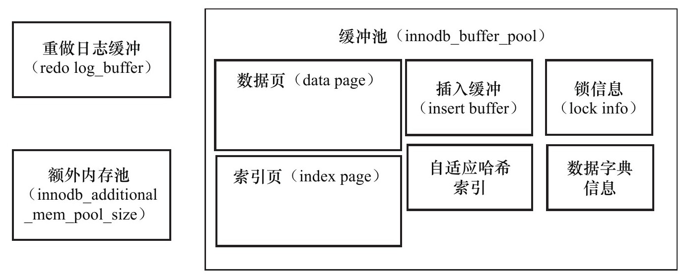

InnoDB存储引擎
--------------

[TOC]

主要由**后台线程**,**内存池**，**文件**组成

### 1：后台线程

##### 1.1 Master Thread

Master Thread是一个非常核心的后台线程，主要负责将缓冲池中的数据异步刷新到磁盘，保证数据的一致性，包括脏页的刷新、合并插入缓冲（INSERT BUFFER）、UNDO页的回收等。

##### 1.2 IO Thread

在InnoDB存储引擎中大量使用了AIO（异步IO）来**处理写IO请求**，这样可以极大提高数据库的性能。而IO Thread的工作负责这些IO请求的回调（call back）处理。InnoDB 1.0版本之前共有4个IO Thread，分别是write、read、insert buffer和log IO thread。在windows系统中可以通过`innodb_file_io_threads`来调节

##### 1.3 Purge Thread

事务被提交后，其所使用的undolog可能不再需要，需要PurgeThread来**回收已经使用并分配的undo页**

##### 1.4 Page Cleaner Thread

将之前版本中脏页的刷新操作都放入到单独的线程中来完成。而其目的是为了**减轻原Master Thread的工作及对于用户查询线程的阻塞**，进一步提高InnoDB存储引擎的性能。

### 2. 内存

数据库系统也会通过内存来缓解CPU速度与磁盘速度之间的鸿沟。缓冲池就是其中一种方法

##### 2.1 缓冲池

缓冲池中缓存的数据页类型有：索引页、数据页、undo页、插入缓冲（insert buffer）、自适应哈希索引（adaptive hash index）、InnoDB存储的锁信息（lock info）、数据字典信息（data dictionary)等

##### 2.2 LRU List、Free List和Flush List（缓冲池的管理）

数据库中的缓冲池是通过LRU（Latest Recent Used，最近最少使用）算法管理,在InnoDB存储引擎中，缓冲池中页的大小默认为16KB，同样使用LRU算法对缓冲池进行管理。

InnoDB存储引擎对传统的LRU算法做了一些优化。LRU列表中加入了**midpoint位置**。新读取到的页，放入到LRU列表的midpoint位置。

midpoint位置可由参数`innodb_old_blocks_pct`控制，默认配置为5/8处

###### **为什么不采用朴素的LRU算法,直接将读取的页放入到LRU列表的首部?**

因为直接将读取到的页放入到LRU的首部，那么**某些SQL操作可能会使缓冲池中的页被刷新出**，这类操作需要访问表中的许多页，甚至是全部的页，而这些页通常来说又仅在这次查询操作中需要，并不是活跃的热点数据。如果页被放入LRU列表的首部，那么非常**可能将所需要的热点数据页从LRU列表中移除**，而在下一次需要读取该页时，InnoDB存储引擎需要再次访问磁盘。

Free List 存放可用的空闲页，

Flush List中的页为脏页列表，即缓冲池中的页和磁盘上的页的数据产生了不一致的页面。

InnoDB存储引擎从1.0.x版本开始**支持压缩页**的功能，即将原本16KB的页压缩为1KB、2KB、4KB和8KB。对于非16KB的页，是通过**unzip_LRU列表**进行管理的,unzip_LRU也是LRU列表当中的，从LRU中去分配内存。

##### 2.3 重做日志缓冲（redo Log）

在通常情况下，8MB的重做日志缓冲池足以满足绝大部分的应用，重做日志在下列三种情况下会将**重做日志缓冲中的内容刷新到外部磁盘的重做日志文件中**。

❑Master Thread每一秒将重做日志缓冲刷新到重做日志文件；

❑每个事务提交时会将重做日志缓冲刷新到重做日志文件；

❑当重做日志缓冲池剩余空间小于1/2时，重做日志缓冲刷新到重做日志文件。

##### 2.4 额外的内存池

当该区域的内存不够时，会从缓冲池中进行申请

### 3. Checkpoint技术

> 这一节主要说了Checkpoint的目的和作用以及集中Checkpoint的方式

Checkpoint（检查点）技术的目的是解决以下几个问题：

❑缩短数据库的恢复时间；

❑缓冲池不够用时，将脏页刷新到磁盘；

❑重做日志不可用时，刷新脏页。

当数据库发生宕机时，数据库不需要重做所有的日志，因为Checkpoint之前的页都已经刷新回磁盘。故数据库只需对Checkpoint后的重做日志进行恢复。这样就大大缩短了恢复的时间。

对于InnoDB存储引擎而言，其是通过LSN（Log Sequence Number）来标记版本的。而LSN是8字节的数字，其单位是字节。每个页有LSN，重做日志中也有LSN，Checkpoint也有LSN，

Checkpoint是将缓冲池中的脏页刷回到磁盘。不同之处在于**每次刷新多少页到磁盘**，**每次从哪里取脏页**，以及**什么时间触发Checkpoint**。在InnoDB存储引擎内部，有两种Checkpoint，分别为：

❑Sharp Checkpoint：在数据库关闭时将所有的脏页都刷新回磁盘

❑Fuzzy Checkpoint：只刷新一部分脏页

对于Fuzzy Checkpoint，有几种不同的方式：

1. ❑Master Thread Checkpoint:以每秒或每十秒的速度从缓冲池的脏页列表中刷新一定比例的页回磁盘。是异步的,不会影响用户的其他操作
2. ❑FLUSH_LRU_LIST Checkpoint：InnoDB存储引擎需要保证LRU列表中需要有差不多100个空闲页可供使用
3. ❑Async/Sync Flush Checkpoint：做日志文件不可用的时候，需要强制将一些页刷新回磁盘，而此时脏页是从脏页列表中选取的
4. ❑Dirty Page too much Checkpoint：脏页的数量太多，导致InnoDB存储引擎强制进行Checkpoint

### 4 Master Thread工作方式

> 这部分将具体解释Master Thread的**具体实现**

Master Thread具有最高的线程优先级别。其内部由多个循环（loop）组成：主循环（loop）、后台循环（backgroup loop）、刷新循环（flush loop）、暂停循环（suspend loop）

**主循环**主要有有两大部分的操作——**每秒钟的操作**和**每10秒的操作**

***每秒一次的操作包括：***

❑日志缓冲刷新到磁盘，即使这个事务还没有提交（总是）；

❑合并插入缓冲（可能）；

❑至多刷新100个InnoDB的缓冲池中的脏页到磁盘（可能）；

❑如果当前没有用户活动，则切换到background loop（可能）

***每10秒的操作，包括如下内容：***

❑刷新100个脏页到磁盘（可能的情况下）；

❑合并至多5个插入缓冲（总是）；

❑将日志缓冲刷新到磁盘（总是）；

❑删除无用的Undo页（总是）；

❑刷新100个或者10个脏页到磁盘（总是）。

**background 循环**，若当前没有用户活动（数据库空闲时）或者数据库关闭（shutdown），就会切换到这个循环。

background loop会执行以下操作：

❑删除无用的Undo页（总是）；

❑合并20个插入缓冲（总是）；

❑跳回到主循环（总是）；

❑不断刷新100个页直到符合条件（可能，跳转到**flush loop**中完成）。

**flush loop**刷新结束就会切换到**suspend__loop**，将Master Thread挂起，等待事件的发生

> Master Thread1.0.x版本之前**可能存在的问题**

1. 无论何时，InnoDB存储引擎最大只会刷新100个脏页到磁盘，合并20个插入缓冲。如果是在写入密集的应用程序中，每秒可能会产生大于100个的脏页，产生大于20个插入缓冲的情况，Master Thread似乎会“忙不过来”，或者说它总是做得很慢。当发生宕机需要恢复时，由于很多数据还没有刷新回磁盘，会导致恢复的时间可能需要很久，尤其是对于insert buffer来说。

2. 参数innodb_max_dirty_pages_pct默认值的问题，在InnoDB 1.0.x版本之前，该值的默认为90，意味着脏页占缓冲池的90%。innodb_max_dirty_pages_pct，才刷新100个脏页，如果有很大的内存，或者数据库服务器的压力很大，这时刷新脏页的速度反而会降低。同样，在数据库的恢复阶段可能需要更多的时间。

> 对于之前存在问题的**解决办法**

1. InnoDB Plugin（从InnoDB1.0.x版本开始）提供了参数innodb_io_capacity，用来表示磁盘IO的吞吐量，默认值为200。对于刷新到磁盘页的数量，会按照innodb_io_capacity的百分比来进行控制。规则如下：

   ❑在合并插入缓冲时，合并插入缓冲的数量为innodb_io_capacity值的5%；

   ❑在从缓冲区刷新脏页时，刷新脏页的数量为innodb_io_capacity。（如果有固态硬盘可以更高）

2. 而从InnoDB 1.0.x版本开始，innodb_max_dirty_pages_pct默认值变为了75。

   另一个参数是innodb_adaptive_flushing（自适应地刷新），该值影响每秒刷新脏页的数量。原来的刷新规则是：脏页在缓冲池所占的比例小于innodb_max_dirty_pages_pct时，不刷新脏页；大于innodb_max_dirty_pages_pct时，刷新100个脏页。随着innodb_adaptive_flushing参数的引入，InnoDB存储引擎会通过一个名为buf_flush_get_desired_flush_rate的函数来判断需要刷新脏页最合适的数量

    之前每次进行**full purge操作**时，最多回收20个Undo页，从InnoDB 1.0.x版本开始引入了参数innodb_purge_batch_size，该参数可以控制每次full purge回收的Undo页的数量。该参数的默认值为20，并可以动态地对其进行修改

### 5. InnoDB关键特性

> 本节分别介绍innodb关键特性：
>
> ❑插入缓冲（Insert Buffer）
>
> ❑两次写（Double Write）
>
> ❑自适应哈希索引（Adaptive Hash Index）
>
> ❑异步IO（Async IO）
>
> ❑刷新邻接页（Flush Neighbor Page）

#### 5.1 插入索引

当我们在插入的时候如果主键不是自增的，类似UUID这样，那么插入就是随机的，由于B+树的特性决定了非聚集索引插入的离散性，所以当访问的时候就需要离散地访问非聚集索引页，导致了插入操作性能下降。

为了解决这个问题：InnoDB存储引擎开创性地设计了**Insert Buffer**，对于非聚集索引的插入或更新操作，不是每一次直接插入到索引页中，而是先判断插入的非聚集索引页是否在缓冲池中，**若在**，则直接插入；**若不在**，则先放入到一个Insert Buffer对象中，数据库这个非聚集的索引已经插到叶子节点，而实际并没有，只是存放在另一个位置。然后再以一定的频率和情况进行Insert Buffer和辅助索引页子节点的merge（合并）操作，通常能将多个插入合并到一个操作中（因为在一个索引页中），大大提高了对于非聚集索引插入的性能。

Insert Buffer的使用需要同时满足以下两个条件：

❑索引是辅助（非聚集索引）索引（secondary index）；

❑索引不是唯一（unique）的。

**也就是非唯一辅助索引的插入操作**

但是目前Insert Buffer存在一个问题是：在写密集的情况下，**插入缓冲会占用过多的缓冲池内存**（innodb_buffer_pool），默认最大可以占用到1/2的缓冲池内存

MySQL5.5之前的版本中其实都叫做Insert Buffer，之后优化为 Change Buffer可以看做是 Insert Buffer 的升级版。

插入缓冲（ Insert Buffer）这个其实只针对 INSERT 操作做了缓冲，而Change Buffer 对INSERT、DELETE、UPDATE都进行了缓冲，所以可以统称为写缓冲，

##### 5.2 Change Buffer

InnoDB从1.0.x版本开始引入了Change Buffer，从这个版本开始，InnoDB存储引擎可以对DML操作——**INSERT、DELETE、UPDATE都进行缓冲**，他们分别是：Insert Buffer、Delete Buffer、Purge buffer。适用的对象依然是**非唯一的辅助索引**（普通索引），Change Buffer在有大量数据更新操作时候，减少了磁盘IO这个非常耗时的操作，会大大提升性能（在写多读少的情况下，收益比较大，写少读多的情况，更新完后就会通过读操作，写会磁盘，则收益不大，**在适当的情况下应该关闭Change Buffer**）

所以当我们需要改变的记录要更新的目标页不在内存中：

* 对于唯一索引来说，需要将数据页读入内存，**判断到没有冲突，插入这个值**，语句执行结 束；
*  对于普通索引来说，则是**将更新记录在change buffer**，语句执行就结束了

所以对一条记录进行操作的时候，首先会将它们的记录标记先删除，然后再删除真正的记录（merge操作）

**merge操作**会在 1)访问这个数据 页会触发merge外，2) 系统有后台线程会定期merge 3)数据库正常关闭

**merge的执行流程是这样的**： 1. 从磁盘读入数据页到内存（老版本的数据页）； 2. 从change buffer里找出这个数据页的change buffer 记录(可能有多个），依次应用，得到新 版数据页； 3. 写redo log。这个redo log包含了数据的变更和change buffer的变更。

###### Change Buffer和redo Log的区别

Change Buffer会将普通索引的更新先存在内存中，待merge时候再写入到磁盘中，然后写入到redo log，也就是磁盘 ，但是当写入到Change Buffer中后**电脑断电**，这个时候我们就可以通过写入到磁盘的**redo log操作来恢复数据**。

##### 5.3 Insert Buffer的内部实现

insert Buffer的数据结构是一棵B+树。在MySQL 4.1之前的版本中每张表有一棵Insert Buffer B+树。而在现在的版本中，全局只有一棵Insert Buffer B+树，负责对所有的表的辅助索引进行Insert Buffer。而这棵B+树存放在共享表空间中

##### 5.4 Merge Insert Buffer

若需要实现插入记录的辅助索引页不在缓冲池中，那么需要将辅助索引记录首先插入到这棵B+树中。但是Insert Buffer中的记录何时合并（merge）到真正的辅助索引中呢？

**Merge Insert Buffer**的操作可能发生在以下几种情况下：

❑辅助索引页被读取到缓冲池时；

❑Insert Buffer Bitmap页追踪到该辅助索引页已无可用空间时；

❑Master Thread。

#### 5.2 两次写doublewrite

insert Buffer带给InnoDB存储引擎的是**性能上的提升**，那么doublewrite（两次写）带给InnoDB存储引擎的是**数据页的可靠性**

之前的innodb会出现**页失效问题**，doublewrite由两部分组成，一部分是内存中的doublewrite buffer，大小为2MB，另一部分是物理磁盘上共享表空间中连续的128个页，即2个区（extent），大小同样为2MB,在对缓冲池的脏页进行刷新时，并不直接写磁盘，而是会通过**memcpy函数将脏页先复制到内存中的doublewrite buffer**，之后通过doublewrite buffer再分两次，每次1MB顺序地写入共享表空间的物理磁盘上，然后马上调用fsync函数，同步磁盘，避免缓冲写带来的问题。在这个过程中，因为doublewrite页是连续的，因此这个过程是顺序写的，开销并不是很大。在完成doublewrite页的写入后，再将doublewrite buffer中的页写入各个表空间文件中，此时的写入则是离散的

**double write的缺点?**

double write buffer实际上也是一个文件，引入了一次额外写的开销，每个数据页都被要求写两次。由于需要大量的fsync操作，所以它会降低MySQL的整体性能，但是并不会降低到原来的50%。这主要是因为：

1) double write是一个连接的存储空间，所以硬盘在写数据的时候是顺序写，而不是随机写，这样性能更高。

2) 将数据从double write buffer写到真正的segment中的时候，系统会自动合并连接空间刷新的方式，每次可以刷新多个pages。

#### 5.2 自适应哈希索引

InnoDB存储引擎会监控对表上各索引页的查询。如果观察到建立哈希索引可以带来速度提升，则建立哈希索引，称之为自适应哈希索引（Adaptive Hash Index，AHI）。AHI是通过缓冲池的B+树页构造而来，因此建立的速度很快

#### 5.3 异步IO

数据库系统都采用异步IO（Asynchronous IO，AIO）的方式来处理磁盘操作，

AIO的另一个优势是可以进行IO Merge操作，也就是将多个IO合并为1个IO，这样可以提高IOPS的性能，如果每个页的大小为16KB，当同步IO需要进行3次IO操作。而AIO会判断到这三个页是连续的（显然可以通过（space，page_no）得知）。因此AIO底层会发送一个IO请求，直接读取48KB的页。

#### 5.4 刷新邻接页

当刷新一个脏页时，InnoDB存储引擎会检测该页**所在区（extent）的所有页**，如果是脏页，那么一起进行刷新。这样做的好处显而易见，**通过AIO可以将多个IO写入操作合并为一个IO操作**，故该工作机制在传统机械磁盘下有着显著的优势。但是需要考虑到下面两个问题：

❑是不是可能将不怎么脏的页进行了写入，而该页之后又会很快变成脏页？

❑固态硬盘有着较高的IOPS，是否还需要这个特性？可以使用`innodb_flush_neighbors`参数关闭

### 6 总结

innodb的体系架构就是由**多个内存块组成的缓冲池**和**多个后台线程**构成。缓冲池缓存磁盘数据（解决cpu速度和磁盘速度的严重不匹配问题），后台进程保证缓存池和磁盘数据的一致性（读取、刷新），并保证数据异常宕机时能恢复到正常状态。

**缓冲池**主要分为三个部分：redo log buffer（重做日志缓冲）、innodb_buffer_pool（缓冲池，缓冲池有包括数据页，索引页，插入缓冲，锁信息，自适应哈希索引），innodb_additional_mem_pool（额外内存池）。

**后台进程**分为：master thread，IO thread，purge thread，page cleaner thread。