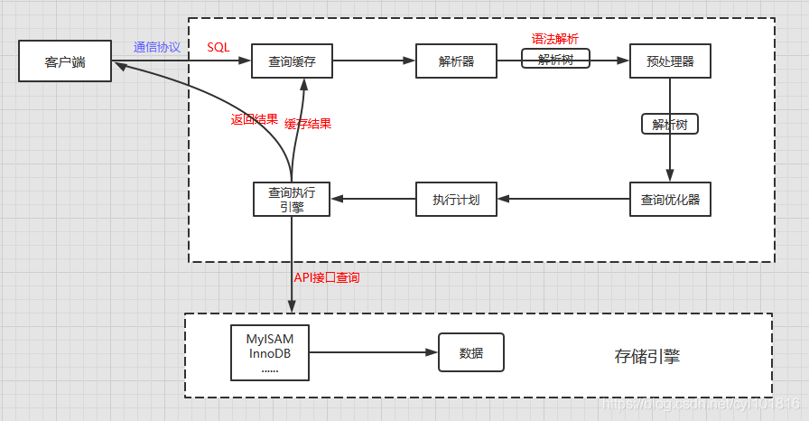

数据库
------

mysql总的体系结构，存储引擎innodb，底层存储格式，索引，锁，事务，主从备份，性能调优，SQL语句

[TOC]

#### 1.SQL语句分类

DQL:查询语句

DML:增删改语句

DDL:create drop alter 对表结构改变

TCL:事务控制语言commit提交事务，rollback回滚事务

DCL:数据控制语言，grant授权，revoke撤销权限

### 2.数据库索引

几种索引实现方式：

hash表：哈希表这种结构适用于只有等值查询的场景，没有范围查询

数组：有序数组索引只适用于静态存储引擎，也就是不会改变的数据

N叉搜索树：最常用

1. 自增id还是UUID做主键

https://segmentfault.com/a/1190000039415655

2. 索引下推，最左匹配，

    **最左匹配：**创建了多列索引(name,age,sex)，会先匹配name字段，再匹配age字段，再匹配sex字段的，中间不能跳过。mysql会一直向右匹配直到遇到范围查询(>、<、between、like)就停止匹配。一般，在创建多列索引时，where子句中使用最频繁的一列放在最左边。

3. 索引分类

    ```java
    索引分类
    1.普通索引index :加速查找
    2.唯一索引
        主键索引：primary key ：加速查找+约束（不为空且唯一）
        唯一索引：unique：加速查找+约束 （唯一）
    3.联合索引
        -primary key(id,name):联合主键索引
        -unique(id,name):联合唯一索引
        -index(id,name):联合普通索引
    4.全文索引fulltext :用于搜索很长一篇文章的时候，效果最好。
    5.空间索引spatial :了解就好，几乎不用
    ```

4. 建索引的几大原则

> 最左前缀匹配原则
>
> 尽量选择区分度高的列作为索引。
>
> =和in可以乱序
>
> 索引列不能参与计算，保持列“干净”
>
> 尽量的扩展索引，不要新建索引

5. 常用优化总结

    ##### *1 有索引但未被用到的情况*

    

##### **2 避免select \***

#####   order by 语句优化

##### GROUP BY语句优化

##### 用 exists 代替 in

##### 使用 varchar/nvarchar 代替 char/nchar

##### 能用DISTINCT的就不用GROUP BY

##### 能用UNION ALL就不要用UNION

##### 在Join表的时候使用相当类型的例，并将其索引

#### mysql锁

全局锁、表级锁和**行锁**

间隙锁，共享锁，排他锁

#### 事务

**看Mysql45讲的第三讲。**

事务的四大特性：ACID;

可能会出现的问题：脏读（dirty read）、不可重复读（non- repeatable read）、幻读（phantomread）

SQL标准的事务隔离级别：读未提交（read uncommitted）、 读提交（read committed）、可重复读（repeatable read）和串行化（serializable ）

1.  读未提交是指，一个事务还没提交时，它做的变更就能被别的事务看到。
2.   读提交是指，一个事务提交之后，它做的变更才会被其他事务看到。
3.   可重复读是指，一个事务执行过程中看到的数据，总是跟这个事务在启动时看到的数据是一 致的。当然在可重复读隔离级别下，未提交变更对其他事务也是不可见的。 
4.  串行化，顾名思义是对于同一行记录，“写”会加“写锁”，“读”会加“读锁”。当出现读写锁冲突 的时候，后访问的事务必须等前一个事务执行完成，才能继续执行。

##### 启动事务的方式

1.  显式启动事务语句， begin 或 start transaction。配套的提交语句是commit，回滚语句是 rollback。 
2.  set autocommit=0，这个命令会将这个线程的自动提交关掉。意味着如果你只执行一个 select语句，这个事务就启动了，而且并不会自动提交。这个事务持续存在直到你主动执行 commit 或 rollback 语句，或者断开连接。

##### 长事务存在的风险

如何寻找长事务： information_schema.INNODB_TRX 表中包含了当前innodb内部正在运行的事务信息，这个表中给出了事务的开始时间，我们可以稍加运算即可得到事务的运行时间。

1.  会导致数据库里有很早的事务视图，所以这个事务提交之前，数据库里面它可能用到的回滚记录都必须保留，这就会导致大量占 用存储空间。
2.  占用锁资源

##### 如何避免长事务带来的风险

首先，从应用开发端来看：

1.  确认是否使用了set autocommit=0。这个确认工作可以在测试环境中开展，把MySQL的 general_log开起来，然后随便跑一个业务逻辑，通过general_log的日志来确认。一般框架 如果会设置这个值，也就会提供参数来控制行为，你的目标就是把它改成1。 	
2.   确认是否有不必要的只读事务。有些框架会习惯不管什么语句先用begin/commit框起来。我 见过有些是业务并没有这个需要，但是也把好几个select语句放到了事务中。这种只读事务 可以去掉。 
3.  业务连接数据库的时候，根据业务本身的预估，通过SETMAX_EXECUTION_TIME命令， 来控制每个语句执行的最长时间，避免单个语句意外执行太长时间。（为什么会意外？在后 续的文章中会提到这类案例） 

其次，从数据库端来看：

1.  监控 information_schema.Innodb_trx表，设置长事务阈值，超过就报警/或者kill；
2.  Percona的pt-kill这个工具不错，推荐使用； 
3.  在业务功能测试阶段要求输出所有的general_log，分析日志行为提前发现问题； 
4.  4. 如果使用的是MySQL 5.6或者更新版本，把innodb_undo_tablespaces设置成2（或更大的 值）。如果真的出现大事务导致回滚段过大，这样设置后清理起来更方便。

#### 日志

##### redo log

redo log是 InnoDB引擎特有的日志，主要是**保证crash-safe能力**，保证即使数据库发生异常重启，之前提交的记录都不会丢失

redo log记录的是数据库中每个页的修改，而不是某一行或某几行修改成怎样，可以用来恢复提交后的物理数据页（恢复数据页，且只能恢复到最后一次提交的位置，因为修改会覆盖之前的）

redo log是固定大小的，比如可以配置为一组4个文件，每个文件的大小是 1GB，那么这块“粉板”总共就可以记录4GB的操作，

而且写入操作是个**循环操作**，写到末尾就可以从文件开始继续

> crash-safe主要体现在事务执行过程中突然崩溃，重启后能保证事务完整性

##### binlog

Server层也有自己的日志，称为binlog（归档日志），将mysql的所有操作以二进制的形式记录在磁盘中

主要记录用**户对数据库操作的SQL语句**（除了查询语句），用作**主从同步和数据库基于时间点的还原**

所以：

1. 如果是主从模式下，binlog是必须的，因为从库的数据同步依赖的就是binlog；
2. 如果是单机模式，并且不考虑数据库基于时间点的还原，binlog就不是必须，因为有redo log就可以保证crash-safe能力了；但如果万一需要回滚到某个时间点的状态，这时候就无能为力，所以建议binlog还是一直开启；


##### undolog

##### redo log与bin log有什么不同

1. redo log是InnoDB引擎特有的；binlog是MySQL的Server层实现的，所有引擎都可以使用。 
2. redo log是物理日志，记录的是“在某个数据页上做了什么修改”；binlog是逻辑日志，记录的 是这个语句的原始逻辑，比如“给ID=2这一行的c字段加1 ”。 
3. redo log是循环写的，空间固定会用完；binlog是可以追加写入的。“追加写”是指binlog文件 写到一定大小后会切换到下一个，并不会覆盖以前的日志。
4. 为了保证数据库逻辑上的一致性，在事务提交时候需要使用**两阶段提交**


#### 数据块主从备份


#### 故障排查的命令

使用 show processlist 命令查看当前所有连接信息； 

使用 Explain 命令查询 SQL 语句执行计划；

开启慢查询日志，查看慢查询的 SQL。


#### 一条SQL语句执行得很慢的原因有哪些

1、大多数情况是正常的，只是偶尔会出现很慢的情况。

2、在数据量不变的情况下，这条SQL语句一直以来都执行的很慢。

##### 对于情况1

1. 数据库在刷新脏页（redo log刷新）

   > 第一个问题：什么时候会出发数据库flush操作
   >
   > 1. redo log满了（write pos和checkpoint相遇）
   >
   > 2. 内存空间不足以读入新的内存页，需要根据策略把就得内存页给写回，（刷脏页）
   >
   > 3. MySQL认为系统“空闲”的时候
   >
   > 4. 数据库正常关闭
   >
   >    ##### 对于第一种情况：
   >
   >    ##### 对于第二种情况：(如果脏页过多，则会耗费很多时间，所以需要控制脏页的比例)
   >
   >    如果需要淘汰的页面是干净的：直接淘汰使用
   >
   >    如果需要淘汰的页面是脏页：先刷到磁盘，变成干净页后才能复用
   >
   >    ##### **InnoDB刷脏页的控制策略**
   >
   >    首先需要知道诉**InnoDB所在主机的IO能力**，innodb_io_capacity这个值设置为磁盘的IOPS
   >
   >    InnoDB的刷盘速度就是要参考这两个因素：一个是脏页比例，一个是redo log写盘速度（刷回磁盘需要写redo log）。
   >
   >    
   >
   >    F1(M：设置的脏页比例上限)和F2（N：计算的当前写入的序号跟checkpoint对应的序号之间的差值），然后以F1,F2最大值的速率进行刷新

2. 拿不到锁

##### 对于情况2

1. 优化sql语句
2. 建索引，索引优化（没有索引，没有用上索引，函数操作导致没有用上索引，数据库自己选错索引）

##### 一条 SQL 查询语句的执行流程又是怎样的呢？



1.通过通信协议（TCP/IP,Unix Socket,命名管道,内存共享）,创建连接(长连接，短连接)，

2.查询缓存(Query Cache)

3.语法解析和预处理(Parser & Preprocessor)

> 语法解析器主要对 sql 语句进行语法和语义分析，检查单词是否拼写错误，检查要查询的表或字段是否存在。

4.查询优化（Query Optimizer） 与查询执行计划

> ​	优化器

5.存储引擎（Storage Engine）

6.执行引擎（ Query Execution Engine） ， 返回结果

##### 一条SQL更新语句是如何执行的


1. 使用连接器连接数据库，先做身份验证

2. 分析器会通过词法和语法解析知道这是一条更新语句。优化器决定要使用ID这个索引。 然后，执行器负责具体执行，找到这一行，然后更新

3. 执行器先找引擎取ID=2这一行。ID是主键，引擎直接用树搜索找到这一行。如果ID=2这一 行所在的数据页本来就在内存中，就直接返回给执行器；否则，需要先从磁盘读入内存，然 后再返回。 
4. 执行器拿到引擎给的行数据，把这个值加上1，比如原来是N，现在就是N+1，得到新的一行 数据，再调用引擎接口写入这行新数据。 
5. 引擎将这行新数据更新到内存中，同时将这个更新操作记录到redo log里面，此时redo log处 于prepare状态。然后告知执行器执行完成了，随时可以提交事务。
6.  执行器生成这个操作的binlog，并把binlog写入磁盘。
7.  执行器调用引擎的提交事务接口，引擎把刚刚写入的redo log改成提交（commit）状态，更 新完成。

记录redo log：它的关键点就是**先写日志，再写磁盘**


#### mysql的两阶段提交协议

[参考](https://zhuanlan.zhihu.com/p/142491549)

##### 何为两阶段提交？（2PC）

mysql中在server层级别有个binlog日志，归档日志，用于备份，**主从同步复制**，如果采用一主多从架构，主备切换，那就必须用到binlog进行主从同步，此时事务提交就必须**保证redolog与binlog的一致性**，一般情况没有开启binlog日志，事务提交不会两阶段提交，**若需要主从同步就必须开启binlog使用两阶段提交保证数据一致性**。

##### 为什么要两阶段提交？

保证redolog与binlog一致性，保证事务在多个引擎的原子性。

##### 两阶段提交过程？

Prepare 阶段：InnoDB 将回滚段undolog设置为 prepare 状态；将 redolog 写文件并刷盘；

Commit 阶段：Binlog 写入文件；binlog 刷盘；InnoDB commit；

redolog与binlog怎样联系起来的？（XID）

崩溃恢复的时候，会按顺序扫描redo log，若redolog既有prepare又有commit，直接提交，如果碰到只有parepare、而没有commit的redo log，就拿着XID去binlog找对应的事务

#### mysql选择索引的方式

1.扫描的行数来判断：我们在[基数”（cardinality）](./mysql技术内幕/5.索引)说过基数越大，区分度越高，越适合建立索引

2.可以采用force index强行选择一个索引

3.也可以新建一个更合适的索引，来提供给优化器做选 择，或删掉误用的索引

#### mysql 的Online DDL重建表过程

*丁奇mysql45讲十三讲*

重建表

1. 建立一个临时文件，扫描表A主键的所有数据页；
2. 用数据页中表A的记录生成B+树，存储到临时文件中； 
3. 生成临时文件的过程中，将所有对A的操作记录在一个日志文件（rowlog）中，对应的是图 中state2的状态；
4. 临时文件生成后，将日志文件中的操作应用到临时文件，得到一个逻辑数据上与表A相同的 数据文件，对应的就是图中state3的状态； 
5. 用临时文件替换表A的数据文件。

#### count(*)语句实现

**<u>对于msyql实现count(*)：</u>**

1. MyISAM表虽然count(*)很快，但是不支持事务； 
2. *showtable status命令虽然返回很快，但是不准确；*
3.  InnoDB表直接count(*)会遍历全表，虽然结果准确，但会导致性能问题。

所以如果想要准确快速的记录总行数，只能我们自己去设计实现：

1、 用缓存系统保存计数（但是可能会出现数据一致性问题）

2、 使用数据库+事务，只要插入数据的事务没有commit，就不进行+1

而count(字 段），则表示返回满足条件的数据行里面，参数“字段”不为NULL的总个数

#### order by语句执行过程

mysql45讲第十六讲

#### order by rand()随机逻辑

