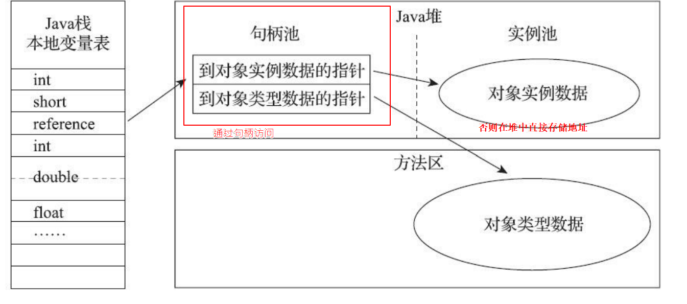

# Java 内存区域详解

[TOC]


## 1.JVM 运行时的数据区域

首先获取一个直观的认识：


总共也就这么 5 个区（直接内存不属于 JVM 运行时数据区的一部分），除了程序计数器其他的地方都有可能出现 OOM (OutOfMemoryError)，其中程序计数器和两个栈（Java 虚拟机栈 & 本地方法栈）都是每个线程要有一个的，所以肯定是线程隔离的。而其他 2 个区就是线程共享的了，也就是说，如果有多个线程要同时访问这两个区的数据，是会出现线程安全问题的。接下来，我们将对这些区域进行详细的介绍。

### 程序计数器（线程私有）

- 当前线程所执行的字节码的行号指示器，字节码解释器工作时就是通过改变这个计数器的值来确定下一条要执行的字节码指令的位置
- 执行 Java 方法和 native 方法时的区别：
	- 执行 Java 方法时：记录虚拟机正在执行的字节码指令地址；
	- 执行 native 方法时：无定义；
- 是 5 个区域中唯一不会出现 OOM 的区域。

### Java 虚拟机栈（线程私有）

- Java 方法执行的内存模型，每个方法执行的过程，就是它所对应的栈帧在虚拟机栈中入栈到出栈的过程；
- 服务于 Java 方法，每个方法被执行的时候，Java虚拟机都 会同步创建一个栈帧，用于存储局部变量表、操作数栈、动态连接、方法出口等信 息。每一个方法被调用直至执行完毕的过程，就对应着一个栈帧在虚拟机栈中从入栈到出栈的过程。
- 局部变量表中的存储空间以局部**变量槽（Slot）**来表示，其中64位长度的long和 double类型的数据会占用两个变量槽，其余的数据类型只占用一个。
- 可能抛出的异常：
	- OutOfMemoryError（在虚拟机栈可以动态扩展的情况下，扩展时无法申请到足够的内存）；
	- StackOverflowError（线程请求的栈深度 > 虚拟机所允许的深度）；
- 虚拟机参数设置：`-Xss`.

### 本地方法栈

- 服务于 native 方法；
- 可能抛出的异常：与 Java 虚拟机栈一样。

### Java 堆

- 唯一的目的：存放对象实例；
- 垃圾收集器管理的主要区域；
- 可以处于物理上不连续的内存空间中，但是逻辑上必须连续；
- 所有线程共享的Java堆中可以划分出多个线程私有的分配缓冲区 （Thread Local Allocation Buffer，TLAB），以提升对象分配时的效率
- 可能抛出的异常：
	- OutOfMemoryError（堆中没有内存可以分配给新创建的实例，并且堆也无法再继续扩展了）。
- 虚拟机参数设置：
	- 最大值：`-Xmx`
	- 最小值：`-Xms`
	- 两个参数设置成相同的值可避免堆自动扩展。

### 方法区

- 存储已被虚拟机加载的*类信息、常量、静态变量、即时编译器编译后的代码*等数据；	
	- 类信息：即 Class 类，如类名、访问修饰符、常量池、字段描述、方法描述等。
- 垃圾收集行为在此区域很少发生；
- 不过也不能不清理，对于经常动态生成大量 Class 的应用，如 Spring 等，需要特别注意类的回收状况。
- **运行时常量池**也是方法区的一部分
- Java语言并不要求常量 一定只有编译期才能产生，不是预置入Class文件中常量池的内容才能进入方法区运行时常量池，**运行期间也可以将新的常量放入池中**，
- Class 文件中除了有类的版本、字段、方法、接口等描述信息外，还有一项是常量池，用于存放编译器生成的各种字面量（就是代码中定义的 static final 常量）和符号引用，这部分信息就存储在运行时常量池中。
- 永久代的概念，现在已经废弃转为**元空间**
- 可能抛出的异常：
	- OutOfMemoryError（方法区无法满足内存分配需求时）。

### 直接内存（不太能理解）

- JDK 1.4 的 NIO 类可以**使用 native 函数库直接分配堆外内存**，这是一种基于通道与缓冲区的 I/O 方式，它在 Java 堆中存储一个 DirectByteBuffer 对象作为堆外内存的引用，这样就可以对堆外内存进行操作了。因为可以避免 Java 堆和 Native 堆之间来回复制数据，在一些场景可以带来显著的性能提高。
- 虚拟机参数设置：`-XX:MaxDirectMemorySize`
	- 默认等于 Java 堆最大值，即 `-Xmx` 指定的值。
- 将直接内存放在这里讲解的原因是它也可能会出现 OutOfMemoryError；
	- 服务器管理员在配置 JVM 参数时，会根据机器的实际内存设置 `-Xmx` 等信息，但经常会忽略直接内存（默认等于 `-Xmx` 设置值），使得各个内存区域的总和**大于物理内存限制**，从而导致动态扩展时出现 OOM。


## 2.HotSpot 虚拟机堆中的对象

这一小节将对 JVM 对 Java 堆中的对象的创建、布局和访问的全过程进行讲解。

##### 对象的创建（遇到一条 new 指令时）

1. 检查这个指令的参数能否在常量池中定位到一个类的符号引用，并检查这个符号引用代表的类是否已被加载、解析和初始化过。如果没有，先把这个类加载进内存；

2. 类加载检查通过后，虚拟机将为新对象分配内存，此时已经可以确定存储这个对象所需的内存大小；

3. **在堆中为新对象分配可用内存（如果内存规整：指针碰撞；不规整：空闲列表）**；

4. 将分配到的内存初始化；

5. 设置对象头中的数据；

6. 但是目前构造函数还没有执行，new指令之后会执行init方法，完成对象的创建。

   

第 3 步，在堆中为新对象分配可用内存时，会涉及到以下两个问题：

##### 如何在堆中为新对象划分可用的内存？（内存是否规整取决于垃圾回收的算法）

- 指针碰撞（内存分配规整）
	- 用过的内存放一边，没用过的内存放一边，中间用一个指针分隔；
	- 分配内存的过程就是将指针向没用过的内存那边移动所需的长度；
- 空闲列表（内存分配不规整）
	- 维护一个列表，记录哪些内存块是可用的；
	- 分配内存时，从列表上选取一块足够大的空间分给对象，并更新列表上的记录；

##### 如何处理多线程创建对象时，划分内存的指针的同步问题？

问题：对象创建在虚拟机中是非常频繁的行 为，即使仅仅修改一个指针所指向的位置，在并发情况下也并不是线程安全的，可能出现正在给对象 A分配内存，指针还没来得及修改，对象B又同时使用了原来的指针来分配内存的情况

解决方案有两种情况：

1. 对分配内存空间的动作进行同步处理——实际上虚拟机是采用CAS配上失败 重试的方式保证更新操作的原子性；
2. 把内存分配的动作按照线程划分在不同的空间之中进行，即每个线程在Java堆中预先分配一小块内存，称为**本地线程分配缓冲（Thread Local Allocation Buffer，TLAB**），哪个线程要分配内存，就在哪个线程的本地缓冲区中分配，只有本地缓冲区用完 了，分配新的缓存区时才需要同步锁定。

- 通过 `-XX:+/-UseTLAB` 参数设定是否使用 TLAB。

## 3.对象的内存布局

对象在堆中生成–主要三个部分（对象头（Header）、实例 数据（Instance Data）和对齐填充（Padding））

- 对象头：
	- 第一部分：存储对象自身运行时的数据，HashCode、GC分代年龄等（Mark Word）；
	- 第二部分：类型指针，指向它的类元数据的指针，虚拟机通过这个指针来判断这个对象是哪个类的实例（HotSpot 采用的是直接指针的方式访问对象的）；
	- 如果是个数组对象，对象头中还有一块用于记录数组长度的数据。
- 实例数据：
	- 默认分配顺序：longs/doubles、ints、shorts/chars、bytes/booleans、oops (Ordinary Object Pointers)，相同宽度的字段会被分配在一起，除了 oops，其他的长度由长到短；
	- 默认分配顺序下，父类字段会被分配在子类字段前面。
- 对象填充：  
    仅仅起着占位符的作用  

<font color='red'>*注：HotSpot VM要求对象的起始地址必须是8字节的整数倍，所以不够要补齐。*</font>

## 4.对象的访问（使用）

Java 程序需要通过虚拟机栈上的 reference 数据来操作堆上的具体对象，reference 数据是一个指向对象的引用，不过如何通过这个引用定位到具体的对象，目前主要有以下两种访问方式：句柄访问和直接指针访问。

#### 句柄访问



句柄访问会在 Java 堆中划分一块内存作为**句柄池**，每一个句柄存放着到对象实例数据和对象类型数据的指针。

优势：对象移动的时候（这在垃圾回收时十分常见）只需改变句柄池中对象实例数据的指针，不需要修改reference本身。

#### 直接指针访问

直接指针访问方式在 Java 堆对象的实例数据中存放了一个指向对象类型数据的指针，在 HotSpot 中，这个指针会被存放在对象头中。

优势：减少了一次指针定位对象实例数据的开销，速度更快。

## 5.实战:OutOfMemoryError异常：

#### java堆溢出：

- 只要不断的创建对象，并且保证GC Roots到对象之间有可达路径来避免垃圾回收机制。在对象到达最大堆的容量后就会产生内存溢出异常。
- 设置虚拟机参数；
```
-Xms20m -Xmx20m -XX:+HeapDumpOnOutOfMemoryError
//限制Java堆的大小为20MB，不可扩展，将堆的最小值与-Xms参数与最大堆-Xmx参数设置为一样即可以避免自动扩展。
//参数-XX:+HeapDumpOnOutOfMemoryError可以让虚拟机在出现内存溢出异常时Dump出当前的内存堆储快照
```
- 解决方法：
	- 先通过内存映像分析工具分析 Dump 出来的堆转储快照，确认内存中的对象是否是必要的，即分清楚是出现了内存泄漏还是内存溢出；
	- 如果是内存泄漏，通过工具查看泄漏对象到 GC Root 的引用链，定位出泄漏的位置；
	- 如果不存在泄漏，检查虚拟机堆参数（-Xmx 和 -Xms）是否可以调大，检查代码中是否有哪些对象的生命周期过长，尝试减少程序运行期的内存消耗。

#### 虚拟机栈和本地方法栈溢出：

hotSpot虚拟机中并不区分本地方法栈和虚拟机栈， -Xoss可以设置本地方法栈的大小，栈容量由-Xss设置。关于虚拟机栈的异常，，描述为：

- <font color='red'> 如果线程请求的栈深度大于虚拟机所允许的最大深度，将抛出StackOverflowError异常 </font>
- <font color='red'> 如果虚拟机在扩展栈时无法申请到足够的内存，则抛出OutOfMemoryError异常 </font>

使用-Xss参数设置减少栈内存容量，抛出StackOverfiowError异常，堆栈深度相应缩小。
定义了大量的本地变量，增加方法帧中局部变量表中的长度，抛出StackOverfiowError异常，堆栈深度相应缩小。

设置虚拟机参数：
```
-Xss128k
//设置堆栈内存为128k
```
#### 方法区和运行时常量池溢出(没懂)

*运行时常量池属于方法区*

方法区用于存放Class的相关信息，如类名，访问修饰符，常量池，字段描述，方法描述等。

使用CGLib 直接操作字节码来生成大量动态类，在实际中，spring框架最类进行增强时候就可能导致方法区溢出

#### 本机直接内存溢出（没理解）

DirectMemory容量可以通过-XX：MaxDirectMemorySize指定。'