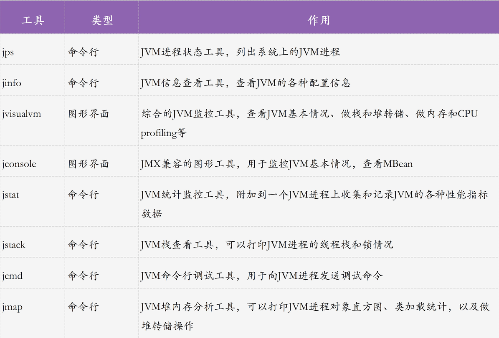

### 1.工具

##### JDK工具

1.利用jps(JVM Process Status Tool)找出进程id, `jps -l`

2.利用 jstat 查看VM统计信息 ,`jstat -gc (进程id) (打印时间间隔)`

3.利用 jmap 查看对象分布情况 

>   使用 jmap 可查看堆内存初始化配置信息以及堆内存的使用情况，输出堆内存中的对象信息，包括产生了哪些对象，对象数量多少等。
>
>   `jmap -heap <PID>`打印出堆内存相关的一些参数设置以及各个区域的情况, **生成堆内存转储快照**

4.**利用 jstack 分析线程栈**

>   jstack 是一种**线程堆栈分析工具**，最常用的功能就是使用 <u>jstack pid 命令查看线程的堆栈信息</u>，通常会结合 top -Hp pid 或 pidstat -p pid -t 一起查看具体线程的状态，也经常用来排查一些死锁的异常、CPU占用高的线程等

##### Linux命令行工具

1.**top 命令**，实时显示正在执行进程的 CPU 使用率、内存使用率以及系统负载等信息。其中上半部分显示的是系统的统计信息，下半部分显示的是进程的使用率统计信息，最重要的就是看 load average，4核CPU 负载因子为4，则代表每个核都满了

2.**vmstat 命令**：vmstat 是 Virtual Meomory Statistics（虚拟内存统计）的缩写，可对操作系统的虚拟内存、进程、CPU活动进行监控。

>   **命令格式：**【vmstat [ 选项 ] [ <时间间隔> ] [ <次数> ]】
>
>   *   如果 Procs.r(等待运行的进程数) 经常大于4，CPU.id(`空闲时间(包括IO等待时间)，中央处理器的空闲时间 。以百分比表示`) 经常少于40，表示cpu的负荷很重。
>   *   如果 IO.bi(`发送到块设备的块数`)，bo 长期不等于0，表示内存不足。 
>   *   如果 disk 经常不等于0，且在 b 中的队列大于3，表示io性能不好。
>   *   通过 cSystem.cs(`每秒上下文切换数`) 观察 Java 程序运行过程中系统的上下文切换频率。过高说明程序创建了过多的线程导致频繁的上下文切换。

3.**pidstat 命令**:如果是监视某个应用的上下文切换，可以使用 <u>pidstat 命令监控指定进程的上下文切换</u>

### 选择合适的垃圾回收器

CPU单核，那么毫无疑问Serial 垃圾收集器是你唯一的选择。

CPU多核，关注吞吐量 ，那么选择PS+PO组合。

CPU多核，关注用户停顿时间，JDK版本1.6或者1.7，那么选择CMS。

CPU多核，关注用户停顿时间，JDK1.8及以上，JVM可用内存6G以上，那么选择G1。

### 调优目标

**1、将转移到老年代的对象数量降低到最小；**

**2、减少full GC的执行时间；**

### 调优步骤

*   **分析系统运行情况**：分析GC日志及dump文件，判断是否需要优化，确定瓶颈问题点；
*   确定JVM调优**量化目标**；
*   确定JVM调优参数（根据历史JVM参数来调整）；
*   依次<u>确定调优内存、延迟、吞吐量等指标</u>；
*   对比观察调优前后的差异；
*   不断的分析和调整，直到找到合适的JVM参数配置；
*   **找到最合适的参数**，将这些参数应用到所有服务器，并进行后续跟踪。

### 调优方法

https://zhuanlan.zhihu.com/p/345748447

##### 调优参数

##### 常见调优

1.   设置合适的垃圾回收器
2.   堆大小设置： 计算活跃数据的大小（应用程序稳定后长期存活对象在堆中的大小），也就是Full GC后堆中老年代占用大小，<u>堆中大小可以设置为：</u>

<u>总大小：3-4倍活跃数据大小，新生代：1-1.5活跃数据大小 老年代2-3倍活跃数据大小</u>

3.   **调整内存区域大小比率**

*   如果**对象经常朝生夕灭**，年轻代可以设置大一些，减少每次minor gc对象复制的消耗
*   **元空间可以的话调整大一些**，因为元空间如果满了扩容是会触发full gc，停顿时间较长，即使此时老年代空间有很多空余

3.   调整对象升老年代的年龄` -XX:InitialTenuringThreshol=7 `

4.   **调整大对象的标准**`XX:PretenureSizeThreshold=1000000`

5.   **调整GC的触发时机**

6.   **调整 JVM本地内存大小**，如果不加限制，会直接触发OOM错误` XX:MaxDirectMemorySize`

### 2.案例

#### 1.元空间会产生内存溢出么？在什么情况下会产生内存溢出？

元空间溢出最明显特征就是Heap Dump文件没有什么明显的异常

1、在Java7之前，频繁的错误使用String.intern()方法
		2、运行期间生成了大量的代理类，导致方法区被撑爆，无法卸载
		3、应用长时间运行，没有重启

#### 2.什么情况下会发生栈内存溢出

- 栈是线程私有的，它的生命周期与线程相同，每个方法在执行的时候都会**创建一个栈帧**，用来存储<u>局部变量表，操作数栈，动态链接，方法出口</u>等信息。局部变量表又<u>包含基本数据类型，对象引用类型</u>
- 如果线程请求的栈深度大于虚拟机所允许的最大深度，将抛出StackOverflowError异常，**方法递归调用**产生这种结果。
- 如果Java虚拟机栈可以动态扩展，并且扩展的动作已经尝试过，但是无法申请到足够的内存去完成扩展，或者在<u>新建立线程的时候没有足够的内存去创建对应的虚拟机栈</u>，那么Java虚拟机将抛出一个OutOfMemory 异常。(线程启动过多)
- 参数 -Xss 去调整JVM栈的大小

#### 如何排查内存泄漏

1.jstat -gc pid [时间间隔]查看GC状态，发现full gc调用频繁

2.jstack保存线程栈现场，jmap保存堆现场

3.分析堆栈，查看对象，特别是大对象的占用情况

#### 如何避免full gc

#### Major GC和Minor GC频繁

1.   确定问题，确定优化目标，需要达到什么样的效果
2.   如果MinGC频繁，可以将eden区内存增大（不会增大单次minGC时间，因为mingc时间取决于存活对象的多少，复制需要时间，其他不需要）
3.   老年代major gc 频繁，可能是**动态年龄计算**将大量年前对象提前加入老年代

#### 请求高峰期发生GC，导致服务可用性下降

问题：GC日志显示，高峰期CMS在**重新标记（Remark）阶段耗时1.39s**。Remark阶段是Stop-The-World（以下简称为STW）的，即在执行垃圾回收时，Java应用程序中除了垃圾回收器线程之外其他所有线程都被挂起，意味着在此期间，用户正常工作的线程全部被暂停下来，这是低延时服务不能接受的。本次优化目标是降低Remark时间。

在CMS的`可被终止的预清理`阶段，为了期待在发生ygc后进行重新标记，所以JVM会等待发生一次ygc, 在进行重新标记，所以这个阶段，我们可以`CMSScavengeBeforeRemark`参数强制发生一次ygc，

参考：https://zhuanlan.zhihu.com/p/345748447

https://zhuanlan.zhihu.com/p/363961261

https://cloud.tencent.com/developer/article/1619330

