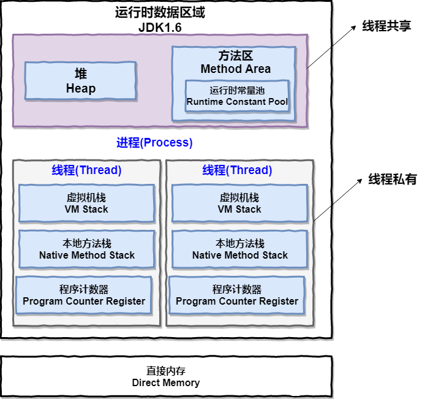
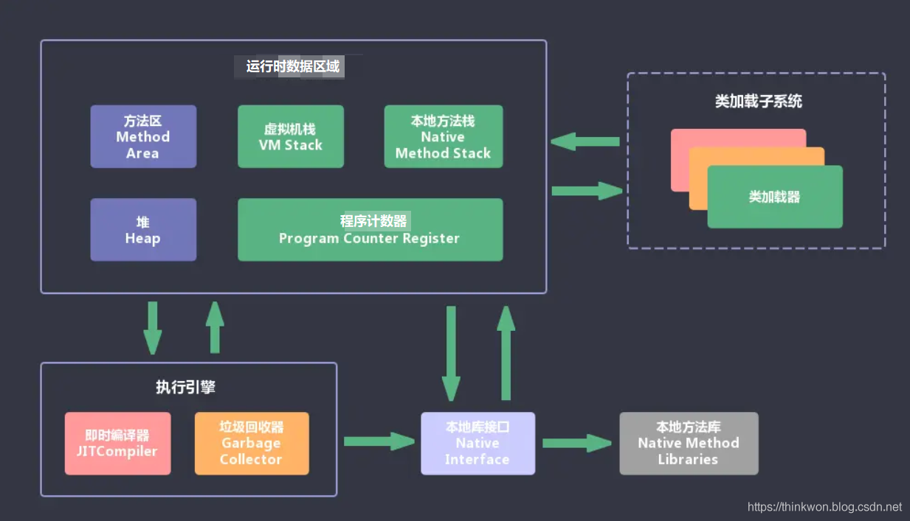
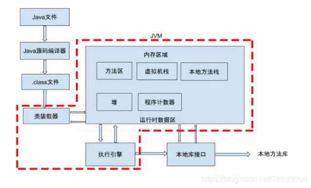

### JVM

### 1. 垃圾回收算法分类

从垃圾回收算法实现主要分为**复制（copy）**、**标记清除**（mark-sweep）和**标记压缩**（mark-compact）

从回收方式上可以分为**串行回收**、**并行回收**、**并发回收**（CMS,G1,ZGC,Shenandoah）

从内存管理上可以分为**分代管理**和**非分代管理**。

### 对象在哪里分配？

数组和对象是堆上分配，当学完**逃逸分析**后，我们了解到并不完全是这样的。由于 **JIT 的存在，如果发现某些对象没有逃逸出方法，那么就有可能被优化成了栈上分配**

### CMS和G1的优缺点

### 吞吐量优先和响应时间优先的回收器有哪些？

吞吐量=（运行用户代码）/(用户代码+垃圾收集)

**新生代：**

Serial收集器：简单高效，会stop the world 适合单核服务器

ParNew收集器：多线程的serial

Parallel Scavenge：多线程收集器，也是采用复制算法。 Parallel Scavenge收集器的目的是达到一个**可控制的吞吐量**，而ParNew收集器关注点在于尽可能的缩短垃圾**收集时用户线程的停顿时间***。

**老年代：**

Serial Old：

Parallel Old收集器：

CMS收集器：重视服务器响应速度，要求系统停顿时间最短

G1收集器：G1能建立可预测的时间停顿模型，能让使用者明确指定一个长度为M毫秒的时间片段内，消耗在垃圾收集上的时间不得超过N毫秒。
### 到底多大的对象会被直接扔到老年代？

##### 新生代

##### 老年代

> 1.提升（大于age的对象进老年代，）
>
> 2.**分配担保**
>
> 每次存活的对象，都会放入其中一个幸存区，这个区域默认的比例是 10%。但是我们无法保证每次存活的对象都小于 10%，当 Survivor 空间不够，就需要依赖其他内存（指老年代）进行分配担保。这个时候，对象也会直接在老年代上分配。
>
> 3.**大对象直接在老年代分配**
>
> 4.**动态对象年龄判定**：幸存区中相同年龄对象大小的和，大于幸存区的一半，大于或等于 age 的对象将会直接进入老年代。
>
> 

##### **卡片标记（card marking）**

用来标记**跨代引用**，类似Bitmap

卡表（Card Table）就是用于标记卡页状态的一个集合，每个卡表项对应一个卡页。

如果年轻代有对象分配，而且老年代有对象指向这个新对象， 那么这个老年代对象所对应内存的卡页，就会标识为 dirty，卡表只需要非常小的存储空间就可以保留这些状态。

垃圾回收时，就可以先读这个卡表，进行快速判断。

### G1什么时候引发FullGC

**Minor GC:**新生代的垃圾收集

**Major GC:**老年代的垃圾收集。目前只有CMS收集器会有单独收集老年代的行为。

**Mixed GC：**指目标是收集**整个新生代以及部分老年代**的垃圾收集。目前只有G1收集器会有这种行为。

**Full GC:**收集整个Java堆和方法区的垃圾收集

1. System.gc() 方法的调用 
   此方法的调用是建议 JVM 进行 Full GC，注意这**只是建议而非一定**，但在很多情况下它会触发 Full GC，从而增加 Full GC 的频率。通常情况下我们只需要让虚拟机自己去管理内存即可，我们可以通过 -XX:+ DisableExplicitGC 来禁止调用 System.gc()。

2. 老年代空间不足 
   老年代空间不足会触发 Full GC 操作，若进行该操作后空间依然不足，则会抛出如下错误： 
   `java.lang.OutOfMemoryError: Java heap space`

3. 永久代空间不足 
   JVM 规范中运行时数据区域中的方法区，在 HotSpot 虚拟机中也称为永久代（Permanet Generation），存放一些类信息、常量、静态变量等数据，当系统要加载的类、反射的类和调用的方法较多时，永久代可能会被占满，会触发 Full GC。如果经过 Full GC 仍然回收不了，那么 JVM 会抛出如下错误信息： 
   `java.lang.OutOfMemoryError: PermGen space `

4. CMS GC 时出现 promotion failed 和 concurrent mode failure 
   promotion failed，就是上文所说的担保失败，而 concurrent mode failure 是在执行 CMS GC 的过程中同时有对象要放入老年代，而此时老年代空间不足造成的。

5. 统计得到的 Minor GC 晋升到老生代的平均大小大于老年代的剩余空间

### volatile有什么用？说明下volatile的实现原理

### 双重检查锁定的单例需要不需要加volatile？

### 为何volatile不是线程安全的？

### 说一说伪共享问题

https://www.jianshu.com/p/7e613d34928b

### 描述下你对JMM(Java内存模型)的理解？

[参考1](https://github.com/Snailclimb/JavaGuide/blob/master/docs/java/multi-thread/Java%E5%B9%B6%E5%8F%91%E5%9F%BA%E7%A1%80%E5%B8%B8%E8%A7%81%E9%9D%A2%E8%AF%95%E9%A2%98%E6%80%BB%E7%BB%93.md#1-%E4%BB%80%E4%B9%88%E6%98%AF%E7%BA%BF%E7%A8%8B%E5%92%8C%E8%BF%9B%E7%A8%8B)[参考2](https://github.com/Snailclimb/JavaGuide/blob/3965c02cc0f294b0bd3580df4868d5e396959e2e/Java%E7%9B%B8%E5%85%B3/%E5%8F%AF%E8%83%BD%E6%98%AF%E6%8A%8AJava%E5%86%85%E5%AD%98%E5%8C%BA%E5%9F%9F%E8%AE%B2%E7%9A%84%E6%9C%80%E6%B8%85%E6%A5%9A%E7%9A%84%E4%B8%80%E7%AF%87%E6%96%87%E7%AB%A0.md)

一个进程中可以有多个线程，多个线程共享进程的**堆**和**方法区 (JDK1.8 之后的元空间)\**资源，但是每个线程有自己的\**程序计数器**、**虚拟机栈** 和 **本地方法栈**。

##### 程序计数器为什么是私有的?

程序计数器主要有下面两个作用：

1. 字节码解释器通过改变程序计数器来依次读取指令，从而实现代码的流程控制，如：顺序执行、选择、循环、异常处理。
2. 在多线程的情况下，程序计数器用于记录当前线程执行的位置，从而当线程被切换回来的时候能够知道该线程上次运行到哪儿了。

需要注意的是，如果执行的是 native 方法，那么程序计数器记录的是 undefined 地址，只有执行的是 Java 代码时程序计数器记录的才是下一条指令的地址。

所以，程序计数器私有主要是为了**线程切换后能恢复到正确的执行位置**。

##### 虚拟机栈和本地方法栈为什么是私有的?

* **虚拟机栈：** 每个 Java 方法在执行的同时会创建一个栈帧用于存储局部变量表、操作数栈、常量池引用等信息。从方法调用直至执行完成的过程，就对应着一个栈帧在 Java 虚拟机栈中入栈和出栈的过程。
* **本地方法栈：** 和虚拟机栈所发挥的作用非常相似，区别是： **虚拟机栈为虚拟机执行 Java 方法 （也就是字节码）服务，而本地方法栈则为虚拟机使用到的 Native 方法服务。** 在 HotSpot 虚拟机中和 Java 虚拟机栈合二为一。

所以，为了**保证线程中的局部变量不被别的线程访问到**，虚拟机栈和本地方法栈是线程私有的。

##### 堆和方法区

堆和方法区是所有线程共享的资源，其中堆是进程中最大的一块内存，主要用于存放**新创建的对象** (几乎所有对象都在这里分配内存)，方法区主要用于存放已**被加载的类信息、常量、静态变量、即时编译器编译后的代码等数据**

### JVM 的主要组成部分及其作用

JVM包含两个子系统和两个组件，两个子系统为Class loader(类装载)、Execution engine(执行引擎)；两个组件为Runtime data area(运行时数据区)、Native Interface(本地接口)。

Class loader(类装载)：根据给定的全限定名类名(如：java.lang.Object)来装载class文件到Runtime data area中的method area。

Execution engine（执行引擎）：执行classes中的指令。

Native Interface(本地接口)：与native libraries交互，是其它编程语言交互的接口。

Runtime data area(运行时数据区域)：这就是我们常说的JVM的内存。

作用 ：首先通过编译器把 Java 代码转换成字节码，类加载器（ClassLoader）再把字节码加载到内存中，将其放在运行时数据区（Runtime data area）的方法区内，而字节码文件只是 JVM 的一套指令集规范，并不能直接交给底层操作系统去执行，因此需要特定的命令解析器执行引擎（Execution Engine），将字节码翻译成底层系统指令，再交由 CPU 去执行，而这个过程中需要调用其他语言的本地库接口（Native Interface）来实现整个程序的功能。

### JVM的堆栈

堆一般就是jvm中的堆，栈一般就是java虚拟机栈

**物理地址**

堆的物理地址分配对对象是不连续的。因此性能慢些。在GC的时候也要考虑到不连续的分配，所以有各种算法。比如，标记-消除，复制，标记-压缩，分代（即新生代使用复制算法，老年代使用标记——压缩）

栈使用的是数据结构中的栈，先进后出的原则，物理地址分配是连续的。所以性能快。

**内存分配**

堆因为是不连续的，所以分配的内存是在运行期确认的，因此大小不固定。一般堆大小远远大于栈。

栈是连续的，所以分配的内存大小要在编译期就确认，大小是固定的。

**存放的内容**

堆存放的是对象的实例和数组。因此该区更关注的是数据的存储

栈存放：局部变量，操作数栈，返回结果。该区更关注的是程序方法的执行。

### 对象创建方法和创建过程

> 遇到new指令时，检查这个指令的参数能否在常量池中定位到一个符号引用，并检查这个符号引用所定位的类是否已经被加载，解析，初始化过，如果没有，那么进行类加载过程，首先类加载检查，接下来为这个类分配内存，分配内存的方法有：指针碰撞，空闲列表。此外还要考虑内存分配时的同步问题，CAS去解决，内存 分配完毕后虚拟机将分配的内存空间初始化为0，然后对对象进行必要的设置（对象头中的设置)，然后执行class的init方法，执行构造方法等操作

https://blog.csdn.net/justloveyou_/article/details/72466416

https://blog.csdn.net/SDDDLLL/article/details/94394338

### 怎么判断对象是否可以被回收？

引用计数器法：为每个对象创建一个引用计数，有对象引用时计数器 +1，引用被释放时计数 -1，当计数器为 0 时就可以被回收。它有一个缺点不能解决循环引用的问题；
可达性分析算法：从 GC Roots 开始向下搜索，搜索所走过的路径称为引用链。当一个对象到 GC Roots 没有任何引用链相连时，则证明此对象是可以被回收的。

### jvm对象分配规则

对象的内存分配，从大方向上将，就是在堆上分配（但也可能经过JIT编译后被拆散为标量类型并间接地在栈上分配），对象主要分配在**新生代**的Eden区上，如果启动了本地线程分配缓冲，将按线程优先在TLAB上分配。少数情况也可能直接分配在老年代中，分配的规则并不是百分之百固定的，其细节取决于当前使用的是哪一种垃圾收集器组合，还有虚拟机中与内存相关的参数的设置。

1. **对象优先\**分配\**在Eden区**

   -verbose:gc -Xms20M -Xmx20M -Xmn10M -XX:SurvivorRatio=8

2. **大对象保存到老年代（优先保存在Eden区）**

3. **长期存活的对象将进入老年代**

4. **动态对象年龄判定**

   如果**Survivor区中相同年龄的所有对象大小的总和大于Survivor空间的一半**，年龄大于或等于该年龄的对象可以直接进入老年代

5. **空间分配担保**

   当发生Minor GC时，虚拟机会检测之前每次晋升到老年代的平均大小是否大于老年代的剩余空间大小，如果大于，则改为直接进行一次Full GC。如果小于，则查看HandlePromotionFailure设置是否允许担保失败；如果允许，那只会进行Minor GC；如果不允许，则也要改为进行一次Full GC。

   新生代使用复制收集算法，但为了内存利用率，值使用其中一个Survivor空间来作为轮换备份，因此当出现大量对象在Minor GC后仍然存活的情况时（最极端就是内存回收后新生代中所有对象都存活），就需要**老年代进行分配担保**，让Survivor无法容纳的对象直接进入老年代。

   取平均值进行比较其实仍然是一种动态概率的手段，也就是说如果某次Minor GC存活后的对象突增，远远高于平均值时，依然会导致**担保失败**（Handle Promotion Failure）。如果出现HandlePromotionFailure失败，那就只好在失败后重新发起一次Full GC。虽然担保失败时绕的圈子是最大的，但大部分情况下都还是会将HandlePromotionFailure开关打开，避免Full GC过于频繁。

### JVM加载class文件原理

类加载主要分为加载、验证、准备、解析、初始化

##### **加载：**

主要有

- 通过一个类的全限定名来获取此类的class字节码二进制流
- 将这个字节码二进制流中的静态存储结构转化为方法区中的运行时数据结构
- 在内存中生成一个代表该类的java.lang.Class对象，作为方法区中这个类的各种数据的访问入口

对于Class对象，Java虚拟机规范并没有规定是存储在Java堆中，HotSpot虚拟机将其存放在方法区内。

##### 验证：

验证作为链接过程中的第一步，大致会完成以下4个阶段的检验动作：

- **文件格式验证** 该阶段主要在字节流转化为方法区中的运行时数据时，负责检查字节流是否符合Class文件的规范，保证其可以正确的被解析并存储于方法区中。后面的检查都是基于方法区的存储结构进行检验，不会再直接操作字节流。
- **元数据验证** 该阶段负责分析存储于方法区的结构是否符合Java语言规范的要求，如该类是否继承了不允许继承的类（被final修饰的类）、是否包含父类等。此阶段进行数据类型的校验，保证符合不存在非法的元数据信息。
- **字节码验证** 元数据验证保证了字节码中的数据类型符合语言的规范，该阶段则负责分析数据流和控制流，确定方法体的合法性，保证被校验的方法在运行时不会危害虚拟机的运行。
- **符号引用验证** 最后一个阶段发生在链接的解析阶段。在解析阶段，会将虚拟机中的符号引用转化为直接引用，该阶段则负责对各种符号引用进行匹配性校验，保证外部依赖真实存在，并且符合外部依赖类、字段、方法的访问性。

##### 准备

准备阶段正式为类的字段变量分配内存，**并设置初始值**。这些变量存储于方法区中，注意此处的变量为 类变量（被static修饰符修饰），而非实例变量。

##### 解析

解析阶段将常量池中的**符号引用替换为直接引用**。在字节码文件中，类、接口、字段、方法等类型都是由一组符号来表示，其形式由Java虚拟机规范中的Class文件格式定义。在虚拟机执行特定指令之前，需要将符号引用转化为目标的指针、相对偏移量或者句柄，这样可以通过此类直接引用在内存中定位调用的具体位置。

##### 初始化

在类的class文件中，包含两个特殊的方法：<clinit>和<init>。这两个方法由编译器自动生成，分别代表**类构造器**和**构造函数**。其中构造函数可以由变成人员实现，而类构造器则由编译器自动生成。而初始化阶段则负责调用类构造器，来初始化变量和资源。

### 双亲委派机制的好处

如果一个类加载器收到了类加载的请求，它首先不会自己去加载这个类，而是把这个请求委派给父类加载器去完成，每一层的类加载器都是如此，这样所有的加载请求都会被传送到顶层的启动类加载器中，只有当父加载无法完成加载请求（它的搜索范围中没找到所需的类）时，子加载器才会尝试去加载类。

##### 优点：

是Java类随着它的类加载器一起具备了一种带有优先级的层次关系，通过这种层级关可以避免类的重复加载，当父亲已经加载了该类时，就没有必要子ClassLoader再加载一次。其次是考虑到安全因素，java核心api中定义类型不会被随意替换，假设通过网络传递一个名为java.lang.Integer的类，通过双亲委托模式传递到启动类加载器，而启动类加载器在核心Java API发现这个名字的类，发现该类已被加载，并不会重新加载网络传递的过来的java.lang.Integer，而直接返回已加载过的Integer.class，这样便可以防止核心API库被随意篡改。

##### 双亲委派机制怎么破坏

### Java 对象结构

Java 对象由三个部分组成：<u>对象头、实例数据、对齐填充</u>。

对象头由两部分组成，第一部分存储对象自身的运行时数据：哈希码、GC 分代年龄、锁标识状态、线程持有的锁、偏向线程 ID（一般占 32/64 bit）。

第二部分是指针类型，指向对象的类元数据类型（即对象代表哪个类）。如果是数组对象，则对象头中还有一部分用来记录数组长度。

实例数据用来存储对象真正的有效信息（包括父类继承下来的和自己定义的）

对齐填充：JVM 要求对象起始地址必须是 8 字节的整数倍（8 字节对齐）

### JAVA反射机制原理

### 什么时候会出现OOM

Java中涉及内存分配都可能会产生OOM

##### GC Roots 有哪些

GC Roots 是一组必须活跃的引用。用通俗的话来说，就是程序接下来通过直接引用或者间接引用，能够访问到的潜在被使用的对象。

GC Roots 包括：

- Java 线程中，当前所有正在被调用的方法的引用类型参数、局部变量、临时值等。也就是与我们栈帧相关的各种引用。
- 所有当前被加载的 Java 类。
- Java 类的引用类型静态变量。
- 运行时常量池里的引用类型常量（String 或 Class 类型）。
- JVM 内部数据结构的一些引用，比如 sun.jvm.hotspot.memory.Universe 类。
- 用于同步的监控对象，比如调用了对象的 wait() 方法。
- JNI handles，包括 global handles 和 local handles。

这些 GC Roots 大体可以分为三大类，下面这种说法更加好记一些：

- 活动线程相关的各种引用。
- 类的静态变量的引用。
- JNI 引用。

有两个注意点：

- 我们这里说的是活跃的引用，而不是对象，对象是不能作为 GC Roots 的。
- GC 过程是找出所有活对象，并把其余空间认定为“无用”；而不是找出所有死掉的对象，并回收它们占用的空间。所以，哪怕 JVM 的堆非常的大，基于 tracing 的 GC 方式，回收速度也会非常快。

##### 引用链

强引用、软引用、弱引用、虚引用

被引用的对象不一定都存活，因为可能是弱引用，虚引用等

#####  OOM 场景

##### Java堆

先分清楚到底是出现了内存泄漏（Memory Leak）还是内存溢出（Memory Overfow）

如果是内存泄漏，可进一步通过工具查看泄漏对象到GC Roots的引用链，找到泄漏对象是通过怎样的引用路径、与哪些GC Roots相关联，才导致垃圾收集器无法回收它们，根据泄漏对象的类型信息以及它到GC Roots引用链的信息，一般可以比较准确地定位到这些对象创建的位置，进而找出产生内存泄漏的代码的具体位置。

如果不是内存泄漏，换句话说就是内存中的对象确实都是必须存活的，那就应当检查Java虚拟机的堆参数（-Xmx与-Xms）设置，与机器的内存对比，看看是否还有向上调整的空间。再从代码上检查是否存在某些对象生命周期过长、持有状态时间过长、存储结构设计不合理等情况，尽量减少程序运行期的内存消耗。

##### 也有可能：

应用程序无意中保存了对象引用，对象无法被 GC 回收

应用程序过度使用 finalizer。finalizer 对象不能被 GC 立刻回收。finalizer 由结束队列服务的守护线程调用，有时 finalizer 线程的处理能力无法跟上结束队列的增长

##### 虚拟机栈和本地方法栈

**虚拟机栈：**就是我们常说的**栈**，每个java方法在执行时，会创建一个**“栈帧（stack frame）”**，栈帧的结构分为“局部变量表、操作数栈、动态链接、方法出口几个部分

**本地方法栈：**服务的对象是JVM执行的**native方法**，而虚拟机栈服务的是JVM执行的java方法。

由于HotSpot虚拟机中并不区分虚拟机栈和本地方法栈，栈容量只能由**-Xss参数来设定**。关于虚拟机栈和本地方法栈，在《Java虚拟机规范》中描述了两种异常：

1）如果**线程请求的栈深度大于虚拟机所允许的最大深度**，将抛出**StackOverfowError**异常。（StackOverfowError）

2）如果虚拟机的栈内存**允许动态扩展**，当扩展栈容量无法申请到足够的内存时，将抛出OutOfMemoryError异常。

无论是由于**栈帧太大还是虚拟机栈容量太小**，当新的栈帧内存无法分配的时候，HotSpot虚拟机抛出的都是StackOverfowError异常

#####  方法区和运行时常量池溢出

**方法区：**方法区的主要职责是用于存放类型的相关信息，如类名、访问修饰符、常量池、字段描述、方法描述等。对于这部分区域的测试，基本的思路是运行时产生大量的类去填满方法区，直到溢出为止

JDK8之前存在永久代，所以当我们一直使用String.intern方法在常量池中常见字符串，会报"PermGen space oom"错误

但是自JDK 7起，原本存放在永久代的字符串常量池被移至Java堆之中，所以在JDK 7及以上版本，限制方法区的容量对intern无效。这时候使用**-Xmx参数限制最大堆到6MB就能够看到**以下两种运行结果之一，具体取决于哪里的对象分配时产生了溢出：

当运行时常量池移至堆中后，通过StringBuilder创建的对象和intern方法的字符串常量就会都被分到Java堆中

再JDK1.8以后，永久代被淘汰，元空间被移至堆外，通过`·-XX：MaxMetaspaceSize：设置元空间最大值，默认是-1，即不限制，或者说只受限于本地内存大小。`来限制，正常只受限于本地内存

##### 本机直接内存溢出

直接内存（Direct Memory）的容量大小可通过-XX：MaxDirectMemorySize参数来指定，如果不去指定，则默认与Java堆最大值（由-Xmx指定）一致

### 即时编译

### 逃逸分析

### 元空间

##### 永久代

**存放：**存放JVM运行时使用的类。永久代同样包含了Java SE库的类和方法，**存放类和方法对象**

为什么移除？

*   它的大小是在启动时固定好的——很难进行调优。-XX:MaxPermSize，设置成多少好呢？
*   HotSpot的内部类型也是Java对象：它可能会在Full GC中被移动，同时它对应用不透明，且是非强类型的，难以跟踪调试，还需要存储元数据的元数据信息（meta-metadata）。
*   简化Full GC：每一个回收器有专门的元数据迭代器。
*   可以在GC不进行暂停的情况下并发地释放类数据。
*   使得原来受限于持久代的一些改进未来有可能实现

##### 元空间

随着JDK8的到来，JVM不再有PermGen。但类的元数据信息（metadata）还在，只不过不再是存储在连续的堆空间上，而是移动到叫做“Metaspace”的本地内存（Native memory）中。

元空间并不在虚拟机中，而是使用**本地内存**。因此，默认情况下，元空间的大小仅受本地内存限制，但可以通过以下参数来指定元空间的大小：

-XX:MetaspaceSize，初始空间大小，达到该值就会触发垃圾收集进行类型卸载，同时GC会对该值进行调整：如果释放了大量的空间，就适当降低该值；如果释放了很少的空间，那么在不超过MaxMetaspaceSize时，适当提高该值。-XX:MaxMetaspaceSize，最大空间，默认是没有限制的。

**就是为什么要做这个转换？**

　　1、字符串存在永久代中，容易出现性能问题和内存溢出。

　　2、类及方法的信息等比较难确定其大小，因此对于永久代的大小指定比较困难，太小容易出现永久代溢出，太大则容易导致老年代溢出。

　　3、永久代会为 GC 带来不必要的复杂度，并且回收效率偏低。

　　4、Oracle 可能会将HotSpot 与 JRockit 合二为一。
