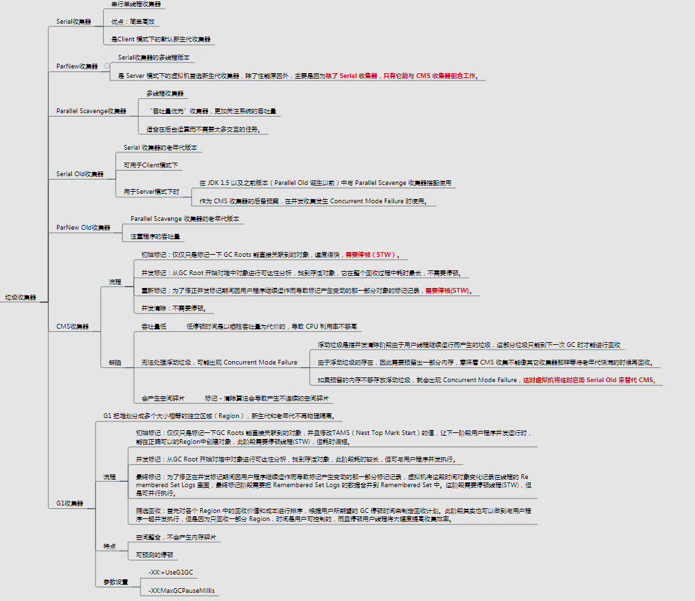
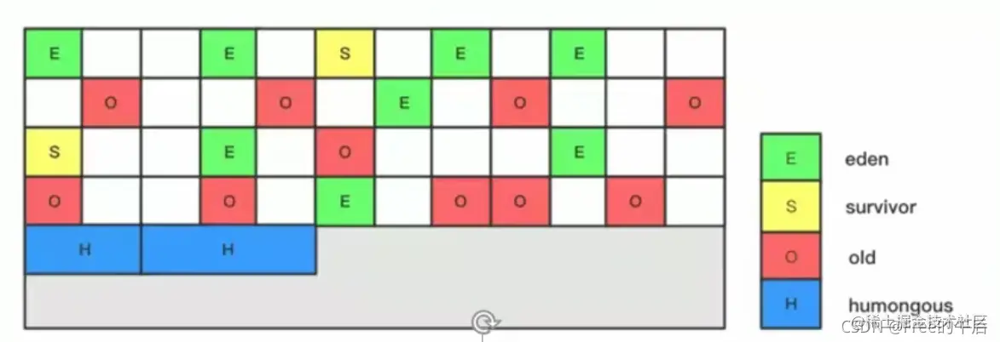

###  CMS垃圾回收

采用并发，标记清除算法进行回收的GC

1.  <u>cms只会回收老年代和永久代</u>（1.8开始为元数据区，需要设置CMSClassUnloadingEnabled），不会收集年轻代；
2.  cms是一种预处理垃圾回收器，它不能等到old内存用尽时回收，需要在内存用尽前，完成回收操作，否则会导致并发回收失败；所以cms垃圾回收器开始执行回收操作，有一个触发阈值，默认是老年代或永久带达到92%；

#### 讲一下CMS的流程

1.  初始标记(CMS-initial-mark) ,会导致stw；

    >   标记老年代中所有的<u>GC Roots对象</u> 2.标记年轻代中活着的对象引用到的老年代的对象
    >
    >   可以适当增加线程数来加开初始标记时间

2.  并发标记(CMS-concurrent-mark)，与用户线程同时运行；

    >   从“初始标记”阶段标记的对象开始找出所有存活的对象;因为是并发运行的，<u>在运行期间会发生新生代的对象晋升到老年代</u>、或者是直接在老年代分配对象、或者更新老年代对象的引用关系等等，对于这些对象，都是需要进行<u>重新标记</u>的，否则有些对象就会被遗漏，发生漏标的情况。为了提高重新标记的效率，该阶段会把上述对象所在的Card标识为Dirty，后续只需扫描这些Dirty Card的对象，避免扫描整个老年代； 并发标记阶段只负责将引用发生改变的Card标记为Dirty状态，不负责处理；

3.  预清理（CMS-concurrent-preclean），与用户线程同时运行；

    >   这个阶段就是用来处理前一个阶段因为引用关系改变导致没有标记到的存活对象的，它会扫描所有标记为Direty的Card 

4.  可被终止的预清理（CMS-concurrent-abortable-preclean） 与用户线程同时运行；

    >   这个阶段尝试着去承担下一个阶段Final Remark阶段足够多的工作,**此阶段最大持续时间为5秒**，为了期待这5秒内能够发生一次ygc，清理年轻带的引用，这样下个阶段的重新标记阶段，<u>扫描年轻代指向老年代的引用的时间减少</u>

5.  重新标记(CMS-remark) ，会导致stw；（***主要耗费时间阶段***）

    >   完成标记整个老年代的所有的存活对象。 这个阶段，重新标记的**内存范围是整个堆**，包含_young_gen和_old_gen。
    >
    >   **为什么要扫描新生代呢？**因为对于老年代中的对象，如果被新生代中的对象引用，那么就会被视为存活对象，即使新生代的对象已经不可达了，也会使用这些不可达的对象当做cms的“gc root”，来扫描老年代； 因此对于老年代来说，引用了老年代中对象的新生代的对象，也会被老年代视作“GCROOTS”:当此阶段耗时较长的时候，可以加入参数-XX:+CMSScavengeBeforeRemark，在重新标记之前，<u>先执行一次ygc，回收掉年轻带的对象无用的对象</u>，并将对象放入幸存带或晋升到老年代，这样再进行年轻带扫描时，只需要扫描幸存区的对象即可，一般幸存带非常小，这大大减少了扫描时间 由于之前的预处理阶段是与用户线程并发执行的，这时候可能年轻带的对象对老年代的引用已经发生了很多改变，这个时候，remark阶段要花很多时间处理这些改变，会导致很长stop the word，<u>所以通常CMS尽量运行Final Remark阶段在年轻代是足够干净的时候。</u>

6.  并发清除(CMS-concurrent-sweep)，与用户线程同时运行；

    >   **老年代所有存活的对象已经被标记**,由于CMS并发清理阶段用户线程还在运行着，伴随程序运行自然就还会有新的垃圾不断产生，这一部分垃圾出现在标记过程之后，CMS无法在当次收集中处理掉它们，只好留待下一次GC时再清理掉。这一部分垃圾就称为**“浮动垃圾”**

7.  并发重置状态等待下次CMS的触发(CMS-concurrent-reset)，与用户线程同时运行；

    >   重新设置CMS算法内部的数据结构，准备下一个CMS生命周期的使用。

#### 听说过CMS的并发预处理和并发可中断预处理吗

- CMS并发预处理——并发标记
- CMS并发可中断预处理——重新标记

1、CMS是一个关注停顿时间，以回收停顿时间最短为目标的垃圾回收器。并发预处理阶段做的工作是标记，重标记需要STW，因此重标记的工作尽可能多的在并发阶段完成来减少STW的时间。此阶段标记**从新生代晋升的对象、新分配到老年代的对象以及在并发阶段被修改了的对象**。
		2、并发可中断预清理(Concurrent precleaning)是标记**在并发标记阶段引用发生变化的对象**，如果发现对象的引用发生变化，则JVM会标记堆的这个区域为Dirty Card。那些能够从Dirty Card到达的对象也被标记（标记为存活），当标记做完后，这个Dirty Card区域就会消失。CMS有两个参数：CMSScheduleRemarkEdenSizeThreshold、CMSScheduleRemarkEdenPenetration，默认值分别是2M、50%。两个参数组合起来的意思是预清理后，eden空间使用超过2M时启动可中断的并发预清理（CMS-concurrent-abortable-preclean），直到eden空间使用率达到50%时中断，进入重新标记阶段

#### 出现concurrent mode failure异常

这个异常发生在cms正在回收的时候。执行CMS GC的过程中，同时业务线程也在运行，当年轻代空间满了，执行ygc，需要将存活的对象放入到老年代，而此时老年代空间不足，这时CMS还没有机会回收老年带产生的，或者在做Minor GC的时候，新生代救助空间放不下，需要放入老年代，而老年代也放不下，就会产生异常。所以我们需要预留足够的空间来进行CMS垃圾回收，

`-XX:CMSInitiatingOccupancyFraction=70 是指设定CMS在对内存占用率达到70%的时候开始GC。`这个参数需要设置合理，设置小了会导致频繁进行垃圾回收，设置大了则肯呢个发生CMF异常

#### 过早提升与提升失败

在 Minor GC 过程中，Survivor Unused 可能不足以容纳 Eden 和另一个 Survivor 中的存活对象， 那么多余的将被移到老年代， 称为过早提升（Premature Promotion）,这会导致老年代中短期存活对象的增长， 可能会引发严重的性能问题。 再进一步， 如果老年代满了， Minor GC 后会进行 Full GC， 这将导致遍历整个堆， 称为提升失败（Promotion Failure）

#### 早提升的原因

1.  Survivor空间太小，容纳不下全部的运行时短生命周期的对象，如果是这个原因，可以尝试将Survivor调大，否则端生命周期的对象提升过快，导致老年代很快就被占满，从而引起频繁的full gc；
2.  对象太大，Survivor和Eden没有足够大的空间来存放这些大象；

#### 解决方法

1.  如果是因为内存碎片导致的大对象提升失败，cms需要进行空间整理压缩；
2.  如果是因为提升过快导致的，说明Survivor 空闲空间不足，那么可以尝试调大 Survivor；
3.  如果是因为老年代空间不够导致的，尝试将CMS触发的阈值调低；

### 3. G1垃圾回收

https://juejin.cn/post/7010034105165299725#heading-7

**JDK9的默认垃圾回收器**

G1(Garbage-First)是一款**面向服务端应用的垃圾收集器,**主要针对配备**多核CPU**及大容量内存的机器,**以极高概率满足GC停顿时间的同时**,还**兼具高吞吐量的性能特征**

跳出了之前回收器的分代行为，可以面向**堆内存的任何部分来组成垃圾回收，分成不同的区region**，这些区可以组成不同大小的Eden空间，Survivor空间，老年代空间，还有**humongous区域来存储大对象**（超过1.5个Region）。

#### 相关参数

>   -XX:+UseG1GC 使用
>
>   -XX:G1HeapRegionSize=n 设置region
>
>   -XX:MaxGCPauseMillis=n 设置期望最大GC停顿时间
>
>   -XX:ConcGCThreads=n并发垃圾收集器使用的线程数量
>
>   -XX:InitiatingHeapOccupancyPercent=n 启动并发GC周期时的堆内存占用百分比.

#### 主要原理

使用G1收集器时，它将整个<u>Java堆划分成约2048个大小相同的独立Region块</u>，每个Region块大小根据堆空间的实际大小而定，整体被控制在1MB到32MB之间，且为2的N次幂，即1MB,2MB, 4MB, 8MB, 16MB, 32MB。可以通过-XX :G1HeapRegionSize设定。**所有的Region大小相同**，且**在JVM生命周期内不会被改变**。

虽然还保留有新生代和老年代的概念，但新生代和老年代不再是物理隔离的了,它们都是一部分Region (不连续)的集合。**通过Region的动态分配方式实现逻辑上的连续。**

G1垃圾收集器还增加了一种新的内存区域，叫做**Humongous内存区域**，如图中的H块。主要用于存储大对象，如果**超过1.5个region, 就放到H**；**对于堆中的大对象，默认直接会被分配到老年代**，但是如果它**一个短期存在的大对象，就会对垃圾收集器造成负面影响**。为了解决这个问题，G1划分了一个Humongous区，它用来专门存放大对象。**如果一个H区装不下一个大对象，那么G1会寻找连续的H区来存储**。为了能找到连续的H区，有时候不得不启动Full GC。 G1的大多数行为都把H区作为老年代的一部分来看待。

##### **可预测的停顿时间模型**

1. 跨Region对象怎么解决（卡表）
2. 并发标记阶段如何保证收集线程和用户线程互不干扰（）
3. 怎样建立起可靠的停顿预测模型

### 收集过程

#### 过程1：年轻代GC

暂停所有停用程序线程，进行年轻代回收，然后将年轻代对象放到survivor区或者是老年区间

#### 过程2：老年代标记（只回收百分百为垃圾的region）

##### 初始标记：

标记从根节点直接可达的对象。这个阶段是STW的,并且会触发一次年轻代GC

##### 根区域扫描(Root Region Scanning)

扫描Survivor区**直接可达的老年代区域对象,**并标记被引用的对象。**这一过程必须在young GC之前完成**(YoungGC时,会动Survivor区,所以这一过程必须在young GC之前完成)

##### **并发标记(Concurrent Marking):**

在整个堆中进行并发标记(和应用程序并发执行),此过程可能被young GC中断。在并发标记阶段,**若发现区域对象中的所有对象都是垃圾,那这个区域会被立即回收**。同时,**并发标记过程中,会计算每个区域的对象活性**(区域中**存活对象的比例**)

##### **再次标记(Remark):**

由于应用程序持续进行,需要修正上一次的标记结果。**是STW的**。G1中采用了比CMS更快的初始快照算法:snapshot一at一the一beginning (SATB).

##### **独占清理(cleanup,STW)**

计算各个区域的存活对象和GC回收比例,并进行排序,识别可以混合回收的区域。为下阶段做铺垫。**是STW的。**(这个阶段并不会实际上去做垃圾的收集)

#### 过程3：混合回收

如果堆内存使用超过45，则开始混合回收，有一个阈值，达到多少阈值的region就会被回收，默认65%

**Mixed GC并不是FullGC**,**老年代的堆占有率达到参数(-XX:InitiatingHeapOccupancyPercent)设定的值则触发**,回收所有的Young和部分Old(根据期望的GC停顿时间确定old区垃圾收集的优先顺序)以及大对象区,正常情况G1的垃圾收集是先做MixedGC,**主要使用复制算法**,需要把各个region中存活的对象拷贝到别的region里去,**拷贝过程中如果发现没有足够的空region能够承载拷贝对象就会触发一次Full GC**

#### 使用场景

面向大内存，多处理机的机器。

*   实时数据占用了超过半数的堆空间；
*   对象分配率或“晋升”的速度变化明显；
*   期望消除耗时较长的GC或停顿（超过0.5——1秒）。

### 总结

##### CMS:

收集老年代，基于标记清除算法，会产生内存碎片（几次GC后进行内存整理），无法处理浮动垃圾，需要两次暂停（**初始标记和重新标记**）需要在内存资源耗完前进行清理，

安全点(Safepoint)：1.<u>抢先式中断</u>（Preemptive Suspension） 抢先式中断不需要线程的执行代码主动去配合，在GC发生时，首先把所有线程全部中断，如果发现有线程中断的地方不在安全点上，就恢复线程，让它“跑”到安全点上。现在几乎没有虚拟机采用这种方式来暂停线程从而响应GC事件。2.<u>主动式中断</u>（Voluntary Suspension） 主动式中断的思想是当GC需要中断线程的时候，不直接对线程操作，仅仅简单地设置一个标志，各个线程执行时主动去轮询这个标志，发现中断标志为真时就自己中断挂起。轮询标志的地方和安全点是重合的，另外再加上创建对象需要分配内存的地方

##### G1

将堆划分为一个个region，**多个不连续的Region**组成了年轻代，老年代；带来了**停顿时间可预测的收集模型**：<u>（跟踪各个Region中垃圾堆积，优先回收价值最大的Region，相比cms最差停顿时间好很多）</u>。即G1提供了接近实时的收集特性。G1整体上是标记整理算法，region之间是基于复制算法，G1垃圾收集内存占用（Rset）和程序运行时额外负载都比cms高 

G1使用卡表来**减少老年代的全堆空间扫描** 该技术将整个堆划分为一个个大小为512字节的卡，并且维护一个卡表，用来存储每张卡的一个标识位。这个标识位代表<u>对应的卡是否可能存有指向新生代对象的引用</u>。如果可能存在，那么我们就认为这张卡是脏的。

在进行Minor GC的时候，我们便可以不用扫描整个老年代，而是在<u>卡表中寻找脏卡</u>，并将脏卡中的对象加入到Minor GC的GC Roots里。当完成所有脏卡的扫描之后，Java虚拟机便会将所有脏卡的标识位清零。