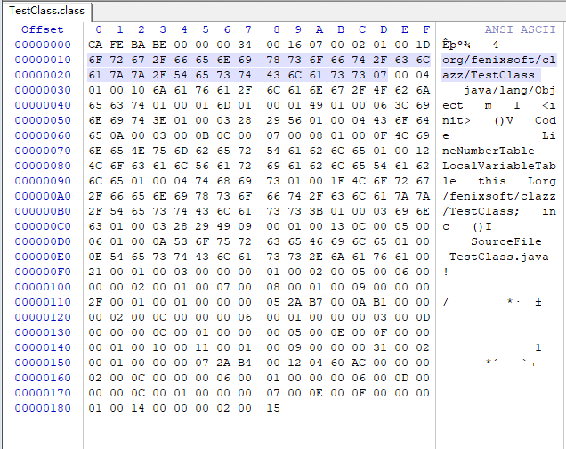
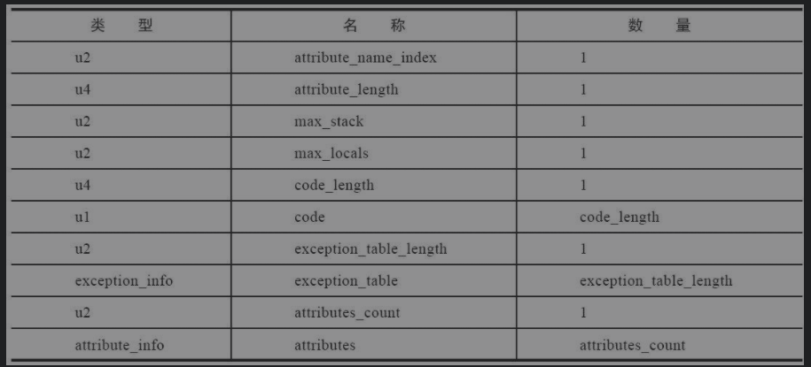

### 1. 无关性基石

口号：一次编写，到处运行
可以视同java虚拟机运行其他程序，早期的java分==为Java语言规范==和==Java虚拟机规范==


### 2. class类文件结构

- **class**文件格式采<u>用两种数据</u>结构来存储数据分别是：“无符号数”和“表”
·无符号数属于基本的数据类型，以u1、u2、u4、u8来分别代表1个字节、2个字节、4个字节和8个字节的无符号数
- 表是由多个无符号数或者其他表作为数据项构成的复合数据类型，为了便于区分，所有表的命名都习惯性地==以“_info”结尾==。表用于描述==有层次关系==的复合结构的数据，整个Class文件本质上也可以视作是一张表

### 3.魔数与Class文件的版本

- 魔数（1-4字节）：4字节，用来确定这个文件能否被一个虚拟机接受，值为0xCAFEBABE
- 版本号（5-8字节）：4字节（前两个是次版本号，后两个是主版本号）不能执行超过版本号的class文件（注意一定要用winhex打开，我用notepad++打开显示的和书上不一样）
- 常量池（）：接着一个字节是常量池计数器（9字节），常量池中存放两大类常量：字面量和符号引用  
- ==常量池的项目类型：==

| 类型                             | 标志 | 描述                         |
| -------------------------------- | ---- | ---------------------------- |
| CONSTANT_Utf8_info               | 1    | UTF-8编码的字符串            |
| CONSTANT_Integer_info            | 3    | 整型字面量                   |
| CONSTANT_Float_info              | 4    | 浮点型字面量                 |
| CONSTANT_Long_info               | 5    | 长整型字面量                 |
| CONSTANT_Double_info             | 6    | 双精度浮点数字面量           |
| CONSTANT_Class_info              | 7    | 类或者接口的符号引用         |
| CONSTANT_String_info             | 8    | 字符串类型字面量             |
| CONSTANT_Fieldref_info           | 9    | 字段的符号引用               |
| CONSTANT_Methodref_info          | 10   | 类中方法的符号引用           |
| CONSTANT_InterfaceMethodref_info | 11   | 接口中方法的符号引用         |
| CONSTANT_NameandType_info        | 12   | 字段或方法的部分符号引用     |
| CONSTANT_Methodhandle_info       | 15   | 表示方法句柄                 |
| CONSTANT_MethodType_info         | 16   | 方法类型                     |
| CONSTANT_Dynamic_info            | 17   | 动态计算常量                 |
| CONSTANT_InvokeDynamic_info      | 18   | 动态方法调节点               |
| CONSTANT_Module_info             | 19   | 表示一个模块                 |
| CONSTANT_package_info            | 20   | 表示一个模块开放或者导出的包 |
```
符号引用有：
* 被模块导出或者开放的包（Package）
* 类和接口的全限定名（FullyQualifiedName）
* 字段的名称和描述符（Descriptor）
* 方法的名称和描述符
* 方法句柄和方法类型（MethodHandle、MethodType、InvokeDynamic）
* 动态调用点和动态常量（Dynamically-ComputedCallSite、Dynamically-Computed Constant）
```
### 动手查看字节码

通过编译TestClass.java再使用winhex来打开TestClass.class文件可以查看字节码文件

也可以通过java自带的工具javap 来反编译class文件


- 访问标志（常量池后两个字节代表访问标志)：分别有public，final,super,interface,abstract,synthetic,enum,module
- 类索引、父类索引与接口索引集合(??)
- 字段表集合：用于描述接口或者类中声明的变量（引用常量池来描述）
- 方法表集合：方法的定义通过访问标志、名称索引、描述符索引来表达，代码存放在字符串常量池中属性为code 的字段中
- 属性表集合：Class文件、字段表、方法表都可以携带自己的属性表集合，以描述某些场景专有的信息  
**1. code属性**  
注意：接口中可能不存在code属性

attribute_name_index：固定为code  
attribute_length：属性值长度  
max_stack：操作数栈深度最大值  
max_locals：局部变量表所需的存储空间（max_locals的单位是变量槽（Slot），变量槽是虚拟机为局部变量分配内存所使用的最小单位。对于byte、char、float、int、short、boolean和returnAddress等长度不超过32位的数据类型，每个局部变量占用一个变量槽，而double和long这两种64位的数据类型则需要两个变量槽)  
code_length ==code==：用来存储Java源程序编译后生成的字节码指令
- Exceptions属性：列举出方法中可能抛出的受查异常（Checked Excepitons），也就是方法描述时在throws关键字后面列举的异常
- LineNumberTable属：描述Java源码行号与字节码行号（字节码的偏移量）之间的对应关系，如果没有，在抛出异常时堆栈中不会显示出错的行号
- LocalVariableTable及LocalVariableTypeTable属性：描述栈帧中局部变量表的变量与Java源码中定义的变量之间的关系，
- SourceFile及SourceDebugExtension属性：用于记录生成这个Class文件的源码文件名称
- ConstantValue属性：被static修饰的变量使用这项属性
- InnerClasses属性：描述一个类的内部类属性
- Deprecated及Synthetic属性:过时和不是由java源码产生
- StackMapTable属性：这个属性会在虚拟机类加载的字节码验证阶段被新类型检查验证器（Type Checker）