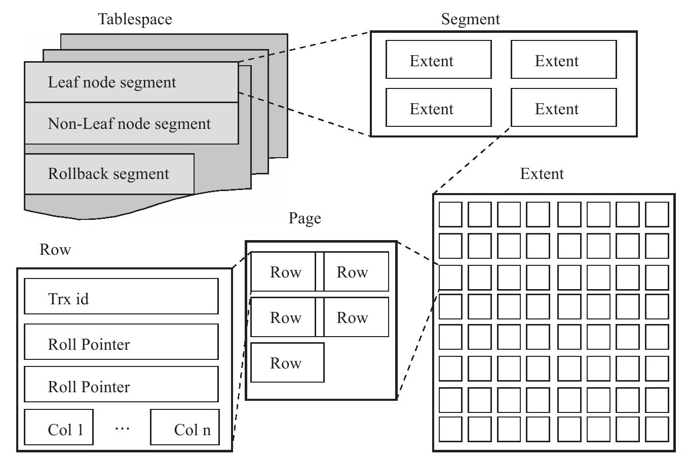

表
--

[TOC]

> 本章主要介绍innoDB存储引擎的存储方式和实现原理

### 索引组织表

表的创建需要有主键，如果没有指定主键，则首先判断表中**是否有非空的唯一索引（Unique NOT NULL）**，如果有，则该列即为主键。否则，InnoDB存储引擎自动创建一个6字节大小的指针。如果有多个唯一索引，则会从前往后依据**定义索引的顺序**来选择主键

### InnoDB逻辑存储结构

从InnoDB存储引擎的逻辑存储结构看，所有数据都被逻辑地存放在一个空间中，称之为**表空间（tablespace）**。表空间又由**段（segment）、区（extent）、页（page）**组成。页在一些文档中有时也称为块（block）



##### 表空间

表空间可以看做是InnoDB存储引擎逻辑结构的最高层，默认情况下InnoDB存储引擎有一个共享表空间ibdata1，即所有数据都存放在这个表空间内。

##### 段

表空间是由各个段组成的，常见的段有数据段、索引段、回滚段等，

**数据段即为B+树的叶子节点，索引段即为B+树的非索引节点，回滚段较为特殊**

##### 区

区是由连续页组成的空间，在任何情况下每个区的大小都为1MB。为了保证区中页的连续性，InnoDB存储引擎一次从磁盘申请4～5个区。在默认情况下，InnoDB存储引擎页的大小为16KB，即一**个区中一共有64个连续的页**。

InnoDB 1.0.x版本开始引入压缩页，即每个页的大小可以通过参数KEY_BLOCK_SIZE设置为2K、4K、8K，因此每个区对应页的数量就应该为512、256、128。

InnoDB 1.2.x版本新增了参数innodb_page_size，通过该参数可以将默认页的大小设置为4K、8K，但是页中的数据库不是压缩。这时区中页的数量同样也为256、128。总之，不论页的大小怎么变化，区的大小总是为1M

##### 页

InnoDB有页（Page）的概念（也可以称为块），页是InnoDB磁盘管理的最小单位，一般为16KB,就像上面所说的，可以压缩到4k，8k

在InnoDB存储引擎中，常见的页类型有：

❑数据页（B-tree Node）

❑undo页（undo Log Page）

❑系统页（System Page）

❑事务数据页（Transaction system Page）

❑插入缓冲位图页（Insert Buffer Bitmap）

❑插入缓冲空闲列表页（Insert Buffer Free List）

❑未压缩的二进制大对象页（Uncompressed BLOB Page）

❑压缩的二进制大对象页（compressed BLOB Page）

InnoDB存储引擎是面向列的（row-oriented），也就说数据是按行进行存放的。**每个页**存放的行记录也是有硬性定义的，最多允许存放16KB/2-200行的记录，即**7992行记录**

### InnoDB行记录格式

##### Compact行记录格式

通过`ROW_FORMAT=COMPACT`

通过分析ibd文件的二进制文件，其中的记录来了解其

##### Redundant行记录格式

Redundant是MySQL 5.0版本之前InnoDB的行记录存储方式，MySQL 5.0支持Redundant是为了兼容之前版本的页格式。


##### 行溢出数据

不懂

##### Compressed和Dynamic行记录格式

##### CHAR的行结构存储

### InnoDB数据页结构

InnoDB数据页由以下7个部分组成，如图4-6所示。

❑File Header（文件头）38字节：记录页的一些头信息

**❑Page Header（页头）**56字节：记录数据页的状态信息

**❑Infimun和Supremum Records：**

Infimum记录是比该页中任何主键值都要小的值，Supremum指比任何可能大的值还要大的值。这两个值在页创建时被建立，并且在任何情况下不会被删除。在Compact行格式和Redundant行格式下，两者占用的字节数各不相同

**❑User Records**（用户记录，即行记录）

User Record就是之前讨论过的部分，即实际存储行记录的内容。再次强调，InnoDB存储引擎表总是B+树索引组织的。

**❑Free Space**（空闲空间）

Free Space很明显指的就是空闲空间，同样也是个链表数据结构。在一条记录被删除后，该空间会被加入到空闲链表中。

**❑Page Directory**（页目录）


**❑File Trailer**（文件结尾信息）8字节

在默认配置下，InnoDB存储引擎每次从磁盘读取一个页就会检测该页的完整性，即页是否发生Corrupt，这就是通过File Trailer部分进行检测，File Trailer只有一个FIL_PAGE_END_LSN部分，占用8字节。前4字节代表该页的checksum值，最后4字节和File Header中的FIL_PAGE_LSN相同。将这两个值与File Header中的FIL_PAGE_SPACE_OR_CHKSUM和FIL_PAGE_LSN值进行比较，看是否一致（checksum的比较需要通过InnoDB的**checksum函数**来进行比较，不是简单的等值比较），以此来保证页的完整性（not corrupted）。

### Named File Formats机制

通过Named File Formats机制来解决不同版本下页结构兼容性的问题

### 约束

触发器和约束

外键约束

### 视图

### 分区表

> 本节介绍了**常见的分区方式**，以及**在什么情况下需要选择进行分区**

常见的存储引擎Innodb,MyISAM、NDB等都支持分区

当前MySQL数据库支持以下几种类型的分区。

❑RANGE分区：行数据基于属于一个给定连续区间的列值被放入分区。MySQL 5.5开始支持RANGE COLUMNS的分区。

❑LIST分区：和RANGE分区类型，只是LIST分区面向的是离散的值。MySQL 5.5开始支持LIST COLUMNS的分区。

❑HASH分区：根据用户自定义的表达式的返回值来进行分区，返回值不能为负数。

❑KEY分区：根据MySQL数据库提供的哈希函数来进行分区。

水平分区，指将同一表中不同行的记录分配到不同的物理文件中。

垂直分区，指将同一表中不同列的记录分配到不同的物理文件中。

##### RANGE分区

```mysql
CREATE TABLE t(
id INT
)ENGINE=INNDB
PARTITION BY RANGE(id)(
PARTITION p0 VALUES LESS THAN(10),
PARTITION p1 VALUES LESS THAN(20));
```


启用分区之后，表不再由一个ibd文件组成了，而是由建立分区时的各个分区ibd文件组成，如下面的t#P#p0.ibd，t#P#p1.ibd

##### LIST分区

LIST分区使用VALUES IN。因为每个分区的值是离散的，因此只能定义值

```mysql
mysql＞CREATE TABLE t(
-＞a INT,
-＞b INT)ENGINE=INNODB
-＞PARTITION BY LIST(b)(
-＞PARTITION p0 VALUES IN(1,3,5,7,9),
-＞PARTITION p1 VALUES IN(0,2,4,6,8)
-＞);
```

遇到分区未定义的值时，MyISAM和InnoDB存储引擎的处理完全不同。MyISAM引擎会将之前的行数据都插入，但之后的数据不会被插入。而InnoDB存储引擎将其视为一个事务，因此没有任何数据插入

##### HASH分区

HASH分区的目的是将数据均匀地分布到预先定义的各个分区中，保证各分区的数据数量大致都是一样的

##### KEY分区

KEY分区和HASH分区相似，不同之处在于HASH分区使用用户定义的函数进行分区，KEY分区使用MySQL数据库提供的函数进行分区

##### COLUMNS分区

COLUMNS分区可以直接使用非整型的数据进行分区，分区根据类型直接比较而得，不需要转化为整型

COLUMNS分区支持以下的数据类型：

❑所有的整型类型，如INT、SMALLINT、TINYINT、BIGINT。FLOAT和DECIMAL则不予支持。

❑日期类型，如DATE和DATETIME。其余的日期类型不予支持。

❑字符串类型，如CHAR、VARCHAR、BINARY和VARBINARY。BLOB和TEXT类型不予支持。

##### 分区中的NULL值

对于RANGE分区，如果向分区列插入了NULL值，则MySQL数据库会将该值放入最左边的分区。

在LIST分区下要使用NULL值，则必须显式地指出哪个分区中放入NULL值，否则会报错

HASH和KEY分区对于NULL的处理方式和RANGE分区、LIST分区不一样。任何分区函数都会将含有NULL值的记录返回为0。如：

##### 分区和性能

数据库的应用分为两类：一类是**OLTP（在线事务处理）**，如Blog、电子商务、网络游戏等；另一类是**OLAP（在线分析处理）**，如数据仓库、数据集市。在一个实际的应用环境中，可能既有OLTP的应用，也有OLAP的应用。如网络游戏中，玩家操作的游戏数据库应用就是OLTP的，但是游戏厂商可能需要对游戏产生的日志进行分析，通过分析得到的结果来更好地服务于游戏，预测玩家的行为等，而这却是OLAP的应用。

**对于OLAP的应用，分区的确是可以很好地提高查询的性能**，因为OLAP应用大多数查询需要频繁地扫描一张很大的表。假设有一张1亿行的表，其中有一个时间戳属性列。用户的查询需要从这张表中获取一年的数据。如果按时间戳进行分区，则只需要扫描相应的分区即可。这就是前面介绍的Partition Pruning技术。

然而对于OLTP的应用，分区应该非常小心。在这种应用下，**通常不可能会获取一张大表中10%的数据，大部分都是通过索引返回几条记录即可**。而根据B+树索引的原理可知，对于一张大表，一般的B+树需要2～3次的磁盘IO。因此B+树可以很好地完成操作，不需要分区的帮助，并且设计不好的分区会带来严重的性能问题。

##### 在表和分区间交换数据

ALTER TABLE…EXCHANGE PARTITION可以进行分区之间的数据交换，

但要使用ALTER TABLE…EXCHANGE PARTITION语句，必须满足下面的条件：

❑要交换的表需和分区表有着相同的表结构，但是表不能含有分区

❑在非分区表中的数据必须在交换的分区定义内

❑被交换的表中不能含有外键，或者其他的表含有对该表的外键引用

❑用户除了需要ALTER、INSERT和CREATE权限外，还需要DROP的权限

