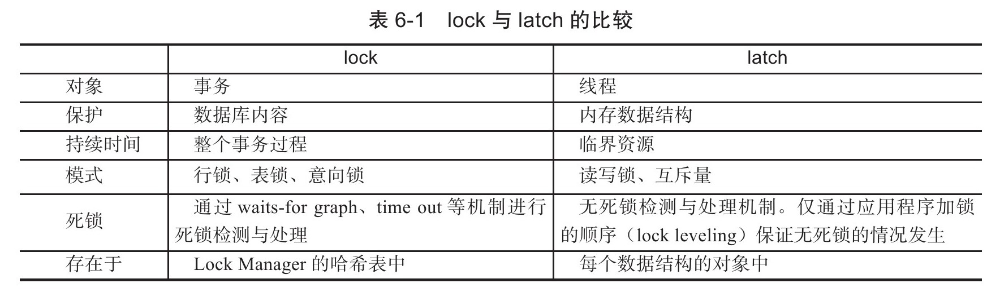

第6章　锁
---------

[TOC]

### lock与latch

latch一般称为闩锁（轻量级的锁），因为其要求锁定的时间必须非常短。若持续的时间长，则应用的性能会非常差。在InnoDB存储引擎中，latch又可以分为mutex（互斥量）和rwlock（读写锁）。其目的是用来保证并发线程操作临界资源的正确性，并且通常没有死锁检测的机制。

lock的对象是事务，用来锁定的是数据库中的对象，如表、页、行。并且一般lock的对象仅在事务commit或rollback后进行释放（不同事务隔离级别释放的时间可能不同)。此外，lock，正如在大多数数据库中一样，是有死锁机制的。

### InnoDB存储引擎中的锁

InnoDB存储引擎实现了如下两种标准的行级锁：

❑共享锁（S Lock）读锁，允许事务读一行数据。

❑排他锁（X Lock）写锁，允许事务删除或更新一行数据。

##### 一致性非锁定读

一致性的非锁定读（consistent nonlocking read）是指InnoDB存储引擎通过行多版本控制（multi versioning）的方式来读取当前执行时间数据库中行的数据。如果读取的行正在执行DELETE或UPDATE操作，这时读取操作不会因此去等待行上锁的释放。相反地，InnoDB存储引擎会去读取行的一个快照数据

（也就是在事务删除和更新事务没有提交之前去读取数据，会读到一个快照数据，也就是旧的数据）

##### 一致性锁定读

在某些情况下，用户需要显式地对数据库读取操作进行加锁以保证数据逻辑的一致性。而这要求数据库支持加锁语句，即使是SELECT的只读操作也有可能需要加上锁

SELECT…FOR UPDATE对读取的行记录加一个X锁，其他事务不能对已锁定的行加上任何锁。SELECT…LOCK IN SHARE MODE对读取的行记录加一个**S锁**，其他事务可以向被锁定的行加S锁，但是如果加X锁，则会被阻塞。

##### 自增长与锁

AUTO-INC Locking可以来控制自增id增长，但是性能会存在问题：1. 对于有自增长值的列的并发插入性能较差，事务必须等待前一个插入的完成（虽然不用等待事务的完成）。2. 对于INSERT…SELECT的大数据量的插入会影响插入的性能，因为另一个事务中的插入会被阻塞

从MySQL 5.1.22版本开始，InnoDB存储引擎中提供了一种**轻量级互斥量的自增长实现机制**，这种机制大大提高了自增长值插入的性能。并且从该版本开始，InnoDB存储引擎提供了一个参数innodb_autoinc_lock_mode来控制自增长的模式

##### 外键和锁

对于外键值的插入或更新，首先需要查询父表中的记录，即SELECT父表。但是对于父表的SELECT操作，不是使用一致性非锁定读的方式，因为这样会发生数据不一致的问题（上一个事务执行的删除操作，如果去读快照，可能上一个事务提交后就找不到对应的那行数据），因此这时使用的是SELECT…LOCK IN SHARE MODE方式，即主动对父表加一个S锁。如果这时父表上已经这样加X锁，子表上的操作会被阻塞，

### 锁的算法

##### 行锁的3种算法

InnoDB存储引擎有3种行锁的算法，其分别是：

❑Record Lock：单个行记录上的锁

❑Gap Lock：间隙锁，锁定一个范围，但不包含记录本身

❑Next-Key Lock∶Gap Lock+Record Lock，锁定一个范围，并且锁定记录本身

锁算法会从Next-Key Lock到Record Lock。

##### 解决Phantom Problem

Phantom Problem是指在同一事务下，连续执行两次同样的SQL语句可能导致不同的结果，第二次的SQL语句可能会返回之前不存在的行。

InnoDB存储引擎采用Next-Key Locking的算法避免Phantom Problem。对于上述的SQL语句SELECT*FROM t WHERE a＞2 FOR UPDATE，其锁住的不是5这单个值，而是对（2，+∞）这个范围加了X锁。因此任何对于这个范围的插入都是不被允许的，从而避免Phantom Problem。

InnoDB存储引擎默认的事务隔离级别是REPEATABLE READ，在该隔离级别下，其采用Next-Key Locking的方式来加锁。而在事务隔离级别READ COMMITTED下，其仅采用Record Lock，因此在上述的示例中，会话A需要将事务的隔离级别设置为READ COMMITTED。

### 锁问题

##### 脏读

##### 不可重复读

##### 丢失更新

### 阻塞

### 死锁

死锁是指两个或两个以上的事务在执行过程中，因争夺锁资源而造成的一种互相等待的现象。若无外力作用，事务都将无法推进下去。解决死锁问题最简单的方式是不要有等待，将任何的等待都转化为回滚，并且事务重新开始。毫无疑问，这的确可以避免死锁问题的产生。然而在线上环境中，这可能导致并发性能的下降，甚至任何一个事务都不能进行。

* 解决死锁问题最简单的一种方法是超时，即当两个事务互相等待时，当一个等待时间超过设置的某一阈值时，其中一个事务进行回滚，另一个等待的事务就能继续进行
* 除了超时机制，当前数据库还都普遍采用wait-for graph（等待图）并采用深度优先的算法来进行**死锁检测**，

##### 死锁概率

### 锁升级

锁升级（Lock Escalation）是指将当前锁的粒度降低。举例来说，数据库可以把一个表的1000个行锁升级为一个页锁，或者将页锁升级为表锁

#### 本章问题

##### mysql的锁

<u>参考mysql45讲第六章*全局锁和表锁 ：给表加个字段怎么有这么多阻碍？*</u>

###### 全局锁：

锁整个数据库实例

###### 表级锁：

分为表锁和元数据锁

元数据锁：

在MySQL 5.5版本中引入了MDL，当对一个表做增删改查操作的时候，加MDL读锁；当 要对表做结构变更操作的时候，加MDL写锁。

###### 行锁：

MySQL的行锁是在引擎层由各个引擎自己实现的。但并不是所有的引擎都支持行锁，比如 MyISAM引擎就不支持行锁。不支持行锁意味着并发控制只能使用表锁

**<u>两阶段锁协议：</u>**

**<u>死锁和死锁检测：</u>**

如果你的事务中需要锁多个行，要把最可能造成锁冲突、最可能影响并 发度的锁的申请时机尽量往后放。

