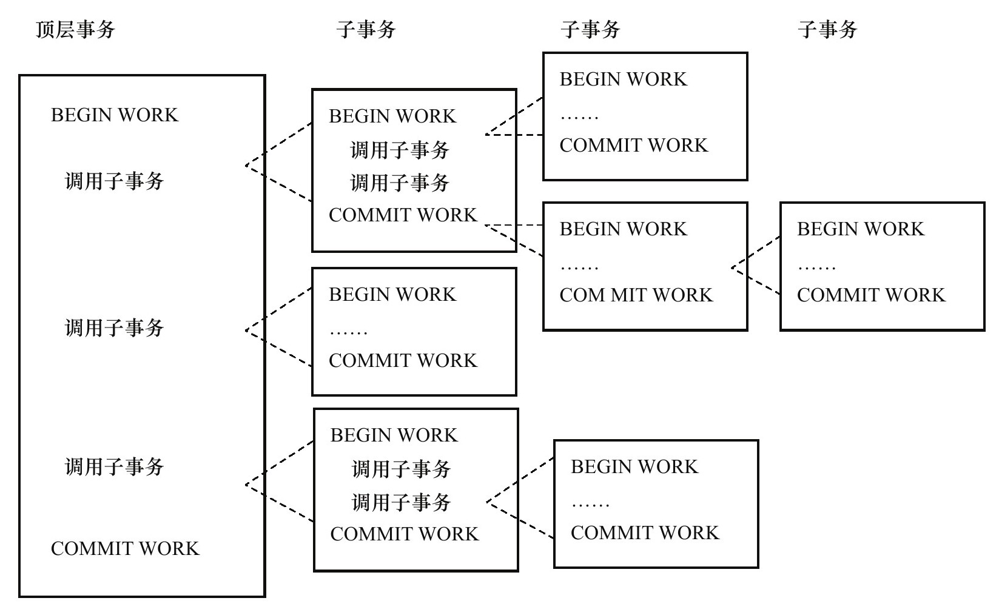
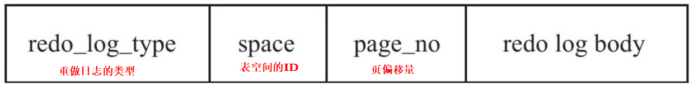

第7章　事务
-----------

[TOC]

在数据库提交工作时，事务可以确保要么所有修改都已经保存了，要么所有修改都不保存。

InnoDB存储引擎中的事务完全符合ACID的特性。ACID是以下4个词的缩写：

❑原子性（atomicity）

❑一致性（consistency）

❑隔离性（isolation）

❑持久性（durability）

在第六章锁中，讨论InnoDB是如何实现事务的**隔离性**的，本章主要关注事务的原子性这一概念，并说明怎样正确使用事务及编写正确的事务应用程序，避免在事务方面养成一些不好的习惯。

### 认识事务

A（Atomicity），原子性。在计算机系统中，每个人都将原子性视为理所当然。例如在C语言中调用SQRT函数，其要么返回正确的平方根值，要么返回错误的代码，而不会在不可预知的情况下改变任何的数据结构和参数。如果SQRT函数被许多个程序调用，一个程序的返回值也不会是其他程序要计算的平方根。

C（consistency），一致性。一致性指**事务将数据库从一种状态转变为下一种一致的状态**。在事务开始之前和事务结束以后，数据库的**完整性约束没有被破坏**。例如，在表中有一个字段为姓名，为唯一约束，即在表中姓名不能重复。如果一个事务对姓名字段进行了修改，但是在事务提交或事务操作发生回滚后，表中的姓名变得非唯一了，这就破坏了事务的一致性要求，即事务将数据库从一种状态变为了一种不一致的状态。因此，事务是一致性的单位，如果事务中某个动作失败了，系统可以自动撤销事务——返回初始化的状态。

I（isolation），隔离性。隔离性还有其他的称呼，如并发控制（concurrency control）、可串行化（serializability）、锁（locking）等。事务的隔离性要求每个读写事务的对象对其他事务的操作对象能相互分离，即**该事务提交前对其他事务都不可见**，通常这使用锁来实现。当前数据库系统中都提供了一种粒度锁（granular lock）的策略，**允许事务仅锁住一个实体对象的子集，以此来提高事务之间的并发度**。

D（durability），持久性。事务一旦提交，其结果就是永久性的。即使发生宕机等故障，数据库也能将数据恢复。需要注意的是，只能从事务本身的角度来保证结果的永久性。例如，在事务提交后，所有的变化都是永久的。即使当数据库因为崩溃而需要恢复时，也能保证恢复后提交的数据都不会丢失。但若不是数据库本身发生故障，而是一些外部的原因，如RAID卡损坏、自然灾害等原因导致数据库发生问题，那么所有提交的数据可能都会丢失。因此**持久性保证事务系统的高可靠性**（High Reliability），而不是高可用性（High Availability）。

### 分类

从事务理论的角度来说，可以把事务分为以下几种类型：

❑扁平事务（Flat Transactions）

❑带有保存点的扁平事务（Flat Transactions with Savepoints）

❑链事务（Chained Transactions）

❑嵌套事务（Nested Transactions）

❑分布式事务（Distributed Transactions）

***扁平事务（Flat Transaction）：***

在扁平事务中，所有操作都处于同一层次，其由BEGIN WORK开始，由COMMIT WORK或ROLLBACK WORK结束，其间的操作是原子的，要么都执行，要么都回滚。因此扁平事务是应用程序成为原子操作的基本组成模块

扁平事务的主要限制是不能提交或者回滚事务的某一部分，或分几个步骤提交，比如，一个扁平事务分为了几个部分，当进行了几个部分后，发生故障，这样对于扁平事务，就需要回滚前面已经进行的步骤，由于这个问题，就出现了***带有保存点的扁平事务***，

***链事务：***在提交一个事务时，释放不需要的数据对象，将必要的处理上下文隐式地传给下一个要开始的事务。注意，提交事务操作和开始下一个事务操作将合并为一个原子操作。这意味着下一个事务将看到上一个事务的结果，就好像在一个事务中进行的一样。

***嵌套事务***（Nested Transaction）是一个层次结构框架。由一个顶层事务（top-level transaction）控制着各个层次的事务。顶层事务之下嵌套的事务被称为子事务（subtransaction），其控制每一个局部的变换

***分布式事务***（Distributed Transactions）通常是一个在分布式环境下运行的扁平事务，因此需要根据数据所在位置访问网络中的不同节点。

### 事务的实现

事务隔离性由第6章讲述的锁来实现。原子性、一致性、持久性通过数据库的redo log和undo log来完成。redo log称为重做日志，用来保证事务的原子性和持久性。undo log用来保证事务的一致性。

##### redo

**重做日志redo用来实现事务的持久性**，即事务ACID中的D。其由两部分组成：一是内存中的重做日志缓冲（redo log buffer），其是易失的；二是重做日志文件（redo log file），其是持久的。

当事务提交（COMMIT）时，必须先将该事务的所有日志写入到重做日志文件进行持久化，待事务的COMMIT操作完成才算完成。这里的日志是指重做日志，在InnoDB存储引擎中，由两部分组成，即redo log和undo log。redo log用来保证事务的持久性，undo log用来帮助事务回滚及MVCC的功能。

为了确保每次日志都写入重做日志文件，在每次将重做日志缓冲写入重做日志文件后，InnoDB存储引擎都需要调用一次fsync操作

***log block***

在InnoDB存储引擎中，重做日志都是以512字节进行存储的。这意味着重做日志缓存、重做日志文件都是以块（block）的方式进行保存的，称之为重做日志块（redo log block），每块的大小为512字节。

重做日志块除了日志本身之外，还由日志块头（log block header）及日志块尾（log block tailer）两部分组成。重做日志头一共占用12字节，重做日志尾占用8字节。故每个重做日志块实际可以存储的大小为492字节（512-12-8）

***log group***

重做日志文件中存储的就是之前在log buffer中保存的log block，因此其也是根据块的方式进行物理存储的管理，每个块的大小与log block一样，同样为512字节。在InnoDB存储引擎运行过程中，log buffer根据一定的规则将内存中的log block刷新到磁盘

***重做日志格式***

InnoDB存储引擎的存储管理是基于页的，故其重做日志格式也是基于页的。虽然有着不同的重做日志格式，但是它们有着通用的头部格式

***LSN***

LSN表示事务写入重做日志的字节的总量。例如当前重做日志的LSN为1 000，有一个事务T1写入了100字节的重做日志，那么LSN就变为了1100，若又有事务T2写入了200字节的重做日志，那么LSN就变为了1 300。可见LSN记录的是重做日志的总量，其单位为字节，LSN不仅记录在重做日志中，还存在于每个页中。在每个页的头部，有一个值FIL_PAGE_LSN，记录了该页的LSN。在页中，LSN表示该页最后刷新时LSN的大小

##### undo

##### purge

##### group commit

#### 本章面试题

###### 事务的隔离级别

SQL标准的事务隔离级别包括：**读未提交**（read uncommitted）、 **读提交**（read committed）、**可重复读**（repeatable read）和**串行化**（serializable ）

**读未提交**是指，一个事务还没提交时，它做的变更就能被别的事务看到。

 **读提交**是指，一个事务提交之后，它做的变更才会被其他事务看到。 

**可重复读**是指，一个事务执行过程中看到的数据，总是跟这个事务在启动时看到的数据是一 致的。当然在可重复读隔离级别下，未提交变更对其他事务也是不可见的。

 **串行化**，顾名思义是对于同一行记录，“写”会加“写锁”，“读”会加“读锁”。当出现读写锁冲突 的时候，后访问的事务必须等前一个事务执行完成，才能继续执行。

