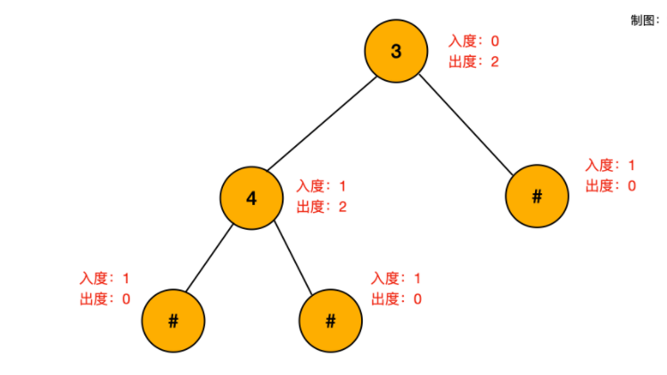

### [面试题 05.03. 翻转数位](https://leetcode-cn.com/problems/reverse-bits-lcci/)

此解答负数的情况没有过，留着以后去做

```java
class Solution {
    public int reverseBits(int num) {
        if(num<0)return 32;//在计算机中,负数采用补码的形式储存
       int[] res = new int[32];
       int index = 0;
       int max = 0;
       while(num>0){
           if((num&1)==1){
               res[index]++;
           }else{
               index++;
           }
           num/=2;
       }
       for(int i = 0;i<index+1;i++){
           max = Math.max(max,res[i]+res[i+1]+1);
       }
       return max;
    }
}
```

### [331. 验证二叉树的前序序列化](https://leetcode-cn.com/problems/verify-preorder-serialization-of-a-binary-tree/)

题解：https://leetcode-cn.com/problems/verify-preorder-serialization-of-a-binary-tree/solution/pai-an-jiao-jue-de-liang-chong-jie-fa-zh-66nt/

stack构建的几种形式

1.  LinkedList<String> stack = new LinkedList<>();
2.  Stack<String> stack = new Stack<>();

```java
class Solution {
    public boolean isValidSerialization(String preorder) {
        LinkedList<String> stack = new LinkedList<>();//
        for(String c:preorder.split(",")){
            stack.push(c);
            while(stack.size()>=3&&stack.get(0).equals("#")
            &&stack.get(1).equals("#")&&!stack.get(2).equals("#")){//get方法的作用。get应该是获取栈顶的第0个，第1个和第2个
                    stack.pop();
                    stack.pop();
                    stack.pop();
                    stack.push("#");
        }
        }
        return stack.size()==1&&stack.pop().equals("#");
    }
}
```

计算入度出度,每个二叉树，入度=出度，所以我们通过计算节点的入度出度，每个非空节点（除了根节点）入度为1，出度为2，所以入度-1，出度+2，最后比较diff是否为0



```java
class Solution {
    public boolean isValidSerialization(String preorder) {
        int diff = 1;
        for(String s:preorder.split(",")){
            diff-=1;
            if(diff<0){return false;}
            if(!s.equals("#")){
                diff+=2;
            }
        }
        return diff==0;
    }
}
```

