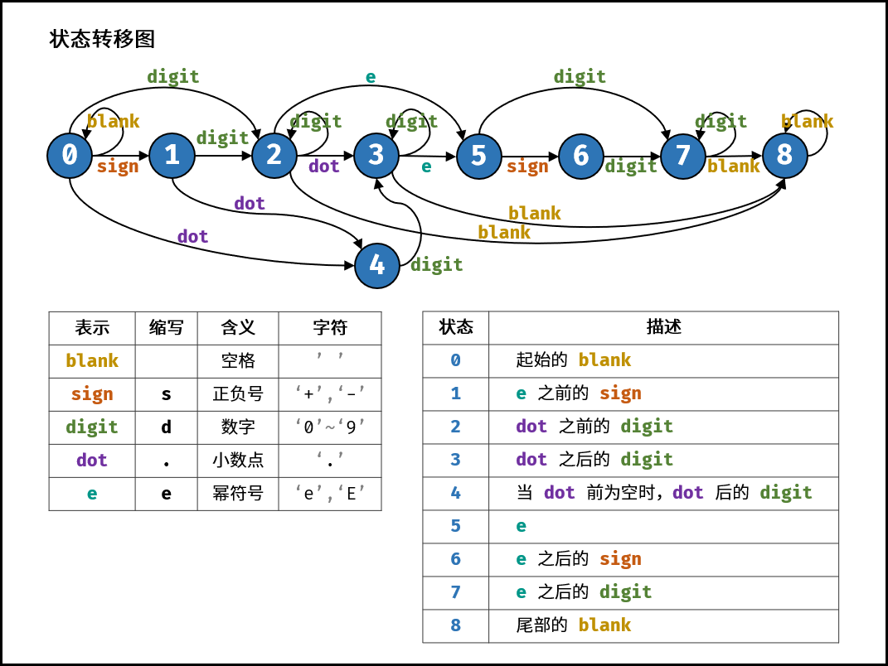

### [剑指 Offer 47. 礼物的最大价值](https://leetcode-cn.com/problems/li-wu-de-zui-da-jie-zhi-lcof/)

动态规划，每次取左边和上边最大值保存下来就可以

```java
class Solution {
    public int maxValue(int[][] grid) {
        if(grid.length==0||grid[0].length==0)return 0;
        int a = grid.length;
        int b = grid[0].length;
        
        int[][] dp = new int[a][b];
        dp[0][0] = grid[0][0];
        for(int i =1;i<b;i++){
            dp[0][i]=dp[0][i-1]+grid[0][i];
        }
        for(int i =1;i<a;i++){
            dp[i][0]=dp[i-1][0]+grid[i][0];
        }
        for(int i = 1;i<a;i++){
            for(int j = 1;j<b;j++){
                dp[i][j] = Math.max(dp[i-1][j],dp[i][j-1])+grid[i][j];
            }
        }
        return dp[a-1][b-1];
    }
}
```

### [剑指 Offer 20. 表示数值的字符串](https://leetcode-cn.com/problems/biao-shi-shu-zhi-de-zi-fu-chuan-lcof/)


按照字符串从左到右的顺序，定义以下 9 种状态。

1. 开始的空格
2. 幂符号前的正负号
3. 小数点前的数字
4. 小数点、小数点后的数字
5. 当小数点前为空格时，小数点、小数点后的数字
6. 幂符号
7. 幂符号后的正负号
8. 幂符号后的数字
9. 结尾的空格



最重要就是画出状态图，每个状态转移到下一个状态的情况，然后更新状态

```java
class Solution {
    public boolean isNumber(String s) {
       Map[] states = {
            new HashMap<>() {{ put(' ', 0); put('s', 1); put('d', 2); put('.', 4); }}, // 0.
            new HashMap<>() {{ put('d', 2); put('.', 4); }},                           // 1.
            new HashMap<>() {{ put('d', 2); put('.', 3); put('e', 5); put(' ', 8); }}, // 2.
            new HashMap<>() {{ put('d', 3); put('e', 5); put(' ', 8); }},              // 3.
            new HashMap<>() {{ put('d', 3); }},                                        // 4.
            new HashMap<>() {{ put('s', 6); put('d', 7); }},                           // 5.
            new HashMap<>() {{ put('d', 7); }},                                        // 6.
            new HashMap<>() {{ put('d', 7); put(' ', 8); }},                           // 7.
            new HashMap<>() {{ put(' ', 8); }}                                         // 8.
        };
        int p = 0;
        char t ;
        for(char c:s.toCharArray()){//对应每一种情况，
            if(c>='0'&&c<='9'){
                t = 'd';
            }else if(c=='+'||c=='-'){
                t = 's';
            }else if(c=='.'||c==' '){
                t = c;
            }else if(c=='e'||c=='E'){
                t = 'e';
            }else{
                t='?';
            }
        if(!states[p].containsKey(t)){return false;}//查看情况是否存在
        p = (int)states[p].get(t);//更新状态到下一次
        }
        return p==2||p==3||p==7||p==8；判断最终状态，合法，则代表为数值
    }
}
```

