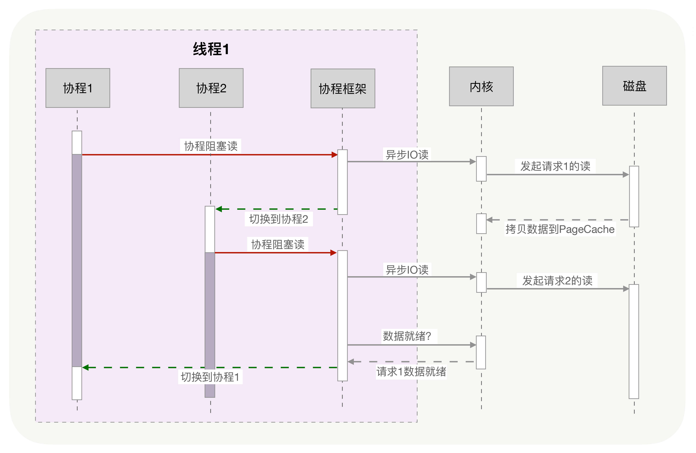
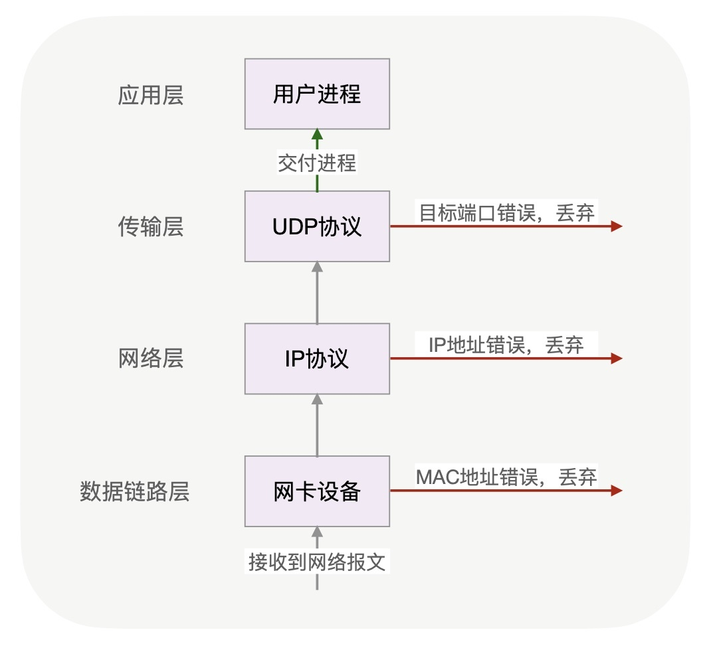
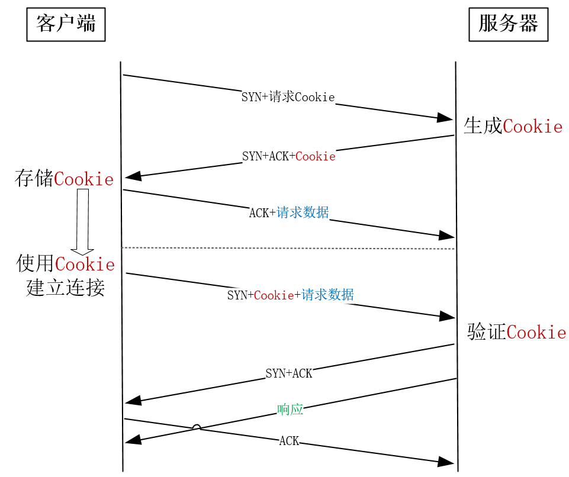
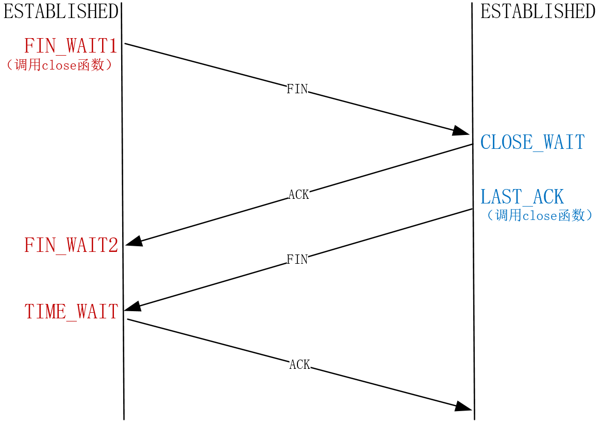
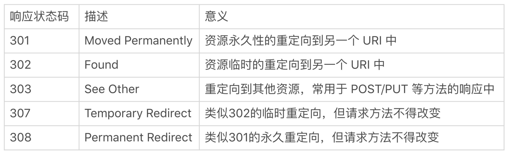

分为Linux硬件系统调优，网络调优，

> ### 硬件
>
> CPU优化：CPU缓存
>
> 内存优化：内存池
>
> 磁盘优化：索引(查找)，零拷贝（传输）
>
> ### 网络
>
> 一对多通讯，
>
> TCP协议：9，10，11，12
>
> HTTP/HTTPS:14,15,16,17
>

### **第一讲：CPU缓存**

CPU缓存由更快的SRAM构成（内存是由DRAM构成的），并且离CPU核心近。

分为三级缓存：L1,L2, L3; L1,L2时每个核心都独有的，三级缓存是CPU上所有核心<u>共享</u>的，程序执行时，**<u>会先将内存中的数据载入到共享的三级缓存</u>**中，再进入每颗核心独有的二级缓存，最后进入最快的一级缓存，之后才会被CPU使用


缓存要比内存快很多。CPU访问一次内存通常需要100个时钟周期以上，而访问一级缓存只需要4~5个时钟周期，二级缓存大约12个时钟周期，三级缓存大约30个时钟周期（对于2GHZ主频的CPU来说，一个**时钟周期**是0.5纳秒 也就是1/2G)

因此如果CPU所要操作的数据在缓存中，则直接读取，这称为**缓存命中**。命中缓存会带来很大的性能提升，**因此，我们的代码优化目标是提升CPU缓存的命中率。**

##### 1.提升数据缓存的命中率

`CPU Cache Line`定义了缓存一次载入数据的大小，Linux上你可以通过coherency_line_size配置查看它，通常是64字节,如果我们取得数据不足64B,则会顺序地补足后续元素。当元素类型是4个字节的整数时，性能就会比8个字节的高精度浮点数时速度更快，因为<u>缓存一次载入的元素会更多</u>

对于二维数组的遍历：array[j] [i]执行的时间是后者array[i] [j]的8倍之多,当访问array[0] [0]时，若它们占用的内存不足64字节，CPU就会顺序地补足后续元素，读够64字节，所以按**内存布局去访问元素**，就会带来性能提升。

```C++
 for(i = 0; i < N; i+=1) {
     for(j = 0; j < N; j+=1) {
        array[i][j] = 0;
  }
```

对于Nginx，它是用哈希表来存放域名、HTTP头部等数据的，这样访问速度非常快，而哈希表里桶的大小如server_names_hash_bucket_size，它默认就等于CPU Cache Line的值。由于所存放的字符串长度不能大于桶的大小，所以当需要存放更长的字符串时，就需要修改桶大小，但Nginx官网上明确建议它应该是CPU Cache Line的整数倍。因为对于桶==缓存行大小的，**不会存在伪共享问题。**

**linux有perf工具**可以直观的验证缓存命中的情况,直接查看<u>第十九讲，监控系统性能</u>


##### 2.提升指令缓存的命中率

对于有一个元素为0到255之间随机数字组成的数组，要对他做两个操作：一是**循环遍历数组**，判断每个数字是否小于128，如果小于则把元素的值置为0；二是将数组排序。

```c
for(i = 0; i < N; i++) {
   if (array [i] < 128) array[i] = 0;
}
sort(array, array +N);
```

对于上面的场景：先排序的遍历时间只有后排序的三分之一，为什么？CPU**含有分支预测器**

当代码中出现if、switch等语句时，意味着此时至少可以选择跳转到两段不同的指令去执行。如果分支预测器可以预测接下来要在哪段代码执行（比如if还是else中的指令），就可以提前把这些指令放在缓存中，CPU执行时就会很快。当数组中的元素完全随机时，分支预测器无法有效工作，而当array数组有序时，**分支预测器会动态地根据历史命中数据对未来进行预测，命中率就会非常高。**

##### 3.提升多核CPU下的缓存命中率

对于多CPU下的缓存，若进程A在时间片1里使用CPU核心1，自然也填满了核心1的一、二级缓存，当时间片1结束后，操作系统会让进程A让出CPU，基于效率并兼顾公平的策略重新调度CPU核心1，以防止某些进程饿死。如果此时CPU核心1繁忙，而CPU核心2空闲，则进程A很可能会被调度到CPU核心2上运行，这样，即使我们对代码优化得再好，也只能在一个时间片内高效地使用CPU一、二级缓存了，下一个时间片便面临着缓存效率的问题。

操作系统提供了将进程或者线程绑定到某一颗CPU上运行的能力。如Linux上提供了`sched_setaffinity`方法实现这一功能，其他操作系统也有类似功能的API可用，当多线程同时执行密集计算，且CPU缓存命中率很高时，如果将每个线程分别绑定在不同的CPU核心上，性能便会获得非常可观的提升.

**Perf工具也提供了cpu-migrations事件**，它可以显示进程从不同的CPU核心上迁移的次数。

##### 总结

> CPU缓存分为数据缓存与指令缓存:
>
> 1. 对于**数据缓存**，我们应在循环体中尽量操作同一块内存上的数据，由于缓存是根据CPU Cache Line批量操作数据的，所以顺序地操作连续内存数据时也有性能提升。
>
> 2. 对于**指令缓存**，有规律的条件分支能够让CPU的分支预测发挥作用，进一步提升执行效率。
> 3. 对于多核系统，如果**进程的缓存命中率非常高，则可以考虑绑定CPU来提升缓存命中率。**

### **第二讲：内存池**

有一个问题：在Linux系统中，用Xmx设置JVM的最大堆内存为8GB，但在近百个并发线程下，观察到Java进程占用了14GB的内存。为什么会这样呢？

就要说到**高级语言内存申请机制**，对于高级语言，申请内存必须经过**C库**，而C库通过**预分配更大的空间作为内存池**，来加快后续申请内存的速度。这样预分配的6GB的C库内存池就与JVM中预分配的8G内存池叠加在一起，造成了Java进程的内存占用超出了预期。

对于内存池，有应用层内存池（高级语言申请，JVM）, C库内存池(java也会使用堆外内存) 两层。C库内存池有Ptmalloc2（linux默认）和TCMalloc

##### Ptmalloc2

当主进程下申请1字节的内存时，Ptmalloc2会预分配132K字节的内存（Ptmalloc2中叫Main Arena），应用代码再申请内存时，会从这已经申请到的132KB中继续分配；当我们释放这1字节时，Ptmalloc2也不会把内存归还给操作系统。Ptmalloc2认为，与其把这1字节释放给操作系统，不如先缓存着放进内存池里，仍然当作用户态内存留下来，进程再次申请1字节的内存时就可以直接复用，这样速度快了很多。


对于内存预分配的问题，我们首先可以考虑**通过设置MALLOC_ARENA_MAX环境变量，可以限制线程内存池的最大数量**，或者选择一个预分配内存更少的内存池：Google的TCMalloc的内存池

##### 选择Ptmalloc2还是TCMalloc

<u>TCMalloc适用的场景：</u>**它对多线程下小内存的分配特别友好。**Ptmalloc2每次分配内存一定要加锁，才能解决共享资源的互斥问题。然而，加锁的消耗并不小。TCMalloc只是从10纳秒上升到25纳秒，只增长了1.5倍，而Ptmalloc2则从32纳秒上升到137纳秒，增长了3倍以上。TCMalloc针对小内存做了很多优化，每个线程独立分配内存，无须加锁，所以速度更快！而且，**线程数越多，Ptmalloc2出现锁竞争的概率就越高**

**Ptmalloc2**：而对于**Ptmalloc2**，**更擅长大内存的分配**，单线程下分配257K字节的内存，Ptmalloc2的耗时不变仍然是32纳秒，但TCMalloc就由10纳秒上升到64纳秒，增长了5倍以上！**现在TCMalloc反过来比Ptmalloc2慢了1倍！**这是因为TCMalloc特意针对小内存做了优化。其为<u>子线程预分配了64MB内存池</u>，虽然增大了内存消耗，但却加快了分配速度，这就是**以空间换时间**的思想

>  如果主要**分配256KB以下的内存**，特别是**多线程环境下**，应当选择TCMalloc；否则应使用Ptmalloc2，它的通用性更好。

##### 从堆还是栈上分配内存？

对于<u>静态类型</u>语言，不使用new关键字分配的对象大都是在栈中的，使用new关键字分配的内存都是在堆上分配的。

对于<u>动态类型</u>语言，无论是否使用new关键字，内存都是从堆中分配的。这也是动态语言比静态语言慢的一个原因。

**从栈中分配内存会更快**，因为每个线程都有独立的栈，所以分配内存时不需要加锁保护，而且栈上对象的尺寸在编译阶段就已经写入可执行文件了，执行效率更高！性能至上的**Golang语言就是按照这个逻辑设计的**，即使你用new关键字分配了堆内存，但编译器如果认为在栈中分配不影响功能语义时，会自动改为在栈中分配。

在栈中分配内存也有<u>缺点</u>，一是， 栈内存生命周期有限，它会随着函数调用结束后自动释放，在堆中分配的内存，并不会。二是，栈的容量有限，如CentOS 7中是8MB字节，如果你申请的内存超过限制会造成栈溢出错误（比如，递归函数调用很容易造成这种问题），而堆则没有容量限制。

> **所以，当我们分配内存时，如果在满足功能的情况下，可以在栈中分配的话，就选择栈。**

##### 总结

> 1. 隐藏着的C库内存池，对进程的内存开销有很大的影响。当进程的占用空间超出预期时，你需要清楚你正在使用的是什么内存池，它对每个线程预分配了多大的空间。
>
> 2. 不同的C库内存池，都有它们最适合的应用场景，例如TCMalloc对多线程下的小内存分配特别友好，而Ptmalloc2则对各类尺寸的内存申请都有稳定的表现，更加通用。
>
> 3. 内存池管理着堆内存，它的分配速度比不上在栈中分配内存。只是栈中分配的内存受到生命周期和容量大小的限制，应用场景更为有限。然而，如果有可能的话，尽量在栈中分配内存，它比内存池中的堆内存分配速度快很多！

### **第三讲：索引**

在磁盘中访问文件，其速度是很慢的，所以基于查询的优化技术，索引是非常有效的

索引种类有很多，哈希表、红黑树、B树都可以在内存中使用，如果我们需要数据规模上亿后还能提供微秒级的访问速度，**那么作为最快的索引，哈希表是第一选择。**

使用哈希表就需要根据内存大小**考虑开辟多大数组，处理哈希冲突的方法，哈希函数的好坏**，

另外如果需要范围查询：优先考虑B树，红黑树。

### **第四讲：零拷贝**

[零拷贝技术总结](../中间件\Netty\Netty零拷贝.md)

原来的文件传输，将一个文件分为多个小分，每次**经历了用户态与内核态的上下文切换**，将文件发送出去，性能不太好。

所以要想提升传输文件的性能，需要从**降低上下文切换的频率和内存拷贝次数**两个方向入手

1. mmap+wirte的方式（减少一次数据拷贝过程，但系统调用还需要两次，4次上下文切换）
2. sendfile（减少了两次上下文切换）
3. SG-DMA（两次上下文切换，两次数据拷贝）

##### PageCache，磁盘高速缓存（小文件适用）

大文件不应使用PageCache，也不应使用零拷贝技术处理

##### 异步IO + 直接IO（大文件适用）


### **第五讲：协程**

进程->线程->协程

对于线程，每个线程会被分配一定的时间片，时间片到了就会切换到其他的线程去执行，这其中切换就涉及到用户态和内核态的切换，系统保存线程上下文，当线程繁忙且数量众多时，这些切换会消耗绝大部分的CPU运算能力。

所以就有了协程，协程是在线程阻塞期间，并不通过CPU去切换线程，保存上下文，而是通过协程框架，将当前协程进行切换，等到结果返回后，在通过协程框架切换回来，这种切换由于不经过内核，所以耗时比较短



创建协程时，会从进程的堆中，分配一段内存作为协程的栈。线程的栈有8MB，而协程栈的大小通常只有几十KB。而且，C库内存池也不会为协程预分配内存，它感知不到协程的存在。这样，更低的内存占用空间为高并发提供了保证，毕竟十万并发请求，就意味着10万个协程。当然，栈缩小后，就尽量不要使用递归函数，也不能在栈中申请过多的内存，这是实现高并发必须付出的代价。

但是协程框架设计复杂，需要考虑很多问题，对于那些无法协程化、会导致内核切换的阻塞函数，或者计算太密集从而长时间占用CPU的任务，协程可能就无法发挥他自己的作用，这个时候使用线程会更好。无法协程化、会导致内核切换的阻塞函数，或者计算太密集从而长时间占用CPU的任务

### **第六讲：锁**

互斥锁与自旋锁，合理使用读写锁，乐观锁悲观锁，

### 第七讲：一对多通讯

多数情况下，我们都是一对一通讯，但是在一些情况下，巧用一对多通讯，在网络资源的利用上效率要比一对一高得多。这种一对多的通讯方式，在局域网中有很广泛的应用，常见的ARP欺骗、泛洪攻击等，都是通过一对多通讯进行的。

当应用场景中用一对多代替一对一通讯时，**发送方性能会获得很大的提升**，整个局域网的效率也会提高。比如，源主机的带宽只有1Gbps，如果采用一对一的方式向100个客户端发送流媒体，这100台主机的带宽之和不会超过1Gbps。但采用一对多传输时，总带宽就可以达到100Gbps。

一对多通讯分为两种：对局域网内所有主机发送消息的叫做**广播**，而对部分主机发送消息的，则叫做**组播**。

##### 广播

传输层的TCP协议为了保证可靠性，一个连接上只能有两方，所以无法进行一对多通讯。而UDP协议无需建立连接，所以我们常用**UDP协议发送广播。**

广播的性能高有两个原因：首先，交换机直接转发给接收方，要比从发送方到接收方的传输路径更短。其次，原本需要发送方复制多份报文再逐一发送至各个接受者的工作，被交换机完成了，这既分担了发送方的负载，也充分使用了整个网络的带宽。

那么，交换机收到消息后，怎么知道这是广播报文并转发给整个网络呢？我们知道，以太网中的数据链路层，通过硬件的MAC地址来传播消息，交换机就通过报文的MAC地址来确定是否需要广播。**当交换机收到目标MAC地址是ff:ff:ff:ff:ff:ff的报文时，便知道这是一个广播报文，**才会将它转发给局域网中的所有主机，否则只会转发给MAC地址对应端口上的主机。

如果只是对所在子网进行广播，那么使用受限广播地址255.255.255.255就可以了；如果局域网划分了多个子网，主机需要向其他子网广播，则需要正确地设置直接广播地址（路由器需要打开直接广播功能）

 分为本地广播和网络广播，IP分为网络ID和主机ID,**主机ID的比特位全部设为1后就是广播地址**,比如，192.168.0.101是C类地址，把主机ID从101改为255后，就可以用192.168.0.255发送广播了。但是如何划分网络和主机ID呢？

1. 首先有A,B,C每一类都有不同数量的网络号和主机号，一个A类网络可以容纳千万台主机，B类网络则只能容纳6万多台主机，C类网络则最多容纳254台主机
2. 子网掩码

广播虽然有很多优点，可是一旦被滥用，很容易产生网络风暴，所以路由器默认是不转发广播报文的。

##### 组播

当你用UDP广播来做分布式系统的服务发现，会遇到这样一个问题：若并非网络内的所有主机都属于分布式系统，那么，当指定了端口的UDP广播报文到达其他主机时，会怎么样呢？这些广播报文在这3个步骤后会被丢弃：

- 第1步，网卡设备收到报文后，查看报文中的目标MAC地址是否与本机的MAC地址匹配，如果不匹配就会丢弃。广播MAC地址默认匹配，继续交由上层的IP协议栈处理；
- 第2步，IP协议栈查看目标IP地址是否为本机IP地址，不匹配也会丢弃报文。上文介绍过的广播IP地址同样默认匹配，交由传输层协议继续处理。
- 第3步，传输层检查目标端口是否有进程在监听，如果没有则丢弃报文，反之则交付给进程处理。不属于集群的主机自然不会启动服务监听端口，在这一步才会丢弃广播报文。



对于不属于分布式集群的主机而言，广播报文既占用了它们的带宽，这3步协议栈的操作也消耗了CPU的计算力，所以在某些情况下，组播可以做到将包发送到特定的主机

组播IP与常见的单播IP不同，它是前文介绍过5类IP地址中的D类地址，32位IP地址的前4位必须是1110，因此组播IP地址的范围是从224.0.0.0到239.255.255.255。

当设置好组播IP地址后，还要通过管理组播地址的**IGMP协议**（Internet Group Management Protocol），将主机IP地址添加进虚拟组中。编程语言提供的**setsockopt函数**，就可以操作IGMP协议管理组播地址。比如，使用参数IP_ADD_MEMBERSHIP就能够向虚拟组中增加IP，而IP_DROP_MEMBERSHIP则可以从组中去除某个主机的IP。

##### 总结

> 1.一对多通讯能够充分利用整体网络的性能,在TCP协议分层后，
>
> 2.IP协议天然就支持一对多通讯方式。TCP协议面向连接的特性使它放弃了一对多的通讯方式，而UDP协议则继承了IP协议的这一功能。所以，在一对多通讯场景中，我们会选择UDP协议。
>
> 3.如何划分为网络ID和主机ID,当主机ID所有的比特位改为全1时，IP地址就表示该网络下的所有主机，这就是广播地址
>
> 4.组播可以更精准地“定向”广播。组播地址也被称为D类地址，它描述的虚拟组要通过IGMP协议管理

### 第八讲：事件驱动C10M实现

早些年我们谈到高并发，总是会提到C10K，这是指服务器同时处理1万个TCP连接。随着服务器性能的提升，近年来我们更希望单台服务器的并发能力可以达到**C10M，也就是同时可以处理1千万个TCP连接**。从C10K到C10M，实现技术并没有本质变化，都是用**事件驱动和异步开发**实现的

事件驱动：一个TCP报文就可能导致一个事件

##### 异步开发

基于上面的事件驱动，我们在开发中就可以使用异步开发。对于服务器来说，对最慢的操作做异步化改造，才能值回开发效率的损失。而服务里对资源的操作速度由快到慢，依次是CPU、内存、磁盘和网络。CPU和内存的执行速度都是纳秒级的，无须考虑事件驱动，而磁盘和网络都可以采用事件驱动的异步方式处理。

相对而言，网络不只速度慢，而且波动很大，既受制于连接对端的性能，也受制于网络传输路径。把操作网络的同步API改为事件驱动的异步API收益最大。而磁盘（特别是机械硬盘）访问速度虽然不快，但它最慢时也不过几十毫秒，是可控的。而且目前磁盘异步IO技术还不成熟，它绕过了PageCache性能损失很大。所以当下的事件驱动，主要就是指**网络事件**。

##### 处理网络事件

epoll就是内核提供给用户处理异步处理网络事件的接口，

epoll为了降低性能消耗，把获取事件拆分成两步。

- 第一步把需要监控的socket传给内核（epoll_ctl函数），它仅在连接建立等有限的时机调用；
- 第二步收集事件（epoll_wait函数）便不用传递socket了，这样就把socket的重复传递改为了一次传递，降低了性能损耗。

### **第九讲：提升TCP三次握手性能**

TCP是一个可以双向传输的全双工协议，所以需要经过三次握手才能建立连接。三次握手在一个HTTP请求中的平均时间占比在10%以上，在网络状况不佳、高并发或者遭遇SYN泛洪攻击等场景中，对性能有很大的影响。

##### 三次握手过程：

1. 客户端发送SYN开启了三次握手，此时在客户端上用**netstat命令**可以看到**连接的状态是SYN_SENT**，这时服务器一般会在几毫秒内返回ACK，但如果客户端迟迟没有收到ACK会怎么样呢？客户端会重发SYN，**重试的次数由tcp_syn_retries参数控制**，默认是6次：第1次重试发生在1秒钟后，接着会以翻倍的方式在第2、4、8、16、32秒共做6次重试，最后一次重试会等待64秒，如果仍然没有返回ACK，才会终止三次握手。(确定在网络比较好的情况下，比如内网，我们可以降低重试次数)
2. 当服务器收到SYN报文后，会立刻回复SYN+ACK报文，既确认了客户端的序列号，也把自己的序列号发给了对方。此时，服务器端出现了新连接，状态是SYN_RCV。这个状态下，服务器必须**建立一个SYN半连接队列来维护未完成的握手信息**，当这个队列溢出后，服务器将无法再建立新连接。`netstat -s | grep "SYNs to LISTEN"`查看队列溢出导致SYN被丢弃的个数，修改队列大小的方法，是设置Linux的`tcp_max_syn_backlog` 参数：默认1024。
3. 如果SYN半连接队列已满，只能丢弃连接吗？并不是这样，**开启syncookies功能就可以在不使用SYN队列的情况下成功建立连接**，syncookies服务器根据当前状态计算出一个值，放在己方发出的SYN+ACK报文中发出，当客户端返回ACK报文时，取出该值验证，如果合法，就认为连接建立成功。（tcp_syncookies值为0时表示关闭该功能，2表示无条件开启功能，为1表示SYN半连接队列放不下时，再启用它 ）
4. 如果服务器没有收到ACK，就会一直重发SYN+ACK报文。当网络繁忙、不稳定时，报文丢失就会变严重，此时应该调大重发次数。反之则可以调小重发次数。**修改重发次数的方法是，调整tcp_synack_retries参数：**默认为5
5. 服务器收到ACK后连接建立成功，此时，内核会把连接从SYN半连接队列中移出，再移入accept队列，等待进程调用accept函数时把连接取出来。如果进程不能及时地调用accept函数，就会造成accept队列溢出，最终导致建立好的TCP连接被丢弃。**通常情况下，应当把tcp_abort_on_overflow设置为0（为0的时候不通知客户端，而是不管这个连接，那么客户端就会多次重发，这样当accept队列有空闲的时候，就会处理该连接）因为这样更有利于应对突发流量**,我们也可以调整accept队列的长度`net.core.somaxconn = 128`。

由于以上TCP三次握手在HTTP请求完成的时间占比在10%到30%之间，Google提出了TCP fast open方案，客户端可以在首个SYN报文中就携带请求，这节省了1个RTT的时间

##### TFO的流程

1. 第一阶段为首次建立连接，这时走正常的三次握手，但在客户端的SYN报文会明确地告诉服务器它想使用TFO功能，这样服务器会把客户端IP地址用只有自己知道的密钥加密（比如AES加密算法），作为Cookie携带在返回的SYN+ACK报文中，客户端收到后会将Cookie缓存在本地。

2. 之后，如果客户端再次向服务器建立连接，就可以在第一个SYN报文中携带请求数据，同时还要附带缓存的Cookie，服务器收到后，会用自己的密钥**验证Cookie是否合法**，验证通过后连接才算建立成功，再把请求交给进程处理，同时给客户端返回SYN+ACK。虽然客户端收到后还会返回ACK，但服务器不等收到ACK就可以发送HTTP响应了

   

为了防止SYN泛洪攻击，服务器的TFO实现必须能够自动化地定时更新密钥。

Linux下怎么打开TFO功能呢？这要通过tcp_fastopen参数。<u>只有客户端和服务器同时支持时，TFO功能才能使用</u>，**所以tcp_fastopen参数是按比特位控制的。其中，第1个比特位为1时，表示作为客户端时支持TFO；第2个比特位为1时，表示作为服务器时支持TFO**，所以当tcp_fastopen的值为3时（比特为0x11）就表示完全支持TFO功能

##### 总结

> 针对TCP三次握手的优化方法
>
> 1. 客户端通过发送SYN发起握手时，可以通过tcp_syn_retries控制重发次数
> 2. 当服务器的SYN半连接队列溢出后，可以通过tcp_max_syn_backlog 调整队列长度
> 3. 服务器回复SYN+ACK报文的重试次数由tcp_synack_retries参数控制
> 4. 为了应对SYN泛洪攻击，应将tcp_syncookies参数设置为1，它仅在SYN队列满后开启syncookie功能，保证连接成功建立
> 5. 可以通过tcp_abort_on_overflow参数在accept队列满的时候，用RST通知客户端连接建立失败
> 6. **TFO技术绕过三次握手**，使得HTTP请求减少了1个RTT的时间。Linux下可以通过tcp_fastopen参数开启该功能。

### 第十讲：提升TCP四次挥手性能

**四次挥手只涉及两种报文：FIN和ACK**

1.   当主动方关闭连接时，会发送FIN报文，此时主动方的连接状态由ESTABLISHED变为FIN_WAIT1。当被动方收到FIN报文后，内核自动回复ACK报文，连接状态由ESTABLISHED变为CLOSE_WAIT，顾名思义，它在等待进程调用close函数关闭连接。当主动方接收到这个ACK报文后，连接状态由FIN_WAIT1变为FIN_WAIT2，主动方的发送通道就关闭了。

2.   被动方的发送通道是如何关闭的?当被动方进入CLOSE_WAIT状态时，进程的read函数会返回0，这样开发人员就会有针对性地调用close函数，进而触发内核发送FIN报文，此时被动方连接的状态变为LAST_ACK。当主动方收到这个FIN报文时，内核会自动回复ACK，同时连接的状态由FIN_WAIT2变为TIME_WAIT，Linux系统下大约1分钟后TIME_WAIT状态的连接才会彻底关闭。而被动方收到ACK报文后，连接就会关闭。

     

##### 主动方的优化

关闭连接：异常退出，close或者shutdown函数，close调用后，哪怕对方在半关闭状态下发送的数据到达主动方，进程也无法接收。

主动方发送FIN报文后，连接就处于FIN_WAIT1状态下，该状态通常应在数十毫秒内转为FIN_WAIT2。只有迟迟收不到对方返回的ACK时，才能用netstat命令观察到FIN_WAIT1状态。此时，**内核会定时重发FIN报文，其中重发次数由tcp_orphan_retries参数控制**，如果FIN_WAIT1状态连接有很多，你就需要考虑降低tcp_orphan_retries的值。当重试次数达到tcp_orphan_retries时，连接就会直接关闭掉。

当进程调用close函数关闭连接后，无论该连接是在FIN_WAIT1状态，还是确实关闭了，这个连接都与该进程无关了，它变成了孤儿连接。Linux系统为防止孤儿连接过多，导致系统资源长期被占用，就提供了tcp_max_orphans参数。如果孤儿连接数量大于它，新增的孤儿连接将不再走四次挥手，而是直接发送RST复位报文强制关闭。

连接收到ACK进入FIN_WAIT2状态后，就表示主动方的发送通道已经关闭，接下来将等待对方发送FIN报文，关闭对方的发送通道。这时，**如果连接是用shutdown函数关闭的，连接可以一直处于FIN_WAIT2状态。但对于close函数关闭的孤儿连接，这个状态不可以持续太久，而tcp_fin_timeout控制了这个状态下连接的持续时长。**`net.ipv4.tcp_fin_timeout = 60`

Linux提供了`tcp_max_tw_buckets` 参数，当TIME_WAIT的连接数量超过该参数时，新关闭的连接就不再经历TIME_WAIT而直接关闭。

为什么有TIME_WAIT状态？

##### 被动方的优化

被动方收到收到FIN报文时，内核自动回复ACK报文后，连接就进入**CLOSE_WAIT状态**，在应用程序中，我们需要read函数返回0时调用close函数关闭连接，然后内核自动发送FIN连接到主动方，自己变为LAST_ACK状态，如果迟迟等不到ACK，内核就会重发FIN报文，重发次数仍然由tcp_orphan_retries参数控制

### 第十一讲：调优TCP缓冲区

每当进程新建一个TCP连接，buff/cache中的内存都会上升4K左右。而且，当连接传输数据时，就远不止增加4K内存了。这样，几十万并发连接，就在进程内存外又增加了GB级别的系统内存消耗。因为**TCP连接是由内核维护的**，内核为每个连接建立的内存缓冲区，既要为网络传输服务，也要充当进程与网络间的缓冲桥梁。如果连接的内存配置过小，就无法充分使用网络带宽，TCP传输速度就会很慢；如果连接的内存配置过大，那么服务器内存会很快用尽，新连接就无法建立成功。因此，只有深入理解Linux下TCP内存的用途，才能正确地配置内存大小。

##### 滑动窗口如何影响传输速度

TCP必须保证每一个报文都能够到达对方，它采用的机制就是：报文发出后，必须收到接收方返回的ACK确认报文。如果在一段时间内（称为RTO，retransmission timeout）没有收到，这个报文还得重新发送，所以<u>TCP报文发出去后</u>，并不能立刻从内存中删除，因为重发时还需要用到它。由于TCP是由内核实现的，所以报文存放在内核缓冲区中，这也是高并发下<u>buff/cache内存</u>增加很多的原因。

1. 提速的方式很简单，**并行地批量发送报文，再批量确认报文即可**
2. 但是发送方需要考虑接收方的处理能力，当接收方硬件不如发送方，或者系统繁忙、资源紧张时，是无法瞬间处理这么多报文的，这时候就有了<u>滑动窗口</u>，基于接收方的处理能力，发送方就有了滑动窗口。
3. 而对于普通的TCP字段中只有2个字节，因此它最多能表达216 即65535字节大小的窗口，所以可以通过`tcp_window_scaling`配置设为1，此时窗口的最大值可以达到1GB（2^30）
4. 但是滑动窗口并不是越大越好，<u>网络传输能力对发送速度也会限制</u>

##### 如何去适配滑动窗口

缓冲区到底该设置为多大呢？TCP的传输速度==发送窗口与接收窗口+网络传输能力。其中，两个窗口由缓冲区大小决定（进程调用read函数是否及时也会影响它）。如果缓冲区大小与网络传输能力匹配，<u>那么缓冲区的利用率就达到了最大值</u>。

**怎样计算出网络传输能力呢？**带宽描述了网络传输能力，但它不能直接使用，因为它与窗口或者说缓冲区的计量单位不同。带宽是单位时间内的流量 ，它表达的是速度，比如你家里的宽带100MB/s，而窗口和缓冲区的单位是字节。当网络速度乘以时间才能得到字节数，差的这个时间，这就是**网络时延**。

但是如果将缓冲区设置为带宽时延积，是不是就可以了呢？并不是，因为我们的网络情况并不确定，不能时时刻刻保证最大速度，如果一直将缓存区设置为最大，太浪费内存了。所以我们可以使用<u>Linux的**缓冲区动态调节功能**</u>，

发送缓存区：`tcp_wmem`设置为动态上下限，第1个数值是动态范围的下限，第3个数值是动态范围的上限。而中间第2个数值，则是初始默认值。

接收缓存区：`tcp_rmem `第1个数值是动态范围的下限，第3个数值是动态范围的上限。而中间第2个数值，则是初始默认值。接受缓存区**可以依据空闲系统内存的数量来调节接收窗口**，注意需要通过`tcp_moderate_rcvbuf为1来开启调节功能`，否则不自动开启

##### 总结

> 高并发系统除了关注引用内存的使用，还必须关注TCP内核缓冲区的内存使用情况。
>
> TCP使用ACK确认报文实现了可靠性，又依赖滑动窗口既提升了发送速度也兼顾了接收方的处理能力，但是滑动窗口大小也会影响，可以通过`tcp_window_scaling`配置设为1。
>
> 内核缓冲区决定了滑动窗口的上限，但我们不能通过socket的SO_SNFBUF等选项直接把缓冲区大小设置为带宽时延积，因为TCP不会一直维持在最高速上，过大的缓冲区会减少并发连接数。所以发送，接收缓存区也要设置合理。

### 第十二讲：优化TCP拥塞控制性能

上一节说到通过设置滑动窗口大小，发送接收缓存区大小可以提高发送速度，这一节我们看看拥塞控制如何优化。

2013年谷歌把初始拥塞窗口从3个MSS（最大报文长度）左右提升到10个MSS，将Web站点的网络性能提升了10%以上，而有些高速CDN站点，甚至把初始拥塞窗口提升到70个MSS。近年来谷歌提出的**<u>*BBR拥塞控制算法*</u>**已经应用在高版本的Linux内核中，从它在YouTube上的应用可以看到，在高性能站点上网络时延有20%以上的降低，传输带宽也有提高。除了调整linux拥塞控制算法，正确地设置参数也可以提升网络性能

##### 慢启动阶段如何调整初始拥塞窗口？

根据Google对Web对象大小的CDF累积分布统计，大多数对象在10KB左右，对于慢开始阶段，我们的用色串口设置为1，然后经过4个RTT时间变为16，大部分资源还没有享受到最大速度下载就结束了。

因此，2013年TCP的初始拥塞窗口调整到了10个MSS，这样1个RTT内就可以传输10KB的请求。我们可以通过`ss -nli|fgrep cwnd`命令查看目前拥塞窗口多大，再通过ip route change命令修改初始拥塞窗口

##### 出现网络拥塞时该怎么办

以下3种场景都会导致慢启动阶段结束：

1. 通过定时器明确探测到了丢包；
2. 拥塞窗口的增长到达了慢启动阈值ssthresh（全称为slow start threshold），也就是之前发现网络拥塞时的窗口大小；
3. 接收到重复的ACK报文，可能存在丢包。

对于第1种场景，在规定时间内没有收到ACK报文，这说明报文丢失了，必须先降低发送速度，再进入拥塞避免阶段。不同的拥塞控制算法降低速度的幅度并不相同，比如<u>CUBIC算法会把拥塞窗口降为原先的0.8倍</u>（也就是发送速度降到0.8倍）。此时，我们知道了多大的窗口会导致拥塞，因此可以把慢启动阈值设为发生拥塞前的窗口大小。

对于第2种场景，虽然还没有发生丢包，但发送方已经达到了曾经发生网络拥塞的速度（拥塞窗口达到了慢启动阈值），接下来发生拥塞的概率很高，所以进入**拥塞避免阶段，此时拥塞窗口不能再以指数方式增长，而是要以线性方式增长**。接下来，拥塞窗口会以每个RTT增加1个MSS的方式代替慢启动阶段指数增长的方式。慢启动阈值是多大呢？<u>建议最初的慢启动阈值尽可能的大</u>，这样才能快速发现网络瓶颈。

对于第三种场景，由于等待超时太浪费时间，所以**快速重传算法便应运而生**，当连续收到3个重复ACK时，立刻重传丢失的包。并且降低拥塞窗口。**为了平滑地降低速度，发送方应当先进入快速恢复阶段，在失序报文到达接收方后，再进入拥塞避免阶段**

所以以上四个阶段，对于每一个阶段我们都可以采用不同的算法去调整拥塞窗口，故生产环境之前的测试环节很重要。

##### 基于测量的拥塞控制算法

进行拥塞控制的最佳时间点，是缓冲队列刚出现积压的时刻，**此时，网络时延会增高，但带宽维持不变，这两个数值的变化可以给出明确的拥塞信号**这种以测量带宽、时延来确定拥塞的方法，在丢包率较高的网络中应用效果尤其好。2016年Google推出的BBR算法（全称Bottleneck Bandwidth and Round-trip propagation time），就是**<u>测量驱动的拥塞控制算法</u>**，它在YouTube站点上应用后使得网络时延下降了20%以上，传输带宽也有5%左右的提升。

Linux 4.9版本之后都支持BBR算法，开启BBR算法仍然使用tcp_congestion_control配置`net.ipv4.tcp_congestion_control=bbr`

> 内核支持的拥塞控制算法： cubic reno  bbr(bbr适合高rt场景，机房内网)

### 第十四讲：优化TLS/SSL协议

当前应用层协议HTTP->HTTPS,就是用了TLS/SSL协议来保障应用层消息的安全。HTTPS就是在TCP协议之上添加了TLS层，TLS层把HTTP请求用对称加密算法重新进行了编码。这其中就用了不同的加密算法

##### 对称加密优化

目前主流的对称加密算法叫做AES，甚至你日常使用的WINRAR等压缩软件也在使用AES算法，**AES只支持3种不同的密钥长度，分别是128位、192位和256位，它们的安全性依次升高，运算时间也更长。**

只有数百比特的密钥，到底该如何对任意长度的明文加密呢？主流对称算法会将原始明文分成等长的多组明文，再分别用密钥生成密文，最后把它们拼接在一起形成最终密文，比如，**CBC分组模式**中，只有第1组明文加密完成后，才能对第2组加密，因为第2组加密时会用到第1组生成的密文。因此，CBC必然无法并行计算。而CBC分组模式无法使用多核的并行计算能力，性能受到很大影响。**所以，通常我们应选择可以并行计算的GCM分组模式，这也是当下互联网中最常见的AES分组算法。**

AES算法中的替换法、行移位等流程对CPU指令并不友好，Intel在2008年推出了支持AES-NI指令集的CPU，能够将AES算法的执行速度从<u>每字节消耗28个时钟周期</u>，降低至3.5个时钟周期。在Linux上你可以用下面这行命令查看CPU是否支持AES-NI指令集:`sort -u /proc/crypto | grep module |grep aes`

##### 协商出密钥：非对称加密

早期解决密钥传递的是<u>RSA 密钥协商算法</u>。当你部署TLS证书到服务器上时，证书文件中包含一对公私钥，公钥会在握手阶段传递给客户端。在RSA密钥协商算法中，客户端会生成随机密钥（随机种子），并使用服务器的公钥加密后再传给服务器。根据非对称加密算法，公钥加密的消息仅能通过私钥解密，这样服务器解密后，双方就得到了相同的密钥，再用它加密应用消息。

RSA(**不支持前向保密**)->DH密钥协商算法(速度很慢，大量的乘法运算)->ECDH（更快，利用椭圆曲线）

提升密钥协商速度的另一个思路，是**减少密钥协商的次数**，主要包括以下3种方式：

> 1. 最为简单有效的方式是在一个TLS会话中传输多组请求，对于HTTP协议而言就是使用长连接，在请求中加入Connection: keep-alive头部便可以做到。
>
> 2. 客户端与服务器在首次会话结束后缓存下session密钥，并用唯一的session ID作为标识。这样，下一次握手时，客户端只要把session ID传给服务器，且服务器在缓存中找到密钥后（为了提升安全性，缓存会定期失效），双方就可以加密通讯了。这种方式的问题在于，当N台服务器通过负载均衡提供TLS服务时，客户端命中上次访问过的服务器的概率只有1/N，所以大概率它们还得再次协商密钥。
>
> 3. session ticket方案可以解决上述问题，它把服务器缓存密钥，改为由服务器把密钥加密后作为ticket票据发给客户端，由客户端缓存密文。其中，集群中每台服务器对session加密的密钥必须相同，这样，客户端携带ticket密文访问任意一台服务器时，都能通过解密ticket，获取到密钥。

##### TLS1.3

TLS1.3 对性能的最大提升，在于它把TLS握手时间从2个RTT降为1个RTT。在TLS1.2的握手中，先要通过Client Hello和Server Hello消息协商出后续使用的加密算法，再互相交换公钥并计算出最终密钥。**TLS1.3中把Hello消息和公钥交换合并为一步，这就减少了一半的握手时间**

TODO,需要再看看TLS1.3

### 第十五讲: 提升HTTP1.1性能

如何全面地提升HTTP/1.1协议的性能呢？在不升级协议的情况下，有3种优化思路：1. 首先是通过缓存避免发送HTTP请求；2. 如果不得不发起请求，那么就得思考如何才能减少请求的个数；3. 最后则是减少服务器响应的体积。

##### 缓存

第一次请求时，将资源存在本地磁盘来减少HTTP请求，但是服务器上的资源更新后，客户端并不知道，它若再使用过期的缓存就会出错，所以服务器会在发送响应时预估一个过期时间并在响应头部中告诉客户端，而客户端一旦发现缓存过期则重新发起网络请求。

##### 降低HTTP请求的次数

一个资源由于迁移、维护等原因从url1移至url2后，在客户端访问原先的url1时，服务器不能简单粗暴地返回错误，而是通过302响应码及Location头部，告诉客户端资源已经改到url2了，而客户端再用url2发起新的HTTP请求。但是这种方式增加了HTTP的请求次数，1. <u>所以我们可以考虑使用代理服务器访问重定向资源，然后由代理服务器来返回给客户端。</u>



2.合并请求。当多个访问小文件的请求被合并为一个访问大文件的请求时，这样虽然传输的总资源体积未变，但减少请求就意味着减少了重复发送的HTTP头部，同时也减少了TCP连接的数量。常见的几种合并方式(打包工具将js css资源合并压缩)（将多个小图片合并为大图片发送，然后再分割）(懒加载技术)

##### 如何减少响应

减少资源体积的唯一方式是对资源重新编码压缩，**其中又分为无损压缩与有损压缩两种。**

**无损压缩**通常用来传输二进制可执行文件，Huffman就是一种无锁的压缩方式，支持无损压缩算法的客户端会在请求中通过Accept-Encoding头部明确地告诉服务器：`Accept-Encoding: gzip, deflate, br`; 服务器也会在响应的头部中，告诉客户端包体中的资源使用了何种压缩算法`content-encoding: gzip`, 目前gzip使用最为广泛，但它的压缩效率以及执行速度其实都很一般，<u>Google于2015年推出的[Brotli](https://zh.wikipedia.org/wiki/Brotli) 算法在这两方面表现都更优秀（也就是上文中的br）</u>

有损压缩：它通过牺牲质量来提高压缩比，主要针对的是图片和音视频，HTTP请求可以通过Accept头部中的q质量因子，告诉服务器期望的资源质量：`Accept: audio/*; q=0.2, audio/basic`;

图片的压缩：Google在2010年推出的[WebP格式](https://zh.wikipedia.org/wiki/WebP)，而音视频的压缩比要比图片要高得多，可以压缩到几百分之一

对响应资源做压缩不只用于HTTP/1.1协议，事实上它对任何信息传输场景都有效，消耗一些CPU计算力在事前或者事中做压缩，通常会给性能带来不错的提升。

##### 总结

> 从三个方面介绍了HTTP/1.1协议的优化策略:缓存，减少请求，压缩
>
> 1. 本地缓存，代理服务器缓存
> 2. 减少重定向请求，打包请求，懒加载
> 3. 通过压缩响应来降低传输的字节数，选择更优秀的压缩算法能够有效降低传输量，比如用Brotli无损压缩算法替换gzip，或者用WebP格式替换png等格式图片等。

### 第十六讲: 提升HTTP2的性能

HTTP/2协议既降低了传输时延也提升了并发性，已经被主流站点广泛使用。多数HTTP头部都可以被压缩90%以上的体积，这节约了带宽也提升了用户体验，像**Google的高性能协议gRPC也是基于HTTP/2协议实现的。**

HTTP/2协议也并不是毫无缺点，到2020年3月时它的替代协议[HTTP/3](https://zh.wikipedia.org/wiki/HTTP/3) 已经经历了[27个草案，推出在即。**HTTP/3的目标是优化传输层协议**，它会保留HTTP/2协议在应用层上的优秀设计。

##### 静态表编码能节约多少带宽？

HTTP/1.1协议最为人诟病的是ASCII头部编码效率太低，浪费了大量带宽。HTTP/2使用了静态表、动态表两种编码技术（合称为HPACK）

使用基于<u>二进制编码</u>，就不需要冒号、空格和\r\n作为分隔符。使用静态表(将常见的请求头用数字替代，写入客户端与服务器端的代码中去)，最后再使用静态哈夫曼进行压缩。

> 静态编码表可以将24字节的压缩到13字节

##### 动态表编码能节约多少带宽？

虽然静态表已经将24字节的Host头部压缩到13字节，**但动态表可以将它压缩到仅1字节，这就能节省96%的带宽！**

HTTP/2能在一个连接上传输所有对象，那么只要客户端与服务器按照同样的规则，<u>对首次出现的HTTP头部用一个数字标识，随后再传输它时只传递数字即可，这就可以实现几十倍的压缩率</u>。所有被缓存的头部及其标识数字会构成一张表，它与已经传输过的请求有关，是动态变化的，因此被称为**动态表**。

后续的host头部需要一字节，八个比特，首位1表示它在动态表中，而后7位1001010值为64+8+2=74，指向服务器缓存的动态表第74项

静态表、Huffman编码、动态表共同完成了HTTP/2头部的编码，其中，前两者可以将体积压缩近一半，而后者可以将反复传输的头部压缩95%以上的体积！

动态表的缺点：会占用很多内存，影响并发能力。

##### 如何并发传输请求？

通过Stream来实现高并发，**当HTTP/2实现100个并发Stream时，只经历1次TCP握手、1次TCP慢启动以及1次TLS握手，但100个TCP连接会把上述3个过程都放大100倍！**

HTTP/2还可以为每个Stream配置1到256的权重，权重越高服务器就会为Stream分配更多的内存、流量

##### 服务器主动推送资源？

HTTP/1.1不支持服务器主动推送消息，因此当客户端需要获取通知时，只能通过定时器不断地拉取消息。HTTP/2的消息推送结束了无效率的定时拉取，节约了大量带宽和服务器资源。

HTTP/2的推送是这么实现的。首先，所有客户端发起的请求，必须使用**单号Stream承载**；其次，所有服务器进行的推送，必须使用双号Stream承载；最后，服务器推送消息时，会通过PUSH_PROMISE帧传输HTTP头部，并通过Promised Stream ID告知客户端，接下来会在哪个双号Stream中发送包体。

### 第十七讲: protobuf

Google在2008年推出的**Protobuf**，是一个针对具体编程语言的编解码工具,使用Protobuf编码消息速度很快，消耗的CPU计算力也不多，而且编码后的字符流体积远远小于JSON等格式，能够大量节约昂贵的带宽，因此**gRPC也把Protobuf作为底层的编解码协议**。

上一节静态表通过数字映射来表示http头部，动态表通过反复使用上一次的连接来减少传输字段，但是静态表**只能将61个最常用的HTTP头部映射为数字，它能发挥出的作用很有限**，而动态表在**反复传输时字段总是略有变动，动态表就无能为力了**，所以就有了protobuf编码方式。

protobuf编码过程：

1. 对于我们传输的JSON消息`{"name":"John","id":1234,"sex":"MALE"}`,我们可以事先定义好他们的字段关系在proto文件中，比如下面

   ```protobuf
   message Person {
     string name = 1;
     uint32 id = 2;  
   
     enum SexType {
       MALE = 0;
       FEMALE = 1;
     }
     SexType sex = 3;
   }
   ```

2. 接着，通过protoc程序便可以针对不同平台、编程语言，将它生成编解码类，最后通过类中自动生成的SerializeToString方法将消息序列化，编码后的信息仅有11个字节

3. Protobuf对不同类型的值，采用6种不同的编码方式

Protobuf对字符串做编码逻辑时并没有做压缩操作，所以我们可以考虑对大量字符串的字段做**<u>哈夫曼压缩操作</u>**

### 第十九讲：监控系统性能

##### 对于单机环境

通过[Brendan Gregg](https://en.wikipedia.org/wiki/Brendan_Gregg) 发明的[火焰图](http://www.brendangregg.com/flamegraphs.html)，以及为火焰图提供监控数据的工具，火焰图的X轴由多个方块组成，每个方块表示一个函数，**其长度是定时采样得到的函数调用频率，因此你可以简单粗暴地把它近似为执行时间**，Y轴，它表示函数的调用栈。这里，我们既可以看到内核API的函数调用栈，也可以看到用户态函数的调用栈，非常强大

##### 对于分布式环境

监控基于日志来做，对系统的侵入性最低，分析日志时：

1. 首先会从<u>横向上</u>，聚合分析成百上千个组件中时延、吞吐量、错误码等数据项的统计值，通常选择支持<u>Map Reduce算法的系统</u>（比如Hadoop）进行计算，并将结果以可视化的方式展现出来，协助性能分析，这样就是**离线计算**，也可以通过Fink，Spark实时计算，显示。
2. 在纵向上，监控一个请求在整个生命周期内，各个参与组件的性能状态。因此必须设计一个请求ID，能够贯穿在各个组件内使用，由于分布式系统中的请求数量非常大，这个ID的碰撞概率必须足够低。所以，请求ID通常会同时包含时间和空间元素（比如IP地址）。这个方案还有个很威武的名字，叫做<u>全链路监控</u>

### 第二十二讲：AKF立方体理论

扩展系统的三个维度：

- X轴：直接水平复制应用进程来扩展系统。(扩展无状态服务)
- Y轴：将功能拆分出来扩展系统。(成本比较高，需要重构代码，并做大量测试，比如读写分离)
- Z轴：基于用户信息扩展系统。（可以解决用户高速增长的问题，例如数据库分库分表）

### 第二十二讲：NWR读写模型

**无单点的去中心化系统**非常有用的NWR算法，NWR是在去中心化系统中将1份数据存放在N个节点上，每次操作时，**写W个节点、读R个节点**，只要调整W、R与N的关系，就能动态地平衡一致性与性能。NWR在NoSQL数据库中有很广泛的应用，比如Amazon的Dynamo和开源的Cassandra，这些数据库往往跨越多个IDC数据中心，包含成千上万个物理机节点，适用于海量数据的存储与处理。

David K. Gifford在1979年首次提出了**Quorum 算法**，如果冗余数据存放在N个节点上，且每次写操作成功写入W个节点，而读操作则从R个节点中选择并读出正确的数据，如果W + R > N，客户端就总能读到最新写入的数据

### 第XX讲：HTTP3协议

HTTP/2协议虽然大幅提升了HTTP/1.1的性能，然而，基于TCP实现的HTTP/2遗留下3个问题：

1. 有序字节流引出的**队头阻塞（**[**Head-of-line blocking**](https://en.wikipedia.org/wiki/Head-of-line_blocking)**）**，使得HTTP/2的多路复用能力大打折扣；

2. **TCP与TLS叠加了握手时延**，建链时长还有1倍的下降空间；

3. 基于TCP四元组确定一个连接，这种诞生于有线网络的设计，并不适合移动状态下的无线网络，这意味着**IP地址的频繁变动会导致TCP连接、TLS会话反复握手**，成本高昂。

而HTTP/3协议恰恰是解决了这些问题：

- HTTP/3基于UDP协议重新定义了连接，在QUIC层实现了无序、并发字节流的传输，解决了队头阻塞问题（包括基于QPACK解决了动态表的队头阻塞）；
- HTTP/3重新定义了TLS协议加密QUIC头部的方式，既提高了网络攻击成本，又降低了建立连接的速度（仅需1个RTT就可以同时完成建链与密钥协商）；
- HTTP/3 将Packet、QUIC Frame、HTTP/3 Frame分离，实现了连接迁移功能，降低了5G环境下高速移动设备的连接维护成本。