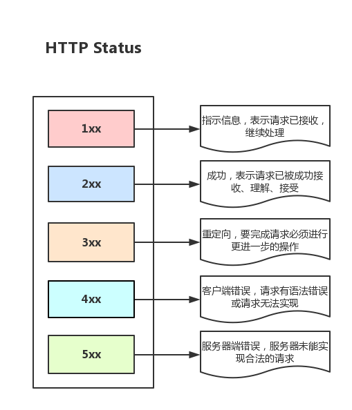

### 1.Jvm的垃圾回收机制

https://mp.weixin.qq.com/s/Cy9IdUZDwE3C4X4iUWnggA

1. 回收的对象： java堆和方法区

2. 找到需要回收的对象：引用计数法和可达性分析

3. 回收算法：标记-清除算法（效率都高，会产生大量不连续的内存碎片），复制算法（会浪费一半的内存空间），标记-整理算法（移动对象需要STW）,分代收集算法
4. 具体的收集器：新生代收集器，老年代收集器，
5. 比较重要的G1,CMS，ZGC

### 2.ping命令的工作过程及原理

https://blog.csdn.net/lcx390549721/article/details/82781483

ping工作在应用层，但不实用TCP协议，使用网络层的ICMP协议

ping 命令会发送一份ICMP回显请求报文给目标主机，并等待目标主机返回ICMP回显应答。因为ICMP协议会要求目标主机在收到消息之后，必须返回ICMP应答消息给源主机，如果源主机在一定时间内收到了目标主机的应答，则表明两台主机之间网络是可达的。

### 3.HTTPS报文有什么

可能是书上写了的

https://blog.csdn.net/scanf_linux/article/details/107614117

### 4.HTTP和HTTPS区别

1、https协议需要到CA申请证书。

2、http是超文本传输协议，采用明文传输信息，存在信息窃听、信息篡改和信息劫持的风险。https则是具有安全性的ssl/tls加密传输协议。而协议TLS/SSL具有身份验证、信息加密和完整性校验的功能，可以避免此类问题发生。

3、http和https使用的是完全不同的连接方式，用的端口也不一样，前者是80，后者是443；使用的URL也不一样，前者为http//:URL，后者为https//:URL。

4、http的连接很简单，是无状态的；HTTPS协议是由SSL/TLS+HTTP协议构建的可进行加密传输、身份认证的网络协议，比http协议安全。

### 5.HashMap原理

https://itlemon.blog.csdn.net/article/details/104271481

### 6.session工作原理

https://blog.csdn.net/sinat_36184075/article/details/105674613

https://www.cnblogs.com/woshimrf/p/5317776.html

**Session生命周期结束时机：**

**浏览器关闭**：销毁Cookie中的jsessionid=xxx，原session对象会保留默认30min后才销毁，30分钟后为新的session;
	**session销毁**：主动调用 session.invalidate() 方法后，立即将session对象销毁，再次访问时会创建新的session.

### 7.Synchronized实现原理

https://blog.csdn.net/jinjiniao1/article/details/91546512

### 8.CurrentHashMap的实现原理


### 9.多线程下HashMap为什么会死循环

https://developer.aliyun.com/article/38431

### 10.缓存

1. 数据库数据缓存：memcached，Redis
2. 反向代理缓存，CDN缓存，DNS
3.  web应用层缓存
4. 浏览器端缓存


### 11.用户反应网站卡，问都有哪些可能性，以及排查方法。

先判断是server端问题还是client端出现问题，如果是server端，1. 服务器带宽不够2. 服务器负载过大3. 开发代码SQL代码需要优化 4. 数据库数据多，

> 检测工具：
>
> 浏览器调试，服务器资源使用情况，负载等情况，mysql日志


> 解决办法：
>
> 1. 加带宽
> 2. sql语句优化
> 3. 数据库分库分表或者读写分离
> 4. CDN缓存,静态页面缓存
> 5. 网站架构（添加服务器，负载均衡）

### 12.java中的异常体系

https://blog.csdn.net/hguisu/article/details/6155636

### 13.输入URL到浏览器发生了什么

https://blog.csdn.net/weixin_40851188/article/details/89032946

1. 从浏览器接收到url到开启网络请求线程（这一部分涉及浏览器的机制以及进程与线程之间的关系）

   > 1.1 多进程浏览器，每个tab相当一个进程，每个进程包含有多个线程,
   >
   > 1.2 浏览器内核进程（Renderer进程）是浏览器的主要进程，其中分为GUI线程，事件触发线程，定时器线程，JS引擎线程，网络请求线程。
   >
   > 1.3 Browser主进程和浏览器内核进程（Renderer进程）的通信，得到需要渲染的内容
   >
   > 1.4 Render进程拿到内容后，开始渲染（包含建立dom树，解析css构建render树，布局和绘制render树）
   >
   > 1.5 浏览器渲染进程中有**普通图层和复合图层**
   >
   > 1.6 浏览器的**事件触发进程**
   >
   > 1.7 浏览器内核进程（Renderer进程）的定时器线程
   >
   > 1.8 解析URL（根据特定的格式解析URL每一部分完成字符编码等操作）
   >
   > 1.9 缓存检查（查看页面是否进行了缓存）
   >
   > 1.10 网络请求线程（发送网络请求，开辟进程）

2. 从开启网络线程到发出一个完整的http请求（这一部分涉及到dns查询，tcp/ip请求，五层因特网协议栈等知识）

   > 2.1 DNS解析域名成为IP（DNS解析缓存，递归解析，迭代解析，DNS负载均衡）
   >
   > 2.2 如果浏览器有缓存，直接使用浏览器缓存，否则使用本机缓存，再没有的话就是用host。如果本地没有，就向dns域名服务器查询（当然，中间可能还会经过路由，也有缓存等），查询到对应的IP。
   >
   > 2.3 优化可以考虑CDN加速，dns-prefetch
   >
   > 2.4 生成HTTP请求消息（**请求格式，响应格式**）
   >
   > 2.5: TCP/IP三次握手，四次挥手
   >
   > > 链路层：对0和1进行分组，定义数据帧，确认主机的物理地址，传输数据；
   > > 网络层：定义IP地址，确认主机所在的网络位置，并通过IP进行MAC寻址，对外网数据包进行路由转发；
   > > 传输层：定义端口，确认主机上应用程序的身份，并将数据包交给对应的应用程序；
   > > 应用层：定义数据格式，并按照对应的格式解读数据。(HTTP/HTTPS，对称加密，非对称加密)

3. 从服务器接收到请求到对应后台接收到请求（这一部分可能涉及到负载均衡，安全拦截以及后台内部的处理等等）

   

   3.1 安全拦截

    1. 防火墙(包过滤，应用层网关，电路层网关)

       包过滤规则：通过ip地址，端口号。tcp控制位，控制web服务器联网，控制外网无法访问内网，

   3.2 负载均衡

        1. 使用DNS服务器进行轮询（缺点）
           2. 负载均衡服务器
           3. 缓存服务器（缓存更新方法）
           4. 正向代理（代理服务器在客户端，），反向代理，透明代理
           5. 内容分发服务CDN

   3.3  后台业务逻辑的处理及返回

   ​		服务器端的套接字的建立和通信过程和端口号

4. 后台和前台的http交互（这一部分包括http头部、响应码、报文结构、cookie,cookie优化，以及编码解码，如gzip压缩等）

   

   > 4.1 http报文结构（通用头部，请求/响应头部，请求/响应体）
   >
   > 4.2 cookie以及优化
   >
   > 4.3 gzip压缩
   >
   > 4.4 长链接&短连接
   >
   > 4.5 http 2.0
   >
   > 4.6 https

5. 单独拎出来的缓存问题，http的缓存（这部分包括http缓存头部，etag，catch-control等）

   > 缓存头部

6. 浏览器接收到http数据包后的解析流程（这部分包括dom树、css规则树、合并成render树，然后layout、painting渲染、复合图层合成、GPU绘制、外链资源处理、loaded和domcontentloaded等）

7. CSS的可视化格式模型（元素的渲染规则，如css三大模型，BFC，IFC等概念）

8. JS引擎解析过程（JS的解释阶段，预处理阶段，执行阶段生成执行上下文，VO，作用域链、回收机制等等）

9. 其它（可以拓展不同的知识模块，如跨域，web安全，hybrid模式等等内容）


### 14. 秒杀系统

遇到的问题：

1. 高并发：**缓存雪崩**，**缓存击穿**，**缓存穿透**

   **我们在开发程序的时候都要有一颗“不信任”的心，就是不要相信任何调用方，比如你提供了API接口出去，你有这几个参数，那我觉得作为被调用方，任何可能的参数情况都应该被考虑到，做校验，因为你不相信调用你的人，你不知道他会传什么参数给你**

   > <u>缓存雪崩:</u>redis中的key值在某一个时间段，全部过期后某一时刻流量剧增，缓存全部失效，请求全部打到数据库上，数据块直接挂掉，解决方案1.给每个键设置一个随机的过期时间2. 如果**Redis**是集群部署，将热点数据均匀分布在不同的**Redis**库中也能避免全部失效的问题,者设置热点数据永远不过期，有更新操作就更新缓存就
   >
   > <u>缓存穿透</u>:一直访问redis和数据库中都不存在的数据，如果后端没有做参数校验，在大量并发访问的情况下可能导致宕机，*解决方案：1. 接口层增加校验，比如用户鉴权校验，参数做校验，不合法的参数直接代码Return，2. 对单个IP每秒访问次数超出阈值的IP都拉黑；3.布隆过滤器判断key是否存在 4.系统高可用做好*
   >
   > <u>缓存击穿</u>：是指一个Key非常热点，在不停的扛着大并发，大并发集中对这一个点进行访问，当这个Key在失效的瞬间，持续的大并发就穿破缓存，直接请求数据库，就像在一个完好无损的桶上凿开了一个洞。解决方案：设置热点数据永远不过期
   >
   > * 事前：**Redis** 高可用，主从+哨兵，**Redis cluster**，避免全盘崩溃。
   >
   > * 事中：本地 **ehcache** 缓存 + **Hystrix** 限流+降级，避免** MySQL** 被打死。
   > * 事后：**Redis** 持久化 **RDB**+**AOF**，一旦重启，自动从磁盘上加载数据*，快速恢复缓存数据。*

   

2. *超卖问题*

3. 恶意请求

4. 链接暴露：开发者模式或者后台开发人员获取秒杀链接

5. 数据库：

解决方案：

**分布式Session:**使用redis来存储令牌和对应的用户信息，前端获取信息时候携带令牌，去redis中寻找对应的用户信息;

### 15.缓存

1. 浏览器/APP缓存

2. CDN缓存

3. 接入层缓存

   > Nginx本地缓存
   >
   > PageSpeed
   >
   > Varnish

4. 应用层缓存

> 1. HashMap 或者 ConcurrentHashMap
> 2. 在 Java 中基于 LinkedHashMap 类，提供了一个自动清理最老元素的功能，，基于这个特质，可以将改造成一个LRU（Least Recently Used ，表示最近最少使用）缓存使用。
> 3. EhCache缓存：支持堆内缓存（占用JVM空间，引发频繁GC）和堆外缓存(堆外内存中的对象必须要序列化，键和值必须实现Serializable接口，因此存取速度上会比堆内缓存慢。在Java中可以通过 -XX:MaxDirectMemorySize 参数设置堆外内存的上限。)
> 4. 缓存数据存储在磁盘上，数据可以不丢失，更大的存储空间，缓存在磁盘上的数据也需要支持序列化，速度会被比内存更慢
> 5. Guava Cache 是其中的一个专门用于处理本地缓存的轻量级框架，是全内存方式的本地缓存，而且是线程安全的。和 ConcurrentMap 相比，Guava Cache 可以限制内存的占用，并可设置缓存的过期时间，可以自动回收数据，而 ConcurrentMap 只能通过静态方式来控制缓存，移除数据元素需要显示的方式来移除
> 6. Guava Cache四种内存回收方式
>
> 堆内缓存：
>
> 堆外缓存:

Guava Cache和EhCache的区别？

https://www.cnblogs.com/liushijie/p/5217981.html

5. 分布式缓存

缓存一致性问题怎么解决？

https://mp.weixin.qq.com/s/dYvM8_6SQnYRB6KjPsprbw

> 1. 先删除缓存，再更新数据库。解决方案是使用延迟双删。
> 2. 先更新数据库，再删除缓存。解决方案是消息队列或者其他binlog同步，引入消息队列会带来更多的问题，并不推荐直接使用。
> 3. 通过在总线加LOCK, 或者通过缓存一致性协议


### 16. 高可用解决方案

1. 降级
2. 限流

3. 切流量
4. 可回滚

### 20.java动态代理

JDK动态代理


Gglib动态代理

### 18.加密算法

对称加密：DES，3DES，AES

非对称加密：RSA,DSA,

散列加密：SHA-1,MD5

### 23.BIO，NIO，AIO区别

**流**：将数据抽象成为一组有顺序的字节集合，主要为数据建立一个输送管道，将数据从输入端传输到输出端

**五种 IO 模型包括**：阻塞 IO、非阻塞 IO、信号驱动 IO、IO 多路复用、异步 IO。其中，前四个被称为同步 IO

##### 阻塞 IO（Blocking I/O）

*一直等着数据到来，不去做其他的事情*

BIO 中的阻塞，就是阻塞在 2 个地方：

1. OS 等待数据报(通过网络发送过来)准备好。
2. 将数据从内核空间拷贝到用户空间。

##### 非阻塞 IO（Noblocking I/O）


每次应用进程询问内核是否有数据报准备好，当有数据报准备好时，就进行拷贝数据报的操作，***从内核拷贝到用户空间，和拷贝完成返回的这段时间，应用进程是阻塞的***。但在没有数据报准备好时，并不会阻塞程序，内核直接返回未准备就绪的信号，等待应用进程的下一个轮询。但是，轮询对于 CPU 来说是较大的浪费，一般只有在**特定的场景**下才使用。

**NIO 不会在 recvfrom（询问数据是否准备好）时阻塞，但还是会在将数据从内核空间拷贝到用户空间时阻塞。一定要注意这个地方，Non-Blocking 还是会阻塞的。**

##### IO 多路复用（I/O Multiplexing）

https://zhuanlan.zhihu.com/p/115220699


传统情况下 client 与 server 通信需要 3 个 socket(客户端的 socket，服务端的 server socket，服务端中用来和客户端通信的 socket)，而在 IO 多路复用中，客户端与服务端通信需要的不是 socket，而是 3 个 channel，通过 channel 可以完成与 socket 同样的操作，channel 的底层还是使用的 socket 进行通信，但是多个 channel 只对应一个 socket(可能不只是一个，但是 socket 的数量一定少于 channel 数量)，这样仅仅通过少量的 socket 就可以完成更多的连接，提高了 client 容量。

IO多路复用就是在单线程/进程中处理多个事件流，更少的浪费资源，在不同的操作系统中有不同的实现：

1. Windows：selector
2. Linux：select、poll、epoll
3. Mac：kqueue

其中 epoll，kqueue 比 selector 更为高效，这是因为他们监听方式的不同。selector 的监听是通过轮询 FD_SETSIZE 来问每一个 socket：“你改变了吗？”，假若监听到事件，那么 selector 就会调用相应的事件处理器进行处理。但是 epoll 与 kqueue 不同，他们把 socket 与事件绑定在一起，当监听到 socket 变化时，立即可以调用相应的处理。 **selector，epoll，kqueue 都属于 Reactor IO 设计。**

##### 信号驱动（Signal driven IO）


信号驱动 IO 模型，应用进程告诉内核：当数据报准备好的时候，给我发送一个信号，对 SIGIO 信号进行捕捉，并且调用我的信号处理函数来获取数据报。

##### 异步 IO（Asynchronous I/O）

程序发起 read 操作之后，立刻就可以开始去做其它的事。kernel 会等待数据准备完成，然后将数据拷贝到用户内存，当这一切都完成之后，kernel 会给用户进程发送一个 signal，告诉它 read 操作完成了。

##### TODO 什么是Reactor IO ？

##### Blocking IO 与 Non-Blocking IO 区别？

阻塞或非阻塞只涉及程序和 OS，Blocking IO 会一直 block 程序直到 OS 返回，而 Non-Block IO 在 OS 内核准备数据包的情况下会立即得到返回。

##### Asynchronous IO 与 Synchronous IO？

只要有 block 就是同步 IO，完全没有 block 则是异步 IO。所以我们之前所说的 Blocking IO、Non-Blocking IO、IO Multiplex，均为 Synchronous IO，只有 Asynchronous IO 为异步 IO。

#####  Non-Blocking IO 不是会立即返回没有阻塞吗?

**Non-Blocking IO 在数据包准备时是非阻塞的，但是在将数据从内核空间拷贝到用户空间还是会阻塞**。而 Asynchronous IO 则不一样，当进程发起 IO 操作之后，就直接返回再也不理睬了，由内核完成读写，完成读写操作后 kernel 发送一个信号，告诉进程说 IO 完成。在这整个过程中，进程完全没有被 block。

##### IO 模式（Reactor 与 Proactor）

##### 同步与异步，阻塞与非阻塞他們的区别

##### Java 中的 NIO

NIO 是一种基于通道和缓冲区的 I/O 方式，它可以使用 Native 函数库直接分配堆外内存（区别于 JVM 的运行时数据区），然后通过一个存储在 java 堆里面的 DirectByteBuffer 对象作为这块内存的直接引用进行操作。这样能在一些场景显著提高性能，因为避免了在 Java 堆和 Native 堆中来回复制数据。

NIO 主要有三大核心部分：Channel(通道)，Buffer(缓冲区), Selector（选择器）。*传统 IO 是基于字节流和字符流进行操作*（基于流），而 NIO 基于 Channel 和 Buffer(缓冲区)进行操作，**数据总是从通道读取到缓冲区中，或者从缓冲区写入到通道中。Selector(选择区)用于监听多个通道的事件（比如：连接打开，数据到达）**。因此，单个线程可以监听多个数据通道。

##### Java 中的 AIO

JDK1.7 升级了 NIO 类库，升级后的 NIO 类库被称为 NIO 2.0。Java 正式提供了异步文件 I/O 操作，同时提供了与 UNIX 网络编程事件驱动 I/O 对应的 AIO。**NIO 2.0 引入了新的异步通道的概念，并提供了异步文件通道和异步套接字通道的实现**。

##### epoll和select的区别

[参考链接](https://github.com/doocs/source-code-hunter/blob/main/docs/Netty/IOTechnologyBase/%E6%8A%8A%E8%A2%AB%E8%AF%B4%E7%83%82%E7%9A%84BIO%E3%80%81NIO%E3%80%81AIO%E5%86%8D%E4%BB%8E%E5%A4%B4%E5%88%B0%E5%B0%BE%E6%89%AF%E4%B8%80%E9%81%8D.md)

### 24 负载均衡算法有哪些？

负载均衡被设计用来处理大型网站的高并发问题，也就是根据需求将客户端的请求发送到不同的服务器进行处理

主要的负载均衡算法有：

1.轮询法：按顺序分配，而不管服务器端的总负载和当前负载。

2.随机法：根据随机函数，随机选择一台机器进行分配

3.源地址哈希法：根据服务消费者请求客户端的IP地址，通过哈希函数计算得到一个哈希值，将此哈希值和服务器列表的大小进行取模运算，得到的结果便是要访问的服务器地址的序号。采用源地址哈希法进行负载均衡，相同的IP客户端，如果服务器列表不变，将映射到同一个后台服务器进行访问。

4.加权轮询法：配置高、负载低的机器分配更高的权重，使其能处理更多的请求，而配置低、负载高的机器，则给其分配较低的权重，降低其系统负载，将请求按照顺序且根据权重分配给后端。

5.最小连接数法

### 25 LRU算法

**用到缓存，基本都会有LRU**

##### 1.操作系统

由于操作系统的内存有限，在运行大型的程序的时候，不能把整个程序加载到内存中，所以根据局部性原理，操作系统引入虚拟内存，也就是先将程序多个页面，每次只需要将需要的页面加载进入内存，当程序需要的时候，通过页面置换算法，将内存腾出来，换上需要的，所以就有了页面置换算法，好的置换算法能够有效减少页面更换频率。

1. 最佳置换算法
2. 先进先出算法
3. 最近最久未使用算法：将最近长时间潍坊问的页面换掉，因为根据**局部性原理**
4. 时钟置换算法

##### 2.算法题

双向链表+hashMap，可以使用get和put时间复杂度都为O(1)

```java
class LRUCache {
    class DLinkedNode{
        int key;
        int value;
        DLinkedNode pre;
        DLinkedNode next;
        public DLinkedNode(){}
        public DLinkedNode(int _key,int _value){
            key = _key;
            value = _value;
        }
    }
    private Map<Integer,DLinkedNode> cache = new HashMap<>();
    private int size;
    private int capacity;
    private DLinkedNode head,tail;
    public LRUCache(int capacity) {
        this.size=0;
        this.capacity = capacity;
        head = new DLinkedNode();
        tail = new DLinkedNode();
        head.next = tail;
        tail.pre = head;
    }
    
    public int get(int key) {
        DLinkedNode node =  cache.get(key);
        if(node==null){
            return -1;
        }
        moveToHead(node);
        return node.value;
    }
    
    public void put(int key, int value) {
        DLinkedNode node = cache.get(key);
        if(node == null){
            DLinkedNode newNode = new DLinkedNode(key,value);
            cache.put(key,newNode);
            addToHead(newNode);
            ++size;
            if(size>capacity){
                DLinkedNode tail = removeTail();
                cache.remove(tail.key);
                --size;
            }
        }else{
            node.value = value;
            moveToHead(node);
        }
    }
    void addToHead(DLinkedNode node){
        node.pre = head;
        node.next = head.next;
        node.pre.next = node;
        node.next.pre = node;
    }
     void removeNode(DLinkedNode node) {
        node.pre.next = node.next;
        node.next.pre = node.pre;
    }
    void moveToHead(DLinkedNode node){
        removeNode(node);
        addToHead(node);
    }
    DLinkedNode removeTail(){
        DLinkedNode res = tail.pre;
        removeNode(res);
        return res;
    }
}
```


##### 3.Redis中的LRU

Redis 3.0中对于 LRU 替换算法的优化，在只维护一个eviction pool带来的少量开销情况下，对算法效率的提升是比较明显的，效率的提升带来的是访问命中率的提升。同时，在目前3.4的unstable版本中我们也可以看见Redis计划实现 LFU 算法以支持更丰富的业务场景，大致思想是**随机取出若干个key，然后按照访问时间排序后，淘汰掉最不经常使用**

`https://zhuanlan.zhihu.com/p/34133067`

### 26 幂等性解决方案


### 27 关于object o = new Object();

##### 1.对象创建过程

##### 2.加问DCL要不要加volatile问题?(指令重排)

##### 3.对象在内存中的存储布局?(对象与数组的存储不同)

markword

class pointer

instace data

padding

##### 4.对象头具体包括什么?(markword klasspointer)synchronized锁信息

##### 5．对象怎么定位?(直接间接)

##### 6.对象怎么分配?(栈上-线程本地-Eden-old)

##### 7.object o = new Object()在内存中占用多少字节?

##### 8.新问题:为什么hotspot不使用c++对象来代表java对象?

##### 9．新问题:class对象是在堆还是在方法区?

### 28 内存屏障

#####  CPU内存屏障

2.sfence, 是一种Store Barrier 写屏障 
       3.mfence, 是一种全能型的屏障，具备ifence和sfence的能力

**写内存屏障(Store Memory Barrier)**: 在指令后插入Store Barrier, 能让写入缓存中的最新数据更新写入主内存, 让其他线程可见
强制写入主内存, 这种显示调用, CPU就不会因为性能考虑而进行指令重排

**读内存屏障(Load Memory Barrier)**: 在指令前插入Load Barrier, 可以让高速缓存中的数据失效, 强制从新从主内存读取数据
强制读取主内存内容, 让CPU缓存和主内存保持一致, 避免了缓存导致的一致性问题

##### JVM内存屏障

**内存屏障（memory barrier）是一个CPU指令。它是这样一条指令： a) 确保一些特定操作执行的顺序(先于这个命令的必须先执行，后于这个命令的必须后执行。)； b) 影响一些数据的可见性(强制更新一次不同CPU的缓存)**

**LoadLoad 屏障** :Load1,Loadload,Load2 确保Load1读到的数据在Load2之前可以读到。

**StoreStore 屏障** 

**LoadStore 屏障** 

**StoreLoad 屏障** 

常见的具体使用内存屏障的有几种：

1. 通过 Synchronized关键字包住的代码区域

2. 使用了volatile修饰变量,则对变量的写操作,会插入StoreLoad屏障.
