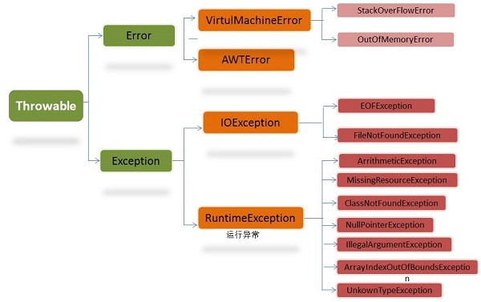

###   去哪网java实习生面

  一面（技术面） 

  1.自我介绍，并分析简历上的项目，并发情况，数据量大的情况你怎么办 

  2.分析悲观锁和乐观锁 [Java中锁分类和锁优化方法](F:\paperSet\笔记\javaKI\并发&多线程\源码分析\Java中的锁.md)

  3.数据库索引

  4.出题建表，写sql，~~mybatis标签拆分判断~~。 

  5.hashmap详细说明，底层数据结构。  [hashMap](F:\paperSet\笔记\javaKI\java基础\java集合源码分析\hashMap源码.md)

  6.concurrenthashmap详细说明 。[concurrenthashmap解析](F:\paperSet\笔记\javaKI\并发&多线程\源码分析\ConcurrentHashMap源码分析(一).md)

   7.treeset

   8.线程常见状况。 

   9.maven生命周期。 

   10.linux常用命令。 

   二面（技术面） 

   1.各种排序以及应用场景(快排，归并，堆排，选择排)。 


   2.给你10亿个数，选择10个最小的，最优算法。 [TOPK问题处理](F:\paperSet\笔记\javaKI\TopK问题.md)

   3.时间复杂度，空间复杂度。 

   4.线程池，callable,ExecutorService源码，参数含义。 [线程池解析](F:\paperSet\笔记\javaKI\并发&多线程\源码分析\线程池解析.md)

   6.Spring boot工作机制 

   7.简单说下redis。 

   8.服务器集群。 **【哨兵机制，集群切片】**

   9.数据库事务，事务隔离级别 **(45讲03, 08)**

   10.git常用命令，是否用过github。 

   三面（技术面） 

   1.最近在学什么。 

   2.如果学习一个新框架 

   3.设计一块缓存的数据结构，实现快速增加，删除，查找等操作，并判断时间空间复杂度。 **LRU**

   4.项目并发如何解决。 **[并发涉及问题：1.线程安全2.效率3.高并发下的系统设计]**

### zoom合肥实习面

##### 一面

大概面了30分钟，面试官估计是以后的同事

*   [x] 自我介绍

*   [x] 问了问读了什么书

*   [x] 围绕项目问了一些实现的问题

*   [ ] Redis场景题：   
    *   如果有一个for循环，不停地进行SET操作，且每次SET的key不一样，可能会循环上万次。这样的话应该怎么优化
    *   用Redis做缓存的时候，说说详细流程，怎么防脏读[双写一致性](F:\paperSet\笔记\javaKI\分布式&高并发\场景题.md)
    
*   [ ] Spring的AOP

*   [ ] Spring怎么实现事务，事务有哪些隔离级别

*   [ ] Java基本类型的封包拆包

    >   1.   编码过程中只接收对象的情况，比如List中只能存入对象，不能存入基本数据类型；比如一个方法的参数是Object时，不能传入基本数据类型，但可以传入对应的包装类；
    >   2.   方便类型之间的转换，比如String和int之间的转换可以通过int的包装类Integer来实现

*   [ ] 举个线程不安全的例子**【多个线程+1】【死锁】**

*   [ ] 关于线程的使用的场景题

*   [ ] CAS的具体实现

*   [ ] MySQL有哪些索引，有什么区别**【实现方式的索引，索引类型，b+树索引类型（联合索引，覆盖索引）】**

*   [ ] SQL语句调优会吗，有哪些调优方式,[调优](F:\paperSet\笔记\javaKI\数据库\数据库调优.md)

*   [ ] 关于我们公司，有什么想问我的吗

##### 二面

*   [ ] 聊项目   
    *   说了项目的表结构
    *   项目部分功能的具体实现
    *   提了一些项目上可能会遇到的问题，问我怎么解决
    *   感觉收获很大，很多自己以前没有考虑
    
*   [x] Java8有什么新的特性【lamda表达式】

*   [x] Java怎么具体实现的ThreadLocal [ThreadLocal解析](../javaKI\并发&多线程\源码分析\ThreadLocal原理.md)

*   [x] 线程有哪些状态

*   [x] 讲讲线程池，都有哪些参数

*   [x] 说说常用的线程同步的方法

*   [x] 浏览器请求URL到返回页面的详细过程(如果是localhost呢) [网络](../计算机网络\浏览器请求URL到返回页面的详细过程.md)

*   [x] 三次握手、四次挥手的详细过程 [](./笔记\javaKI\计算机网络\TCP协议.md)

*   [x] 讲讲Java都有哪些锁，他们有什么区别 [](../并发&多线程\源码分析\Java中的锁.md)

*   [x] 说说你会什么容器，然后挑了HashMap和TreeMap问  [treeMap](../java基础\java集合源码分析\TreeMap源码.md),[hashMap](../java基础\java集合源码分析\hashMap源码.md)

*   [ ] 说说你会什么并发容器，挑了ConcurrentHashMap的具体实现问

    >   ##### CopyOnWriteArrayList，ConcurrentHashMap，**BlockingQueue**，HashTable

*   [ ] 项目用了Spring Boot，问了问内嵌的服务器还有做了哪些配置

*   [ ] AOP有什么用？有些名词你知道吗？

*   [ ] 说说jdk动态代理和CGLIB有什么区别

    

*   [ ] 对什么设计模式比较熟？挑了适配器、装饰器和问【单例模式】【工厂模式】【克隆模式】【代理模式】

*   [ ] 用过Spring Cloud吗(不会，但谈了谈Dubbo和ZooKeeper)

*   [ ] 会前端吗，有了解过什么

*   [ ] 打算做后台什么方向

### 蚂蚁金服1面

*   [x] 1.说说你熟悉的java集合类，hashmap？ 


*   [x] 2.线程安全的map？ （ConcurrentHashMap，）


*   [x] 3.线程是怎么创建的？ 

*   [x] 4线程池创建及种类？ 

*   [ ] 5.栈与堆的区别？ 

*   [ ] 6.创建一个方法，只有一个语句：return "hello"+string（传参），内存发生了什么？ 

*   [x] 7.数据库的索引？ 

*   [ ] 8.你看过设计模式吗？ 

*   [x] 9.你的英语6级过了，平时看什么英文书籍吗？ 

*   [x] 10你觉得自己收获最大的一个项目？收获了什么？有什么难点？ 

*   [x] 11.咱们这个地点是在杭州与上海，你可以吗？可以，排序（杭州、上海）为什么？ 

*   [x] 12.你还有什么问题吗？  


*   [x] 13重写hashcode（）与equal（）要注意什么？他们之间什么关系？ 

    >   ​      默认情况下从超类Object继承而来的equals方法与‘==’是完全等价的，比较的都是对象的内存地址，但我们可以重写equals方法，使其按照我们的需求进行比较，如String类重写了equals方法，使其比较的是字符的序列，而不再是内存地址。
    >
    >   ​		重写equals.也需要重写hashcode, 并且应该满足**自反性，对称性，传递性，一致性**


*   [x] 14.object类有什么方法？ 

​		toString, hashcode,equals, wait,notify,finalize,clone


*   [x] 15.hashmap的遍历时间复杂度？ 


*   [x] 16.数据库的事务？ACID的具体含义？ 

*   [x] 17守护进程？ 

*   [x] 18 你所知道的异常？平时写程序时的异常？【经典面试题中的异常有写】

    >   error:是程序无法处理的错误，表示运行应用程序中较严重问题
    >
    >   exception:是程序本身可以处理的异常,分为运行时异常（Java编译器不会检查它，不处理也能编译通过）和非运行时异常；
    >
    >    

### [京东]() 商城平台中间件部门（offer）

##### 一面

*   [x] 自我介绍
*   [x] 项目介绍
     （我对于项目说的比较细，项目简介、用到的技术、总体框架、个人贡献，着重讲了项目中遇到的问题，我这里说的是并发形下的性能和数据精确性问题）
*   [ ] 项目中用到了Redis，介绍一下Redis数据类型 **[字符串，*链表，字典hash*，跳跃表，整数集合，压缩列表]**
*   [x] 你们怎么保证Redis缓存和数据库的数据一致性？缓存雪崩？击穿？穿透？
*   [x] 算法的时间复杂度和空间复杂度的含义，分析一下快排的？
*   [x] MySQL外键删除策略？

```Tex
1.CASCADE：从父表删除或更新且自动删除或更新子表中匹配的行。
2.SET NULL：从父表删除或更新行，并设置子表中的外键列为NULL。如果使用该选项，必须保证子表列没有指定NOT NULL。
3.RESTRICT：拒绝对父表的删除或更新操作。
4.NO ACTION：标准SQL的关键字，在MySQL中与RESTRICT相同。
```


*   [x] 如何做的MySQL优化？
*   [x] MySQL索引结构？介绍一下B树和B+树？MyISAM和InnoDB索引的区别？
*   [x] 什么是事务？事务隔离级别和MVCC？
*   [ ] 最短路径算法
*   [x] HashMap和ConcurrentHashMap
*   [x] Thread的join方法了解吗？（我说相当于if(isAlive())wait(0)）那为啥不直接用wait(0)?（不知道）
*   [x] final关键字，final修饰的方法不能被重写，能被重载吗
    （在这里额外提了Java内存模型对于final的底层实现）


*   [x] JVM了解吗，说说所知道的
    （？？我讲了内存区域、垃圾回收、类加载，然后，面试官说可以了）

##### 二面

*   [x] 项目介绍

*   [x] Redis线程安全吗，事务支持一致性吗 [](../中间件\Redis\Redis的设计与实现\Redis事务.md)

    >   MULTI开启，EXEC执行，WATCH监控每个键。
    >
    >   <u>**redis是单线程的，Redis的事务总是以串行的方式运行**的</u>，并且事务也总是具有隔离性的，可以保证在执行过程中不被修改

*   [x] 数组与链表的区别？

*   [x] 项目中数据安全性如何保证的？
     （我答对于请求使用 session+token+时间戳 校验，对于传输的数据进行非对称加密，使用HTTPS，面试官不是很满意）
    
*   [x] MySQL分库分表的方案？
     （我介绍了我们使用的三种方式，hash法、range法以及当前正在使用的hash+range法）
    
*   [x] Zookeeper了解吗？

*   [x] dubbo了解吗？

### 华为武长地区（offer）

##### 一面

*   [x] 项目中遇到的最大的问题？
*   [x] 画一下项目的后端架构图
*   [ ] 看你数据库用的不错，数据库三范式+BCNF范式？
*   [x] 项目中如何处理终端之间的信息交互？
     （Web网页之间使用的WebSocket, 与手机的交互使用的自己用Netty实现的IM框架）
*   [x] 平时怎么学习技术？
*   [x] 为什么想去北京？武汉行吗？

### 去哪儿 机票部门（offer）

##### 一面

*   [x] 项目介绍

*   [x] 项目中遇到的难题

*   [x] 项目中用到了线程池，用的什么线程池，怎么配置的参数？

*   [x] 项目中的并发临界资源是怎么处理的？（加锁，CAS自旋）

*   [ ] AtomicInteger怎么实现的？

*   [x] CAS三大问题及解决方式 [CAS和Unsafe](F:\paperSet\笔记\javaKI\并发&多线程\源码分析\CAS&Unsafe.md)

*   [x] 事务隔离级别，MySQL默认级别，（可重复读），为啥使用可重复读？（可重复读+MVCC达到了序列化要求）

*   [x] 一个类里面有两个方法A和B，方法A有@Transaction，B没有，但B调用了A，外界调用B会不会触发事务？

*   [ ] OS进程间通信的方式？Java使用的哪种方式？

    >   共享存储，消息传递，管道

*   [x] 介绍一下Java中的锁？可重入锁如何实现的可重入？

    

*   [x] 浏览器从输入URL到返回结果中间经历了什么？

*   [x] 分析一下快速排序的时间复杂度和[算法]()复杂度？

*   [x] 现在jdk默认使用的是哪种垃圾回收器？


##### 二面

*   [x] 研究方向

*   [x] 学习的课程

*   [x] 说一下数据库范式

    >   ​	https://www.zhihu.com/question/24696366
    >
    >   ​	一范式：属性不可再分
    >
    >   ​	二范式：数据库表中不存在非关键字段对任一候选关键字段的部分函数依赖
    >
    >   ​	三范式：传递函数依赖
    >
    >   

*   [x] 进程与线程的区别
*   [ ] 算法题：计算一个有环链表的节点数

### 天猫供应链一面面经 JAVA开发

*   [x] HashMap介绍一下

*   [x] 如何衡量一个哈希算法的好坏（散列的均匀吧，感觉没啥好答的）

*   [x] 哈希解决冲突的4种方法 

    >    链地址法，线性探测法，再Hash

*   [x] 索引最左前缀匹配原则 

*   [x] B树和B+树介绍一下 

*   [ ] http协议介绍一下（介绍了一下概念，不知道他想让我说啥，答得不好） 

    >   属于应用层的，无状态的，无连接的协议，最初用于浏览器中的资源传输，它通过请求行（get,post请求方法，资源定位符URL,版本等），请求头（各种请求参数），请求体，现在又HTTP1.0,1.1,2.0,最后还有请求响应码1XX,2XX，3XX等

*   [ ] cookies如何传递的，session如何传递的（不懂啥意思，答得不好） 

    

*   [x] cookie和session的生命周期（没答上来） 

*   [x] 集群中的session会遇到什么问题，有什么解决方案呢（没答上来） 

*   [x] JVM内存模型，哪些是线程私有、共有，都用来干啥的 

*   [x] 什么情况下会导致虚拟机栈的溢出（没答上来） 

    >   堆溢出：
    >
    >   栈溢出：
    >
    >   虚拟机栈，本地方法栈溢出: 
    >
    >   方法区溢出: 
    >
    >   本机内存: 

*   [x] 常量过多会导致什么问题？（没答上来） 

    >   Java6和6之前，常量池是存放在方法区（永久代）中的。
    >
    >   Java7，将常量池是存放到了堆中。
    >
    >   Java8之后，取消了整个永久代区域，取而代之的是元空间。运行时常量池和静态常量池存放在元空间中，而字符串常量池依然存放在堆

*   [x] 介绍垃圾回收[算法

    >   Serial，parNew，parallel Scaverage，Serial Old，parNew Old, CMS，G1（）

*   [x] eden区和suvivor区怎么进去的？（不知道啥意思）

*   [x] 新生代如何晋升到老年代 

*   [ ] 介绍垃圾回收器，每个垃圾回收器的特点 

*   [ ] CMS回收器为啥快？（没回答上） 

*   [ ] JDK8用了哪种回收器，内存空间管理和以前相比有哪些提升？（记错了，感谢评论区指正，jdk7/8使用Parallel Scavenge/Old，jdk9使用G1） 

    >   JDK 8 默认使用 Parallel Scavenge 收集器，CMS需要调整的参数太多，内存碎片太多

*   [ ] 类加载机制介绍一下（一开始回答的有点简单，不知道他想让我说的是父类和子类 静态和非静态 的顺序） 

    >   **类加载过程：**加载验证准备解析初始化
    >
    >   **类加载顺序：**先静态代码块，再其他
    >
    >   类加载器：Bootstrap ClassLoader，Extention ClassLoader，App ClassLoader
    >
    >   双亲委派：
    >
    >   破坏双亲委派：

*   [ ] 构造函数的加载顺序，多个构造函数先加载哪一个（不懂） 

    >   1. 先加载类：执行静态块，静态变量赋值
    >
    >         因为静态部分是依赖于类，而不是依赖于对象存在的，所以静态部分的加载优先于对象存在。
    >
    >   2. 涉及到几个类，加载几个类，先加载父类
    >
    >   3. 实例化对象：依次执行父类、子类的构造块和构造方法
    >
    >   4. 子类和父类又相同的方法时，子类方法会覆盖父类

*   [ ] 内连接和外连接（数据库基础好久没复习了，内连接忘了） 

*   [ ] group by中使用的having是用来干啥的（也忘了。。。） 

*   [ ] dubbo和redis用过吗（回答过于保守，redis直接没问） 

*   [ ] 服务治理介绍一下（基本上回答不上来） 

    >   服务发现，服务订阅，负载均衡

*   [ ] 远程调用需要从注册中心代理吗（不会） 

*   [x] 如果注册中心代理的话并发量太大不会承受不了，怎么解决（不会） 

*   [x] 用过zookeeper吗（没用过） 

    

*   [x]  Spring和MVC了解么（回答过于保守，时间太晚了，没问，哎）

### 网易互娱 服务端开发 暑期实习一、二面面经（已拿offer）

##### **一面：**

*   [x] 问你的项目 

*   [x] Mysql的索引是什么结构的？ 

*   [x] B+树的结构是什么样的？ 

*   [x] 为什么B+树查找更稳定? 

*   [ ] Mysql怎么优化sql语句？ 

  >   ​			答：（又是背过的嘿嘿）这里就简单说一下吧，首先分析一下慢查询日志，通过日志去找出IO大的SQL以及发现未命中索引的SQL语句......然后			对于需要优化的sql语句：  
  >
  >   *    应尽量避免在 where 子句中使用!=、<、>操作符或对字段进行null值判断，否则将引擎放弃使用索引而进行全表扫描； 
  >
  >   *    只返回必要的列：最好不要使用 SELECT * 语句； 
  >
  >   *    只返回必要的行：使用 LIMIT 语句来限制返回的数据； 
  >
  >         mysql> SELECT * FROM table LIMIT 5;
  >
  >        将一个大连接查询分解成对每一个表进行一次单表查询，然后在应用程序中进行关联，这样做的好处有：    
  >
  >        *    让缓存更高效。对于连接查询，如果其中一个表发生变化，那么整个查询缓存就无法使用。而分解后的多个查询，即使其中一个表发生变化，对其它表的查询缓存依然可以使用； 
  >        *    分解成多个单表查询，这些单表查询的缓存结果更可能被其它查询使用到，从而减少冗余的查询； 
  >        *    减少锁竞争 

*   [x] 然后面试官接着问怎么查询一条sql语句是否使用索引？（大概是这个意思） 

*   [x] TCP的三次握手过程？ 

*   [x] TCP和UDP的区别？ 

  >   答：（哈哈，这里楼主背的滚瓜烂熟。） **1. TCP是面向连接的，UDP是无连接的；** **2. TCP是可靠的， 通过TCP连接传送的数据， 无差错，不丢失，不重复 ；UDP不可靠， 即不保证可靠交付 ；** **3. TCP只支持点对点通信，UDP支持一对一、一对多、多对一、多对多；** **4. TCP是面向字节流的，UDP是面向报文的；** **5. TCP有拥塞控制机制。UDP没有，因此网络出现的拥塞不会使源主机的发送速率降低，这对某些实时应用是很重要的，比如媒体通信，游戏；** **6. TCP首部开销（20字节）比UDP首部开销（8字节）要大** **7. UDP 的主机不需要维持复杂的连接状态表。** 
  >
  >   TCP的可靠性是怎么保证的？ 
  >
  >   1.   数据包校验 
  >   2.   对失序数据包重新[排序]()（TCP报文具有序列号） 
  >   3.   丢弃重复数据 
  >   4.   应答机制：接收方收到数据之后，会发送一个确认（通常延迟几分之一秒）； 
  >   5.   超时重发：发送方发出数据之后，启动一个定时器，超时未收到接收方的确认，则重新发送这个数据； 
  >   6.   流量控制：确保接收端能够接收发送方的数据而不会缓冲区溢出 

*   [x] 用过哪些Linux的命令？ 

*   [x] 如何查看一个目录下的文件数？ 

    >   `ls -l | grep "^-" | wc -l`

*   [ ] Linux中rm（删除）正在被进程占用的文件会发生什么？ 

    >    答：在 Linux 系统中，通过 rm 命令删除一个文件，实际上是在相应的目录结构中 unlink 这个文件。如果这个文件仍然被打开着，这个文件仍然可以被这个进程所使用，并将继续占用磁盘空间。等这个程序关闭该文件后，对应文件的空间才会被释放。

*   [ ] [算法题]()： 判断一个[链表]()是否有环？ 

  答：我一开始说的是如果知道[链表]()长度就可以直接遍历[链表]()，遍历的长度大于给定的长度就有环。（当然面试官后来说不给我长度......我太难了）于是想到了B方案----快慢指针,具体过程[百度]()可以搜到,就不再啰嗦了。 

*   [ ] 有序数组找一个元素（自己写测试用例）。 

  答：楼主一开始写出来个二分查找都方法，后来面试官说有重复的元素让我返回最小的下标（好吧，又想了一会没想到什么好办法，只好把[二分查找]()做到底了，意思就是每次找到了一个符合要求的元素后继续往它左边的部分继续[二分查找]()，这样一定能找到最小下标。）  

##### 二面  

*   [ ] 你的数据库里如果有一张很大数据量的表，该如何优化查询效率？分表后增删查改怎么操作？
*   [x] 一个只有R、G、B三种字符的无序字符数组，要以RGB的顺序进行排序。（比如[B,G,R,B,G,R]---->[R,R,G,G,B,B]）
*   [x] 如果一个用户上传图片失败了，原因可能有哪些？怎么去定位bug？
*   [x] 如何实现一个扫码登陆的功能？

### 快手一面

*   [x] 一上来就怼redis数据结构底层实现 

*   [x] 带学期间学过什么计算机有关的课程？（答计网，操作系统，数据结构） 

*   [x] HTTP和HTTPS有什么区别？ 

*   [x] HTTPS如何保证安全性？ 

*   [x] 认证的过程？对称加密非对称加密？防篡改？ 

*   [x] 讲一下TCP/IP模型？ 

*   [x] 浏览器输入一个url，过程？ 

*   [x] DNS解析过程？ 

*   [x] 进程和线程的区别？ 

*   [x] Java里面创建线程的方式？ 

*   [x] Error和Exception的区别？ 

*   [x] Java8的新特性？ 

*   [x] 说一下ConcurrentHashMap底层实现？1.7 vs 1.8？

*   [x] 说说JVM运行时的数据区域吧？ 

*   [x] 哪些会造成OOM？为什么会造成OOM？ 

*   [x] 说说事务的四大特性吧？

*   [ ] InnoDB是如何实现事务的？

    >   **回滚日志（undo log）** 和 **重做日志（redo log）** 两种表实现事务，并实现 **MVCC (多版本并发控制)**；
    >
    >   https://blog.csdn.net/argleary/article/details/104189850

*   [ ] 事务的隔离级别讲一下？如何实现？（中间的两个加锁） 

    >   通过MVCC实现 MVCC=Undo log+隐藏列+ReadView
    >
    >   https://blog.csdn.net/SCUTJAY/article/details/104653599

*   [x] 一个Java程序怎么运行起来的？ 

*   [x] 说说类加载机制吧？说说双亲委派机制？

*   [ ] 如果让你实现一个SpringBoot有没有什么思路？SpringMVC呢？（答的不好） 

*   [ ] 讲一下SpringIOC 和AOP吧 

*   [ ] 算法：有一个文件，里面有各种各样的字符，空格等，问如何统计出出现频率top20？（答：用一个map存储+一个最小堆，小哥：那你代码实现一下吧） 

*   [x] 你觉得你做过最有成就感的事情？ 

*   [x] 未来的规划？

*   [x]  说说你的优点和缺点吧？

