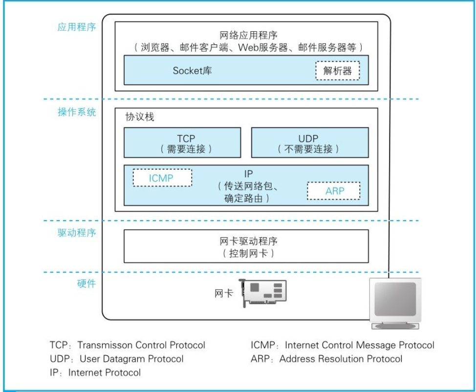
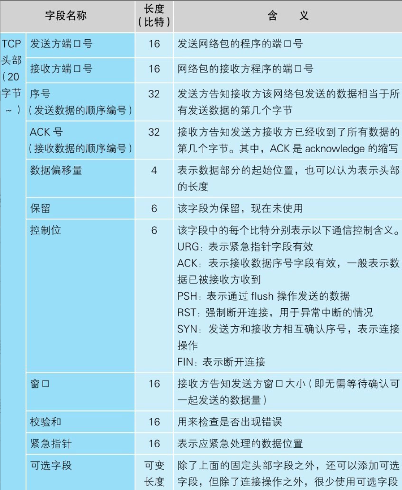

协议栈和网卡
------------

> 本章就介绍了当浏览器将HTTP消息包装好交给操作系统协议栈，通过TCP协议发送给IP的过程,其实涉及到了TCP的可靠性保证所用的方法。

首先我们可以了解一下整个协议栈的构造图，从上到下，上面的部分会向下面的部分委派工作，下面的部分接受委派的工作并实际执行

### 套接字的实体

在协议栈内部有一块用于存放控制信息的内存空间，这里记录了用于控制通信操作的控制信息，例如**通信对象的IP地址、端口号、通信操作的进行状态**等。本来套接字就只是一个概念而已，并不存在实体，如果一定要赋予它一个实体，我们可以说这些**控制信息就是套接字的实体，或者说存放控制信息的内存空间就是套接字的实体**。

在windows中我们可以通过netstat命令`netstat -ano`来查看套接字的详细信息，

##### 调用socket时的操作

创建套接字时，首先分配一个套接字所需的内存空间，然后向其中写入初始状态信息。

### 连接服务器

##### 连接服务器

连接实际上是通信双方交换控制信息，在套接字中记录这些必要信息并准备数据收发的一连串操作。

##### 控制信息的头部

第一类：客户端和服务器相互联络时交换的控制信息，在连接、收发、断开等各个阶段中，每次客户端和服务器之间进行通信时，都需要提供这些控制信息，被称为TCP头部。下面是TCP头部字段信息

另外一类，就是保存在套接字中，用来**控制协议栈操作的信息**

##### 连接操作的实际过程

应用程序调用Socket库connect(提供了服务器的IP和端口号)，与服务器的TCP模块交换控制信息，包括以下几个过程：（也就是**TCP的三次握手过程**）

> 1. 创建TCP头部
>
> 2. TCP模块会将信息传递给IP模块并委托它进行发送
> 3. 网络包就会通过网络到达服务器，然后服务器上的IP模块会将接收到的数据传递给TCP模块
> 4. 服务器的TCP模块根据TCP头部中的信息找到端口号对应的套接字
> 5. 从处于等待连接状态的套接字中找到与TCP头部中记录的端口号相同的套接字，将其状态改为正在连接
> 6. 然后，服务器的TCP模块会返回响应，这个过程和客户端一样，需要在TCP头部中设置发送方和接收方端口号以及SYN比特[插图]。此外，在返回响应时还需要将ACK控制位设为1[插图]，这表示已经接收到相应的网络包
> 7. 网络包就会返回到客户端，通过IP模块到达TCP模块，并通过TCP头部的信息确认连接服务器的操作是否成功
> 8. 现在，**套接字就已经进入随时可以收发数据的状态了**，在不需要使用后调用close函数来断开连接

### 收发数据

##### 将HTTP请求消息交给协议栈

协议栈并不是一收到数据就马上发送出去，而是会将数据存放在内部的发送缓冲区中，并等待应用程序的下一段数据，

一次将多少数据交给协议栈是由应用程序自行决定的，协议栈并不能控制这一行为，需要在数据积累到一定量时再发送出去

***每次发送的数据多少由两个原因来决定***：

1. 每个网络包能容纳的数据长度：在时间内，发送的最大数据不能超过MSS（除去头部之后，一个网络包所能容纳的TCP数据的最大长度），如果时间到了，没有到规定的大小，也会直接发出去。
2. 时间：当应用程序发送数据的频率不高的时候，不需要等到到达规定长度，只需要到达规定的时间MTU（一个网络包的最大长度，以太网中一般为1500字节）,为此，协议栈的内部有一个计时器，当经过一定时间之后，就会把网络包发送出去

这两个要素相互矛盾：长度优先，网络效率高，延迟大；时间优先，网络效率低，延迟小；

##### 对较大的数据进行拆分

当发送数据较大时候，超过MSS的长度，就需要对数据进行拆分发送，拆分出来的每块数据会被放进单独的网络包中。在每一块数据前面加上TCP头部，并根据套接字中记录的控制信息标记发送方和接收方的端口号，然后交给IP模块来执行发送数据的操作

##### 使用ACK号确认网络包已收到

> TCP协议的可靠性保证

***确保客户端向服务器端的可靠：***TCP模块在拆分数据时，会先算好每一块数据相当于从头开始的第几个字节，接下来在发送这一块数据时，将算好的字节数写在TCP头部中，通过序号信息，接收方还能够检查收到的网络包有没有遗漏，如果确认没有遗漏，接收方会将到目前为止接收到的数据长度加起来，计算出一共已经收到了多少个字节，然后将这个数值写入TCP头部的ACK号中发送给发送方，这个返回ACK号的操作被称为确认响应，通过这样的方式，发送方就能够确认对方到底收到了多少数据

***确保服务器端向客户端的可靠：***

最后总的传输过程：

1. 客户端在连接时需要计算出与从客户端到服务器方向通信相关的序号初始值，并将这个值发送给服务器。①
2. 接下来，服务器会通过这个初始值计算出ACK号并返回给客户端。初始值有可能在通信过程中丢失，因此当服务器收到初始值后需要返回ACK号作为确认。同时，服务器也需要计算出与从服务器到客户端方向通信相关的序号初始值，并将这个值发送给客户端（②）。
3. 接下来像刚才一样，客户端也需要根据服务器发来的初始值计算出ACK号并返回给服务器（③）。
4. 到这里，序号和ACK号都已经准备完成了，接下来就可以进入数据收发阶段了。数据收发操作本身是可以双向同时进行的，但Web中是先由客户端向服务器发送请求，序号也会跟随数据一起发送（④）。
5. 然后，服务器收到数据后再返回ACK号（⑤）。
6. 从服务器向客户端发送数据的过程则正好相反（⑥⑦）。

##### 根据网络包平均往返时间调整ACK号等待时间

还有一些其他的**错误检测和补偿机制**：

***返回ACK号的等待时间***：设置需要根据网络情况动态调整，

***使用窗口有效管理ACK号***：动态窗口

***ACK与窗口的合并***：（再写）

##### TODO

### 断开连接，删除套接字

分为两个阶段：1.一方发起断开连接请求，另一方响应请求 2. 删除套接字

***一方发起断开连接请求***：完成数据发送的一方会发起断开过程，我们以服务器一方发起断开过程为例来进行讲解。

首先，<u>服务器一方</u>的应用程序会**调用Socket库的close程序**。然后，服务器的协议栈会生成包含**断开信息的TCP头部**，具体来说就是将控制位中的FIN比特设为1。接下来，协议栈会委**托IP模块向客户端发送数据**。同时，服务器的**套接字**中也会记录下断开操作的相关信息。

接下来轮到<u>客户端</u>了。当收到服务器发来的FIN为1的TCP头部时，客户端的协议栈会将**自己的套接字标记为进入断开操作状态**。然后，告知服务器已收到FIN为1的包，客户端会向服务器**返回一个ACK号**。这些操作完成后，协议栈就可以等待应用程序来取数据了。

***删除套接字***：

为了防止误操作，套接字并不会立即被删除，而是会等待一段时间之后再被删除，就是为了防止误操作

***<u>如果最后客户端返回的ACK号丢失了，结果会如何呢</u>？***

这时，服务器没有接收到ACK号，可能会重发一次FIN。如果这时客户端的套接字已经删除了，会发生什么事呢？套接字被删除，那么套接字中保存的控制信息也就跟着消失了，套接字对应的端口号就会被释放出来。这时，如果别的应用程序要创建套接字，新套接字碰巧又被分配了同一个端口号[插图]，而服务器重发的FIN正好到达，会怎么样呢？本来这个FIN是要发给刚刚删除的那个套接字的，但新套接字具有相同的端口号，于是这个FIN就会错误地跑到新套接字里面，新套接字就开始执行断开操作了。<u>之所以不马上删除套接字，就是为了防止这样的误操作</u>

>  总的过程就是：
>
> （1）客户端发送FIN（2）服务器返回ACK号（3）服务器发送FIN（4）客户端返回ACK号

### IP与以太网的包收发操作

##### 包的基本知识

包是由头部和数据两部分构成的。头部包含目的地址等控制信息，

发送方的设备会创建包，创建包的过程就是**生成含有正确控制信息的头部**，再附加上要发送的数据。接下来，包会被发往最近的网络转发设备。当到达最近的转发设备之后，<u>转发设备会根据头部中的信息判断接下来应该发往哪里</u>。这个过程需要用到一张表，这张表里面记录了每一个地址对应的发送方向，也就是按照头部里记录的目的地址在表里进行查询，并根据查到的信息判断接下来应该发往哪个方向。接下来，包在向目的地移动的过程中，又会到达下一个转发设备，然后又会按照同样的方式被发往下一个转发设备。就这样，经过多个转发设备的接力之后，包最终就会到达接收方的网络设备。

我们就可以看到TCP/IP包含两个头部：

（a）MAC头部（用于以太网协议）

（b）IP头部（用于IP协议）

首先，发送方将包的目的地（要访问的服务器的IP地址）写入IP头部，IP协议就可以**根据这一地址查找包的传输方向**，从而**找到下一个路由器的位置**；接下来，IP协议会委托以太网协议将包传输过去。这时，IP协议会**查找下一个路由器的以太网地址**（MAC地址），并将这个地址**写入MAC头部**中。以太网协议就知道要将这个包发到哪一个路由器上了。总的来说，就是IP协议找到包的传输方向，交给以太网，以太网找到路由器的MAC地址

##### 包收发操作概览

> 协议栈中IP模块是如何完成包收发操作

IP模块负责添加如下两个头部。

（1） MAC头部：以太网用的头部，包含MAC地址

（2）IP头部：IP用的头部，包含IP地址

IP模块将头部封装好后，会将封装好的包交给网卡，传递给网卡的网络包是由一连串0和1组成的数字信息，网卡会将这些数字信息转换为电信号或光信号，并通过网线（或光纤）发送出去，然后这些信号就会到达集线器、路由器等转发设备，再由转发设备一步一步地送达接收方。

包送达对方之后，对方会作出响应。返回的包也会通过转发设备发送回来，然后我们需要接收这个包。接收的过程和发送的过程是相反的，信息先以电信号的形式从网线传输进来，然后由网卡将其转换为数字信息并传递给IP模块（图2.17中的“③接收”）。接下来，IP模块会将MAC头部和IP头部后面的内容，也就是TCP头部加上数据块，传递给TCP模块。接下来的操作就是我们之前讲过的TCP模块负责的部分了。

无论要收发的包是控制包还是数据包，IP对各种类型的包的收发操作都是相同的。

##### 生成包含接收方IP地址的IP头部

> 通过IP表（路由表）生成IP头部，添加到TCP头部之前

##### 生成以太网用的MAC头部

IP模块在生成IP头部之后，会在它前面再加上MAC头部。MAC头部是以太网使用的头部，它包含了接收方和发送方的MAC地址等信息。

***发送方MAC地址由两部分组成***：首先是“**以太类型**”，这里填写表示IP协议的值0800（十六进制）。接下来是发送方**MAC地址**，这里填写网卡本身的MAC地址。MAC地址是在网卡生产时写入ROM里的，只要将这个值读取出来写入MAC头部就可以了

接收方MAC地址：	通过查询路由表IP地址，在通过IP地址通过ARP协议查询到接收方的MAC地址（下面部分讲解）

##### 通过ARP查询目标路由器的MAC地址

ARP协议其实非常简单。在以太网中，有一种叫作广播的方法，可以把包发给连接在**同一以太网中的所有设备**。ARP就是利用广播对所有设备提问：“××这个IP地址是谁的？请把你的MAC地址告诉我。”然后就会有人回答：“这个IP地址是我的，我的MAC地址是××××。

第一种方式是通过**广播**，但是由于广播较为耗费资源，所以在内存在会有一块ARP缓存，将我们已经查到的放入ARP缓存中

之后每次先去查询ARP缓存，当然为了防止IP地址发生变化，ARP缓存中的值在经过一段时间后会被删除，一般这个时间在几分钟左右。

##### 以太网的基本知识

交换式集线器

##### 将IP包转换成电或光信号发送出去

在IP模块将将网络包封装好了后，就会交给链路层，需要将数字信息转换为电或光信号，才能在网线上传输，也就是说，这才是真正的数据发送过程，负责执行这一操作的是网卡，但网卡也无法单独工作，要控制网卡还需要网卡驱动程序

##### 给网络包再加3个控制数据

> 网卡是如何将包转换成电信号并发送到网线中？

网卡驱动从IP模块获取包之后，会将其复制到网卡内的缓冲区中，然后向MAC模块发送发送包的命令。接下来就轮到MAC模块进行工作了。

首先，MAC模块会将包从缓冲区中取出，并在开头加上**报头和起始帧分界符**SFD，在末尾加上用于检测错误的**帧校验序列FCS**。

报头用来测定时机，SFD用来确定帧的起始位置

### UDP协议的收发操作

TCP由于需要可靠性的实现，所以就引入了确认机制来确认收到的包，如果没有收到的包，则重新发送，但是如果漏掉了一个包就要全部重发一遍，怎么看都很低效。为了实现高效的传输，我们要**避免重发已经送达的包**，而是只重发那些出错的或者未送达的包。

不过，在某种情况下，数据很短，用一个包就能装得下。如果只有一个包，就不用考虑哪个包未送达了，因为全部重发也只不过是重发一个包而已，这样我们就可以使用UDP协议

##### 控制用的短数据

像上面说的，我们**只需要一个包**就能解决的，就可以不用TCP,

UDP没有TCP的**接收确认**、**窗口**等机制，因此在收发数据之前不需要建立和断开连接的步骤，只要在从应用程序获取的数据前面加上UDP头部，然后交给IP进行发送就可以了。接收也很简单，只要根据IP头部中的接收方和发送方IP地址，以及UDP头部中的接收方和发送方端口号，找到相应的套接字并将数据交给相应的应用程序就可以了

##### 音频和视频数据

需要在规定的时间内送达的。

发送音频和视频数据的时候。音频和视频数据必须**在规定的时间内送达**，一旦送达晚了，就会错过播放时机，导致声音和图像卡顿。如果像TCP一样通过接收确认响应来检查错误并重发，重发的过程需要消耗一定的时间，因此重发的数据很可能已经错过了播放的时机。一旦错过播放时机，重发数据也是没有用的，因为声音和图像已经卡顿了，这是无法挽回的。

