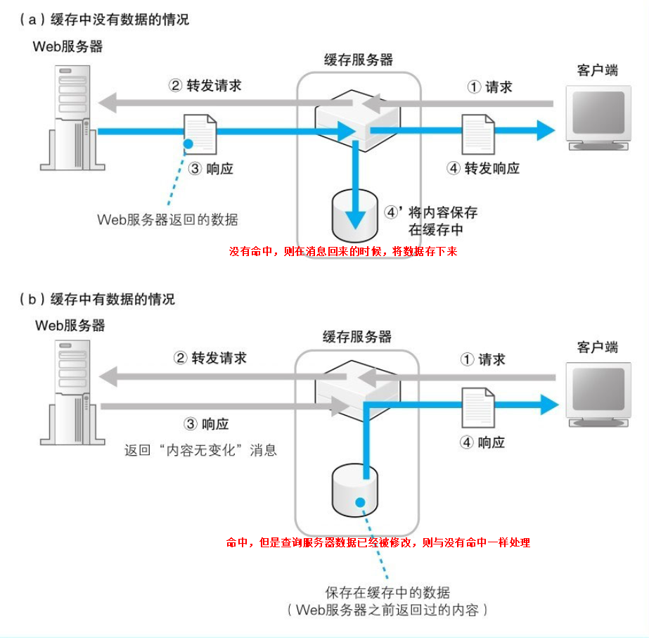

服务器端的局域网
----------------

> Web服务器的部署地点
>
> 防火墙的结构和原理
>
> 负载均衡
>
> 缓存服务器分担负载
>
> 内容分发服务

### Web服务器的部署地点

##### 公司里部署Web服务器

出现的问题：1.公有IP不足。2. 安全性不足

##### 将Web服务器部署在数据中心

数据中心是与**运营商核心部分NOC直接连接**的，或者是与运营商之间的枢纽IX直接连接的。换句话说，数据中心通过高速线路直接连接到互联网的核心部分，因此将服务器部署在这里可以获得很高的访问速度]，当服务器访问量很大时这是非常有效的。

### 防火墙的结构和原理

##### 包过滤方式

防火墙：只允许发往特定服务器中的特定应用程序的包通过，然后屏蔽其他的包。

防火墙的实现方式有很多种：包过滤，应用层网关，电路层网关。

1. 通过发送方IP和接收方IP来进行初步过滤
2. 通过端口号进行限定
3. 通过控制位判断连接方向。TCP在执行连接操作时需要收发3个包，其中第一个包的TCP控制位中SYN为1，而ACK为0，第一个包是从Web服务器发往互联网的，那么我们就阻止它。这样设置之后，当然也不会收到对方返回的第二个响应包，TCP连接操作就失败了，**通过接收方IP地址、发送方IP地址、接收方端口号、发送方端口号、TCP控制位这些条件，我们可以判断出通信的起点和终点、应用程序种类，以及访问的方向**

> 包过滤方式的防火墙可根据接收方IP地址、发送方IP地址、接收方端口号、发送方端口号、控制位等信息来判断是否允许某个包通过。

##### 防火墙无法抵御的攻击

仅凭起点和终点并不能筛选出所有有风险的包。比如，假设Web服务器在收到含有特定数据的包时会引起宕机。但是防火墙只关心包的起点和终点，因此即便包中含有特定数据，防火墙也无法发现，于是包就被放行了。然后，当包到达Web服务器时，就会引发服务器宕机。通过这个例子大家可以看出，只有检查包的内容才能识别这种风险，因此防火墙对这种情况无能为力

### 负载均衡

1. 轮询方式分配（缺点就是有一台出现了故障，不能切换，还是会分配到这台坏掉的服务器）
2. 使用负载均衡器，根据各个机器负载来决定分配到那个服务器

### 使用缓存服务器分担负载

将整个系统按功能分成不同的服务器，如Web服务器、数据库服务器。缓存服务器就是一种按功能来分担负载的方法

但是缓存是会更新的，如果数据库更新了数据，那么缓存就不能使用了

##### 缓存服务器通过更新时间管理内容

1. 首先缓存服务器和负载均衡器一样，需要代替Web服务器被注册到DNS服务器中
2. 客户端会向缓存服务器发送HTTP请求消息
3. 创建用来等待连接的套接字，当客户端进行连接时执行连接操作，然后接收客户端发送的请求消息
4. 缓存服务器会检查请求消息的内容，看看请求的数据是否已经保存在缓存中。根据是否存在缓存，后面的操作会有所不同，现在我们**假设不存在缓存数据**。这时，缓存服务器会在HTTP头部字段中**添加一个Via字段**，表示这个消息经过缓存服务器转发，**如果缓存命中，则跳到第八个步骤**，然后将消息转发给Web服务器，具体发送的web服务器，需要根据请求的URL来对应不同的服务器地址。

5. 缓存服务器会以客户端的身份向目标Web服务器发送请求消息。也就是说，它会先创建套接字，然后连接到Web服务器的套接字，并发送请求消息
6. 缓存服务器会收到来自Web服务器的响应消息
7. 缓存服务器会在响应消息中加上Via头部字段，它表示这个消息是经过缓存服务器中转的，然后缓存服务器会以Web服务器的身份向客户端发送响应消息。同时，**缓存服务器会将响应消息保存到缓存中，并记录保存的时间**
8. 如果命中的话，缓存服务器会添加一个**If-Modified-Since头部字段并将请求转发给Web服务器**，询问Web服务器用户请求的数据是否已经发生变化，Web服务器会根据If-Modified-Since的值与**服务器上的页面数据的最后更新时间进行比较**，如果在指定时间内数据没有变化，Web服务器只要查询一下数据的最后更新时间就好了，比返回页面数据的负担要小一些。而且返回的响应消息也比较短，能相应地减少负担。接下来，返回消息到达缓存服务器，然后缓存服务器就会知道Web服务器上的数据和本地缓存中的数据是一样的，于是就会**将缓存的数据返回给客户端**，当然，如果缓存已经被更改，则与没有命中的情况是一样的。

##### 正向代理

缓存服务器使用的代理机制最早就是**放在客户端一侧的**，这才是代理的原型，称为正向代理

正向代理刚刚出现的时候，其目的之一就是缓存，这个目的和服务器端的缓存服务器相同。不过，当时的正向代理还有另外一个目的，那就是用来实现防火墙。

将浏览器的设置窗口中的“代理服务器”一栏中填写正向代理的IP地址，这样请求就可以发送到代理服务器，由于代理在转发过程中可以查看请求的内容，所以代理还可以禁止员工访问危险的网站，或者是与工作内容无关的网站。发送到代理服务器后，代理服务器再根据请求内容去访问外网服务器。

##### 反向代理

使用正向代理需要在浏览器中进行设置，但是，设置浏览器非常麻烦，如果设置错误还可能导致浏览器无法正常工作

我们可以通过**将请求消息中的URI中的目录名与Web服务器进行关联**，使得代理能够转发一般的不包含完整网址的请求消息。我们前面介绍的服务器端的缓存服务器采用的正是这种方式，这种方式称为反向代理。

##### 透明代理

缓存服务器判断转发目标的方法还有一种，那就是查看请求消息的包头部。因为包的IP头部中包含接收方IP地址，只要知道了这个地址，就知道用户要访问哪台服务器了。这种方法称为透明代理（transparent proxy）。

我们必须将透明代理放在请求消息从浏览器传输到Web服务器的路径中，当消息经过时进行拦截。

### 内容分发服务

缓存服务器部署在服务器端还是客户端，其效果是有差别的，**当缓存服务器放在服务器端时，可以减轻Web服务器的负载，但无法减少互联网中的流量**，。如果在客户端部署缓存服务器，就可以不受或者少受这些拥塞点的影响，让网络流量更稳定，特别是当访问内容中含有大图片或视频时效果更明显

##### 缓存的更新方法

有一种方法是让Web服务器在原始数据发生更新时，立即通知缓存服务器，使得缓存服务器上的数据一直保持最新状态，这样就不需要每次确认原始数据是否有变化了，而且从第一次访问就可以发挥缓存的效果。内容分发服务采用的缓存服务器就具备这样的功能。

Web服务器前面存在着各种各样的服务器，如**防火墙、代理服务器、缓存服务器**等。请求消息最终会通过这些服务器，到达Web服务器。Web服务器接收请求之后，会查询其中的内容，并根据请求生成并返回响应消息。关于这一部分，我们将在下一章进行介绍。

