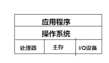
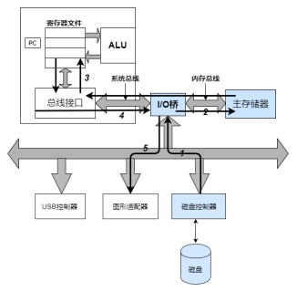
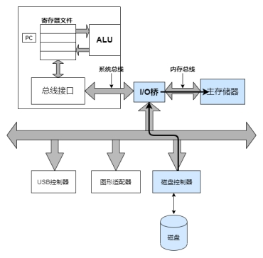
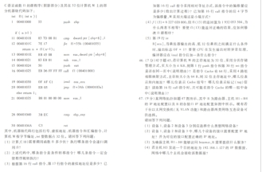

#### **计算机系统的漫游**

计算机整体架构纵向图，从应用程序，到操作系统（进程管理，内存管理，文件管理，IO管理）再到计算机组成原理（存储器，指令系统，中央处理器，总线，IO系统），学习计组就是为了了解计算机底层硬件组成和基本架构，学习操作系统就是了解操作系统究竟是如果管理计算机底层硬件的。

==========================================================

### **1.道路**

\#include <stdio.h>

Int main(){

Int a = 1;

Int b = 1;

 Printf(a+b);

 Return 0;

}

程序在计算机系统中是怎么表示的（0,1二进制码）所以就会有定点数和浮点数表示法之分，加减乘除法怎么实现的？底层的算法逻辑单元（数电），

被保存在hello.c文件中，打开shell，经过编译命令将gcc -o hello hello.c会进行一系列的***\*编译\*******\*①\*******\*（编译原理）（指令系统）\****

 

操作系统会给我们创建一个shell***\*进程\*******\*②\****，在shell中键入命令（字符），通过***\*IO方式（一般是程序中断方式）\****将字符逐一读入寄存器中，再把他们放入内存中，当我们点击回车键（中断方式）时候，系统知道我们当前输入完毕，发送执行信号（涉及到***\*指令系统\****），又会创建一个***\*进程\****来执行hello文件，根据指令中的地址，操作系统会先去磁盘中寻找二进制可执行文件（***\*文件管理\****），将代码和数据从磁盘复制到主存（***\*DMA方式\****），执行文件中的***\*机器语言程序，\****机器语言程序就通过计算机底层的指令系统来执行对应的指令，将hello world 从主存复制到***\*寄存器\****，在从寄存器文件复制到显示设备

 

|      |                                                            |
| ---- | ---------------------------------------------------------- |
|      |  |

 

 

 

***\*①：1.预处理阶段将#开头的代码读取，并插入程序中\****

***\*2.编译阶段：通过编译器将程序翻译为汇编语言\****

***\*main:\****

***\*Subq\**** ***\*$8，%rsp\****

***\*Movl\**** ***\*$.LCO,%edi\****

***\*Call\****  ***\*puts\****

***\*Movl\**** ***\*$0，%eax\****

***\*Addq\**** ***\*$8,%rsp\****

***\*ret\****

 

 

 

 

 

|      |                         |
| ---- | ----------------------- |
|      |  |

 

**3.** ***\*汇编阶段：将汇编语言指令打包生成可重定位目标程序，也就是一段二进制编码\****

**4.** ***\*链接阶段：将多个hello.o文件进行链接，链接阶段大概就是将一些变量替换，生成可执行二进制文件\****

 

 

***\*②：进程也就是我们计组中处理器的抽象，进程中有个并发和并行，线程并发有多核处理器和超线程\****

2. **抽象**
===========

文件是对IO设备的抽象，虚拟内存是对程序存储器的抽象，进程是对正在运行的程序的抽象，虚拟机是对操作系统，处理器，程序的整体抽象，

3. **虚拟内存**
===============

虚拟内存是对主存的抽象，使得每个进程都可以独立的使用内存空间，不受其他程序影响

 

| 操作系统 | 进程            | 存储器   | 文件管理         | IO管理 |
| -------- | --------------- | -------- | ---------------- | ------ |
| 计组     | 处理器+指令系统 | 内存管理 | 外存设备（磁盘） | IO系统 |

所以在操作系统中所有的概念都是针对***\*管理\****计算机底层硬件的